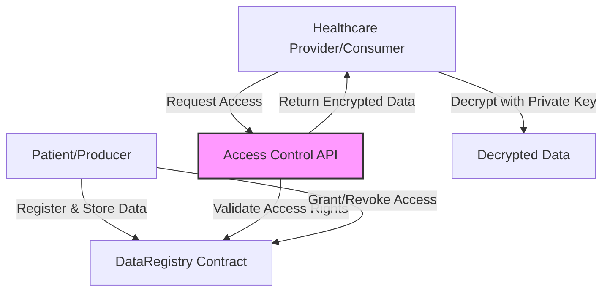
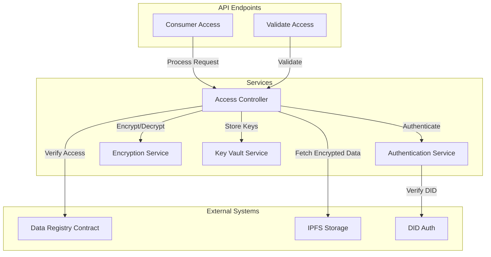

import HeaderTitle from '@/components/title';

<HeaderTitle
  title="Access-control Overview"
  source="https://github.com/LED-UP/LED-UP/tree/main/apis/access-control"
/>
---

**Version:** 1.0.0  
**Last Updated:** April 2024  
**Status:** Production

## Table of Contents

1. [Overview](#overview)
2. [Architecture](#architecture)
3. [Core Components](#core-components)
4. [API Reference](#api-reference)
   - [Access Control Functions](#access-control-functions)
   - [Consumer Access](#consumer-access)
   - [Access Validation](#access-validation)
   - [Access Control](#access-control)
5. [SDK Documentation](#sdk-documentation)
6. [Integration Guide](#integration-guide)
7. [Security](#security)
8. [Best Practices](#best-practices)
9. [Troubleshooting](#troubleshooting)

## Overview

The Access Control API provides secure mechanisms for controlling data access between data producers (patients) and consumers (healthcare providers, researchers) in the LEDUP system. It implements encryption, access verification, and secure data sharing patterns to ensure sensitive health data is shared appropriately and securely.

## Architecture

The Access Control system uses a layered approach with secure cryptographic primitives to ensure data confidentiality and integrity.

## Core Components

For detailed documentation on each component, see:

- [Data Access Controller](./DataAccessController.md)
- [Consumer Access API](./ConsumerAccess.md)
- [Access Validation API](./AccessValidation.md)
- [Access Control Functions](./AccessFunctions.md)
- [Integration Patterns](./IntegrationPatterns.md)

## Integration Guide

To integrate with the Access Control APIs, follow these steps:

1. Authenticate using DID authentication
2. Request access to specific content (CID)
3. Process the encrypted data using the appropriate decryption method
4. Handle the shared secret securely
5. Implement proper error handling for access denied scenarios

For complete integration examples, see the [SDK Documentation](#sdk-documentation) section.

## Security

The Access Control APIs use multiple layers of security:

- DID-based authentication
- Asymmetric encryption for shared secrets
- Symmetric encryption for bulk data
- Secure key management
- Access validation against on-chain registry

## Best Practices

1. Never store decrypted protected health information (PHI) in client-side storage
2. Implement proper session management and timeout handling
3. Use secure communication channels (HTTPS/TLS)
4. Validate all input data before processing
5. Implement proper error handling without leaking sensitive information

## API Reference

### Access Control Functions

For detailed documentation on the Azure Functions that implement the Access Control API endpoints, see:

- [Access Control API Reference](./AccessFunctions.md)

This documentation includes:

- API endpoint specifications
- Request/response formats
- Error handling
- Integration examples
- Security considerations

### Consumer Access

### Access Validation

### Access Control
