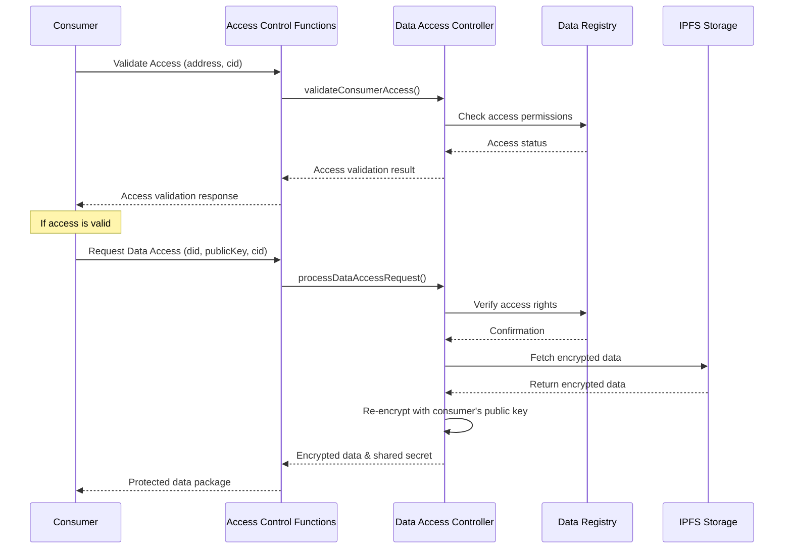

import HeaderTitle from '@/components/title';

<HeaderTitle
  title="Access Control API Reference"
  source="https://github.com/LED-UP/LED-UP/tree/main/apis/access-control"
/>
---


## Overview

The Access Control API provides a set of HTTP endpoints implemented as Azure Functions for managing secure data access between data producers and consumers within the LEDUP ecosystem. These functions enable secure data sharing, access validation, and compliance with access control policies.

## Access Control Flow



## API Endpoints

### Access Validation

Validates if a consumer has access to specific data without retrieving the actual data.

**Endpoint:** `GET /access/validate`

**Query Parameters:**

- `address` (string, required): The Ethereum address of the consumer
- `cid` (string, required): The Content Identifier (CID) of the data to check access for

**Response (200 OK):**

```json
{
  "success": true,
  "data": {
    "isValid": true,
    "cid": "QmX1bUuJBkHnBUHFG8qxvLsBQPtLkxXp6DuXwVQESEzMVL",
    "address": "0x1234567890abcdef1234567890abcdef12345678"
  }
}
```

**Error Response (400 Bad Request):**

```json
{
  "success": false,
  "error": "Missing required parameters",
  "message": "address and cid are required query parameters"
}
```

**Error Response (500 Internal Server Error):**

```json
{
  "success": false,
  "error": "Internal server error",
  "message": "Failed to validate access"
}
```

### Consumer Data Access Request

Processes data access requests from consumers, validating their permissions and returning encrypted data.

**Endpoint:** `POST /consumer-access/request`

**Request Body:**

```json
{
  "did": "did:ethr:0x1234567890abcdef1234567890abcdef12345678",
  "publicKey": "0x1234567890abcdef1234567890abcdef1234567890abcdef1234567890abcdef",
  "cid": "QmX1bUuJBkHnBUHFG8qxvLsBQPtLkxXp6DuXwVQESEzMVL",
  "address": "0x1234567890abcdef1234567890abcdef12345678",
  "signature": "0x1234567890abcdef1234567890abcdef1234567890abcdef1234567890abcdef1234567890abcdef1234567890abcdef1234567890abcdef1234567890abcdef1b"
}
```

**Response (200 OK):**

```json
{
  "success": true,
  "data": {
    "encryptedData": "0x1234567890abcdef...",
    "encryptedSharedSecret": "0x9876543210abcdef..."
  }
}
```

**Error Response (400 Bad Request):**

```json
{
  "success": false,
  "error": "Missing required parameters",
  "message": "did, publicKey, and cid are required"
}
```

**Error Response (401 Unauthorized):**

```json
{
  "success": false,
  "error": "Unauthorized",
  "message": "You do not have permission to access this data"
}
```

**Error Response (403 Forbidden):**

```json
{
  "success": false,
  "error": "Access denied",
  "message": "You do not have permission to access this data"
}
```

**Error Response (500 Internal Server Error):**

```json
{
  "success": false,
  "error": "Internal server error",
  "message": "Failed to process data access request"
}
```

## Security Considerations

### Authentication

- The consumer access endpoint requires a valid signature for authentication.
- Authentication verification is performed by the `AuthService` to ensure the request is from a legitimate user.

### Authorization

- Access permissions are verified against the Data Registry contract, which maintains access control lists.
- Permissions are checked both at the validation and data access request stages.
- The system enforces that only consumers with granted access can retrieve data.

### Encryption

- Data is stored in encrypted form on IPFS.
- Data is re-encrypted with the consumer's public key before transmission.
- Shared secrets are protected with asymmetric encryption.
- All cryptographic operations use industry-standard algorithms and implementations.

## Error Handling

All API endpoints follow a consistent error handling approach:

1. Client errors (4xx) indicate issues with the request data or permissions.
2. Server errors (5xx) indicate issues with processing the request on the server side.
3. All error responses include `success: false`, an `error` field with an error code, and a `message` field with a human-readable error description.

## Integration Examples

### Validating Access Before Request

```typescript
import axios from 'axios';

/**
 * Validates if a consumer has access to a specific data item
 * @param {string} address - Ethereum address of the consumer
 * @param {string} cid - Content ID of the data item
 * @returns {Promise<boolean>} - Whether the consumer has access
 */
const validateAccess = async (address, cid) => {
  try {
    const response = await axios.get('/access/validate', {
      params: { address, cid },
    });

    return response.data.data.isValid;
  } catch (error) {
    console.error('Access validation failed:', error);
    return false;
  }
};

// Usage example
const checkAccess = async () => {
  const consumerAddress = '0x1234567890abcdef1234567890abcdef12345678';
  const dataCid = 'QmX1bUuJBkHnBUHFG8qxvLsBQPtLkxXp6DuXwVQESEzMVL';

  const hasAccess = await validateAccess(consumerAddress, dataCid);

  if (hasAccess) {
    console.log('Consumer has access to the data');
    // Proceed with data access request
  } else {
    console.log('Consumer does not have access to the data');
    // Handle access denied scenario
  }
};
```

### Requesting Data Access

```typescript
import axios from 'axios';
import { ethers } from 'ethers';
import { decrypt } from '@ledup/crypto';

/**
 * Requests access to a specific data item
 * @param {string} did - Decentralized Identifier of the consumer
 * @param {string} publicKey - Public key of the consumer
 * @param {string} cid - Content ID of the data item
 * @param {string} address - Ethereum address of the consumer
 * @param {ethers.Wallet} wallet - Ethereum wallet for signing
 * @returns {Promise<object>} - The decrypted data
 */
const requestDataAccess = async (did, publicKey, cid, address, wallet) => {
  try {
    // Create a signed message for authentication
    const message = `Access request for CID: ${cid}`;
    const signature = await wallet.signMessage(message);

    // Send the data access request
    const response = await axios.post('/consumer-access/request', {
      did,
      publicKey,
      cid,
      address,
      signature,
    });

    const { encryptedData, encryptedSharedSecret } = response.data.data;

    // Decrypt the shared secret using the private key
    const privateKey = wallet.privateKey;
    const sharedSecret = decryptWithPrivateKey(encryptedSharedSecret, privateKey);

    // Decrypt the data using the shared secret
    const decryptedData = decrypt(encryptedData, sharedSecret);

    return JSON.parse(decryptedData);
  } catch (error) {
    console.error('Data access request failed:', error);
    throw new Error('Failed to access data: ' + (error.response?.data?.message || error.message));
  }
};

// Helper function to decrypt with private key
const decryptWithPrivateKey = (encryptedData, privateKey) => {
  const asymmetricCryptoService = new AsymmetricCryptoService();
  return asymmetricCryptoService.decryptWithPrivateKey(encryptedData, privateKey);
};

// Usage example
const accessData = async () => {
  const wallet = new ethers.Wallet('0xprivatekeyhere');
  const consumerDid = 'did:ethr:' + wallet.address;
  const publicKey = '0x' + wallet.publicKey.slice(4); // Remove '0x04' prefix
  const dataCid = 'QmX1bUuJBkHnBUHFG8qxvLsBQPtLkxXp6DuXwVQESEzMVL';

  try {
    const data = await requestDataAccess(consumerDid, publicKey, dataCid, wallet.address, wallet);

    console.log('Successfully accessed data:', data);
    // Process the data as needed
  } catch (error) {
    console.error('Failed to access data:', error);
    // Handle error case
  }
};
```

### Complete Data Access Workflow

```typescript
import axios from 'axios';
import { ethers } from 'ethers';

// Complete data access workflow
const dataAccessWorkflow = async (wallet, dataCid) => {
  try {
    const consumerAddress = wallet.address;

    // Step 1: Validate access first
    console.log('Validating access...');
    const hasAccess = await validateAccess(consumerAddress, dataCid);

    if (!hasAccess) {
      console.error('Access denied. You do not have permission to access this data.');
      return null;
    }

    console.log('Access validation successful.');

    // Step 2: Request data access
    console.log('Requesting data access...');
    const consumerDid = 'did:ethr:' + consumerAddress;
    const publicKey = '0x' + wallet.publicKey.slice(4); // Remove '0x04' prefix

    const data = await requestDataAccess(consumerDid, publicKey, dataCid, consumerAddress, wallet);

    console.log('Data access successful.');
    return data;
  } catch (error) {
    console.error('Data access workflow failed:', error);
    throw error;
  }
};

// Usage
const main = async () => {
  // Initialize wallet from private key or mnemonic
  const wallet = new ethers.Wallet('0xprivatekeyhere');
  const dataCid = 'QmX1bUuJBkHnBUHFG8qxvLsBQPtLkxXp6DuXwVQESEzMVL';

  try {
    const data = await dataAccessWorkflow(wallet, dataCid);
    if (data) {
      console.log('Successfully retrieved data.');
      // Process data
    }
  } catch (error) {
    console.error('Workflow failed:', error);
  }
};
```

## Implementation Details

### Validate Access Function

The validate access function (`validate.ts`) performs quick validation of a consumer's access rights without retrieving the actual data. It verifies that the consumer address has been granted access to the specific content ID (CID) by:

1. Validating the required query parameters
2. Initializing services for encryption, IPFS, and blockchain interaction
3. Using the `DataAccessControllerService` to validate access permissions
4. Returning a simple boolean result indicating whether access is permitted

This function is designed for lightweight permission checks before attempting more resource-intensive data access operations.

### Consumer Access Function

The consumer access function (`consumer.ts`) handles the complete data access workflow:

1. Validates the request parameters (DID, public key, CID, address, signature)
2. Initializes required services for authentication, encryption, and blockchain interaction
3. Authenticates the request using the provided signature
4. Uses the `DataAccessControllerService` to process the data access request
5. Returns the encrypted data and encrypted shared secret to the consumer

This function employs a dual-encryption approach to secure the data:

- The data itself is encrypted with a symmetric key
- The symmetric key is encrypted with the consumer's public key
- This ensures that only the intended recipient with the correct private key can decrypt the data

### Future Implementations

The Access Control API framework includes placeholders for additional functionality:

- **Producer Functions** (`producer.ts`): Will implement endpoints for data producers (patients) to register data, manage access controls, and track data usage.

- **Provider Functions** (`provider.ts`): Will implement specialized endpoints for healthcare providers, including bulk data access requests, credential verification, and compliance reporting features.

These modules are currently in development and will be implemented in future releases of the LEDUP platform.

---

© 2025 LEDUP | Documentation for Production Use | Last Updated: March 2025
