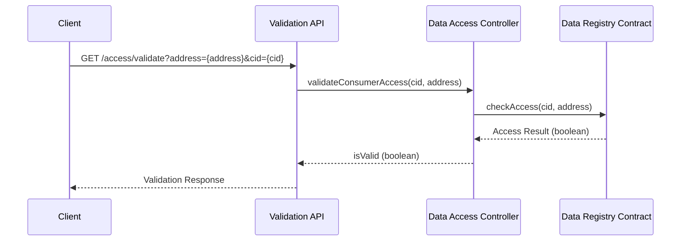

import HeaderTitle from '@/components/title';

<HeaderTitle
  title="Access Validation API"
  source="https://github.com/LED-UP/LED-UP/tree/main/apis/access-control"
/>
---


**Endpoint:** `/access/validate`  
**Method:** `GET`  
**Auth Level:** Anonymous

## Overview

The Access Validation API provides a lightweight endpoint for quickly checking if a consumer has permission to access specific data without retrieving or processing the actual data. This is useful for pre-validating access rights before initiating the more resource-intensive data retrieval process.



## Request

### Query Parameters

| Parameter | Type   | Required | Description                                        |
| --------- | ------ | -------- | -------------------------------------------------- |
| `address` | string | Yes      | Ethereum address of the consumer requesting access |
| `cid`     | string | Yes      | Content identifier of the data to check access for |

**Example Request:**

```
GET /access/validate?address=0x1234567890abcdef1234567890abcdef12345678&cid=QmX7DSMHMbH3UTrFAZ7NJ7GKcNNu93uZdYTmAZQ5ECz5Ag
```

## Response

### Success Response (200 OK)

```typescript
interface ValidationResponse {
  success: true;
  data: {
    isValid: boolean;
    cid: string;
    address: string;
  };
}
```

**Example Success Response (Access Granted):**

```json
{
  "success": true,
  "data": {
    "isValid": true,
    "cid": "QmX7DSMHMbH3UTrFAZ7NJ7GKcNNu93uZdYTmAZQ5ECz5Ag",
    "address": "0x1234567890abcdef1234567890abcdef12345678"
  }
}
```

**Example Success Response (Access Denied):**

```json
{
  "success": true,
  "data": {
    "isValid": false,
    "cid": "QmX7DSMHMbH3UTrFAZ7NJ7GKcNNu93uZdYTmAZQ5ECz5Ag",
    "address": "0x1234567890abcdef1234567890abcdef12345678"
  }
}
```

### Error Responses

#### 400 Bad Request

Returned when required query parameters are missing.

```json
{
  "success": false,
  "error": "Missing required parameters",
  "message": "address and cid are required query parameters"
}
```

#### 500 Internal Server Error

Returned when an internal server error occurs.

```json
{
  "success": false,
  "error": "Internal server error",
  "message": "Failed to validate access"
}
```

## Client Integration

### TypeScript/JavaScript SDK Example

```typescript
import { LedupSDK } from '@ledup/sdk';

async function checkAccess(cid: string, address: string): Promise<boolean> {
  const sdk = new LedupSDK({
    apiEndpoint: 'https://api.ledup.io',
  });

  try {
    // Check if the consumer has access to the data
    const { isValid } = await sdk.access.validate(cid, address);
    return isValid;
  } catch (error) {
    console.error('Failed to validate access:', error);
    return false;
  }
}
```

### Client-Side Workflow Example

```typescript
// In a client application
async function fetchHealthRecord(cid: string) {
  try {
    // Step 1: First check if user has access
    const hasAccess = await checkAccess(cid, userAddress);

    // Step 2: If access is valid, proceed with full data retrieval
    if (hasAccess) {
      // Show loading indicator
      setLoading(true);

      // Request the actual data
      const healthRecord = await requestDataAccess(cid, privateKey);

      // Display the health record
      displayHealthRecord(healthRecord);
    } else {
      // Show access denied message
      showAccessDeniedMessage();
    }
  } catch (error) {
    handleError(error);
  } finally {
    setLoading(false);
  }
}
```

## Use Cases

1. **Permission Pre-Check**: Validate access rights before attempting to retrieve sensitive data
2. **UI Enhancements**: Update user interfaces to show available/restricted records
3. **Batch Validation**: Efficiently check access for multiple records without overhead
4. **Access Management**: Allow data owners to verify active access grants

## Performance Considerations

This endpoint is designed to be lightweight and fast:

- Performs minimal processing
- Only retrieves on-chain access control information
- Does not fetch or decrypt any actual data
- Suitable for frequent polling or bulk validation

## Security Considerations

While this endpoint provides a convenience validation check, it is not a substitute for the full access control that happens during data retrieval:

1. The full access flow will still validate permissions again
2. Results should be treated as informational, not authoritative
3. Both consumer applications and server-side APIs should implement complete security checks
