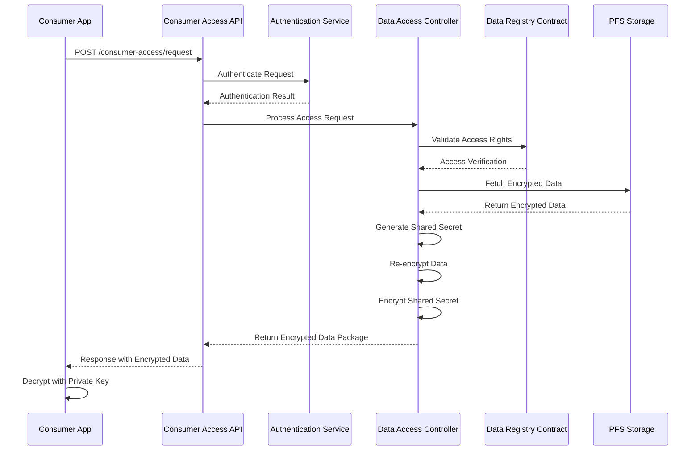

import HeaderTitle from '@/components/title';

<HeaderTitle
  title="Consumer Access API"
  source="https://github.com/LED-UP/LED-UP/tree/main/apis/access-control"
/>
---


**Endpoint:** `/consumer-access/request`  
**Method:** `POST`  
**Auth Level:** Anonymous

## Overview

The Consumer Access API provides a secure endpoint for consumers (healthcare providers, researchers) to request access to specific health data stored in the LEDUP system. It handles authentication, access verification, and returns encrypted data that can only be decrypted by the requester.



## Request

### Headers

| Header         | Value              | Description                       |
| -------------- | ------------------ | --------------------------------- |
| `Content-Type` | `application/json` | Specifies the request body format |

### Body

```typescript
interface DataAccessRequest {
  /** Consumer's DID */
  did: string;
  /** Consumer's public key */
  publicKey: string;
  /** Content identifier of the requested data */
  cid: string;
  /** Consumer's address */
  address: string;
  /** Consumer's signature */
  signature: string;
}
```

**Field Descriptions:**

- `did`: Decentralized Identifier of the requester
- `publicKey`: Public key of the consumer (used for encrypting the shared secret)
- `cid`: Content Identifier of the requested data
- `address`: Ethereum address of the requester
- `signature`: Cryptographic signature to verify the request authenticity

**Example Request:**

```json
{
  "did": "did:ethr:0x1234567890abcdef1234567890abcdef12345678",
  "publicKey": "-----BEGIN PUBLIC KEY-----\nMIIBIjANBgkqhkiG9w0BAQEFAAOCAQ8AMIIBCgKCAQEA3MO+2nIRi/cs+8Dig5X4\n9JdMh+cLzJIN3CYTUDoKnA2WyMLkiA9aWQhQrf6vB3uccC2Rg7W/JZIBHYZBw0YY\nSaVzMpvrqZYwdR3EZ49MbXRY2UUv/VZHCwNjBH7qTnhw9QcIQBG0cW4iQjIZKtNy\naJBd8S7qNqFVGfJ2EsQzpDh5jpVXxJAewiJ8vsIUTKIchQvGpU5Tinclusive8lczK\na/JCj2xTCBgxUKhAvX9S9EApmZPwI4fTH7S0zhvVUgmCjr5SabLul+r0tJ+1vYa9\na4/aVwfmTJ8PWxrQQnubkqOFio+bpqByCbMcDtjCJct3EC1HmqLQKucR/0UK0Kbd\nQQIDAQAB\n-----END PUBLIC KEY-----",
  "cid": "QmX7DSMHMbH3UTrFAZ7NJ7GKcNNu93uZdYTmAZQ5ECz5Ag",
  "address": "0x1234567890abcdef1234567890abcdef12345678",
  "signature": "0x4a625171b33c8941812af84557415798a842f1ce3c74c2eae4299bd39ee8cef27e15de2d7c5ff3439a803d2c1475f6238c2d1ec1d9a1edd33aa17b9b06d13fd61c"
}
```

## Response

### Success Response (200 OK)

```typescript
interface SuccessResponse {
  success: true;
  data: {
    /** Data encrypted with shared secret */
    encryptedData: string;
    /** Shared secret encrypted with consumer's public key */
    encryptedSharedSecret: string;
  };
}
```

**Example Success Response:**

```json
{
  "success": true,
  "data": {
    "encryptedData": "eyJpdiI6ImE2ZjVjM2QwMDc1YzRmMjRiNzRkZDIxNzU1ZGYwM2Y0IiwiYXV0aFRhZyI6IjY4NTAyZTk2NmQzNzFiMzcyYjA5ZTlmYTIzNTM3NDE5IiwiZW5jcnlwdGVkIjoiZWE5ZGVlNDgxNjM5YzhjOGU1MjQ5YzgzZjBlOTljNDk3MTRkODVjM2NkYzUxZjhiYjY0ZjJiMDkxYzE5ZWFmYjhjZjE0YzI3NTBkM2NkMGNkMWIyNWUwYzIyOGU5ZTZkMjc2Y2RkMGU5MGRkOTQyYjZlOTE2MjU3ZjVmZGFmNTYyODc0MjU5NjcyNDVkYThlMTYyNTMyYmEzNTM2NGNkMzQ1NzE4ZjM4ZTcyNGQ1YjgwNjUyZjMwOTVmMzYzYzk0NmQzYzk4MmFiMTZiZjc3YTVhOGY1Y2NlNzQ3YjU0MWI1YjM3NDU2NGIxYjgwY2UyODQzMWJiYjVmYzFiNDlkZDc0ODUzMTNmYWM2OTI5NzE2NjZmNzk1Y2E1ZDVjYzQ3YWY4ZWNlNTZiNGQyNWVjNGFhM2E2OTc3MDJiM2YyMTI4YmJmYTc2M2FiY2EwYWQ2MjFkODc3MjhlY2Q1NzU4OWY3NjNmOGI2ZmY4ZDMwOWJlYzZjNWJhMmUyODIzMGQ4ZGE0ZGM0MzQzYzZhMjY5OGIxODZmN2RlYTIxNDJjZDY2NDdmM2YwNzYyYzQzNWRjMzY3MDc5YTA4NjUzOGU0YWEwMzI0NmQ1MTliMDRmYTUzYzlhZWVmN2ExMDhhYjE3OWI2NGE3OTY5YjA0NzQ1YjA3ZGVlOWNlNjVjODQwZDNmYzRkMGU2NTk1YWI2YWI1MDAifQ==",
    "encryptedSharedSecret": "QlY2SnIibRGBzgjCYDU5HhH5BLNfMQj0Kp+M2Kt9FRHO1IgV2+WGx2nqDSz+QRyv7jibWF94X9ENPFur8ZtEqXkDd4U9Jts1MQf2OsX0zQKx1QXU5+DhCsLCZhXbG7NGK6vSWQBbHTl6+JKC7KTIqSv2R8UZ6fEjNi3d5GezytT0QWwvTT9K6LH8DVGBbvRk1o+GK/vRY08C8GEqZL5MQkiM9n8h7RKCA+nRPUvJDSm1jDkQGrPd3kVY+dvnOcJDOSJe3CykWOFBaUGWMnAf0jWPBFRXdKYqZQfyE3kPe6WEjRD2mYdNX5KS8d4xWDmvdnH7yz7x+JJ0i1eHvnhJmQ=="
  }
}
```

### Error Responses

#### 400 Bad Request

Returned when the request is missing required parameters.

```json
{
  "success": false,
  "error": "Missing required parameters",
  "message": "did, publicKey, and cid are required"
}
```

#### 401 Unauthorized

Returned when authentication fails.

```json
{
  "success": false,
  "error": "Unauthorized",
  "message": "You do not have permission to access this data"
}
```

#### 403 Forbidden

Returned when the consumer does not have access rights to the requested data.

```json
{
  "success": false,
  "error": "Access denied",
  "message": "You do not have permission to access this data"
}
```

#### 500 Internal Server Error

Returned when an internal server error occurs.

```json
{
  "success": false,
  "error": "Internal server error",
  "message": "Failed to process data access request"
}
```

## Client Integration

### TypeScript/JavaScript SDK Example

```typescript
import { LedupSDK } from '@ledup/sdk';

async function requestDataAccess(cid: string, privateKey: string): Promise<any> {
  const sdk = new LedupSDK({
    apiEndpoint: 'https://api.ledup.io',
    privateKey,
  });

  try {
    // Request access to the data
    const { encryptedData, encryptedSharedSecret } = await sdk.consumer.requestAccess(cid);

    // Decrypt the shared secret using the private key
    const sharedSecret = await sdk.crypto.decryptWithPrivateKey(encryptedSharedSecret);

    // Decrypt the data using the shared secret
    const decryptedData = await sdk.crypto.decryptWithSharedSecret(encryptedData, sharedSecret);

    return JSON.parse(decryptedData);
  } catch (error) {
    console.error('Failed to access data:', error);
    throw error;
  }
}
```

## Security Considerations

1. **Authentication**: Ensure valid digital signatures to prevent unauthorized access
2. **Key Security**: Protect private keys used for decryption
3. **Data Integrity**: Verify data hasn't been tampered with during transmission
4. **Authorization**: Confirm on-chain access permissions for each request
5. **Audit Logging**: Track all access attempts for compliance purposes
