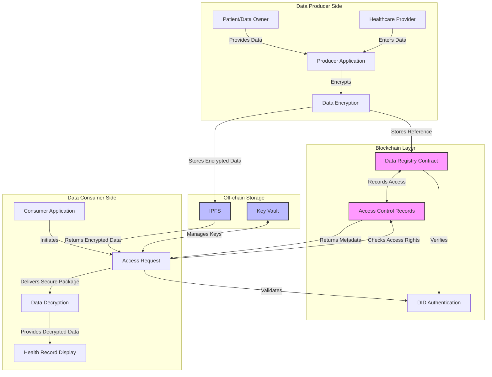
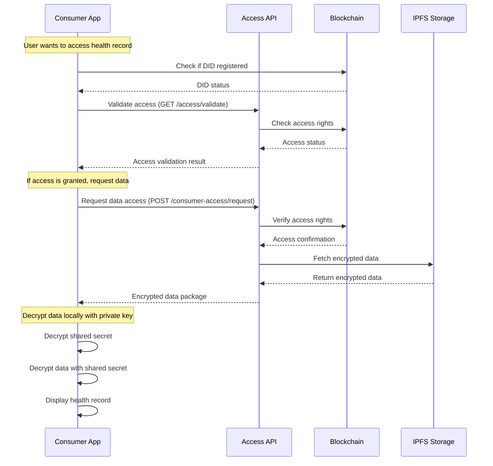
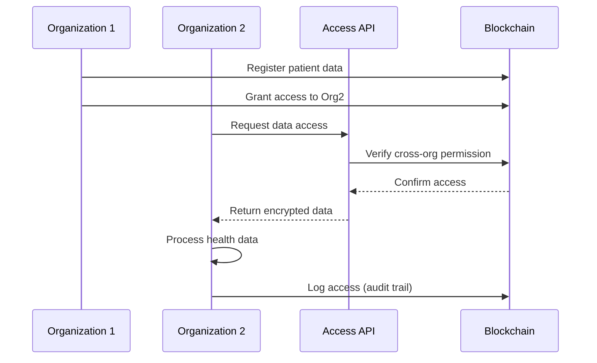
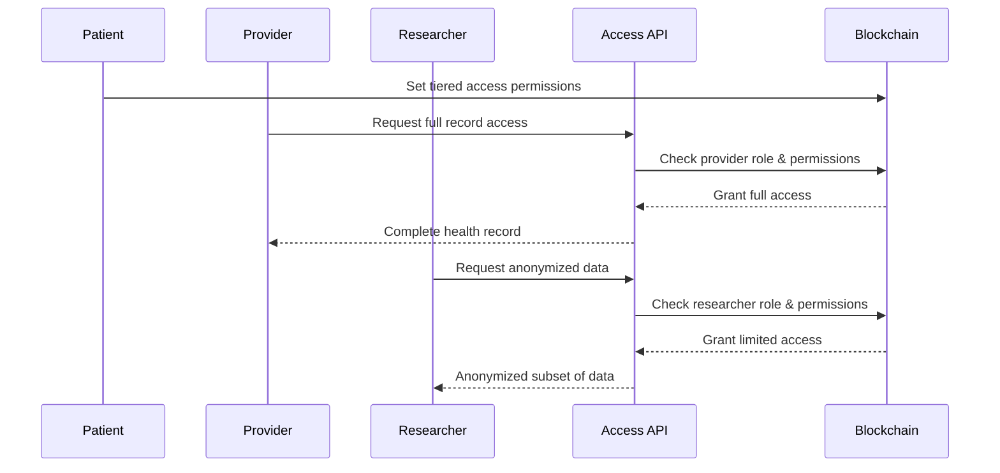

import HeaderTitle from '@/components/title';

<HeaderTitle
  title="Access Control Integration Patterns"
  source="https://github.com/LED-UP/LED-UP/tree/main/apis/access-control"
/>
---


**Version:** 1.0.0  
**Last Updated:** April 2024  
**Status:** Production

## Overview

This document describes common integration patterns for the LEDUP Access Control system. These patterns provide best practices for securely implementing data access controls in various application scenarios.

## Data Flow Diagram

The following diagram illustrates the complete data flow in the access control system:



## Integration Patterns

### 1. Standard Consumer Access Pattern

The most common pattern for accessing protected health data:



### 2. Cross-Organization Data Sharing Pattern

Pattern for securely sharing data between healthcare organizations:



### 3. Tiered Access Control Pattern

Pattern for implementing different access levels based on user roles:



## Implementation Examples

### Producer-Side Implementation

```typescript
import { LedupSDK } from '@ledup/sdk';

async function registerHealthRecord(recordData, ownerDid, privateKey) {
  const sdk = new LedupSDK({
    apiEndpoint: 'https://api.ledup.io',
    privateKey,
  });

  try {
    // 1. Encrypt the health record data
    const { cid, contentHash } = await sdk.producer.encryptAndStore(recordData);

    // 2. Register the record on the blockchain
    await sdk.producer.registerRecord({
      cid,
      recordId: `${recordData.resourceType}-${recordData.id}`,
      contentHash,
      owner: ownerDid,
    });

    // 3. Set initial access permissions (optional)
    // Grant access to primary care provider
    await sdk.producer.grantAccess(cid, primaryProviderDid);

    return { success: true, recordId: `${recordData.resourceType}-${recordData.id}`, cid };
  } catch (error) {
    console.error('Failed to register health record:', error);
    throw error;
  }
}
```

### Consumer-Side Implementation

```typescript
import { LedupSDK } from '@ledup/sdk';

async function accessHealthRecord(cid, consumerDid, privateKey) {
  const sdk = new LedupSDK({
    apiEndpoint: 'https://api.ledup.io',
    privateKey,
  });

  try {
    // 1. Check if we have access before requesting
    const hasAccess = await sdk.access.validate(cid, consumerDid);

    if (!hasAccess) {
      throw new Error('Access denied to requested record');
    }

    // 2. Request the encrypted data
    const { encryptedData, encryptedSharedSecret } = await sdk.consumer.requestAccess(cid);

    // 3. Decrypt the shared secret using consumer's private key
    const sharedSecret = await sdk.crypto.decryptWithPrivateKey(encryptedSharedSecret, privateKey);

    // 4. Decrypt the health record data using the shared secret
    const healthRecordData = await sdk.crypto.decryptWithSharedSecret(encryptedData, sharedSecret);

    return JSON.parse(healthRecordData);
  } catch (error) {
    console.error('Failed to access health record:', error);
    throw error;
  }
}
```

## Best Practices

### Security

1. **Secure Key Management**: Never store private keys in local storage or expose them in client-side code
2. **Validate All Input**: Always validate input data before processing to prevent injection attacks
3. **Implement Rate Limiting**: Protect APIs from brute force and DDoS attacks with proper rate limiting
4. **Use HTTPS Everywhere**: Ensure all API communications use secure HTTPS connections

### Performance

1. **Optimize Data Size**: Only encrypt and transfer necessary data fields
2. **Implement Caching**: Cache validation results temporarily to reduce blockchain queries
3. **Batch Operations**: When possible, batch multiple access checks into a single transaction
4. **Optimize IPFS Retrieval**: Consider IPFS gateway selection based on performance and reliability

### User Experience

1. **Provide Clear Feedback**: Clearly communicate access status to end users
2. **Implement Progressive Loading**: Show available data while waiting for secure data retrieval
3. **Handle Offline Scenarios**: Implement proper offline functionality where permitted by security requirements
4. **Graceful Error Handling**: Present user-friendly messages for access control issues

## Compliance Considerations

When implementing access control, ensure compliance with relevant regulations:

1. **HIPAA**: Maintain audit trails for all PHI access
2. **GDPR**: Implement data portability and right to be forgotten
3. **Consent Management**: Document all patient consents for data sharing
4. **Audit Trails**: Maintain immutable logs of all data access

## Common Implementation Challenges

1. **Key Management**: Secure storage and recovery of cryptographic keys
2. **Cross-Organization Trust**: Establishing trust between different healthcare entities
3. **Versioning**: Handling updates to health records while maintaining security
4. **Performance vs. Security**: Balancing system performance with security requirements

## Troubleshooting

| Issue                       | Possible Cause                          | Solution                                                 |
| --------------------------- | --------------------------------------- | -------------------------------------------------------- |
| Access Denied Unexpectedly  | Expired permissions on blockchain       | Check permission expiration and renew if needed          |
| Decryption Failure          | Incorrect private key or corrupted data | Verify key pair matches and check data integrity         |
| Slow Performance            | Network latency or large data payloads  | Implement pagination and optimize data size              |
| Inconsistent Access Results | Blockchain node synchronization         | Wait for blockchain confirmation or try alternative node |
