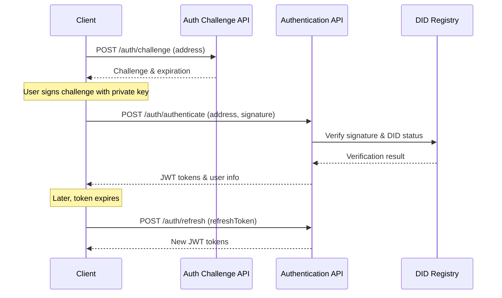

import HeaderTitle from '@/components/title';

<HeaderTitle
  title="Authentication API Reference"
  source="https://github.com/LED-UP/LED-UP/tree/main/apis/auth"
/>

---

## Overview

The Authentication API provides a comprehensive set of HTTP endpoints implemented as Azure Functions for managing decentralized identities (DIDs) and user authentication within the LEDUP ecosystem. These functions enable secure authentication, DID management, and access control for the platform.

## Authentication Flow



## API Endpoints

### Authentication Functions

#### Generate Challenge

Generates an authentication challenge for the provided Ethereum address.

**Endpoint:** `POST /auth/challenge`

**Request Body:**

```json
{
  "address": "0x1234567890abcdef1234567890abcdef12345678"
}
```

**Response (200 OK):**

```json
{
  "success": true,
  "data": {
    "challenge": "Sign this message to authenticate with LED-UP: 1234567890abcdef1234567890abcdef",
    "expiresAt": 1612345678000,
    "id": "12345678-1234-1234-1234-1234567890ab"
  },
  "message": "Challenge generated successfully"
}
```

**Error Response (400 Bad Request):**

```json
{
  "success": false,
  "message": "Address is required"
}
```

**Error Response (500 Internal Server Error):**

```json
{
  "success": false,
  "message": "Failed to generate challenge"
}
```

#### Authenticate

Authenticates a user using their Ethereum address and signature.

**Endpoint:** `POST /auth/authenticate`

**Request Body:**

```json
{
  "address": "0x1234567890abcdef1234567890abcdef12345678",
  "signature": "0x1234567890abcdef1234567890abcdef1234567890abcdef1234567890abcdef1234567890abcdef1234567890abcdef1234567890abcdef1234567890abcdef1b"
}
```

**Response (200 OK):**

```json
{
  "success": true,
  "data": {
    "accessToken": "eyJhbGciOiJIUzI1NiIsInR5cCI6IkpXVCJ9...",
    "refreshToken": "eyJhbGciOiJIUzI1NiIsInR5cCI6IkpXVCJ9...",
    "expiresIn": 3600,
    "user": {
      "address": "0x1234567890abcdef1234567890abcdef12345678",
      "role": "consumer",
      "did": "did:ethr:0x1234567890abcdef1234567890abcdef12345678"
    }
  },
  "message": "Authentication successful"
}
```

**Error Response (400 Bad Request):**

```json
{
  "success": false,
  "message": "Address and signature are required"
}
```

**Error Response (401 Unauthorized):**

```json
{
  "success": false,
  "message": "Invalid signature"
}
```

**Error Response (403 Forbidden):**

```json
{
  "success": false,
  "message": "User account is deactivated"
}
```

#### Refresh Token

Refreshes an authentication token using a refresh token.

**Endpoint:** `POST /auth/refresh`

**Request Body:**

```json
{
  "refreshToken": "eyJhbGciOiJIUzI1NiIsInR5cCI6IkpXVCJ9..."
}
```

**Response (200 OK):**

```json
{
  "success": true,
  "data": {
    "accessToken": "eyJhbGciOiJIUzI1NiIsInR5cCI6IkpXVCJ9...",
    "refreshToken": "eyJhbGciOiJIUzI1NiIsInR5cCI6IkpXVCJ9...",
    "expiresIn": 3600,
    "user": {
      "address": "0x1234567890abcdef1234567890abcdef12345678",
      "role": "consumer",
      "did": "did:ethr:0x1234567890abcdef1234567890abcdef12345678"
    }
  },
  "message": "Token refreshed successfully"
}
```

**Error Response (400 Bad Request):**

```json
{
  "success": false,
  "message": "Refresh token is required"
}
```

**Error Response (401 Unauthorized):**

```json
{
  "success": false,
  "message": "Invalid or expired refresh token"
}
```

#### Verify Token

Verifies the validity of an access token.

**Endpoint:** `POST /auth/verify`

**Request Body:**

```json
{
  "token": "eyJhbGciOiJIUzI1NiIsInR5cCI6IkpXVCJ9..."
}
```

**Response (200 OK):**

```json
{
  "success": true,
  "data": {
    "valid": true,
    "payload": {
      "sub": "0x1234567890abcdef1234567890abcdef12345678",
      "role": "consumer",
      "did": "did:ethr:0x1234567890abcdef1234567890abcdef12345678",
      "iat": 1612345678,
      "exp": 1612349278
    }
  },
  "message": "Token is valid"
}
```

**Error Response (400 Bad Request):**

```json
{
  "success": false,
  "message": "Token is required"
}
```

**Error Response (401 Unauthorized):**

```json
{
  "success": false,
  "message": "Invalid token"
}
```

#### Logout

Invalidates the user's refresh token, effectively logging them out.

**Endpoint:** `POST /auth/logout`

**Request Body:**

```json
{
  "refreshToken": "eyJhbGciOiJIUzI1NiIsInR5cCI6IkpXVCJ9..."
}
```

**Response (200 OK):**

```json
{
  "success": true,
  "message": "Logout successful"
}
```

**Error Response (400 Bad Request):**

```json
{
  "success": false,
  "message": "Refresh token is required"
}
```

### DID Management Functions

#### Create DID

Creates a new Decentralized Identifier (DID) for an Ethereum address.

**Endpoint:** `POST /did/create`

**Request Body:**

```json
{
  "address": "0x1234567890abcdef1234567890abcdef12345678",
  "role": "producer" // Optional, defaults to "producer"
}
```

**Response (201 Created):**

```json
{
  "success": true,
  "data": {
    "did": "did:ethr:0x1234567890abcdef1234567890abcdef12345678",
    "didDocument": {
      "@context": ["https://www.w3.org/ns/did/v1", "https://w3id.org/security/suites/secp256k1-2019/v1"],
      "id": "did:ethr:0x1234567890abcdef1234567890abcdef12345678",
      "controller": ["did:ethr:0x1234567890abcdef1234567890abcdef12345678"],
      "verificationMethod": [
        {
          "id": "did:ethr:0x1234567890abcdef1234567890abcdef12345678#keys-1",
          "type": "EcdsaSecp256k1VerificationKey2019",
          "controller": "did:ethr:0x1234567890abcdef1234567890abcdef12345678",
          "publicKeyHex": "0x..."
        }
      ],
      "authentication": ["did:ethr:0x1234567890abcdef1234567890abcdef12345678#keys-1"]
    },
    "role": "producer"
  },
  "message": "DID created successfully"
}
```

**Response (200 OK) - If DID already exists:**

```json
{
  "success": true,
  "data": {
    "did": "did:ethr:0x1234567890abcdef1234567890abcdef12345678",
    "didDocument": {
      // DID Document structure
    }
  },
  "message": "DID already exists for this address"
}
```

**Error Response (400 Bad Request):**

```json
{
  "success": false,
  "message": "Address is required"
}
```

**Error Response (500 Internal Server Error):**

```json
{
  "success": false,
  "message": "Failed to register DID on the blockchain"
}
```

#### Get DID Document

Retrieves the DID Document for a given DID.

**Endpoint:** `GET /did/document/{did}`

**Response (200 OK):**

```json
{
  "success": true,
  "data": {
    "@context": ["https://www.w3.org/ns/did/v1", "https://w3id.org/security/suites/secp256k1-2019/v1"],
    "id": "did:ethr:0x1234567890abcdef1234567890abcdef12345678",
    "controller": ["did:ethr:0x1234567890abcdef1234567890abcdef12345678"],
    "verificationMethod": [
      {
        "id": "did:ethr:0x1234567890abcdef1234567890abcdef12345678#keys-1",
        "type": "EcdsaSecp256k1VerificationKey2019",
        "controller": "did:ethr:0x1234567890abcdef1234567890abcdef12345678",
        "publicKeyHex": "0x..."
      }
    ],
    "authentication": ["did:ethr:0x1234567890abcdef1234567890abcdef12345678#keys-1"]
  },
  "message": "DID document retrieved successfully"
}
```

**Error Response (400 Bad Request):**

```json
{
  "success": false,
  "message": "DID is required"
}
```

**Error Response (404 Not Found):**

```json
{
  "success": false,
  "message": "DID not found"
}
```

#### Update DID Document

Updates the DID Document for a given DID.

**Endpoint:** `PUT /did/document/{did}`

**Request Body:**

```json
{
  "didDocument": {
    "@context": ["https://www.w3.org/ns/did/v1", "https://w3id.org/security/suites/secp256k1-2019/v1"],
    "id": "did:ethr:0x1234567890abcdef1234567890abcdef12345678",
    "controller": ["did:ethr:0x1234567890abcdef1234567890abcdef12345678"],
    "verificationMethod": [
      {
        "id": "did:ethr:0x1234567890abcdef1234567890abcdef12345678#keys-1",
        "type": "EcdsaSecp256k1VerificationKey2019",
        "controller": "did:ethr:0x1234567890abcdef1234567890abcdef12345678",
        "publicKeyHex": "0x..."
      }
    ],
    "authentication": ["did:ethr:0x1234567890abcdef1234567890abcdef12345678#keys-1"],
    "service": [
      {
        "id": "did:ethr:0x1234567890abcdef1234567890abcdef12345678#messaging",
        "type": "MessagingService",
        "serviceEndpoint": "https://example.com/messaging"
      }
    ]
  }
}
```

**Response (200 OK):**

```json
{
  "success": true,
  "data": {
    "did": "did:ethr:0x1234567890abcdef1234567890abcdef12345678",
    "didDocument": {
      // Updated DID Document
    }
  },
  "message": "DID document updated successfully"
}
```

**Error Response (400 Bad Request):**

```json
{
  "success": false,
  "message": "DID document is required"
}
```

**Error Response (403 Forbidden):**

```json
{
  "success": false,
  "message": "Not authorized to update this DID document"
}
```

**Error Response (404 Not Found):**

```json
{
  "success": false,
  "message": "DID not found"
}
```

#### Deactivate DID

Deactivates a DID to prevent its use in the system.

**Endpoint:** `POST /did/deactivate/{did}`

**Response (200 OK):**

```json
{
  "success": true,
  "data": {
    "did": "did:ethr:0x1234567890abcdef1234567890abcdef12345678",
    "deactivated": true
  },
  "message": "DID deactivated successfully"
}
```

**Error Response (403 Forbidden):**

```json
{
  "success": false,
  "message": "Not authorized to deactivate this DID"
}
```

**Error Response (404 Not Found):**

```json
{
  "success": false,
  "message": "DID not found"
}
```

#### Get DID for Address

Retrieves the DID associated with an Ethereum address.

**Endpoint:** `GET /did/address/{address}`

**Response (200 OK):**

```json
{
  "success": true,
  "data": {
    "did": "did:ethr:0x1234567890abcdef1234567890abcdef12345678",
    "didDocument": {
      // DID Document structure
    }
  },
  "message": "DID retrieved successfully"
}
```

**Error Response (404 Not Found):**

```json
{
  "success": false,
  "message": "No DID found for this address"
}
```

#### Check DID Active

Checks if a DID is active and valid.

**Endpoint:** `GET /did/active/{did}`

**Response (200 OK):**

```json
{
  "success": true,
  "data": {
    "did": "did:ethr:0x1234567890abcdef1234567890abcdef12345678",
    "active": true
  },
  "message": "DID is active"
}
```

**Error Response (404 Not Found):**

```json
{
  "success": false,
  "message": "DID not found"
}
```

#### Resolve DID

Resolves a DID to its DID Document and metadata.

**Endpoint:** `GET /did/resolve/{did}`

**Response (200 OK):**

```json
{
  "success": true,
  "data": {
    "didDocument": {
      // DID Document structure
    },
    "didDocumentMetadata": {
      "created": "2023-01-01T00:00:00Z",
      "updated": "2023-01-02T00:00:00Z",
      "deactivated": false
    }
  },
  "message": "DID resolved successfully"
}
```

**Error Response (404 Not Found):**

```json
{
  "success": false,
  "message": "DID not found"
}
```

#### Update Public Key

Updates the public key associated with a DID.

**Endpoint:** `PUT /did/publickey/{did}`

**Request Body:**

```json
{
  "publicKey": "0x1234567890abcdef1234567890abcdef1234567890abcdef1234567890abcdef"
}
```

**Response (200 OK):**

```json
{
  "success": true,
  "data": {
    "did": "did:ethr:0x1234567890abcdef1234567890abcdef12345678",
    "publicKey": "0x1234567890abcdef1234567890abcdef1234567890abcdef1234567890abcdef"
  },
  "message": "Public key updated successfully"
}
```

**Error Response (400 Bad Request):**

```json
{
  "success": false,
  "message": "Public key is required"
}
```

**Error Response (403 Forbidden):**

```json
{
  "success": false,
  "message": "Not authorized to update this DID's public key"
}
```

**Error Response (404 Not Found):**

```json
{
  "success": false,
  "message": "DID not found"
}
```

## Security Considerations

### Authentication

- All endpoints except for `/auth/challenge`, `/auth/authenticate`, and `/auth/refresh` require a valid JWT access token.
- Access tokens have a limited lifetime (typically 1 hour) and must be refreshed using a refresh token.
- Refresh tokens are revoked upon logout and have a longer lifetime (typically 7 days).

### Authorization

- DIDs can only be updated or deactivated by their controller or by an administrator.
- Certain operations may require specific roles (e.g., `producer`, `consumer`, `administrator`).

### Rate Limiting

- Authentication attempts are rate-limited to prevent brute force attacks.
- Consecutive failed attempts will result in temporary blocking of the client.

## Error Handling

All API endpoints follow a consistent error handling approach:

1. Client errors (4xx) indicate issues with the request data or permissions.
2. Server errors (5xx) indicate issues with processing the request on the server side.
3. All error responses include a `success: false` flag and a `message` field with a human-readable error description.

## Integration Examples

### Complete Authentication Flow

```typescript
import axios from 'axios';

// Step 1: Generate a challenge
const generateChallenge = async (address) => {
  const response = await axios.post('/auth/challenge', { address });
  return response.data.data;
};

// Step 2: Sign the challenge (using ethers.js)
const signChallenge = async (challenge, signer) => {
  return await signer.signMessage(challenge);
};

// Step 3: Authenticate using the signature
const authenticate = async (address, signature) => {
  const response = await axios.post('/auth/authenticate', { address, signature });
  return response.data.data;
};

// Step 4: Refresh the token when needed
const refreshToken = async (refreshToken) => {
  const response = await axios.post('/auth/refresh', { refreshToken });
  return response.data.data;
};

// Step 5: Logout
const logout = async (refreshToken) => {
  await axios.post('/auth/logout', { refreshToken });
};

// Complete flow
const authenticateUser = async (address, signer) => {
  try {
    // Generate challenge
    const { challenge } = await generateChallenge(address);

    // Sign challenge
    const signature = await signChallenge(challenge, signer);

    // Authenticate
    const authResponse = await authenticate(address, signature);

    // Store tokens in secure storage
    localStorage.setItem('accessToken', authResponse.accessToken);
    localStorage.setItem('refreshToken', authResponse.refreshToken);

    return authResponse.user;
  } catch (error) {
    console.error('Authentication failed:', error);
    throw error;
  }
};
```

### Creating and Managing a DID

```typescript
import axios from 'axios';

// Setup axios with authentication
const setupAuthenticatedAxios = (accessToken) => {
  const instance = axios.create({
    headers: {
      Authorization: `Bearer ${accessToken}`,
    },
  });
  return instance;
};

// Create a new DID
const createDid = async (address, accessToken) => {
  const api = setupAuthenticatedAxios(accessToken);
  const response = await api.post('/did/create', { address });
  return response.data.data;
};

// Update a DID document
const updateDidDocument = async (did, didDocument, accessToken) => {
  const api = setupAuthenticatedAxios(accessToken);
  const response = await api.put(`/did/document/${did}`, { didDocument });
  return response.data.data;
};

// Deactivate a DID
const deactivateDid = async (did, accessToken) => {
  const api = setupAuthenticatedAxios(accessToken);
  const response = await api.post(`/did/deactivate/${did}`);
  return response.data.data;
};

// Complete flow for DID creation and management
const manageDid = async (address, accessToken) => {
  try {
    // Create a new DID
    const { did, didDocument } = await createDid(address, accessToken);
    console.log(`Created DID: ${did}`);

    // Update the DID document to add a service
    const updatedDidDocument = {
      ...didDocument,
      service: [
        {
          id: `${did}#messaging`,
          type: 'MessagingService',
          serviceEndpoint: 'https://example.com/messaging',
        },
      ],
    };

    await updateDidDocument(did, updatedDidDocument, accessToken);
    console.log(`Updated DID document for ${did}`);

    return did;
  } catch (error) {
    console.error('DID management failed:', error);
    throw error;
  }
};
```

---

© 2025 LEDUP | Documentation for Production Use | Last Updated: March 2025
