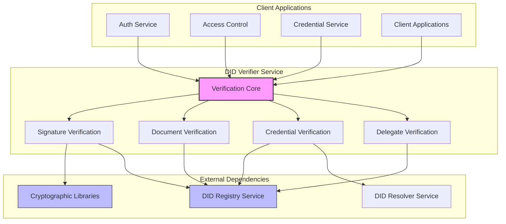
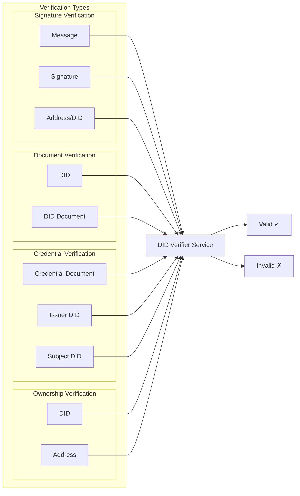
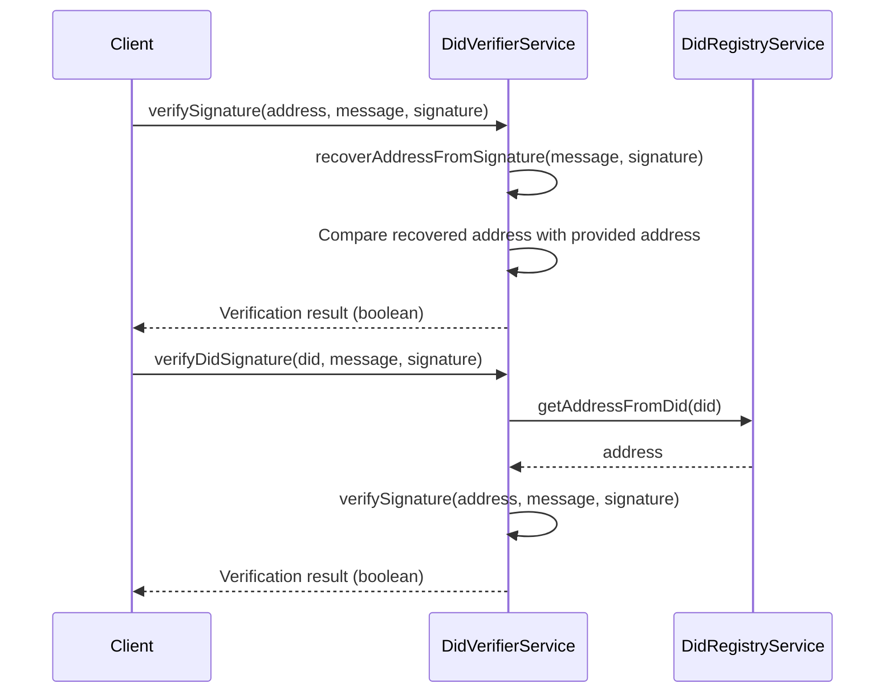
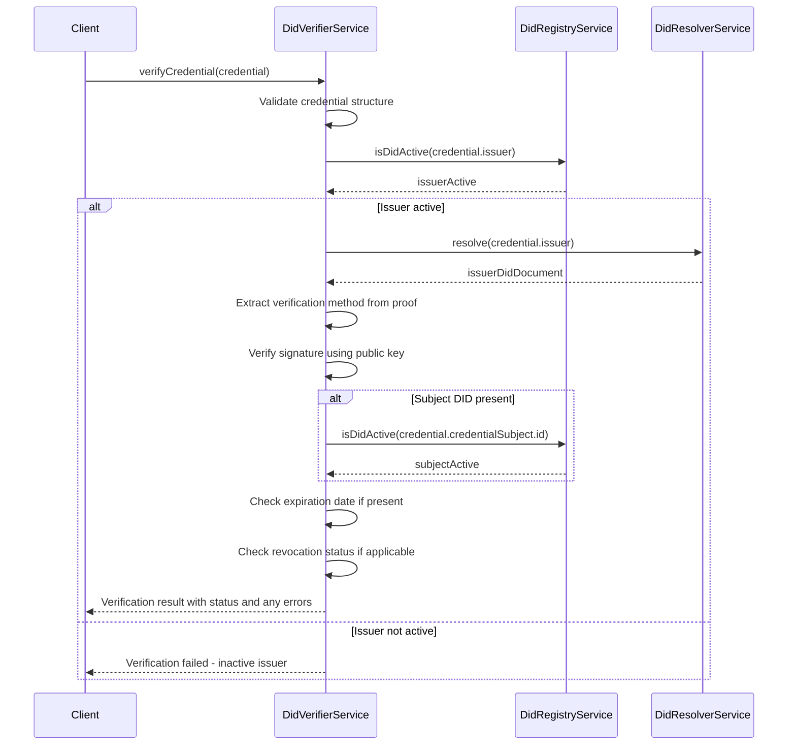
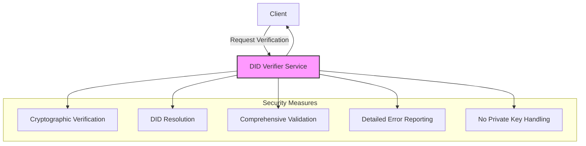
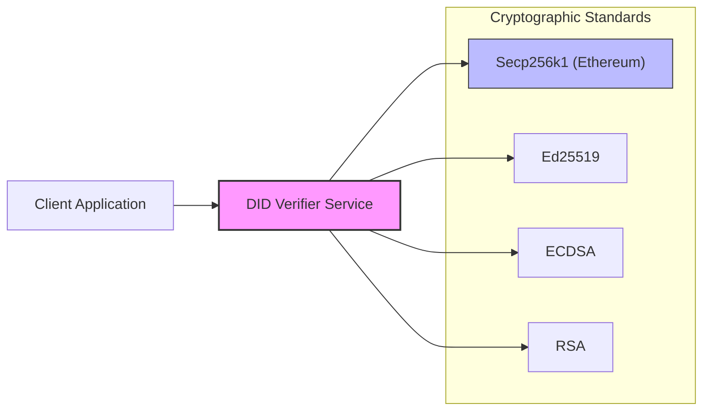

import HeaderTitle from '@/components/title';

<HeaderTitle
  title="DID Verifier Service"
  source="https://github.com/LED-UP/LED-UP/tree/main/apis/auth"
/>
---


**Component Type:** Service  
**Path:** `/services/auth/DidVerifierService.ts`

## Overview

The DID Verifier Service provides cryptographic verification functionality for the LEDUP system's decentralized identity infrastructure. It handles signature verification, DID document authentication, and credential validation to ensure the integrity and authenticity of identity claims within the system.



## Verification Patterns

The DID Verifier Service supports multiple verification patterns for different authentication needs:



## Dependencies

The service relies on several components:

- **DidRegistryService**: For accessing DID information stored on the blockchain
- **InvocationContext**: For logging and contextual operations
- **ethereumjs-util**: For Ethereum cryptographic operations
- **did-jwt**: For verification of DID-based JWT tokens

## Methods

### verifySignature

Verifies that a signature was created by the private key corresponding to an Ethereum address.

```typescript
public async verifySignature(
  address: string,
  message: string,
  signature: string
): Promise<boolean>
```

**Parameters:**

- `address`: The Ethereum address that supposedly signed the message
- `message`: The message that was signed
- `signature`: The signature to verify

**Returns:**

- `Promise<boolean>`: True if the signature is valid, false otherwise

**Process:**

1. Recovers the address from the signature and message
2. Compares the recovered address with the provided address
3. Returns true if they match, false otherwise

### verifyDidSignature

Verifies that a signature was created by the private key corresponding to a DID.

```typescript
public async verifyDidSignature(
  did: string,
  message: string,
  signature: string
): Promise<boolean>
```

**Parameters:**

- `did`: The DID that supposedly signed the message
- `message`: The message that was signed
- `signature`: The signature to verify

**Returns:**

- `Promise<boolean>`: True if the signature is valid, false otherwise

**Process:**

1. Resolves the DID to get the associated Ethereum address
2. Verifies the signature using the address

### verifyDidOwnership

Verifies that a DID is owned by a specific Ethereum address.

```typescript
public async verifyDidOwnership(
  did: string,
  address: string
): Promise<boolean>
```

**Parameters:**

- `did`: The DID to check
- `address`: The Ethereum address to verify as the owner

**Returns:**

- `Promise<boolean>`: True if the address owns the DID, false otherwise

### verifyCredential

Verifies a Verifiable Credential for authenticity and validity.

```typescript
public async verifyCredential(
  credential: any
): Promise<VerificationResult>
```

**Parameters:**

- `credential`: The Verifiable Credential to verify

**Returns:**

- `Promise<VerificationResult>`: Object containing verification status and any errors

**Verification Result Structure:**

```typescript
{
  isValid: boolean;  // True if the credential is valid
  errors: string[];  // Array of error messages if any
}
```

**Verification Checks:**

1. Validates the credential structure according to W3C standards
2. Verifies the issuer's DID is valid
3. Verifies the signature on the credential
4. Checks that the credential has not been revoked
5. Validates the credential's expiration date if present

### verifyDidDocument

Verifies a DID Document for authenticity and conformance to specifications.

```typescript
public async verifyDidDocument(
  didDoc: any
): Promise<boolean>
```

**Parameters:**

- `didDoc`: The DID Document to verify

**Returns:**

- `Promise<boolean>`: True if the document is valid, false otherwise

**Verification Checks:**

1. Validates the document structure according to W3C DID Core specifications
2. Verifies that verification methods (keys) are properly formed
3. Checks for consistency between the DID and the document content

### verifyController

Verifies if a DID is controlled by another DID.

```typescript
public async verifyController(
  did: string,
  controllerDid: string
): Promise<boolean>
```

**Parameters:**

- `did`: The DID to check
- `controllerDid`: The controller DID

**Returns:**

- `Promise<boolean>`: True if the controllerDid is a controller of did, false otherwise

### recoverAddressFromSignature (private)

Internal method that recovers an Ethereum address from a signature and message.

```typescript
private async recoverAddressFromSignature(
  message: string,
  signature: string
): Promise<string>
```

**Parameters:**

- `message`: The original message that was signed
- `signature`: The signature to analyze

**Returns:**

- `Promise<string>`: The recovered Ethereum address

## Verification Workflows

### Signature Verification Flow

The process of verifying a signature:



### Credential Verification Flow

The process of verifying a Verifiable Credential:



## Error Handling

The DidVerifierService implements comprehensive error handling:

| Error Condition                | Handling Strategy                                            |
| ------------------------------ | ------------------------------------------------------------ |
| Invalid signature format       | Returns false with appropriate error message                 |
| DID not found                  | Returns false with "DID not found" error                     |
| Signature verification failure | Returns false with signature mismatch error                  |
| Malformed credential           | Returns verification result with structure validation errors |
| Expired credential             | Returns verification result with expiration error            |
| Revoked credential             | Returns verification result with revocation error            |

## Security Considerations



The DidVerifierService implements several security measures:

1. **Cryptographic Verification**: Uses industry-standard cryptographic libraries for verification
2. **DID Resolution**: Properly resolves DIDs to ensure the correct keys are used for verification
3. **Comprehensive Validation**: Performs thorough validation of credentials and DID documents
4. **Error Details**: Provides detailed error information for security auditing
5. **No Private Key Handling**: Never handles private keys, only performs verification operations

## Integration Examples

### Verifying a Signature

```typescript
// Initialize the DID Verifier Service
const didVerifierService = new DidVerifierService(didRegistryService, context);

// Verify a signature from an Ethereum address
const address = '0x1234567890abcdef1234567890abcdef12345678';
const message = 'Sign this message to prove you own the address 0x1234...5678.';
const signature = '0x7f9e3266f3f110a40bd1b88c7369f2f4775c2ed672ed37c1b650635e94dc7101...';

try {
  const isValid = await didVerifierService.verifySignature(address, message, signature);

  if (isValid) {
    console.log('Signature is valid');
    // Proceed with authentication
  } else {
    console.log('Signature is invalid');
    // Reject authentication
  }
} catch (error) {
  console.error('Signature verification failed:', error);
}
```

### Verifying a DID Signature

```typescript
// Verify a signature from a DID
const did = 'did:ethr:0x1234567890abcdef1234567890abcdef12345678';
const message = 'Sign this message to prove you control the DID did:ethr:0x1234...5678.';
const signature = '0x7f9e3266f3f110a40bd1b88c7369f2f4775c2ed672ed37c1b650635e94dc7101...';

try {
  const isValid = await didVerifierService.verifyDidSignature(did, message, signature);

  if (isValid) {
    console.log('DID signature is valid');
    // Proceed with DID-based authentication
  } else {
    console.log('DID signature is invalid');
    // Reject DID-based authentication
  }
} catch (error) {
  console.error('DID signature verification failed:', error);
}
```

### Verifying a Credential

```typescript
// Verify a Verifiable Credential
const credential = {
  '@context': ['https://www.w3.org/2018/credentials/v1'],
  type: ['VerifiableCredential', 'HealthcareProviderCredential'],
  issuer: 'did:ethr:0xab16a96d359ec26a11e2c2b3d8f8b8942d5bfcdb',
  issuanceDate: '2023-04-12T15:52:30.594Z',
  credentialSubject: {
    id: 'did:ethr:0x1234567890abcdef1234567890abcdef12345678',
    name: 'Dr. John Smith',
    specialty: 'Cardiology',
    licenseNumber: 'MED12345',
  },
  proof: {
    type: 'EcdsaSecp256k1Signature2019',
    created: '2023-04-12T15:52:30.594Z',
    proofPurpose: 'assertionMethod',
    verificationMethod: 'did:ethr:0xab16a96d359ec26a11e2c2b3d8f8b8942d5bfcdb#keys-1',
    signature: '0x7f9e3266f3f110a40bd1b88c7369f2f4775c2ed672ed37c1b650635e94dc7101...',
  },
};

try {
  const verificationResult = await didVerifierService.verifyCredential(credential);

  if (verificationResult.isValid) {
    console.log('Credential is valid');
    // Process the verified credential
  } else {
    console.log('Credential is invalid:', verificationResult.errors);
    // Reject the credential
  }
} catch (error) {
  console.error('Credential verification failed:', error);
}
```

## Cryptographic Standards



The DidVerifierService supports the following cryptographic standards:

1. **Secp256k1**: Ethereum's signature scheme (most common in LEDUP)
2. **Ed25519**: Edwards-curve Digital Signature Algorithm
3. **ECDSA**: Elliptic Curve Digital Signature Algorithm
4. **RSA**: For backwards compatibility with some systems

## Performance Considerations

The DidVerifierService is optimized for performance:

1. **Caching**: Implements caching of DIDs and their associated data
2. **Efficient Recovery**: Uses optimized libraries for address recovery
3. **Parallel Verification**: Can handle multiple verification requests concurrently
4. **Stateless Design**: Maintains no state between verification operations
