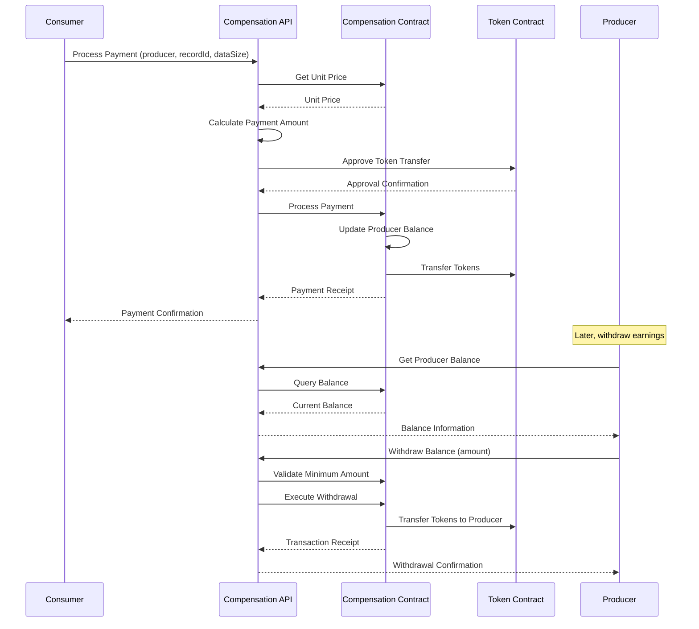

import HeaderTitle from '@/components/title';

<HeaderTitle
  title="Compensation API Reference"
  source="https://github.com/LED-UP/LED-UP/tree/main/apis/contract-services"
/>

---

## Overview

The Compensation API provides a set of HTTP endpoints implemented as Azure Functions for managing data access payments, producer balances, and compensation settings within the LEDUP ecosystem. These functions enable secure payment processing, balance management, and administrative control over the compensation system.

## Compensation Workflow



## API Endpoints

### Payment Processing

#### Process Payment

Processes a payment from a consumer to a producer for data usage.

**Endpoint:** `POST /compensation/process-payment`

**Request Body:**

```json
{
  "producer": "0x1234567890abcdef1234567890abcdef12345678",
  "recordId": "record-123456",
  "dataSize": 10240
}
```

**Parameters:**

- `producer` (string, required): Ethereum address of the data producer
- `recordId` (string, required): Unique identifier for the data record
- `dataSize` (number, required): Size of the data in bytes

**Response (200 OK):**

```json
{
  "success": true,
  "data": {
    "receipt": {
      "transactionHash": "0x1234567890abcdef1234567890abcdef1234567890abcdef1234567890abcdef",
      "blockNumber": 12345678,
      "events": {
        "PaymentProcessed": {
          "producer": "0x1234567890abcdef1234567890abcdef12345678",
          "consumer": "0x9876543210fedcba9876543210fedcba98765432",
          "amount": "10240000000000000000000",
          "serviceFee": "512000000000000000000"
        }
      }
    },
    "paymentDetails": {
      "producer": "0x1234567890abcdef1234567890abcdef12345678",
      "recordId": "record-123456",
      "dataSize": 10240,
      "unitPrice": "1000000000000000000",
      "amount": "10240000000000000000000"
    }
  }
}
```

**Error Response (400 Bad Request):**

```json
{
  "success": false,
  "error": "Invalid request parameters",
  "details": [
    {
      "code": "invalid_type",
      "expected": "number",
      "received": "string",
      "path": ["dataSize"],
      "message": "Expected number, received string"
    }
  ]
}
```

**Error Response (402 Payment Required):**

```json
{
  "success": false,
  "error": "Insufficient funds to process payment",
  "details": "ERC20: transfer amount exceeds balance"
}
```

**Error Response (500 Internal Server Error):**

```json
{
  "success": false,
  "error": "Failed to process payment",
  "details": "Service unavailable"
}
```

### Balance Management

#### Get Producer Balance

Retrieves the current balance for a data producer.

**Endpoint:** `GET /compensation/producer-balance?address={address}`

**Query Parameters:**

- `address` (string, required): Ethereum address of the data producer

**Response (200 OK):**

```json
{
  "success": true,
  "data": {
    "producer": "0x1234567890abcdef1234567890abcdef12345678",
    "balance": "10752000000000000000000",
    "formattedBalance": "10752.0",
    "token": {
      "address": "0xabc1234567890abcdef1234567890abcdef12345",
      "symbol": "LEDP",
      "decimals": "18"
    },
    "timestamp": "2025-03-15T10:30:45.123Z"
  }
}
```

**Error Response (400 Bad Request):**

```json
{
  "success": false,
  "error": "Invalid address format",
  "details": [
    {
      "code": "invalid_string",
      "validation": "regex",
      "message": "Invalid Ethereum address format",
      "path": ["address"]
    }
  ]
}
```

**Error Response (500 Internal Server Error):**

```json
{
  "success": false,
  "error": "Failed to retrieve producer balance",
  "details": "Failed to connect to blockchain provider"
}
```

#### Withdraw Producer Balance

Withdraws tokens from a producer's balance.

**Endpoint:** `POST /compensation/producer/withdraw`

**Request Body:**

```json
{
  "value": 5000
}
```

**Parameters:**

- `value` (number, required): Amount to withdraw (in token units)

**Response (200 OK):**

```json
{
  "success": true,
  "data": {
    "receipt": {
      "transactionHash": "0x1234567890abcdef1234567890abcdef1234567890abcdef1234567890abcdef",
      "blockNumber": 12345678,
      "events": {
        "ProducerPaid": {
          "producer": "0x1234567890abcdef1234567890abcdef12345678",
          "amount": "5000000000000000000000"
        }
      }
    },
    "withdrawal": {
      "amount": "5000",
      "previousBalance": "10752000000000000000000",
      "newBalance": "5752000000000000000000",
      "producer": "0x1234567890abcdef1234567890abcdef12345678"
    }
  }
}
```

**Error Response (400 Bad Request - Insufficient Balance):**

```json
{
  "success": false,
  "error": "Insufficient balance",
  "details": "Requested amount (5000) exceeds available balance (4000)"
}
```

**Error Response (400 Bad Request - Below Minimum):**

```json
{
  "success": false,
  "error": "Amount below minimum",
  "details": "Requested amount (5) is below the minimum withdrawal amount (100)"
}
```

**Error Response (403 Forbidden):**

```json
{
  "success": false,
  "error": "Not authorized to withdraw funds",
  "details": "Caller is not a registered producer"
}
```

### Administrative Functions

#### Get Unit Price

Retrieves the current unit price used for data compensation calculations.

**Endpoint:** `GET /compensation/unit-price`

**Response (200 OK):**

```json
{
  "success": true,
  "data": {
    "unitPrice": "1000000000000000000",
    "formattedUnitPrice": "1.0",
    "token": {
      "address": "0xabc1234567890abcdef1234567890abcdef12345",
      "symbol": "LEDP",
      "decimals": "18"
    }
  }
}
```

**Error Response (500 Internal Server Error):**

```json
{
  "success": false,
  "error": "Failed to retrieve unit price",
  "details": "Failed to connect to blockchain provider"
}
```

#### Change Unit Price

Updates the unit price used for data compensation calculations.

**Endpoint:** `POST /compensation/unit-price`

**Request Body:**

```json
{
  "value": "1500000000000000000"
}
```

**Parameters:**

- `value` (string, required): New unit price in wei

**Response (200 OK):**

```json
{
  "success": true,
  "data": {
    "receipt": {
      "transactionHash": "0x1234567890abcdef1234567890abcdef1234567890abcdef1234567890abcdef",
      "blockNumber": 12345678,
      "events": {
        "UnitPriceChanged": {
          "oldPrice": "1000000000000000000",
          "newPrice": "1500000000000000000",
          "initiator": "0x9876543210fedcba9876543210fedcba98765432"
        }
      }
    },
    "unitPrice": {
      "oldPrice": "1000000000000000000",
      "newPrice": "1500000000000000000",
      "formattedOldPrice": "1.0",
      "formattedNewPrice": "1.5"
    }
  }
}
```

**Error Response (403 Forbidden):**

```json
{
  "success": false,
  "error": "Not authorized",
  "details": "Caller is not the contract owner"
}
```

#### Get Service Fee

Retrieves the current service fee percentage.

**Endpoint:** `GET /compensation/service-fee`

**Response (200 OK):**

```json
{
  "success": true,
  "data": {
    "serviceFee": 5,
    "description": "5% of each payment is retained as a service fee"
  }
}
```

**Error Response (500 Internal Server Error):**

```json
{
  "success": false,
  "error": "Failed to retrieve service fee",
  "details": "Failed to connect to blockchain provider"
}
```

#### Change Service Fee

Updates the service fee percentage.

**Endpoint:** `POST /compensation/service-fee`

**Request Body:**

```json
{
  "value": 7
}
```

**Parameters:**

- `value` (number, required): New service fee percentage (0-100)

**Response (200 OK):**

```json
{
  "success": true,
  "data": {
    "receipt": {
      "transactionHash": "0x1234567890abcdef1234567890abcdef1234567890abcdef1234567890abcdef",
      "blockNumber": 12345678,
      "events": {
        "ServiceFeeChanged": {
          "oldFee": 5,
          "newFee": 7,
          "initiator": "0x9876543210fedcba9876543210fedcba98765432"
        }
      }
    },
    "serviceFee": {
      "oldFee": 5,
      "newFee": 7,
      "description": "Service fee changed from 5% to 7%"
    }
  }
}
```

**Error Response (400 Bad Request):**

```json
{
  "success": false,
  "error": "Invalid service fee",
  "details": "Service fee must be between 0 and 100"
}
```

#### Get Minimum Withdraw Amount

Retrieves the minimum amount required for withdrawals.

**Endpoint:** `GET /compensation/minimum-withdraw-amount`

**Response (200 OK):**

```json
{
  "success": true,
  "data": {
    "minimumWithdrawAmount": "100000000000000000000",
    "formattedAmount": "100.0",
    "token": {
      "address": "0xabc1234567890abcdef1234567890abcdef12345",
      "symbol": "LEDP",
      "decimals": "18"
    }
  }
}
```

**Error Response (500 Internal Server Error):**

```json
{
  "success": false,
  "error": "Failed to retrieve minimum withdraw amount",
  "details": "Failed to connect to blockchain provider"
}
```

#### Get Payment Token Address

Retrieves the address of the ERC20 token used for payments.

**Endpoint:** `GET /compensation/token-address`

**Response (200 OK):**

```json
{
  "success": true,
  "data": {
    "tokenAddress": "0xabc1234567890abcdef1234567890abcdef12345",
    "tokenDetails": {
      "name": "LEDUP Token",
      "symbol": "LEDP",
      "decimals": 18,
      "totalSupply": "1000000000000000000000000"
    }
  }
}
```

**Error Response (500 Internal Server Error):**

```json
{
  "success": false,
  "error": "Failed to retrieve token address",
  "details": "Failed to connect to blockchain provider"
}
```

#### Change Token Address

Updates the ERC20 token address used for payments.

**Endpoint:** `POST /compensation/token-address`

**Request Body:**

```json
{
  "address": "0xdef1234567890abcdef1234567890abcdef12345"
}
```

**Parameters:**

- `address` (string, required): New token contract address

**Response (200 OK):**

```json
{
  "success": true,
  "data": {
    "receipt": {
      "transactionHash": "0x1234567890abcdef1234567890abcdef1234567890abcdef1234567890abcdef",
      "blockNumber": 12345678,
      "events": {
        "TokenAddressChanged": {
          "oldAddress": "0xabc1234567890abcdef1234567890abcdef12345",
          "newAddress": "0xdef1234567890abcdef1234567890abcdef12345",
          "initiator": "0x9876543210fedcba9876543210fedcba98765432"
        }
      }
    },
    "tokenDetails": {
      "oldAddress": "0xabc1234567890abcdef1234567890abcdef12345",
      "newAddress": "0xdef1234567890abcdef1234567890abcdef12345",
      "newToken": {
        "name": "New LEDUP Token",
        "symbol": "NLEDP",
        "decimals": 18
      }
    }
  }
}
```

**Error Response (400 Bad Request):**

```json
{
  "success": false,
  "error": "Invalid token address",
  "details": "Address does not implement the ERC20 interface"
}
```

#### Pause Compensation

Pauses the compensation system to prevent new payments.

**Endpoint:** `POST /compensation/pause`

**Response (200 OK):**

```json
{
  "success": true,
  "data": {
    "receipt": {
      "transactionHash": "0x1234567890abcdef1234567890abcdef1234567890abcdef1234567890abcdef",
      "blockNumber": 12345678,
      "events": {
        "Paused": {
          "account": "0x9876543210fedcba9876543210fedcba98765432"
        }
      }
    },
    "status": {
      "paused": true,
      "timestamp": "2025-03-15T10:30:45.123Z"
    }
  }
}
```

**Error Response (400 Bad Request):**

```json
{
  "success": false,
  "error": "Contract already paused",
  "details": "The compensation contract is already in paused state"
}
```

**Error Response (403 Forbidden):**

```json
{
  "success": false,
  "error": "Not authorized",
  "details": "Caller does not have pauser role"
}
```

#### Unpause Compensation

Unpauses the compensation system to enable payments.

**Endpoint:** `POST /compensation/unpause`

**Response (200 OK):**

```json
{
  "success": true,
  "data": {
    "receipt": {
      "transactionHash": "0x1234567890abcdef1234567890abcdef1234567890abcdef1234567890abcdef",
      "blockNumber": 12345678,
      "events": {
        "Unpaused": {
          "account": "0x9876543210fedcba9876543210fedcba98765432"
        }
      }
    },
    "status": {
      "paused": false,
      "timestamp": "2025-03-15T10:30:45.123Z"
    }
  }
}
```

**Error Response (400 Bad Request):**

```json
{
  "success": false,
  "error": "Contract not paused",
  "details": "The compensation contract is not currently paused"
}
```

**Error Response (403 Forbidden):**

```json
{
  "success": false,
  "error": "Not authorized",
  "details": "Caller does not have pauser role"
}
```

#### Withdraw Service Fee

Withdraws accumulated service fees to the specified address.

**Endpoint:** `POST /compensation/withdraw-service-fee`

**Request Body:**

```json
{
  "recipient": "0x9876543210fedcba9876543210fedcba98765432"
}
```

**Parameters:**

- `recipient` (string, required): Address to receive the service fees

**Response (200 OK):**

```json
{
  "success": true,
  "data": {
    "receipt": {
      "transactionHash": "0x1234567890abcdef1234567890abcdef1234567890abcdef1234567890abcdef",
      "blockNumber": 12345678,
      "events": {
        "ServiceFeeWithdrawn": {
          "recipient": "0x9876543210fedcba9876543210fedcba98765432",
          "amount": "1000000000000000000000"
        }
      }
    },
    "withdrawal": {
      "recipient": "0x9876543210fedcba9876543210fedcba98765432",
      "amount": "1000000000000000000000",
      "formattedAmount": "1000.0"
    }
  }
}
```

**Error Response (400 Bad Request):**

```json
{
  "success": false,
  "error": "Invalid recipient address",
  "details": "The provided address is not a valid Ethereum address"
}
```

**Error Response (403 Forbidden):**

```json
{
  "success": false,
  "error": "Not authorized",
  "details": "Caller is not the contract owner"
}
```

## Security Considerations

### Authentication

- Administrative functions require appropriate authorization roles (owner, pauser).
- Withdrawals can only be made by the producer who owns the balance.
- Service fee withdrawals can only be performed by the contract owner.

### Authorization

- All endpoints implement proper role-based access control.
- Authorization is verified at the smart contract level, ensuring consistent security enforcement.
- Functions verify that callers have appropriate permissions before executing sensitive operations.

### Transaction Security

- All blockchain transactions are signed with authorized private keys.
- Approval flows are implemented for token transfers to prevent unauthorized access.
- Minimum withdrawal amounts prevent dust attacks and inefficient transactions.

## Integration Examples

### Processing a Payment

```typescript
import axios from 'axios';

/**
 * Processes a payment for data access
 * @param {string} producer - Ethereum address of the data producer
 * @param {string} recordId - Unique identifier for the data record
 * @param {number} dataSize - Size of the data in bytes
 * @returns {Promise<object>} - Payment receipt
 */
const processPayment = async (producer, recordId, dataSize) => {
  try {
    const response = await axios.post('/compensation/process-payment', {
      producer,
      recordId,
      dataSize,
    });

    return response.data.data;
  } catch (error) {
    console.error('Payment processing failed:', error.response?.data || error.message);
    throw new Error('Failed to process payment');
  }
};

// Usage example
const main = async () => {
  try {
    const paymentReceipt = await processPayment('0x1234567890abcdef1234567890abcdef12345678', 'record-123456', 10240);

    console.log('Payment processed successfully:', paymentReceipt);
    console.log(`Transaction hash: ${paymentReceipt.receipt.transactionHash}`);
    console.log(`Amount paid: ${paymentReceipt.paymentDetails.amount}`);
  } catch (error) {
    console.error('Error:', error.message);
  }
};
```

### Managing Producer Balance

```typescript
import axios from 'axios';

/**
 * Checks a producer's current balance
 * @param {string} address - Ethereum address of the producer
 * @returns {Promise<object>} - Balance information
 */
const checkProducerBalance = async (address) => {
  try {
    const response = await axios.get(`/compensation/producer-balance?address=${address}`);
    return response.data.data;
  } catch (error) {
    console.error('Balance check failed:', error.response?.data || error.message);
    throw new Error('Failed to check balance');
  }
};

/**
 * Withdraws tokens from a producer's balance
 * @param {number} amount - Amount to withdraw
 * @returns {Promise<object>} - Withdrawal receipt
 */
const withdrawProducerBalance = async (amount) => {
  try {
    const response = await axios.post('/compensation/producer/withdraw', {
      value: amount,
    });
    return response.data.data;
  } catch (error) {
    console.error('Withdrawal failed:', error.response?.data || error.message);
    throw new Error('Failed to withdraw balance');
  }
};

// Usage example
const main = async () => {
  const producerAddress = '0x1234567890abcdef1234567890abcdef12345678';

  try {
    // Check current balance
    const balanceInfo = await checkProducerBalance(producerAddress);
    console.log(`Current balance: ${balanceInfo.formattedBalance} ${balanceInfo.token.symbol}`);

    // Get minimum withdrawal amount
    const minWithdrawResponse = await axios.get('/compensation/minimum-withdraw-amount');
    const minWithdraw = minWithdrawResponse.data.data.formattedAmount;
    console.log(`Minimum withdrawal amount: ${minWithdraw}`);

    // Withdraw if balance is sufficient
    if (parseFloat(balanceInfo.formattedBalance) >= parseFloat(minWithdraw)) {
      const withdrawalAmount = Math.floor(parseFloat(balanceInfo.formattedBalance));
      console.log(`Attempting to withdraw ${withdrawalAmount} tokens...`);

      const withdrawal = await withdrawProducerBalance(withdrawalAmount);
      console.log('Withdrawal successful!');
      console.log(`Transaction hash: ${withdrawal.receipt.transactionHash}`);
      console.log(`New balance: ${withdrawal.withdrawal.newBalance}`);
    } else {
      console.log('Insufficient balance for withdrawal');
    }
  } catch (error) {
    console.error('Error:', error.message);
  }
};
```

### Administrative Tasks

```typescript
import axios from 'axios';

/**
 * Updates the unit price for data compensation
 * @param {string} newPrice - New unit price in wei
 * @returns {Promise<object>} - Update receipt
 */
const updateUnitPrice = async (newPrice) => {
  try {
    const response = await axios.post('/compensation/unit-price', {
      value: newPrice,
    });
    return response.data.data;
  } catch (error) {
    console.error('Unit price update failed:', error.response?.data || error.message);
    throw new Error('Failed to update unit price');
  }
};

/**
 * Updates the service fee percentage
 * @param {number} newFee - New service fee percentage
 * @returns {Promise<object>} - Update receipt
 */
const updateServiceFee = async (newFee) => {
  try {
    const response = await axios.post('/compensation/service-fee', {
      value: newFee,
    });
    return response.data.data;
  } catch (error) {
    console.error('Service fee update failed:', error.response?.data || error.message);
    throw new Error('Failed to update service fee');
  }
};

/**
 * Pauses or unpauses the compensation system
 * @param {boolean} pause - Whether to pause (true) or unpause (false)
 * @returns {Promise<object>} - Operation receipt
 */
const setPauseState = async (pause) => {
  try {
    const endpoint = pause ? '/compensation/pause' : '/compensation/unpause';
    const response = await axios.post(endpoint);
    return response.data.data;
  } catch (error) {
    console.error(`${pause ? 'Pause' : 'Unpause'} operation failed:`, error.response?.data || error.message);
    throw new Error(`Failed to ${pause ? 'pause' : 'unpause'} compensation system`);
  }
};

// Usage example
const adminTasks = async () => {
  try {
    // Update unit price to 1.5 tokens
    const newUnitPrice = '1500000000000000000'; // 1.5 * 10^18
    const priceUpdate = await updateUnitPrice(newUnitPrice);
    console.log(
      `Unit price updated from ${priceUpdate.unitPrice.formattedOldPrice} to ${priceUpdate.unitPrice.formattedNewPrice}`
    );

    // Update service fee to 7%
    const newServiceFee = 7;
    const feeUpdate = await updateServiceFee(newServiceFee);
    console.log(feeUpdate.serviceFee.description);

    // Pause the system for maintenance
    console.log('Pausing compensation system...');
    const pauseReceipt = await setPauseState(true);
    console.log(`System paused: ${pauseReceipt.status.paused}`);

    // Later, unpause the system
    console.log('Unpausing compensation system...');
    const unpauseReceipt = await setPauseState(false);
    console.log(`System paused: ${unpauseReceipt.status.paused}`);
  } catch (error) {
    console.error('Error during administrative tasks:', error.message);
  }
};
```

## Implementation Details

### Process Payment Function

The process payment function (`processPayment.ts`) handles the complete payment workflow:

1. Validates the request parameters using Zod schema validation
2. Initializes the CompensationService and TokenService with appropriate contract addresses and ABIs
3. Gets the current unit price from the compensation contract
4. Calculates the payment amount based on the data size and unit price
5. Approves the token transfer for the calculated amount
6. Processes the payment through the compensation contract
7. Returns a structured response with the transaction receipt and payment details

This function ensures that data consumers properly compensate data producers for health data usage, with appropriate service fees allocated to platform maintenance.

### Producer Balance Function

The producer balance function (`getProducerBalance.ts`) provides a simple way to check a producer's current balance:

1. Validates the address parameter to ensure it's a valid Ethereum address
2. Initializes the CompensationService with the contract address and ABI
3. Retrieves the producer's balance from the contract
4. Gets token details to provide context (symbol, decimals)
5. Formats the balance for better readability
6. Returns a structured response with comprehensive balance information

This function enables producers to monitor their earnings and determine when to make withdrawals.

### Withdraw Producer Balance Function

The withdraw producer balance function (`withdrawProducerBalance.ts`) allows producers to withdraw their earnings:

1. Validates the withdrawal amount using Zod schema validation
2. Initializes the CompensationService with the contract address and ABI
3. Gets the current producer balance using the authenticated signer's address
4. Retrieves the minimum withdrawal amount from the contract
5. Validates the withdrawal amount against the balance and minimum
6. Processes the withdrawal transaction
7. Returns a structured response with the transaction receipt and updated balance information

This function enforces important security constraints, such as minimum withdrawal amounts and balance verification.

---

© 2025 LEDUP | Documentation for Production Use | Last Updated: March 2025
