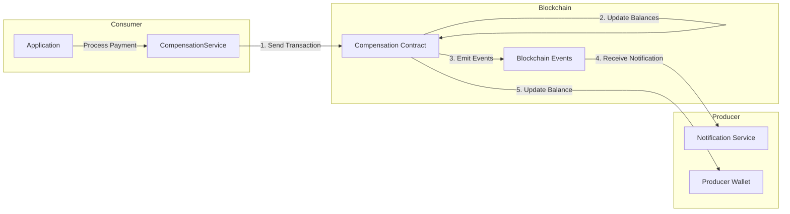
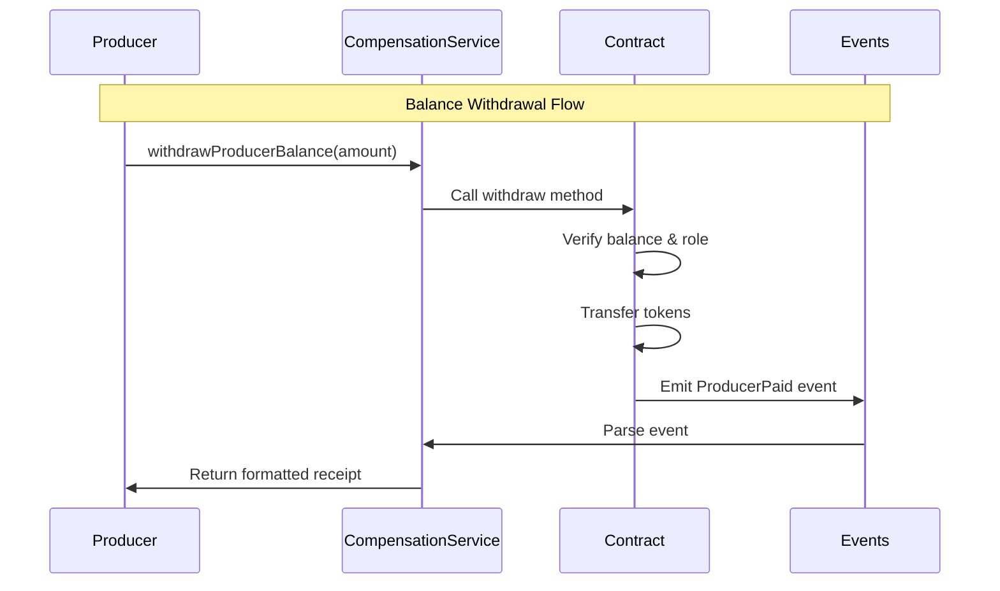
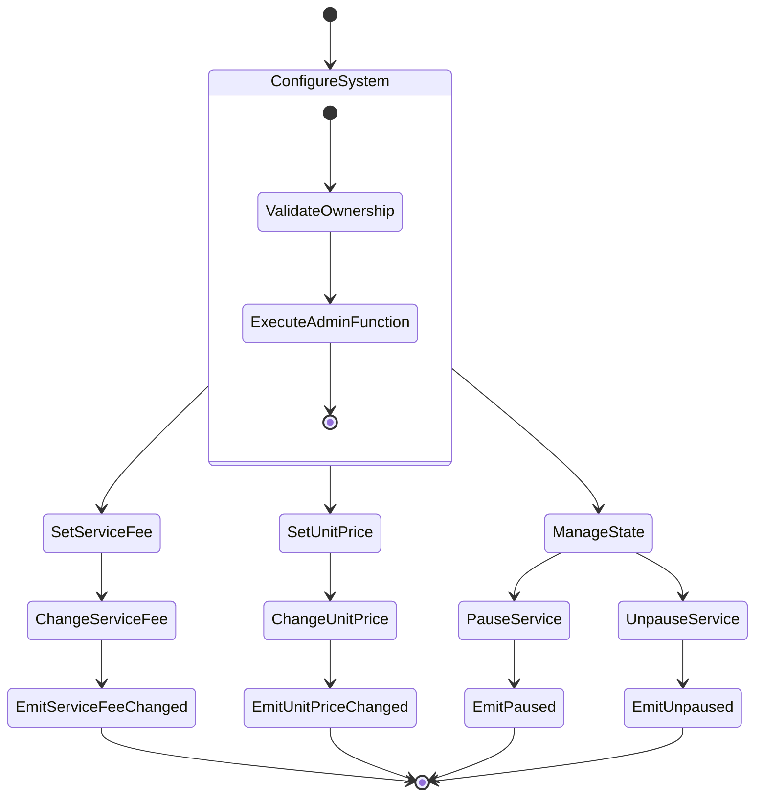
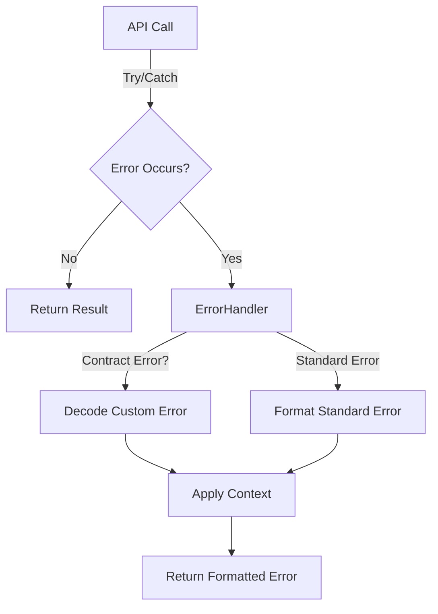
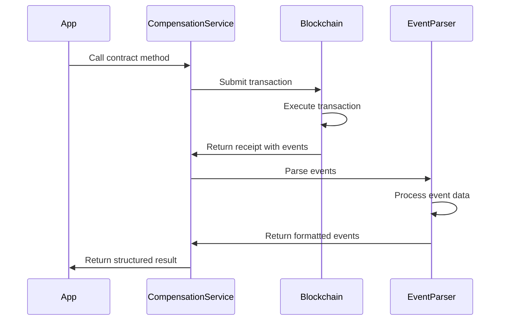

import HeaderTitle from '@/components/title';

<HeaderTitle
  title="LEDUP - Compensation Service API"
  source="https://github.com/LED-UP/LED-UP/tree/main/apis/contract-services"
/>

---

**Version:** 1.0.0  
**Last Updated:** March 2025  
**Status:** Production

## Overview

The Compensation Service provides a TypeScript interface for interacting with the Compensation smart contract in the LEDUP ecosystem. This service handles all payment processing between data consumers and producers, tracks balances, calculates service fees, and manages compensation for health data sharing.

## Key Features

### Payment Processing



The service enables secure payment processing with comprehensive transaction handling:

```typescript
// Process payment from consumer to producer
const result = await compensationService.processPayment({
  producer: '0x1234...', // Producer address
  recordId: 'record-123', // Record identifier
  dataSize: 1024, // Size of data in bytes
  consumerDid: 'did:ledup:consumer123', // DID of the consumer
});

// Result contains transaction details and event information
console.log(`Payment processed with transaction hash: ${result.transactionHash}`);
```

### Balance Management



The service provides methods to manage producer balances and withdrawals:

```typescript
// Check producer's current balance
const balance = await compensationService.getProducerBalance('0x1234...');
console.log(`Current balance: ${balance} tokens`);

// Withdraw available funds
const withdrawalResult = await compensationService.withdrawProducerBalance(1000000000000000000n); // 1 token
console.log(`Withdrawal processed: ${withdrawalResult.description}`);
```

### Administration



The service includes administrative functions for platform management:

```typescript
// Change service fee (admin only)
const feeResult = await compensationService.changeServiceFee(5); // 5% fee
console.log(`Service fee updated: ${feeResult.description}`);

// Change unit price (admin only)
const priceResult = await compensationService.changeUnitPrice(1500000000000000000n); // 1.5 tokens per unit
console.log(`Unit price updated: ${priceResult.description}`);

// Pause/unpause service (admin only)
await compensationService.pauseService();
await compensationService.unpauseService();
```

## Error Handling

The Compensation Service includes robust error handling through the `CompensationErrorHandler` class, which translates blockchain errors into user-friendly messages.



### Common Errors

The service handles the following contract-specific errors:

| Error Code                            | Description                         | User-Friendly Message                                                                       |
| ------------------------------------- | ----------------------------------- | ------------------------------------------------------------------------------------------- |
| `Compensation__InsufficientBalance`   | User has insufficient balance       | "Insufficient balance: The account does not have enough balance to complete this operation" |
| `Compensation__TokenTransferFailed`   | ERC20 token transfer failed         | "Token transfer failed: The token transfer operation failed"                                |
| `Compensation__NoBalanceToWithdraw`   | No balance available for withdrawal | "No balance to withdraw: The account does not have any balance to withdraw"                 |
| `Compensation__InvalidProducer`       | Producer not registered or invalid  | "Invalid producer: The producer is invalid or not registered"                               |
| `Compensation__InvalidConsumer`       | Consumer not registered or invalid  | "Invalid consumer: The consumer is invalid or not registered"                               |
| `Compensation__MinimumWithdrawAmount` | Withdrawal below minimum amount     | "Minimum withdraw amount: The withdrawal amount is below the minimum allowed"               |

### Error Handling Example

```typescript
try {
  await compensationService.withdrawProducerBalance(100); // Too small amount
} catch (error) {
  console.error(error.message);
  // Output: "Minimum withdraw amount: The withdrawal amount is below the minimum allowed"
}
```

## Event Parsing

The service includes a comprehensive event parsing system through the `CompensationEventParser` class, which transforms blockchain events into structured and informative data objects.



### Supported Events

The service parses the following contract events:

| Event Name            | Description                                        | Enriched Data                                                      |
| --------------------- | -------------------------------------------------- | ------------------------------------------------------------------ |
| `PaymentProcessed`    | Emitted when a payment is processed                | Producer address, consumer address, amount, service fee, timestamp |
| `ProducerPaid`        | Emitted when a producer withdraws funds            | Producer address, amount, timestamp                                |
| `ServiceFeeWithdrawn` | Emitted when service fees are withdrawn            | Wallet address, amount, timestamp                                  |
| `ServiceFeeChanged`   | Emitted when the service fee percentage is changed | Old fee, new fee, initiator address                                |
| `UnitPriceChanged`    | Emitted when the unit price is changed             | Old price, new price, initiator address                            |
| `ProducerRemoved`     | Emitted when a producer is removed                 | Producer address, timestamp                                        |

### Event Listening

The service provides a method to listen for events:

```typescript
// Listen for payment events
const unsubscribe = compensationService.listenForEvents(
  'PaymentProcessed',
  { producer: '0x1234...' }, // Optional filter
  (event) => {
    console.log(`Payment processed: ${event.description}`);
    console.log(`Amount: ${event.amount}, Consumer: ${event._consumer}`);
  }
);

// Later, when done listening
unsubscribe();
```

## API Reference

### CompensationService

```typescript
class CompensationService {
  /**
   * Creates a new instance of the CompensationService
   * @param contractAddress The address of the Compensation contract
   * @param abi The ABI of the Compensation contract
   */
  constructor(contractAddress: string, abi: any);

  /**
   * Processes a payment from a consumer to a producer
   * @param params The parameters for the payment
   * @returns A promise that resolves to the transaction receipt with parsed events
   */
  async processPayment(params: ProcessPaymentParams): Promise<Record<string, any>>;

  /**
   * Withdraws a producer's balance
   * @param amount The amount to withdraw
   * @returns A promise that resolves to the transaction receipt with parsed events
   */
  async withdrawProducerBalance(amount: number | bigint): Promise<Record<string, any>>;

  /**
   * Withdraws service fees (admin only)
   * @param amount The amount to withdraw
   * @returns A promise that resolves to the transaction receipt with parsed events
   */
  async withdrawServiceFees(amount: number | bigint): Promise<Record<string, any>>;

  /**
   * Changes the service fee percentage (admin only)
   * @param newServiceFee The new service fee percentage
   * @returns A promise that resolves to the transaction receipt with parsed events
   */
  async changeServiceFee(newServiceFee: number): Promise<Record<string, any>>;

  /**
   * Changes the unit price (admin only)
   * @param newUnitPrice The new unit price
   * @returns A promise that resolves to the transaction receipt with parsed events
   */
  async changeUnitPrice(newUnitPrice: number | bigint): Promise<Record<string, any>>;

  /**
   * Sets the minimum withdrawal amount (admin only)
   * @param amount The minimum withdrawal amount
   * @returns A promise that resolves to the transaction receipt with parsed events
   */
  async setMinimumWithdrawAmount(amount: number | bigint): Promise<Record<string, any>>;

  /**
   * Changes the token address (admin only)
   * @param tokenAddress The new token address
   * @returns A promise that resolves to the transaction receipt with parsed events
   */
  async changeTokenAddress(tokenAddress: string): Promise<Record<string, any>>;

  /**
   * Pauses the service (admin only)
   * @returns A promise that resolves to the transaction receipt with parsed events
   */
  async pauseService(): Promise<Record<string, any>>;

  /**
   * Unpauses the service (admin only)
   * @returns A promise that resolves to the transaction receipt with parsed events
   */
  async unpauseService(): Promise<Record<string, any>>;

  /**
   * Gets the current service fee percentage
   * @returns A promise that resolves to the service fee percentage
   */
  async getServiceFee(): Promise<number>;

  /**
   * Gets the current unit price
   * @returns A promise that resolves to the unit price
   */
  async getUnitPrice(): Promise<number | bigint>;

  /**
   * Gets the minimum withdrawal amount
   * @returns A promise that resolves to the minimum withdrawal amount
   */
  async getMinimumWithdrawAmount(): Promise<number | bigint>;

  /**
   * Gets the token address
   * @returns A promise that resolves to the token address
   */
  async getTokenAddress(): Promise<string>;

  /**
   * Gets a producer's balance
   * @param producer The producer's address
   * @returns A promise that resolves to the producer's balance
   */
  async getProducerBalance(producer: string): Promise<number | bigint>;

  /**
   * Gets the service fee balance
   * @returns A promise that resolves to the service fee balance
   */
  async getServiceFeeBalance(): Promise<number | bigint>;

  /**
   * Verifies if a payment has been processed for a record
   * @param recordId The record ID
   * @returns A promise that resolves to a boolean indicating if payment was processed
   */
  async verifyPayment(recordId: string): Promise<boolean>;

  /**
   * Removes a producer (admin only)
   * @param producer The producer's address to remove
   * @returns A promise that resolves to the transaction receipt with parsed events
   */
  async removeProducer(producer: string): Promise<Record<string, any>>;

  /**
   * Checks if an error is of a specific type
   * @param error The error to check
   * @param errorName The name of the error
   * @returns A boolean indicating if the error is of the specified type
   */
  isErrorType(error: any, errorName: string): boolean;

  /**
   * Listens for contract events
   * @param eventName The name of the event to listen for
   * @param filter Optional filter for the events
   * @param callback The callback function to call when events are emitted
   * @returns A function to unsubscribe from the events
   */
  listenForEvents(eventName: string, filter: any = {}, callback: (event: any) => void): () => void;
}
```

### Input Parameters

```typescript
interface ProcessPaymentParams {
  /**
   * The address of the producer
   */
  producer: string;

  /**
   * The ID of the record being paid for
   */
  recordId: string;

  /**
   * The size of the data in bytes
   */
  dataSize: number;

  /**
   * The DID of the consumer
   */
  consumerDid: string;
}
```

## Integration Examples

### Basic Payment Processing

```typescript
import { CompensationService } from './services/contracts';

// Initialize the service
const compensationService = new CompensationService('0x1234567890AbCdEf1234567890aBcDeF12345678', compensationAbi);

// Process a payment
async function payForRecord() {
  try {
    const receipt = await compensationService.processPayment({
      producer: '0xProducerAddress',
      recordId: 'health-record-123',
      dataSize: 2048, // 2KB
      consumerDid: 'did:ledup:consumer456',
    });

    console.log('Payment successful:', receipt);
    console.log('Transaction hash:', receipt.transactionHash);
    console.log('Events:', receipt.events);

    // Verify the payment was recorded
    const isPaid = await compensationService.verifyPayment('health-record-123');
    console.log('Payment verified:', isPaid);
  } catch (error) {
    console.error('Payment failed:', error.message);
  }
}
```

### Producer Balance Management

```typescript
// Check and withdraw producer balance
async function manageProducerBalance() {
  try {
    // Get current balance
    const balance = await compensationService.getProducerBalance('0xMyAddress');
    console.log(`Current balance: ${balance}`);

    if (balance > 0) {
      // Withdraw available balance
      const withdrawalReceipt = await compensationService.withdrawProducerBalance(balance);
      console.log('Withdrawal successful:', withdrawalReceipt.description);
    }
  } catch (error) {
    console.error('Balance management failed:', error.message);
  }
}
```

### Administrative Functions

```typescript
// Administrative functions (owner only)
async function performAdminOperations() {
  try {
    // Update service fee to 3%
    await compensationService.changeServiceFee(3);

    // Get current service fee and balance
    const fee = await compensationService.getServiceFee();
    const feeBalance = await compensationService.getServiceFeeBalance();
    console.log(`Current fee: ${fee}%, Balance: ${feeBalance}`);

    // Withdraw service fees
    if (feeBalance > 0) {
      await compensationService.withdrawServiceFees(feeBalance);
    }

    // Update token address
    await compensationService.changeTokenAddress('0xNewTokenAddress');
  } catch (error) {
    console.error('Admin operation failed:', error.message);
  }
}
```

## Summary

The Compensation Service provides a robust interface for the economic layer of the LEDUP platform, enabling:

1. **Transparent payment processing** between data consumers and producers
2. **Secure balance management** for all participants
3. **Flexible administration** of service fees and pricing
4. **Comprehensive error handling** with user-friendly messages
5. **Rich event parsing** for tracking and auditing transactions

This service is a critical component for creating a sustainable health data ecosystem with fair compensation for data sharing.

---

**© 2025 LEDUP - All rights reserved.**
