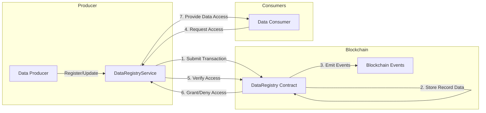
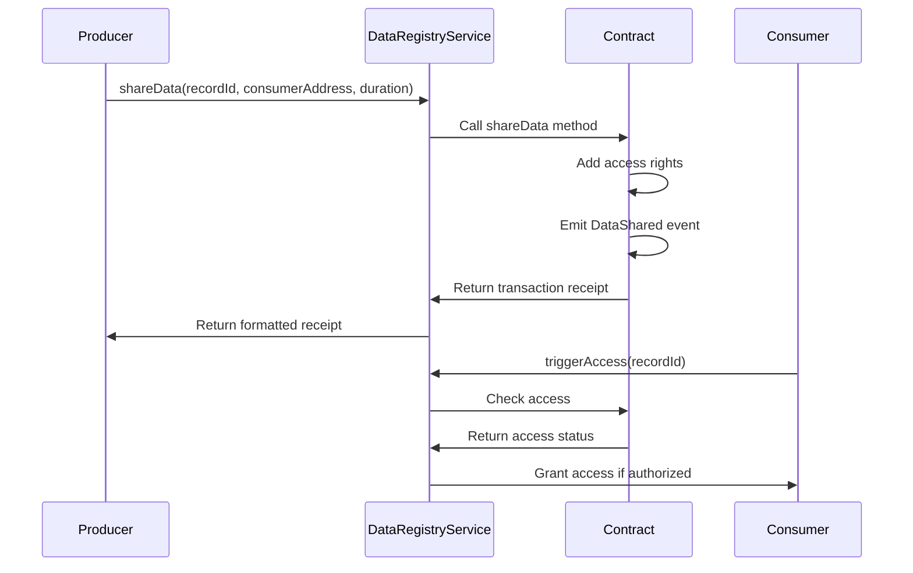
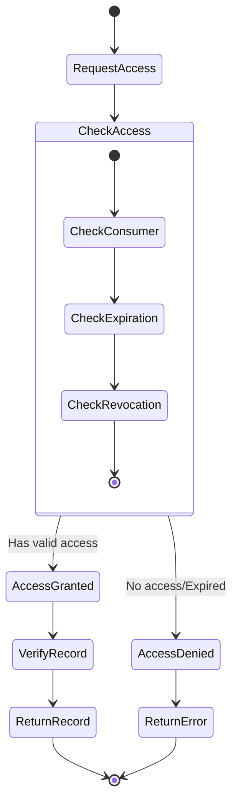
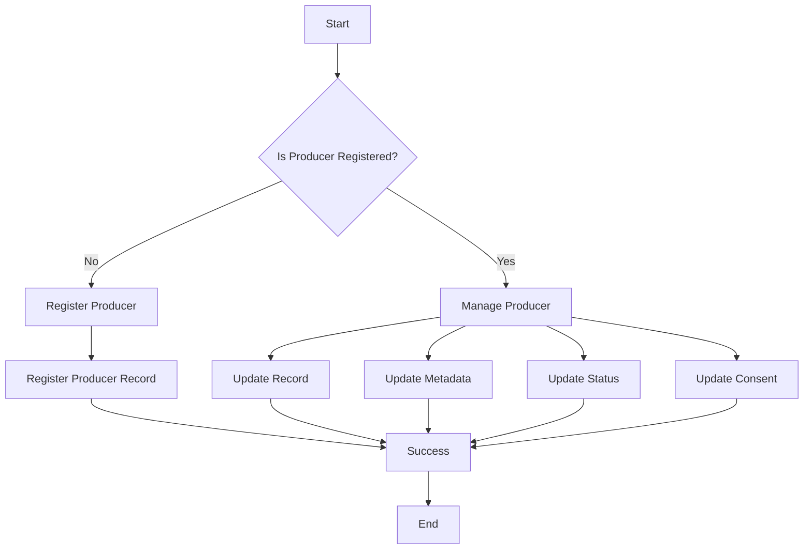
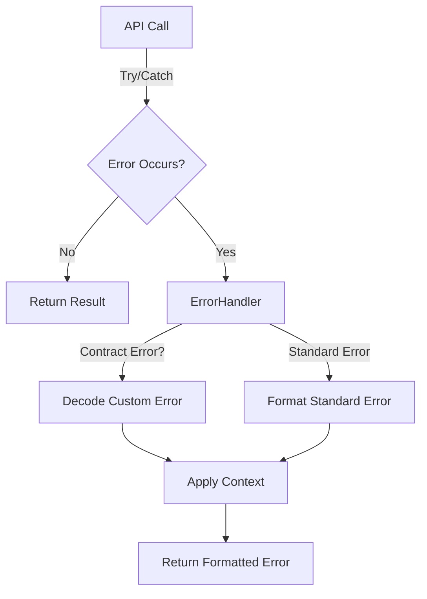
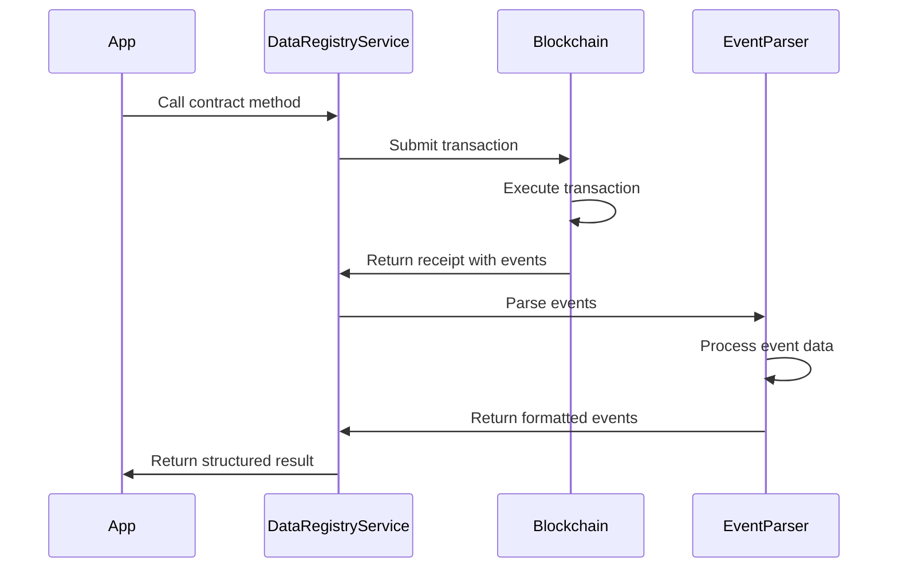

import HeaderTitle from '@/components/title';

<HeaderTitle
  title="LEDUP - Data Registry Service API"
  source="https://github.com/LED-UP/LED-UP/tree/main/apis/contract-services"
/>

---

**Version:** 1.0.0  
**Last Updated:** March 2025  
**Status:** Production

## Overview

The Data Registry Service provides a TypeScript interface for interacting with the DataRegistry smart contract in the LEDUP ecosystem. This service manages the registration, updating, sharing, and verification of health data records on the blockchain, enabling secure and transparent control over sensitive health information.

## Key Features

### Record Management



The service enables comprehensive data record management:

```typescript
// Register a new health record
const registerResult = await dataRegistryService.registerRecord(
  'record-123', // Record ID
  'QmW2WQi7j6c7UgJTnXA5uC8pyEosXMC2nPkTEswqWXvKnU', // IPFS CID
  '0x4a5c8eb84f3a62e9398aa7a5c7eb92f10a0c8c91f896f363f8d2e6e797ac48c4', // Content hash
  ResourceType.HEALTH_RECORD, // Resource type
  5242880 // Data size (5MB)
);
console.log(`Record registered: ${registerResult.description}`);

// Update an existing record
const updateResult = await dataRegistryService.updateRecord(
  'record-123',
  'QmX9H87HCib3nMTMPgEA2CESJzm3iBBjtMJy8vvg8mNcQf', // New IPFS CID
  '0x6b9d4bf2e55ef9a6d2c3f353105618da27e6df33b8a25fe78baff68388536ae1' // New content hash
);
console.log(`Record updated: ${updateResult.description}`);
```

### Data Sharing



The service provides methods for sharing health records:

```typescript
// Share data with a consumer
const shareResult = await dataRegistryService.shareData(
  'record-123',
  '0x1234567890AbCdEf1234567890aBcDeF12345678', // Consumer address
  86400 // Access duration in seconds (24 hours)
);
console.log(`Data shared: ${shareResult.description}`);

// Share data with a service provider (with specific access level)
const providerShareResult = await dataRegistryService.shareToProvider(
  'record-123',
  '0xProviderAddress1234567890AbCdEf1234567890', // Provider address
  604800, // Access duration in seconds (7 days)
  AccessLevel.READ // Read-only access
);
console.log(`Data shared with provider: ${providerShareResult.description}`);

// Revoke access
const revokeResult = await dataRegistryService.revokeAccess(
  'record-123',
  '0x1234567890AbCdEf1234567890aBcDeF12345678' // Consumer address
);
console.log(`Access revoked: ${revokeResult.description}`);
```

### Access Verification



The service provides methods for verifying and managing access to records:

```typescript
// Trigger access to a shared record (for consumers)
const accessResult = await dataRegistryService.triggerAccess('record-123');
console.log(`Access triggered: ${accessResult.description}`);

// Check if a consumer has access to a record
const accessStatus = await dataRegistryService.checkAccess(
  'record-123',
  '0x1234567890AbCdEf1234567890aBcDeF12345678' // Consumer address
);

if (accessStatus.hasAccess && !accessStatus.isRevoked) {
  console.log(`Access granted until: ${new Date(accessStatus.expiration * 1000)}`);
  console.log(`Access level: ${AccessLevel[accessStatus.accessLevel]}`);
} else {
  console.log('Access denied');
}
```

### Producer Management



The service enables producer registration and management:

```typescript
// Register a new producer
const producerResult = await dataRegistryService.registerProducer(RecordStatus.ACTIVE, ConsentStatus.GRANTED);
console.log(`Producer registered: ${producerResult.description}`);

// Register a producer record
const recordResult = await dataRegistryService.registerProducerRecord({
  ownerDid: 'did:ledup:producer123',
  recordId: 'record-123',
  producer: '0xProducerAddress1234567890AbCdEf1234567890',
  signature: '0x123abc...',
  resourceType: ResourceType.HEALTH_RECORD,
  consent: ConsentStatus.GRANTED,
  metadata: { dataType: 'bloodwork', format: 'json' },
});
console.log(`Producer record registered: ${recordResult.description}`);

// Update producer consent status
const consentResult = await dataRegistryService.updateProducerConsent(
  '0xProducerAddress1234567890AbCdEf1234567890',
  ConsentStatus.REVOKED
);
console.log(`Producer consent updated: ${consentResult.description}`);
```

## Error Handling

The Data Registry Service includes robust error handling through the `DataRegistryErrorHandler` class, which translates blockchain errors into user-friendly messages.



### Common Errors

The service handles the following contract-specific errors:

| Error Code                              | Description             | User-Friendly Message                                                  |
| --------------------------------------- | ----------------------- | ---------------------------------------------------------------------- |
| `DataRegistry__Unauthorized`            | Caller lacks permission | "Unauthorized: You do not have permission to perform this action"      |
| `DataRegistry__RecordNotFound`          | Record does not exist   | "Record not found: The specified record does not exist"                |
| `DataRegistry__ProducerNotRegistered`   | Producer not registered | "Producer not registered: The producer must be registered first"       |
| `DataRegistry__InvalidConsent`          | Invalid consent status  | "Invalid consent: Producer has not granted consent for this operation" |
| `DataRegistry__AccessDenied`            | Consumer lacks access   | "Access denied: You do not have access to this record"                 |
| `DataRegistry__AccessExpired`           | Access has expired      | "Access expired: Your access to this record has expired"               |
| `DataRegistry__RecordAlreadyRegistered` | Record already exists   | "Record already registered: A record with this ID already exists"      |

### Error Handling Example

```typescript
try {
  // Try to access a record without permission
  await dataRegistryService.triggerAccess('record-123');
} catch (error) {
  console.error(error.message);
  // Output: "Access denied: You do not have access to this record"

  // Check for specific error type
  if (dataRegistryService.isErrorType(error, 'DataRegistry__AccessDenied')) {
    console.log('You need to request access from the record owner');
  }
}
```

## Event Parsing

The service includes a comprehensive event parsing system through the `DataRegistryEventParser` class, which transforms blockchain events into structured and informative data objects.



### Supported Events

The service parses the following contract events:

| Event Name           | Description                           | Enriched Data                                              |
| -------------------- | ------------------------------------- | ---------------------------------------------------------- |
| `RecordRegistered`   | Emitted when a record is registered   | Record ID, producer, resource type, timestamp, description |
| `RecordUpdated`      | Emitted when a record is updated      | Record ID, new CID, content hash, timestamp, description   |
| `DataShared`         | Emitted when a record is shared       | Record ID, consumer, expiration, access level, description |
| `AccessRevoked`      | Emitted when access is revoked        | Record ID, consumer, timestamp, description                |
| `ProducerRegistered` | Emitted when a producer is registered | Producer address, status, consent, timestamp, description  |
| `ProducerUpdated`    | Emitted when a producer is updated    | Producer address, status, consent, timestamp, description  |
| `RecordVerified`     | Emitted when a record is verified     | Record ID, verifier, timestamp, description                |

### Event Listening

The service provides a method to listen for events:

```typescript
// Listen for data sharing events
const unsubscribe = dataRegistryService.listenForEvents(
  'DataShared',
  { recordId: 'record-123' }, // Optional filter
  (event) => {
    console.log(`Data shared event: ${event.description}`);
    console.log(`Shared with: ${event.consumer}, Expires: ${new Date(event.expiration * 1000)}`);
  }
);

// Later, when done listening
unsubscribe();
```

## API Reference

### DataRegistryService

```typescript
class DataRegistryService {
  /**
   * Creates a new instance of the DataRegistryService
   * @param contractAddress The address of the Data Registry contract
   * @param abi The ABI of the Data Registry contract
   */
  constructor(contractAddress: string, abi: any);

  /**
   * Changes the pause state of the contract
   * @param pause Whether to pause or unpause the contract
   * @returns A promise that resolves to the formatted transaction receipt
   */
  async changePauseState(pause: boolean): Promise<Record<string, any>>;

  /**
   * Gets the pause state of the contract
   * @returns A promise that resolves to a boolean indicating if the contract is paused
   */
  async getPauseState(): Promise<boolean>;

  /**
   * Registers a producer on the blockchain
   * @param status The status of the producer
   * @param consent The consent status of the producer
   * @returns A promise that resolves to the formatted transaction receipt
   */
  async registerProducer(status: RecordStatus, consent: ConsentStatus): Promise<Record<string, any>>;

  /**
   * Registers a producer record on the blockchain
   * @param params The parameters for registering the producer record
   * @returns A promise that resolves to the formatted transaction receipt
   */
  async registerProducerRecord(params: ProducerRegistrationParam): Promise<Record<string, any>>;

  /**
   * Updates a producer record on the blockchain
   * @param params The parameters for updating the producer record
   * @returns A promise that resolves to the formatted transaction receipt
   */
  async updateProducerRecord(params: ProducerRegistrationParam): Promise<Record<string, any>>;

  /**
   * Updates a producer record's metadata
   * @param producer The address of the producer
   * @param recordId The ID of the record
   * @param metadata The new metadata
   * @returns A promise that resolves to the formatted transaction receipt
   */
  async updateProducerRecordMetadata(
    producer: string,
    recordId: string,
    metadata: Metadata
  ): Promise<Record<string, any>>;

  /**
   * Updates a producer record's status
   * @param producer The address of the producer
   * @param status The new status
   * @returns A promise that resolves to the formatted transaction receipt
   */
  async updateProducerRecordStatus(producer: string, status: number): Promise<Record<string, any>>;

  /**
   * Updates a producer's consent status
   * @param producer The address of the producer
   * @param status The new consent status
   * @returns A promise that resolves to the formatted transaction receipt
   */
  async updateProducerConsent(producer: string, status: number): Promise<Record<string, any>>;

  /**
   * Updates the provider's metadata
   * @param metadata The new metadata
   * @returns A promise that resolves to the formatted transaction receipt
   */
  async updateProviderMetadata(metadata: Metadata): Promise<Record<string, any>>;

  /**
   * Updates the provider's record schema
   * @param schemaRef The new schema reference
   * @returns A promise that resolves to the formatted transaction receipt
   */
  async updateProviderRecordSchema(schemaRef: RecordSchema): Promise<Record<string, any>>;

  /**
   * Registers a new record on the blockchain
   * @param recordId The ID of the record
   * @param cid The IPFS CID of the record
   * @param contentHash The hash of the record content
   * @param resourceType The type of resource
   * @param dataSize The size of the data in bytes
   * @returns A promise that resolves to the formatted transaction receipt
   */
  async registerRecord(
    recordId: string,
    cid: string,
    contentHash: string,
    resourceType: ResourceType,
    dataSize: number
  ): Promise<Record<string, any>>;

  /**
   * Updates an existing record
   * @param recordId The ID of the record
   * @param cid The new IPFS CID
   * @param contentHash The new hash of the record content
   * @returns A promise that resolves to the formatted transaction receipt
   */
  async updateRecord(recordId: string, cid: string, contentHash: string): Promise<Record<string, any>>;

  /**
   * Shares a record with a consumer
   * @param recordId The ID of the record
   * @param consumerAddress The address of the consumer
   * @param accessDuration The duration of access in seconds
   * @returns A promise that resolves to the formatted transaction receipt
   */
  async shareData(recordId: string, consumerAddress: string, accessDuration: number): Promise<Record<string, any>>;

  /**
   * Shares a record with a service provider
   * @param recordId The ID of the record
   * @param provider The address of the provider
   * @param accessDuration The duration of access in seconds
   * @param accessLevel The level of access to grant
   * @returns A promise that resolves to the formatted transaction receipt
   */
  async shareToProvider(
    recordId: string,
    provider: string,
    accessDuration: number,
    accessLevel: AccessLevel
  ): Promise<Record<string, any>>;

  /**
   * Revokes access to a record
   * @param recordId The ID of the record
   * @param consumerAddress The address of the consumer
   * @returns A promise that resolves to the formatted transaction receipt
   */
  async revokeAccess(recordId: string, consumerAddress: string): Promise<Record<string, any>>;

  /**
   * Triggers access to a shared record
   * @param recordId The ID of the record
   * @returns A promise that resolves to the formatted transaction receipt
   */
  async triggerAccess(recordId: string): Promise<Record<string, any>>;

  /**
   * Adds a new service provider
   * @param provider The address of the provider
   * @returns A promise that resolves to the formatted transaction receipt
   */
  async addProvider(provider: string): Promise<Record<string, any>>;

  /**
   * Removes a service provider
   * @param provider The address of the provider
   * @returns A promise that resolves to the formatted transaction receipt
   */
  async removeProvider(provider: string): Promise<Record<string, any>>;

  /**
   * Checks if a provider is authorized for a record
   * @param provider The address of the provider
   * @param recordId The ID of the record
   * @returns A promise that resolves to a boolean indicating if the provider is authorized
   */
  async isAuthorizedProvider(provider: string, recordId: string): Promise<boolean>;

  /**
   * Updates the compensation address
   * @param compensationAddress The new compensation address
   * @returns A promise that resolves to the formatted transaction receipt
   */
  async updateCompensationAddress(compensationAddress: string): Promise<Record<string, any>>;

  /**
   * Updates the DID authentication address
   * @param didAuthAddress The new DID authentication address
   * @returns A promise that resolves to the formatted transaction receipt
   */
  async updateDidAuthAddress(didAuthAddress: string): Promise<Record<string, any>>;

  /**
   * Verifies a record
   * @param recordId The ID of the record
   * @returns A promise that resolves to the formatted transaction receipt
   */
  async verifyRecord(recordId: string): Promise<Record<string, any>>;

  /**
   * Checks if a record is verified
   * @param recordId The ID of the record
   * @returns A promise that resolves to a boolean indicating if the record is verified
   */
  async isRecordVerified(recordId: string): Promise<boolean>;

  /**
   * Checks if a consumer has access to a record
   * @param recordId The ID of the record
   * @param consumerAddress The address of the consumer
   * @returns A promise that resolves to an object with access details
   */
  async checkAccess(
    recordId: string,
    consumerAddress: string
  ): Promise<{
    hasAccess: boolean;
    expiration: number;
    accessLevel: AccessLevel;
    isRevoked: boolean;
  }>;

  /**
   * Gets a producer's metadata
   * @param producer The address of the producer
   * @returns A promise that resolves to the producer's metadata
   */
  async getProducerMetadata(producer: string): Promise<{
    did: string;
    consent: ConsentStatus;
    entries: number;
    isActive: boolean;
    lastUpdated: number;
    nonce: number;
  }>;

  /**
   * Gets all records for a producer
   * @param producer The address of the producer
   * @returns A promise that resolves to an array of record IDs
   */
  async getProducerRecords(producer: string): Promise<string[]>;

  /**
   * Gets information about a record
   * @param recordId The ID of the record
   * @returns A promise that resolves to the record information
   */
  async getRecordInfo(recordId: string): Promise<{
    producer: string;
    metadata: {
      resourceType: ResourceType;
      recordId: string;
      producer: string;
      sharedCount: number;
      updatedAt: number;
      dataSize: number;
      contentHash: string;
      cid: string;
    };
  }>;

  /**
   * Gets the producer of a record
   * @param recordId The ID of the record
   * @returns A promise that resolves to the producer's address
   */
  async getRecordProducer(recordId: string): Promise<string>;

  /**
   * Gets the total number of records
   * @returns A promise that resolves to the total number of records
   */
  async getTotalRecords(): Promise<number>;

  /**
   * Gets a producer's record status
   * @param producer The address of the producer
   * @returns A promise that resolves to a boolean indicating the producer's status
   */
  async getProducerRecordStatus(producer: string): Promise<boolean>;

  /**
   * Gets the compensation address
   * @returns A promise that resolves to the compensation address
   */
  async getCompensationAddress(): Promise<string>;

  /**
   * Checks if a specific error occurred
   * @param error The error to check
   * @param errorName The name of the error to check for
   * @returns True if the error matches the specified name
   */
  isErrorType(error: any, errorName: string): boolean;

  /**
   * Listens for events from the contract
   * @param eventName The name of the event to listen for
   * @param filter Optional filter for the event
   * @param callback Callback function to handle the parsed event
   * @returns A function to remove the event listener
   */
  listenForEvents(eventName: string, filter: any, callback: (event: any) => void): () => void;
}
```

### Types and Enums

```typescript
/**
 * Enum for resource types
 */
enum ResourceType {
  HEALTH_RECORD,
  CONSENT_RECORD,
  VERIFICATION_RECORD,
}

/**
 * Enum for access levels
 */
enum AccessLevel {
  READ,
  WRITE,
  ADMIN,
}

/**
 * Enum for consent status
 */
enum ConsentStatus {
  NOT_SET,
  GRANTED,
  REVOKED,
  EXPIRED,
}

/**
 * Enum for record status
 */
enum RecordStatus {
  ACTIVE,
  INACTIVE,
  SUSPENDED,
  DELETED,
}

/**
 * Parameters for registering a producer record
 */
interface ProducerRegistrationParam {
  ownerDid: string;
  recordId: string;
  producer: string;
  signature: string;
  resourceType: ResourceType;
  status?: RecordStatus;
  consent: ConsentStatus;
  metadata: Metadata;
  updaterDid?: string;
}

/**
 * Metadata interface
 */
interface Metadata {
  [key: string]: any;
}

/**
 * Record schema interface
 */
interface RecordSchema {
  [key: string]: any;
}
```

## Integration Examples

### Record Registration and Sharing

```typescript
import { DataRegistryService, ResourceType, ConsentStatus, AccessLevel } from './services/contracts';

// Initialize the service
const dataRegistryService = new DataRegistryService('0x1234567890AbCdEf1234567890aBcDeF12345678', dataRegistryAbi);

// Register and share a health record
async function registerAndShareRecord() {
  try {
    // First, register a new health record
    const recordId = `record-${Date.now()}`; // Generate unique ID
    const ipfsCid = 'QmW2WQi7j6c7UgJTnXA5uC8pyEosXMC2nPkTEswqWXvKnU';
    const contentHash = '0x4a5c8eb84f3a62e9398aa7a5c7eb92f10a0c8c91f896f363f8d2e6e797ac48c4';

    const registerResult = await dataRegistryService.registerRecord(
      recordId,
      ipfsCid,
      contentHash,
      ResourceType.HEALTH_RECORD,
      1048576 // 1MB
    );

    console.log(`Record registered with ID: ${recordId}`);
    console.log(`Transaction hash: ${registerResult.transactionHash}`);

    // Share the record with a consumer
    const consumerAddress = '0xConsumerAddress1234567890AbCdEf1234567890';
    const accessDuration = 86400; // 24 hours in seconds

    const shareResult = await dataRegistryService.shareData(recordId, consumerAddress, accessDuration);

    console.log(`Record shared with ${consumerAddress}`);
    console.log(`Access expires: ${new Date(Date.now() + accessDuration * 1000)}`);

    return { recordId, consumerAddress, registerResult, shareResult };
  } catch (error) {
    console.error('Error registering and sharing record:', error.message);
    throw error;
  }
}
```

### Record Access and Verification

```typescript
// Access and verify a shared health record
async function accessAndVerifyRecord(recordId) {
  try {
    // Check record info first
    const recordInfo = await dataRegistryService.getRecordInfo(recordId);
    console.log('Record info:', recordInfo);

    // Trigger access (as consumer)
    const accessResult = await dataRegistryService.triggerAccess(recordId);
    console.log(`Access triggered: ${accessResult.description}`);

    // Verify the record (e.g., as a trusted verifier)
    const verifyResult = await dataRegistryService.verifyRecord(recordId);
    console.log(`Record verified: ${verifyResult.description}`);

    // Check verification status
    const isVerified = await dataRegistryService.isRecordVerified(recordId);
    console.log(`Verification status: ${isVerified ? 'Verified' : 'Not Verified'}`);

    return { accessResult, verifyResult, isVerified };
  } catch (error) {
    console.error('Error accessing or verifying record:', error.message);

    // Check for specific errors
    if (dataRegistryService.isErrorType(error, 'DataRegistry__AccessDenied')) {
      console.log('You need to request access to this record');
    } else if (dataRegistryService.isErrorType(error, 'DataRegistry__AccessExpired')) {
      console.log('Your access to this record has expired');
    }

    throw error;
  }
}
```

### Producer Registration and Management

```typescript
// Register a producer and manage producer records
async function registerProducerWithRecords() {
  try {
    // Register producer
    const registerResult = await dataRegistryService.registerProducer(RecordStatus.ACTIVE, ConsentStatus.GRANTED);
    console.log(`Producer registered: ${registerResult.description}`);

    // Register a producer record
    const producerRecord = await dataRegistryService.registerProducerRecord({
      ownerDid: 'did:ledup:producer123',
      recordId: 'producer-record-1',
      producer: '0xProducerAddress1234567890AbCdEf1234567890',
      signature: '0x123abc...',
      resourceType: ResourceType.HEALTH_RECORD,
      consent: ConsentStatus.GRANTED,
      metadata: { dataCategory: 'medical-history', createdAt: Date.now() },
    });
    console.log(`Producer record registered: ${producerRecord.description}`);

    // Update producer record metadata
    const updateResult = await dataRegistryService.updateProducerRecordMetadata(
      '0xProducerAddress1234567890AbCdEf1234567890',
      'producer-record-1',
      { dataCategory: 'medical-history', updatedAt: Date.now(), tags: ['updated', 'reviewed'] }
    );
    console.log(`Metadata updated: ${updateResult.description}`);

    // Get producer metadata
    const metadata = await dataRegistryService.getProducerMetadata('0xProducerAddress1234567890AbCdEf1234567890');
    console.log('Producer metadata:', metadata);

    // Get all producer records
    const records = await dataRegistryService.getProducerRecords('0xProducerAddress1234567890AbCdEf1234567890');
    console.log(`Producer has ${records.length} records:`, records);

    return { registerResult, producerRecord, updateResult, metadata, records };
  } catch (error) {
    console.error('Error managing producer:', error.message);
    throw error;
  }
}
```

### Service Provider Management

```typescript
// Manage service providers and provider access
async function manageServiceProviders() {
  try {
    // Add a new service provider
    const providerAddress = '0xProviderAddress1234567890AbCdEf1234567890';
    const addResult = await dataRegistryService.addProvider(providerAddress);
    console.log(`Provider added: ${addResult.description}`);

    // Update provider metadata
    const metadataResult = await dataRegistryService.updateProviderMetadata({
      name: 'HealthCare Provider Inc.',
      serviceType: 'diagnostic',
      apiEndpoint: 'https://api.healthcareprovider.com/v1',
    });
    console.log(`Provider metadata updated: ${metadataResult.description}`);

    // Update provider record schema
    const schemaResult = await dataRegistryService.updateProviderRecordSchema({
      version: '1.0.0',
      fields: [
        { name: 'patientId', type: 'string', required: true },
        { name: 'testResults', type: 'object', required: true },
        { name: 'timestamp', type: 'number', required: true },
      ],
    });
    console.log(`Provider schema updated: ${schemaResult.description}`);

    // Check if provider is authorized for a specific record
    const recordId = 'record-123';
    const isAuthorized = await dataRegistryService.isAuthorizedProvider(providerAddress, recordId);
    console.log(`Provider authorization for ${recordId}: ${isAuthorized ? 'Authorized' : 'Not Authorized'}`);

    return { addResult, metadataResult, schemaResult, isAuthorized };
  } catch (error) {
    console.error('Error managing service providers:', error.message);
    throw error;
  }
}
```

## Summary

The Data Registry Service provides a robust interface for managing health data records in the LEDUP platform, enabling:

1. **Secure registration and management** of health records on the blockchain
2. **Controlled data sharing** with consumers and service providers
3. **Fine-grained access control** with different access levels and durations
4. **Record verification** for enhanced data integrity
5. **Producer management** for health data contributors
6. **Service provider integration** for data processing services

This service forms the core data management layer of the LEDUP ecosystem, allowing sensitive health information to be securely shared while maintaining control and transparency.

---

**© 2025 LEDUP - All rights reserved.**
