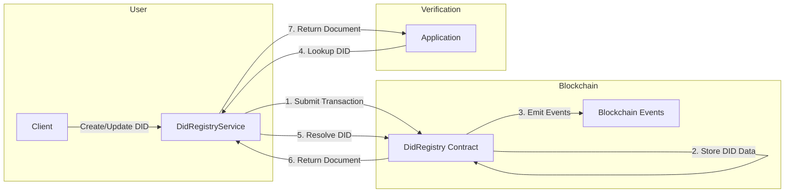
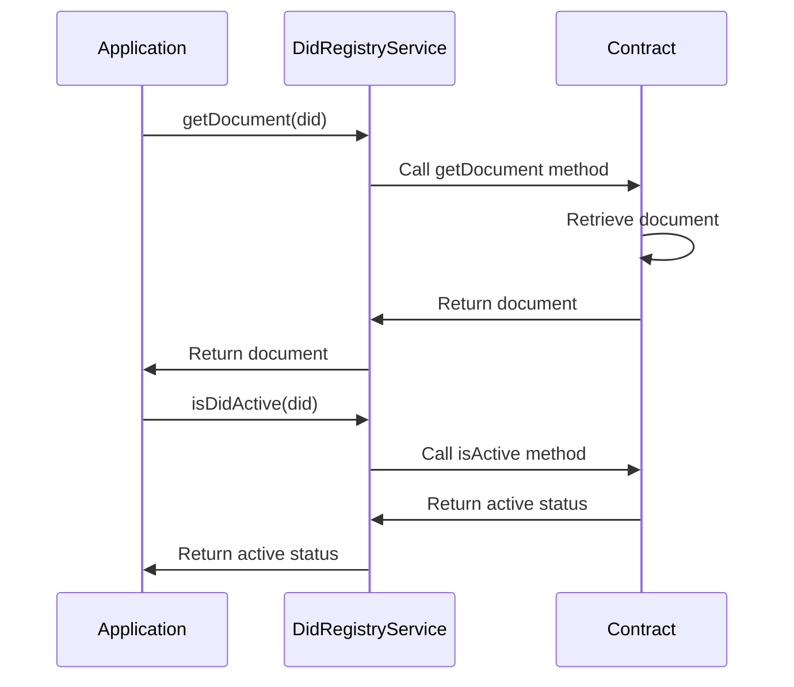
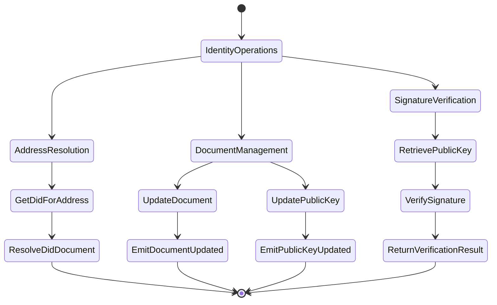
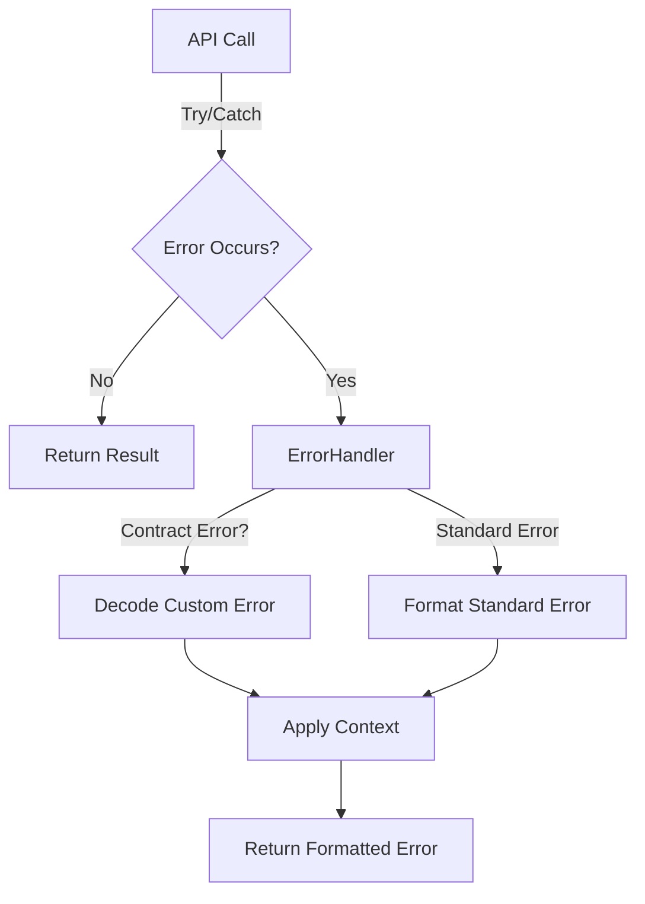
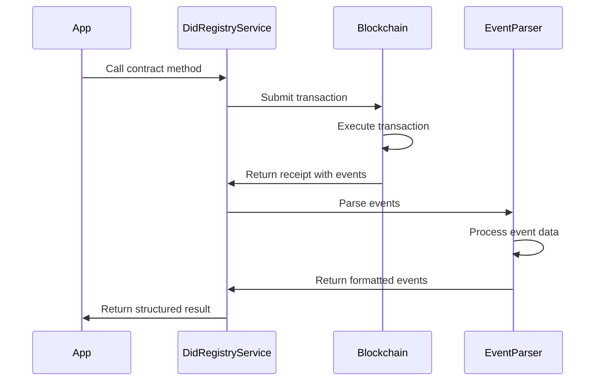

import HeaderTitle from '@/components/title';

<HeaderTitle
  title="LEDUP - DID Registry Service API"
  source="https://github.com/LED-UP/LED-UP/tree/main/apis/contract-services"
/>

---

**Version:** 1.0.0  
**Last Updated:** March 2025  
**Status:** Production

## Overview

The DID Registry Service provides a TypeScript interface for interacting with the DidRegistry smart contract in the LEDUP ecosystem. This service manages Decentralized Identifiers (DIDs) on the blockchain, enabling secure identity management, document storage, and identity verification for all participants in the platform.

## Key Features

### DID Registration and Management



The service enables comprehensive DID management:

```typescript
// Register a new DID
const result = await didRegistryService.registerDid(
  'did:ledup:user123',
  JSON.stringify({subject: 'did:ledup:user123', attributes: {...}}),
  '0x04a591...'  // Public key
);
console.log(`DID registered: ${result.description}`);

// Update a DID document
const updateResult = await didRegistryService.updateDidDocument(
  'did:ledup:user123',
  JSON.stringify({subject: 'did:ledup:user123', attributes: {...}})
);
console.log(`DID document updated: ${updateResult.description}`);

// Deactivate a DID
const deactivateResult = await didRegistryService.deactivateDid('did:ledup:user123');
console.log(`DID deactivated: ${deactivateResult.description}`);
```

### DID Resolution and Verification



The service provides methods to resolve and verify DIDs:

```typescript
// Retrieve a DID document
const document = await didRegistryService.getDocument('did:ledup:user123');
console.log(`DID document: ${document}`);

// Check if a DID exists
const exists = await didRegistryService.didExists('did:ledup:user123');
console.log(`DID exists: ${exists}`);

// Check if a DID is active
const isActive = await didRegistryService.isDidActive('did:ledup:user123');
console.log(`DID is active: ${isActive}`);

// Get the controller (owner) of a DID
const controller = await didRegistryService.getDidController('did:ledup:user123');
console.log(`DID controller: ${controller}`);
```

### Identity Resolution and Cryptographic Operations



The service enables identity resolution and cryptographic operations:

```typescript
// Get DID associated with an address
const didForAddress = await didRegistryService.getDidForAddress('0x1234567890AbCdEf1234567890aBcDeF12345678');
console.log(`DID for address: ${didForAddress}`);

// Get the public key for a DID
const publicKey = await didRegistryService.getPublicKeyForDid('did:ledup:user123');
console.log(`Public key: ${publicKey}`);

// Update the public key for a DID
const updateKeyResult = await didRegistryService.updateDidPublicKey(
  'did:ledup:user123',
  '0x04b691...' // New public key
);
console.log(`Public key updated: ${updateKeyResult.description}`);

// Verify a signature
const isValid = await didRegistryService.verifySignature(
  '0x1234567890AbCdEf1234567890aBcDeF12345678', // Address
  'Hello, world!', // Message
  '0x1a2b3c...' // Signature
);
console.log(`Signature verification: ${isValid ? 'Valid' : 'Invalid'}`);
```

## Error Handling

The DID Registry Service includes robust error handling through the `DidRegistryErrorHandler` class, which translates blockchain errors into user-friendly messages.



### Common Errors

The service handles the following contract-specific errors:

| Error Code                       | Description                   | User-Friendly Message                                                    |
| -------------------------------- | ----------------------------- | ------------------------------------------------------------------------ |
| `DidRegistry__AlreadyRegistered` | DID already exists            | "DID already registered: This DID is already in use"                     |
| `DidRegistry__InvalidDID`        | DID format is invalid         | "Invalid DID: The DID format is invalid or does not exist"               |
| `DidRegistry__DeactivatedDID`    | DID has been deactivated      | "Deactivated DID: This DID has been deactivated and cannot be used"      |
| `DidRegistry__Unauthorized`      | Caller not authorized         | "Unauthorized: You are not authorized to perform this action on the DID" |
| `DidRegistry__InvalidPublicKey`  | Public key is invalid         | "Invalid public key: The provided public key is not valid"               |
| `DidRegistry__InvalidSignature`  | Signature verification failed | "Invalid signature: The provided signature could not be verified"        |

### Error Handling Example

```typescript
try {
  // Try to register a DID that already exists
  await didRegistryService.registerDid(
    'did:ledup:user123',
    JSON.stringify({ subject: 'did:ledup:user123' }),
    '0x04a591...'
  );
} catch (error) {
  console.error(error.message);
  // Output: "DID already registered: This DID is already in use"

  // Check for specific error type
  if (didRegistryService.isErrorType(error, 'DidRegistry__AlreadyRegistered')) {
    console.log('This DID is already registered in the system');
  }
}
```

## Event Parsing

The service includes a comprehensive event parsing system through the `DidRegistryEventParser` class, which transforms blockchain events into structured and informative data objects.



### Supported Events

The service parses the following contract events:

| Event Name             | Description                             | Enriched Data                                     |
| ---------------------- | --------------------------------------- | ------------------------------------------------- |
| `DIDRegistered`        | Emitted when a new DID is registered    | DID, controller, timestamp, description           |
| `DIDDocumentUpdated`   | Emitted when a DID document is updated  | DID, document hash, timestamp, description        |
| `DIDDeactivated`       | Emitted when a DID is deactivated       | DID, timestamp, description                       |
| `PublicKeyUpdated`     | Emitted when a public key is updated    | DID, new public key, timestamp, description       |
| `OwnershipTransferred` | Emitted when contract ownership changes | Previous owner, new owner, timestamp, description |

### Event Listening

The service provides a method to listen for events:

```typescript
// Listen for DID registration events
const unsubscribe = didRegistryService.listenForEvents(
  'DIDRegistered',
  {}, // Optional filter
  (event) => {
    console.log(`DID registered event: ${event.description}`);
    console.log(`DID: ${event.did}, Controller: ${event.controller}`);
  }
);

// Later, when done listening
unsubscribe();
```

## API Reference

### DidRegistryService

```typescript
class DidRegistryService {
  /**
   * Creates a new instance of the DidRegistryService
   * @param contractAddress The address of the DID Registry contract
   * @param abi The ABI of the DID Registry contract
   */
  constructor(contractAddress: string, abi: any);

  /**
   * Creates a new DID for a user
   * @param did The DID to create
   * @param document The DID document to associate with the DID
   * @param publicKey The public key associated with the DID
   * @returns A promise that resolves to the formatted transaction receipt
   */
  async registerDid(did: string, document: string, publicKey: string): Promise<Record<string, any>>;

  /**
   * Alias for registerDid
   * @deprecated Use registerDid instead
   */
  async createDid(did: string, publicKey: string, document: string): Promise<Record<string, any>>;

  /**
   * Updates a DID document
   * @param did The DID to update
   * @param document The new DID document
   * @returns A promise that resolves to the formatted transaction receipt
   */
  async updateDidDocument(did: string, document: string): Promise<Record<string, any>>;

  /**
   * Deactivates a DID
   * @param did The DID to deactivate
   * @returns A promise that resolves to the formatted transaction receipt
   */
  async deactivateDid(did: string): Promise<Record<string, any>>;

  /**
   * Retrieves a DID document
   * @param did The DID to retrieve the document for
   * @returns A promise that resolves to the DID document
   */
  async getDocument(did: string): Promise<string>;

  /**
   * Alias for getDocument
   * @deprecated Use getDocument instead
   */
  async getDidDocument(did: string): Promise<string>;

  /**
   * Checks if a DID exists
   * @param did The DID to check
   * @returns A promise that resolves to a boolean indicating if the DID exists
   */
  async didExists(did: string): Promise<boolean>;

  /**
   * Checks if a DID is active
   * @param did The DID to check
   * @returns A promise that resolves to a boolean indicating if the DID is active
   */
  async isDidActive(did: string): Promise<boolean>;

  /**
   * Gets the controller of a DID
   * @param did The DID to check
   * @returns A promise that resolves to the controller address
   */
  async getDidController(did: string): Promise<string>;

  /**
   * Transfers ownership of the contract to a new owner
   * @param newOwner The address of the new owner
   * @returns A promise that resolves to the formatted transaction receipt
   */
  async transferOwnership(newOwner: string): Promise<Record<string, any>>;

  /**
   * Renounces ownership of the contract
   * @returns A promise that resolves to the formatted transaction receipt
   */
  async renounceOwnership(): Promise<Record<string, any>>;

  /**
   * Gets the public key for a DID
   * @param did The DID to get the public key for
   * @returns A promise that resolves to the public key
   */
  async getPublicKeyForDid(did: string): Promise<string>;

  /**
   * Gets the DID document for a given address
   * @param address The Ethereum address to get the DID for
   * @returns The DID document if found, null otherwise
   */
  async getDidForAddress(address: string): Promise<any>;

  /**
   * Updates the public key for a DID
   * @param did The DID to update
   * @param newPublicKey The new public key
   * @returns A promise that resolves to the formatted transaction receipt
   */
  async updateDidPublicKey(did: string, newPublicKey: string): Promise<Record<string, any>>;

  /**
   * Gets the DID associated with an address
   * @param address The address to get the DID for
   * @returns A promise that resolves to the DID or null if not found
   */
  async addressToDID(address: string): Promise<string | null>;

  /**
   * Verifies a signature against an address
   * @param address The address that supposedly signed the message
   * @param message The message that was signed
   * @param signature The signature to verify
   * @returns A promise that resolves to a boolean indicating if the signature is valid
   */
  async verifySignature(address: string, message: string, signature: string): Promise<boolean>;

  /**
   * Checks if a specific error occurred
   * @param error The error to check
   * @param errorName The name of the error to check for
   * @returns True if the error matches the specified name
   */
  isErrorType(error: any, errorName: string): boolean;

  /**
   * Listens for events from the contract
   * @param eventName The name of the event to listen for
   * @param filter Optional filter for the event
   * @param callback Callback function to handle the parsed event
   * @returns A function to remove the event listener
   */
  listenForEvents(eventName: string, filter: any, callback: (event: any) => void): () => void;
}
```

## Integration Examples

### DID Registration and Management

```typescript
import { DidRegistryService } from './services/contracts';

// Initialize the service
const didRegistryService = new DidRegistryService('0x1234567890AbCdEf1234567890aBcDeF12345678', didRegistryAbi);

// Register a new DID with a document
async function registerNewDid(did, publicKey) {
  try {
    // Create a simple DID document
    const document = JSON.stringify({
      subject: did,
      controller: did,
      created: new Date().toISOString(),
      authentication: [
        {
          id: `${did}#keys-1`,
          type: 'EcdsaSecp256k1VerificationKey2019',
          publicKeyHex: publicKey,
        },
      ],
    });

    // Register the DID
    const result = await didRegistryService.registerDid(did, document, publicKey);
    console.log(`DID registered successfully: ${result.description}`);
    return result;
  } catch (error) {
    console.error('Error registering DID:', error.message);
    throw error;
  }
}

// Update a DID document
async function updateDid(did, newAttributes) {
  try {
    // Get the current document
    const currentDocumentStr = await didRegistryService.getDocument(did);
    const currentDocument = JSON.parse(currentDocumentStr);

    // Update the document with new attributes
    const updatedDocument = {
      ...currentDocument,
      ...newAttributes,
      updated: new Date().toISOString(),
    };

    // Update the DID document
    const result = await didRegistryService.updateDidDocument(did, JSON.stringify(updatedDocument));

    console.log(`DID document updated: ${result.description}`);
    return result;
  } catch (error) {
    console.error('Error updating DID document:', error.message);
    throw error;
  }
}
```

### DID Verification and Resolution

```typescript
// Verify a DID exists and is active
async function verifyDid(did) {
  try {
    // Check if the DID exists
    const exists = await didRegistryService.didExists(did);

    if (!exists) {
      console.log(`DID ${did} does not exist`);
      return { exists: false, active: false };
    }

    // Check if the DID is active
    const isActive = await didRegistryService.isDidActive(did);
    console.log(`DID ${did} exists and is ${isActive ? 'active' : 'inactive'}`);

    // Get the controller
    const controller = await didRegistryService.getDidController(did);
    console.log(`DID ${did} is controlled by ${controller}`);

    return { exists, active: isActive, controller };
  } catch (error) {
    console.error('Error verifying DID:', error.message);
    return { exists: false, active: false, error: error.message };
  }
}

// Resolve DID to document
async function resolveDid(did) {
  try {
    const document = await didRegistryService.getDocument(did);
    return {
      did,
      document: JSON.parse(document),
      found: true,
    };
  } catch (error) {
    console.error(`Error resolving DID ${did}:`, error.message);

    // Check for specific error types
    if (didRegistryService.isErrorType(error, 'DidRegistry__InvalidDID')) {
      return { did, found: false, reason: 'DID not found' };
    } else if (didRegistryService.isErrorType(error, 'DidRegistry__DeactivatedDID')) {
      return { did, found: false, reason: 'DID is deactivated' };
    }

    return { did, found: false, reason: error.message };
  }
}
```

### Identity and Signature Verification

```typescript
// Get DID for an address and verify signature
async function verifyMessageFromAddress(address, message, signature) {
  try {
    // Get the DID for this address
    const did = await didRegistryService.addressToDID(address);

    if (!did) {
      return {
        verified: false,
        reason: 'No DID associated with this address',
      };
    }

    // Verify the signature
    const isValid = await didRegistryService.verifySignature(address, message, signature);

    return {
      verified: isValid,
      did,
      reason: isValid ? 'Signature valid' : 'Invalid signature',
    };
  } catch (error) {
    console.error('Error verifying signature:', error.message);
    return { verified: false, reason: error.message };
  }
}

// Monitor DID events
function monitorDidActivity() {
  // Listen for DID registrations
  const unsubscribeRegistered = didRegistryService.listenForEvents('DIDRegistered', {}, (event) => {
    console.log(`New DID registered: ${event.did}`);
    console.log(`Controller: ${event.controller}`);
  });

  // Listen for DID document updates
  const unsubscribeUpdated = didRegistryService.listenForEvents('DIDDocumentUpdated', {}, (event) => {
    console.log(`DID document updated: ${event.did}`);
  });

  // Listen for DID deactivations
  const unsubscribeDeactivated = didRegistryService.listenForEvents('DIDDeactivated', {}, (event) => {
    console.log(`DID deactivated: ${event.did}`);
  });

  // Return function to stop all listeners
  return () => {
    unsubscribeRegistered();
    unsubscribeUpdated();
    unsubscribeDeactivated();
  };
}
```

## Summary

The DID Registry Service provides a robust interface for decentralized identity management in the LEDUP platform, enabling:

1. **Secure DID creation and management** through standardized identity operations
2. **Document storage and resolution** for identity attributes and metadata
3. **Flexible identity verification** with public key management
4. **Cryptographic operations** including signature verification
5. **Comprehensive error handling** with user-friendly messages
6. **Event-based monitoring** for identity changes

This service forms the foundation of the identity layer in the LEDUP ecosystem, enabling secure and verifiable interactions between participants.

---

**© 2025 LEDUP - All rights reserved.**
