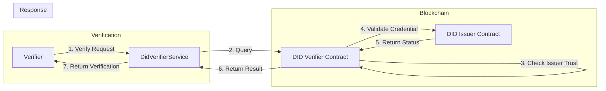
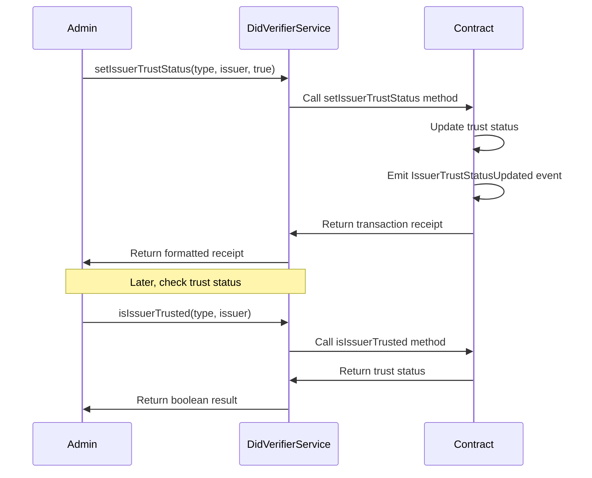
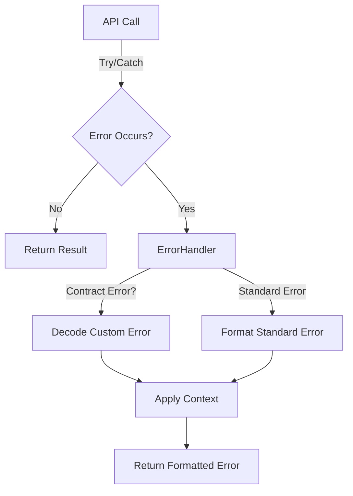
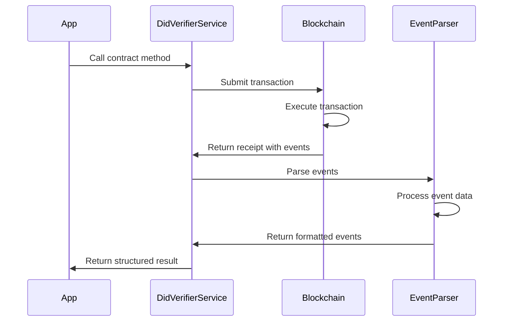

import HeaderTitle from '@/components/title';

<HeaderTitle
  title="LEDUP - DID Verifier Service API"
  source="https://github.com/LED-UP/LED-UP/tree/main/apis/contract-services"
/>

---

**Version:** 1.0.0  
**Last Updated:** March 2025  
**Status:** Production

## Overview

The DID Verifier Service provides a TypeScript interface for interacting with the DID Verifier smart contract in the LEDUP ecosystem. This service manages the verification of credentials and establishes trust relationships between credential issuers and verifiers, allowing for secure and reliable verification of claims across the platform.

## Key Features

### Credential Verification



The service provides methods for verifying credentials:

```typescript
// Verify a credential
const isVerified = await didVerifierService.verifyCredential(
  'HealthRecordAccess', // Credential type
  '0x1234567890AbCdEf1234567890aBcDeF12345678', // Issuer address
  'did:ledup:subject123' // Subject DID
);

if (isVerified) {
  console.log('Credential is verified');
} else {
  console.log('Credential verification failed');
}
```

### Trust Management



The service enables management of issuer trust relationships:

```typescript
// Set an issuer as trusted for a specific credential type
const trustResult = await didVerifierService.setIssuerTrustStatus(
  'HealthRecordAccess', // Credential type
  '0x1234567890AbCdEf1234567890aBcDeF12345678', // Issuer address
  true // Trust status (true = trusted)
);
console.log(`Trust status updated: ${trustResult.description}`);

// Check if an issuer is trusted
const isTrusted = await didVerifierService.isIssuerTrusted(
  'HealthRecordAccess', // Credential type
  '0x1234567890AbCdEf1234567890aBcDeF12345678' // Issuer address
);
console.log(`Is issuer trusted: ${isTrusted ? 'Yes' : 'No'}`);
```

## Error Handling

The DID Verifier Service includes robust error handling through the `DidVerifierErrorHandler` class, which translates blockchain errors into user-friendly messages.



### Common Errors

The service handles the following contract-specific errors:

| Error Code                       | Description               | User-Friendly Message                                                        |
| -------------------------------- | ------------------------- | ---------------------------------------------------------------------------- |
| `DidVerifier__InvalidIssuer`     | Issuer address is invalid | "Invalid issuer: The issuer address is invalid"                              |
| `DidVerifier__UntrustedIssuer`   | Issuer is not trusted     | "Untrusted issuer: The issuer is not trusted for this credential type"       |
| `DidVerifier__InvalidCredential` | Credential is invalid     | "Invalid credential: The credential is invalid or the subject is not active" |

### Error Handling Example

```typescript
try {
  // Try to verify a credential from an untrusted issuer
  await didVerifierService.verifyCredential(
    'HealthRecordAccess',
    '0x1234567890AbCdEf1234567890aBcDeF12345678',
    'did:ledup:subject123'
  );
} catch (error) {
  console.error(error.message);
  // Output: "Untrusted issuer: The issuer is not trusted for this credential type"

  // Check for specific error type
  if (didVerifierService.isErrorType(error, 'DidVerifier__UntrustedIssuer')) {
    console.log('You need to establish trust with this issuer first');
  }
}
```

## Event Parsing

The service includes an event parsing system through the `DidVerifierEventParser` class, which transforms blockchain events into structured data objects.



### Supported Events

The service parses the following contract events:

| Event Name                 | Description                              | Enriched Data                                                 |
| -------------------------- | ---------------------------------------- | ------------------------------------------------------------- |
| `IssuerTrustStatusUpdated` | Emitted when issuer trust status changes | Credential type, issuer, trust status, timestamp, description |

### Event Listening

The service provides a method to listen for trust status events:

```typescript
// Listen for trust status update events
const unsubscribe = didVerifierService.listenForEvents(
  'IssuerTrustStatusUpdated',
  { credentialType: 'HealthRecordAccess' }, // Optional filter
  (event) => {
    console.log(`Trust status updated: ${event.description}`);
    console.log(`Issuer: ${event.issuer}`);
    console.log(`Status: ${event.trusted ? 'Trusted' : 'Untrusted'}`);
  }
);

// Later, when done listening
unsubscribe();
```

## API Reference

### DidVerifierService

```typescript
class DidVerifierService {
  /**
   * Creates a new instance of the DidVerifierService
   * @param contractAddress The address of the DID Verifier contract
   * @param abi The ABI of the DID Verifier contract
   */
  constructor(contractAddress: string, abi: any);

  /**
   * Verifies a credential for a DID
   * @param credentialType The type of credential to verify
   * @param issuer The address of the issuer
   * @param subject The DID of the subject
   * @returns A promise that resolves to a boolean indicating if the credential is verified
   */
  async verifyCredential(credentialType: string, issuer: string, subject: string): Promise<boolean>;

  /**
   * Sets the trust status of an issuer for a specific credential type
   * @param credentialType The type of credential
   * @param issuer The address of the issuer
   * @param trusted Boolean indicating if the issuer should be trusted
   * @returns A promise that resolves to the formatted transaction receipt
   */
  async setIssuerTrustStatus(credentialType: string, issuer: string, trusted: boolean): Promise<Record<string, any>>;

  /**
   * Checks if an issuer is trusted for a specific credential type
   * @param credentialType The type of credential
   * @param issuer The address of the issuer
   * @returns A promise that resolves to a boolean indicating if the issuer is trusted
   */
  async isIssuerTrusted(credentialType: string, issuer: string): Promise<boolean>;

  /**
   * Checks if a specific error occurred
   * @param error The error to check
   * @param errorName The name of the error to check for
   * @returns True if the error matches the specified name
   */
  isErrorType(error: any, errorName: string): boolean;

  /**
   * Listens for events from the contract
   * @param eventName The name of the event to listen for
   * @param filter Optional filter for the event
   * @param callback Callback function to handle the parsed event
   * @returns A function to remove the event listener
   */
  listenForEvents(eventName: string, filter: any, callback: (event: any) => void): () => void;
}
```

## Integration Examples

### Establishing Trust and Verifying Credentials

```typescript
import { DidVerifierService } from './services/contracts';

// Initialize the service
const didVerifierService = new DidVerifierService('0x1234567890AbCdEf1234567890aBcDeF12345678', didVerifierAbi);

// Establish trust with issuers and verify credentials
async function establishTrustAndVerify() {
  try {
    // Establish trust with a hospital issuer for health records
    const hospitalIssuer = '0xHospitalAddress1234567890AbCdEf1234567890';
    const trustResult = await didVerifierService.setIssuerTrustStatus('HealthRecordAccess', hospitalIssuer, true);

    console.log(`Hospital trust established: ${trustResult.description}`);

    // Establish trust with a government agency for identity verification
    const governmentIssuer = '0xGovAddress1234567890AbCdEf1234567890';
    const govTrustResult = await didVerifierService.setIssuerTrustStatus(
      'IdentityVerification',
      governmentIssuer,
      true
    );

    console.log(`Government trust established: ${govTrustResult.description}`);

    // Verify a health record credential
    const healthCredentialVerified = await didVerifierService.verifyCredential(
      'HealthRecordAccess',
      hospitalIssuer,
      'did:ledup:patient123'
    );

    console.log(`Health credential verification: ${healthCredentialVerified ? 'Successful' : 'Failed'}`);

    // Verify an identity credential
    const identityVerified = await didVerifierService.verifyCredential(
      'IdentityVerification',
      governmentIssuer,
      'did:ledup:citizen456'
    );

    console.log(`Identity verification: ${identityVerified ? 'Successful' : 'Failed'}`);

    return {
      hospitalTrust: trustResult,
      governmentTrust: govTrustResult,
      healthVerification: healthCredentialVerified,
      identityVerification: identityVerified,
    };
  } catch (error) {
    console.error('Error in trust and verification process:', error.message);
    throw error;
  }
}
```

### Managing Trust Relationships

```typescript
// Manage trust relationships for different credential types
async function manageTrustRelationships() {
  try {
    const credentialTypes = ['HealthRecordAccess', 'IdentityVerification', 'InsuranceClaim'];
    const issuers = {
      hospital: '0xHospitalAddress1234567890AbCdEf1234567890',
      government: '0xGovAddress1234567890AbCdEf1234567890',
      insurance: '0xInsuranceAddress1234567890AbCdEf1234567890',
    };

    // Create a trust matrix for issuers and credential types
    const trustMatrix = [
      { type: 'HealthRecordAccess', issuer: issuers.hospital, trusted: true },
      { type: 'HealthRecordAccess', issuer: issuers.insurance, trusted: true },
      { type: 'IdentityVerification', issuer: issuers.government, trusted: true },
      { type: 'InsuranceClaim', issuer: issuers.insurance, trusted: true },
    ];

    // Apply the trust matrix
    const trustResults = [];
    for (const entry of trustMatrix) {
      console.log(`Setting ${entry.issuer} as ${entry.trusted ? 'trusted' : 'untrusted'} for ${entry.type}`);

      const result = await didVerifierService.setIssuerTrustStatus(entry.type, entry.issuer, entry.trusted);

      trustResults.push({
        type: entry.type,
        issuer: entry.issuer,
        result,
      });
    }

    // Check trust status for all combinations
    const trustStatus = {};
    for (const type of credentialTypes) {
      trustStatus[type] = {};

      for (const [name, address] of Object.entries(issuers)) {
        const isTrusted = await didVerifierService.isIssuerTrusted(type, address);
        trustStatus[type][name] = isTrusted;

        console.log(`Is ${name} trusted for ${type}? ${isTrusted ? 'Yes' : 'No'}`);
      }
    }

    return { trustResults, trustStatus };
  } catch (error) {
    console.error('Error managing trust relationships:', error.message);
    throw error;
  }
}
```

### Monitoring Trust Status Changes

```typescript
// Set up monitoring for trust status changes
function monitorTrustStatusChanges() {
  console.log('Starting trust status monitoring');

  // Set up event listener for all credential types
  const unsubscribe = didVerifierService.listenForEvents(
    'IssuerTrustStatusUpdated',
    {}, // No filter - monitor all changes
    (event) => {
      const status = event.trusted ? 'trusted' : 'untrusted';

      console.log(`Trust status change detected:`);
      console.log(`- Credential Type: ${event.credentialType}`);
      console.log(`- Issuer: ${event.issuer}`);
      console.log(`- New Status: ${status}`);
      console.log(`- Timestamp: ${new Date(event.timestamp).toLocaleString()}`);

      // Notify administrators or trigger additional actions
      notifyTrustStatusChange(event.credentialType, event.issuer, status);
    }
  );

  // Simple notification function (replace with actual implementation)
  function notifyTrustStatusChange(credentialType, issuer, status) {
    console.log(`NOTIFICATION: ${issuer} is now ${status} for ${credentialType}`);
    // In a real implementation, this could send an email, update a dashboard, etc.
  }

  // Return control functions
  return {
    stopMonitoring: () => {
      unsubscribe();
      console.log('Stopped trust status monitoring');
    },
  };
}
```

## Summary

The DID Verifier Service provides a robust framework for credential verification in the LEDUP ecosystem, enabling:

1. **Credential verification** with cryptographic security
2. **Trust relationship management** between issuers and verifiers
3. **Fine-grained control** over which issuers are trusted for specific credential types
4. **Error handling** for secure and informative credential verification
5. **Event monitoring** for real-time awareness of trust status changes

This service forms an essential part of the LEDUP trust infrastructure, providing the necessary tools to establish and verify trust relationships between entities in a decentralized ecosystem.

---

**© 2025 LEDUP - All rights reserved.**
