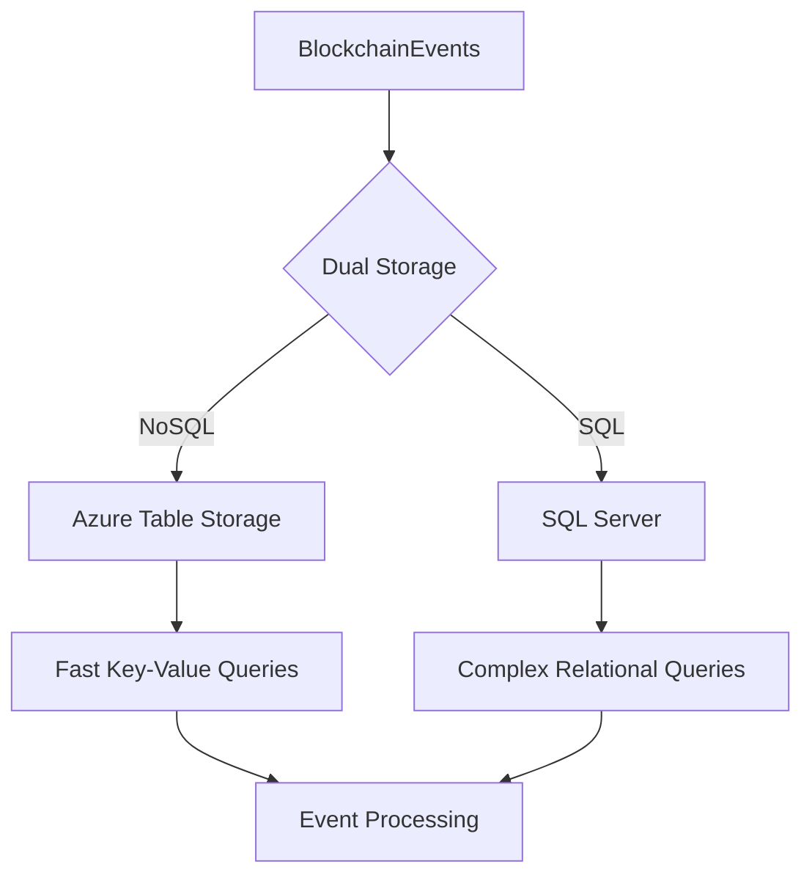
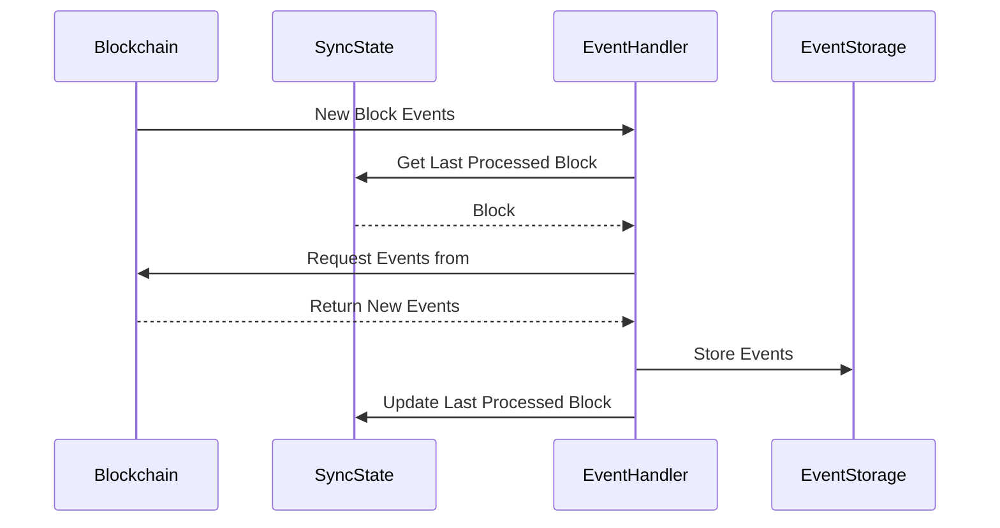

import HeaderTitle from '@/components/title';

<HeaderTitle title="Blockchain Event Service" source="https://github.com/LED-UP/LED-UP/tree/main/apis/db" />

## Overview

The `BlockchainEventService` provides a robust solution for storing, tracking, and retrieving blockchain events within the LEDUP ecosystem. It offers dual storage capabilities, persisting events in both Azure Table Storage for fast querying and SQL Server for relational operations. The service maintains synchronization state between the blockchain and the database, ensuring that all events are properly captured and stored.

## Key Features

### Dual Storage Architecture



The service stores blockchain events in both Azure Table Storage and SQL Server:

- **Azure Table Storage**: Provides fast, scalable, and cost-effective storage for key-value data, optimized for quick lookups and high throughput.
- **SQL Server**: Enables complex relational queries, joins with other data, and supports transactional integrity.

### Sync State Management



The service maintains synchronization state to track:

- Last processed block number and hash
- Synchronization status (SYNCING, SYNCED, ERROR)
- Last processed event details
- Error information for troubleshooting

### Comprehensive Event Querying

The `BlockchainEventService` provides multiple methods to query blockchain events:

- By event name
- By block range
- By transaction hash
- Latest events with pagination
- Events with parsed arguments

## API Reference

### Initialization

#### `initializeBlockchainEventTables()`

```typescript
async function initializeBlockchainEventTables(): Promise<void>;
```

Creates the necessary tables for blockchain event tracking if they don't exist and initializes the sync state.

### Event Storage

#### `storeBlockchainEvent()`

```typescript
async function storeBlockchainEvent(event: BlockchainRecordType): Promise<BlockchainRecordType>;
```

Stores a blockchain event in both Azure Table Storage and SQL Database.

| Parameter | Type                 | Description                   |
| --------- | -------------------- | ----------------------------- |
| event     | BlockchainRecordType | The blockchain event to store |

Returns: A Promise resolving to the stored event with assigned ID.

### Sync State Management

#### `updateBlockchainSyncState()`

```typescript
async function updateBlockchainSyncState(syncState: Partial<BlockchainSyncState>): Promise<void>;
```

Updates the blockchain sync state with the latest processed block information.

| Parameter | Type                           | Description                       |
| --------- | ------------------------------ | --------------------------------- |
| syncState | Partial\`BlockchainSyncState\` | The updated blockchain sync state |

#### `getBlockchainSyncState()`

```typescript
async function getBlockchainSyncState(): Promise<BlockchainSyncState>;
```

Gets the current blockchain sync state.

Returns: A Promise resolving to the current blockchain sync state.

#### `getLastProcessedBlockNumber()`

```typescript
async function getLastProcessedBlockNumber(): Promise<number>;
```

Gets the last processed block number from the blockchain sync state.

Returns: A Promise resolving to the last processed block number.

### Event Queries

#### `getBlockchainEventsByName()`

```typescript
async function getBlockchainEventsByName(eventName: string, limit: number = 100): Promise<BlockchainRecordType[]>;
```

Gets blockchain events by event name.

| Parameter | Type   | Description                                           |
| --------- | ------ | ----------------------------------------------------- |
| eventName | string | The name of the event to filter by                    |
| limit     | number | The maximum number of events to return (default: 100) |

Returns: A Promise resolving to an array of matching events.

#### `getBlockchainEventsByBlockRange()`

```typescript
async function getBlockchainEventsByBlockRange(
  fromBlock: number,
  toBlock: number,
  limit: number = 100
): Promise<BlockchainRecordType[]>;
```

Gets blockchain events within a block range.

| Parameter | Type   | Description                                           |
| --------- | ------ | ----------------------------------------------------- |
| fromBlock | number | The starting block number                             |
| toBlock   | number | The ending block number                               |
| limit     | number | The maximum number of events to return (default: 100) |

Returns: A Promise resolving to an array of events within the block range.

#### `getLatestBlockchainEvents()`

```typescript
async function getLatestBlockchainEvents(limit: number = 10): Promise<BlockchainRecordType[]>;
```

Gets the latest blockchain events.

| Parameter | Type   | Description                                          |
| --------- | ------ | ---------------------------------------------------- |
| limit     | number | The maximum number of events to return (default: 10) |

Returns: A Promise resolving to an array of the latest events.

#### `getBlockchainEventsByTransactionHash()`

```typescript
async function getBlockchainEventsByTransactionHash(transactionHash: string): Promise<BlockchainRecordType[]>;
```

Gets blockchain events by transaction hash.

| Parameter       | Type   | Description                       |
| --------------- | ------ | --------------------------------- |
| transactionHash | string | The transaction hash to filter by |

Returns: A Promise resolving to an array of events from the transaction.

#### `getBlockchainEventsWithParsedArgs()`

```typescript
async function getBlockchainEventsWithParsedArgs(limit: number = 10): Promise<any[]>;
```

Gets blockchain events with parsed arguments.

| Parameter | Type   | Description                                          |
| --------- | ------ | ---------------------------------------------------- |
| limit     | number | The maximum number of events to return (default: 10) |

Returns: A Promise resolving to an array of events with parsed arguments.

## Data Types

### BlockchainSyncState Type

```typescript
interface BlockchainSyncState {
  partitionKey: string;
  rowKey: string;
  lastProcessedBlock: string;
  lastProcessedBlockHash: string;
  lastProcessedTimestamp: string;
  lastSyncedEventName?: string;
  lastSyncedTransactionHash?: string;
  syncStatus: 'SYNCING' | 'SYNCED' | 'ERROR';
  errorMessage?: string;
  totalEventsProcessed: number;
}
```

### BlockchainRecordType

```typescript
interface BlockchainRecordType {
  id?: string;
  transactionHash: string;
  blockHash: string;
  blockNumber: string;
  eAddress: string;
  eData: string;
  topics: string;
  args: string;
  eSignature: string;
  eName: string;
  eTopic: string;
  eTimestamp: string;
  partitionKey?: string;
}
```

## Integration Examples

### Initialize Blockchain Event Storage

```typescript
import { initializeBlockchainEventTables } from '@ledup/api/services/db/BlockchainEventService';

// Set up the tables and initial sync state
await initializeBlockchainEventTables();
```

### Store a New Blockchain Event

```typescript
import { storeBlockchainEvent } from '@ledup/api/services/db/BlockchainEventService';

// Event data received from blockchain
const event = {
  transactionHash: '0xabc123...',
  blockHash: '0xdef456...',
  blockNumber: '5000000',
  eAddress: '0x1234567890abcdef1234567890abcdef12345678',
  eData: '0x...',
  topics: JSON.stringify(['topic1', 'topic2']),
  args: JSON.stringify({ param1: 'value1', param2: 'value2' }),
  eSignature: 'Transfer(address,address,uint256)',
  eName: 'Transfer',
  eTopic: '0x...',
  eTimestamp: new Date().toISOString(),
};

// Store the event
const storedEvent = await storeBlockchainEvent(event);
```

### Update Blockchain Sync State

```typescript
import { updateBlockchainSyncState } from '@ledup/api/services/db/BlockchainEventService';

// Update the sync state after processing events
await updateBlockchainSyncState({
  lastProcessedBlock: '5000100',
  lastProcessedBlockHash: '0xfed987...',
  syncStatus: 'SYNCED',
  totalEventsProcessed: 15020,
});
```

### Query Events by Name

```typescript
import { getBlockchainEventsByName } from '@ledup/api/services/db/BlockchainEventService';

// Get the last 50 Transfer events
const transferEvents = await getBlockchainEventsByName('Transfer', 50);
```

### Implement a Basic Sync Process

```typescript
import {
  getLastProcessedBlockNumber,
  storeBlockchainEvent,
  updateBlockchainSyncState,
} from '@ledup/api/services/db/BlockchainEventService';

async function syncBlockchainEvents(web3Provider) {
  try {
    // Get last processed block
    const lastProcessedBlock = await getLastProcessedBlockNumber();

    // Get current block number from blockchain
    const currentBlock = await web3Provider.getBlockNumber();

    // Update sync status to SYNCING
    await updateBlockchainSyncState({
      syncStatus: 'SYNCING',
    });

    // Calculate block range to process (max 1000 blocks at a time)
    const toBlock = Math.min(lastProcessedBlock + 1000, currentBlock);

    // Get events from blockchain
    const events = await web3Provider.getPastEvents('allEvents', {
      fromBlock: lastProcessedBlock + 1,
      toBlock,
    });

    // Process and store each event
    for (const event of events) {
      const formattedEvent = formatBlockchainEvent(event); // Implement this function
      await storeBlockchainEvent(formattedEvent);
    }

    // Update sync state
    await updateBlockchainSyncState({
      lastProcessedBlock: toBlock.toString(),
      lastProcessedBlockHash: await web3Provider.getBlockHash(toBlock),
      lastProcessedTimestamp: new Date().toISOString(),
      syncStatus: toBlock >= currentBlock ? 'SYNCED' : 'SYNCING',
      totalEventsProcessed: events.length,
    });

    return { processedBlocks: toBlock - lastProcessedBlock, events: events.length };
  } catch (error) {
    // Update sync state with error
    await updateBlockchainSyncState({
      syncStatus: 'ERROR',
      errorMessage: error.message,
    });
    throw error;
  }
}
```

## Error Handling

The `BlockchainEventService` implements robust error handling:

- Initialization errors are logged and propagated
- Storage operation failures include detailed error messages
- Sync state updates capture error messages for diagnosis
- The last processed block number defaults to 0 if unavailable
- Malformed data is detected and handled gracefully

## Performance Considerations

For optimal performance:

- Process blockchain events in batches
- Use the dual storage architecture as designed (tables for key lookups, SQL for complex queries)
- Implement a retry mechanism for transient storage errors
- Consider implementing a queue for high-volume event processing
- Use batched inserts for multiple events when possible

## Summary

The `BlockchainEventService` provides a robust foundation for capturing, storing, and querying blockchain events within the LEDUP ecosystem. Its dual storage architecture balances performance and query flexibility, while its sync state management ensures reliable event processing. The comprehensive query methods make it easy to access blockchain data for various application needs, from real-time monitoring to historical analysis.

---

© 2025 LEDUP | Documentation for Production Use | Last Updated: March 2025
