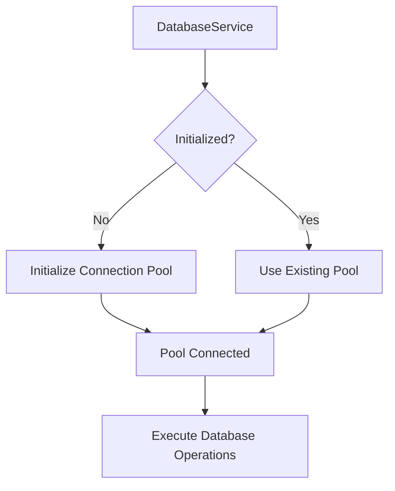
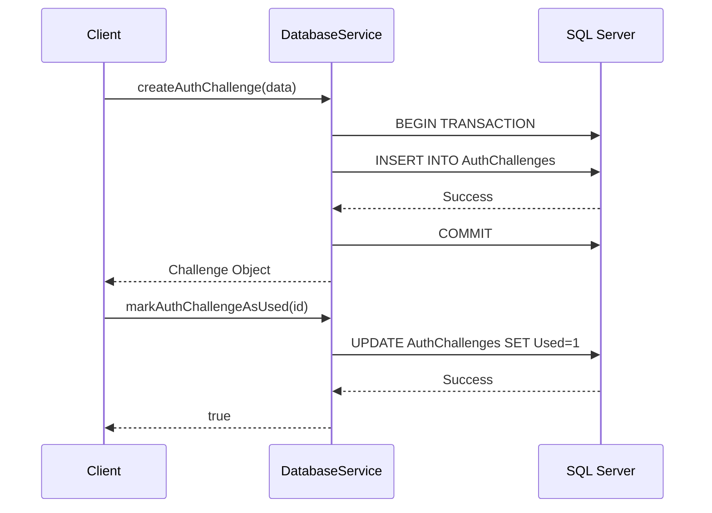

import HeaderTitle from '@/components/title';

<HeaderTitle
  title="DatabaseService"
  source="https://github.com/LED-UP/LED-UP/tree/main/apis/db"
/>
---


## Overview

The `DatabaseService` provides a robust interface for interacting with SQL Server databases within the LEDUP ecosystem. It handles data persistence operations for authentication challenges, refresh tokens, IPFS lookups, and other critical platform data. The service manages connection pooling, transaction handling, and provides a comprehensive set of APIs for CRUD operations on various data entities.

## Key Features

### Connection Management



The service handles automatic connection management through a connection pool, ensuring efficient resource utilization and optimal performance for database operations.

### Schema Management

The `DatabaseService` initializes and maintains the database schema, creating tables if they don't exist:

- `AuthChallenges` - Stores authentication challenges for user verification
- `AuthRateLimits` - Manages rate limiting for authentication attempts
- `RefreshTokens` - Tracks user session refresh tokens
- `IPFSLookups` - Maps IPFS content identifiers to their metadata

### Authentication Services



The service provides comprehensive authentication support through:

- Challenge generation and verification
- Rate limiting for authentication attempts
- Refresh token creation and rotation

### IPFS Integration

The service provides IPFS content identifier lookup and management, enabling secure storage and retrieval of encrypted data on IPFS.

### Transactional Support

The `DatabaseService` supports transaction management for operations that require atomicity, providing methods to start, commit, and rollback transactions.

## API Reference

### Constructor

```typescript
constructor(config?: Partial<DatabaseConfig>)
```

Creates a new instance of `DatabaseService` with optional configuration parameters.

| Parameter | Type                    | Description                                                       |
| --------- | ----------------------- | ----------------------------------------------------------------- |
| config    | Partial<DatabaseConfig> | Optional database configuration to override environment variables |

### Connection Methods

#### `initialize()`

```typescript
async initialize(): Promise<void>
```

Initializes the database connection pool. Called automatically by other methods if needed.

#### `setupDatabase()`

```typescript
async setupDatabase(): Promise<void>
```

Creates the necessary database tables if they don't exist, including AuthChallenges, AuthRateLimits, RefreshTokens, and IPFSLookups.

#### `close()`

```typescript
async close(): Promise<void>
```

Closes the database connection pool.

### Authentication Challenge Methods

#### `createAuthChallenge()`

```typescript
async createAuthChallenge(challenge: AuthChallengeInput): Promise<AuthChallenge>
```

Creates a new authentication challenge for user verification.

| Parameter | Type               | Description                                                      |
| --------- | ------------------ | ---------------------------------------------------------------- |
| challenge | AuthChallengeInput | Challenge data including address, nonce, message, and expiration |

Returns: A Promise resolving to the created AuthChallenge object.

#### `markAuthChallengeAsUsed()`

```typescript
async markAuthChallengeAsUsed(challengeId: string): Promise<boolean>
```

Marks an authentication challenge as used.

| Parameter   | Type   | Description                         |
| ----------- | ------ | ----------------------------------- |
| challengeId | string | ID of the challenge to mark as used |

Returns: A Promise resolving to true if successful.

#### `getActiveAuthChallengeForAddress()`

```typescript
async getActiveAuthChallengeForAddress(address: string): Promise<AuthChallenge | null>
```

Gets the active authentication challenge for an address.

| Parameter | Type   | Description                   |
| --------- | ------ | ----------------------------- |
| address   | string | The user's blockchain address |

Returns: A Promise resolving to the active AuthChallenge or null if none exists.

#### `getAuthChallengeById()`

```typescript
async getAuthChallengeById(id: string): Promise<AuthChallenge | null>
```

Gets an authentication challenge by its ID.

| Parameter | Type   | Description                         |
| --------- | ------ | ----------------------------------- |
| id        | string | The ID of the challenge to retrieve |

Returns: A Promise resolving to the AuthChallenge or null if not found.

#### `deleteExpiredAuthChallenges()`

```typescript
async deleteExpiredAuthChallenges(expirationDate?: Date): Promise<number>
```

Deletes expired authentication challenges.

| Parameter      | Type | Description                                      |
| -------------- | ---- | ------------------------------------------------ |
| expirationDate | Date | Optional date to use as the expiration threshold |

Returns: A Promise resolving to the number of deleted challenges.

### Rate Limiting Methods

#### `recordAuthAttempt()`

```typescript
async recordAuthAttempt(
  identifier: string,
  type: 'ADDRESS' | 'IP'
): Promise<{
  attemptCount: number;
  isBlocked: boolean;
  blockedUntil?: Date;
}>
```

Records an authentication attempt for rate limiting purposes.

| Parameter  | Type              | Description            |
| ---------- | ----------------- | ---------------------- |
| identifier | string            | Address or IP to track |
| type       | 'ADDRESS' \| 'IP' | Type of identifier     |

Returns: A Promise resolving to an object with rate limiting information.

#### `checkRateLimit()`

```typescript
async checkRateLimit(
  identifier: string,
  type: 'ADDRESS' | 'IP'
): Promise<{
  isBlocked: boolean;
  blockedUntil?: Date;
  attemptCount: number;
}>
```

Checks if an identifier is rate limited.

| Parameter  | Type              | Description            |
| ---------- | ----------------- | ---------------------- |
| identifier | string            | Address or IP to check |
| type       | 'ADDRESS' \| 'IP' | Type of identifier     |

Returns: A Promise resolving to an object with rate limiting status.

### Refresh Token Methods

#### `createRefreshToken()`

```typescript
async createRefreshToken(refreshToken: RefreshTokenInput): Promise<RefreshToken>
```

Creates a new refresh token for a user.

| Parameter    | Type              | Description        |
| ------------ | ----------------- | ------------------ |
| refreshToken | RefreshTokenInput | Refresh token data |

Returns: A Promise resolving to the created RefreshToken.

#### `rotateRefreshToken()`

```typescript
async rotateRefreshToken(
  tokenId: string,
  refreshToken: RefreshTokenInput
): Promise<RefreshToken>
```

Rotates a refresh token, revoking the old one and creating a new one.

| Parameter    | Type              | Description               |
| ------------ | ----------------- | ------------------------- |
| tokenId      | string            | ID of the token to rotate |
| refreshToken | RefreshTokenInput | New refresh token data    |

Returns: A Promise resolving to the new RefreshToken.

#### `revokeRefreshToken()`

```typescript
async revokeRefreshToken(token: string): Promise<boolean>
```

Revokes a refresh token.

| Parameter | Type   | Description     |
| --------- | ------ | --------------- |
| token     | string | Token to revoke |

Returns: A Promise resolving to true if successful.

#### `revokeAllUserRefreshTokens()`

```typescript
async revokeAllUserRefreshTokens(userAddress: string): Promise<number>
```

Revokes all refresh tokens for a user.

| Parameter   | Type   | Description         |
| ----------- | ------ | ------------------- |
| userAddress | string | Address of the user |

Returns: A Promise resolving to the number of revoked tokens.

### IPFS Methods

#### `createIPFSLookup()`

```typescript
async createIPFSLookup(ipfsLookup: IPFSLookupInput): Promise<IPFSLookup>
```

Creates a new IPFS lookup entry.

| Parameter  | Type            | Description      |
| ---------- | --------------- | ---------------- |
| ipfsLookup | IPFSLookupInput | IPFS lookup data |

Returns: A Promise resolving to the created IPFSLookup.

#### `getIPFSLookup()`

```typescript
async getIPFSLookup({
  id,
  cid,
  ownerDid,
}: {
  id?: string;
  cid?: string;
  ownerDid?: string;
}): Promise<IPFSLookup | null>
```

Gets an IPFS lookup by ID, CID, or owner DID.

| Parameter | Type   | Description                   |
| --------- | ------ | ----------------------------- |
| id        | string | Optional ID to look up        |
| cid       | string | Optional CID to look up       |
| ownerDid  | string | Optional owner DID to look up |

Returns: A Promise resolving to the IPFSLookup or null if not found.

#### `getAllIPFSLookups()`

```typescript
async getAllIPFSLookups(ownerDid: string): Promise<IPFSLookup[]>
```

Gets all IPFS lookups for an owner.

| Parameter | Type   | Description            |
| --------- | ------ | ---------------------- |
| ownerDid  | string | Owner DID to filter by |

Returns: A Promise resolving to an array of IPFSLookups.

## Integration Examples

### Basic Setup and Initialization

```typescript
import { DatabaseService } from '@ledup/api/services/db';

// Create a new database service instance
const dbService = new DatabaseService();

// Initialize the database connection and create tables
await dbService.initialize();
await dbService.setupDatabase();
```

### Authentication Flow

```typescript
// Create an authentication challenge
const challenge = await dbService.createAuthChallenge({
  address: '0x1234567890abcdef1234567890abcdef12345678',
  nonce: 'randomNonce123',
  message: 'Sign this message to authenticate',
  expiresAt: new Date(Date.now() + 15 * 60 * 1000), // 15 minutes
});

// Later, after user signs the challenge
const isValid = await dbService.markAuthChallengeAsUsed(challenge.id);

// Create a refresh token after successful authentication
const refreshToken = await dbService.createRefreshToken({
  userAddress: '0x1234567890abcdef1234567890abcdef12345678',
  token: 'generatedRefreshToken123',
  expiresAt: new Date(Date.now() + 7 * 24 * 60 * 60 * 1000), // 7 days
});
```

### IPFS Lookup Management

```typescript
// Create an IPFS lookup
const lookup = await dbService.createIPFSLookup({
  cid: 'QmXoypizjW3WknFiJnKLwHCnL72vedxjQkDDP1mXWo6uco',
  keyvaultName: 'myKeyVault',
  createdAt: Date.now(),
  ownerDid: 'did:ethr:0x1234567890abcdef1234567890abcdef12345678',
});

// Retrieve an IPFS lookup
const retrievedLookup = await dbService.getIPFSLookup({ cid: 'QmXoypizjW3WknFiJnKLwHCnL72vedxjQkDDP1mXWo6uco' });

// Get all lookups for an owner
const allLookups = await dbService.getAllIPFSLookups('did:ethr:0x1234567890abcdef1234567890abcdef12345678');
```

### Transaction Management

```typescript
// Start a transaction
const transaction = await dbService.getTransaction();

try {
  // Perform operations within the transaction
  const challenge = await dbService.createAuthChallengeWithTransaction(
    {
      address: '0x1234567890abcdef1234567890abcdef12345678',
      nonce: 'randomNonce123',
      message: 'Sign this message to authenticate',
      expiresAt: new Date(Date.now() + 15 * 60 * 1000),
    },
    transaction
  );

  // More operations...

  // Commit the transaction
  await transaction.commit();
} catch (error) {
  // Rollback on error
  await transaction.rollback();
  throw error;
}
```

## Error Handling

The `DatabaseService` provides detailed error information for database operations, with specific handling for:

- Connection issues
- Constraint violations
- Transaction failures
- Authentication-related errors

All methods throw appropriate exceptions that can be caught and handled by the calling code.

## Summary

The `DatabaseService` is a core component of the LEDUP platform, providing a robust and efficient interface for data persistence. It handles critical operations for user authentication, token management, and IPFS integration, ensuring data integrity and security. The service is designed with performance and reliability in mind, featuring connection pooling, transaction support, and comprehensive error handling.

---

© 2025 LEDUP | Documentation for Production Use | Last Updated: March 2025
