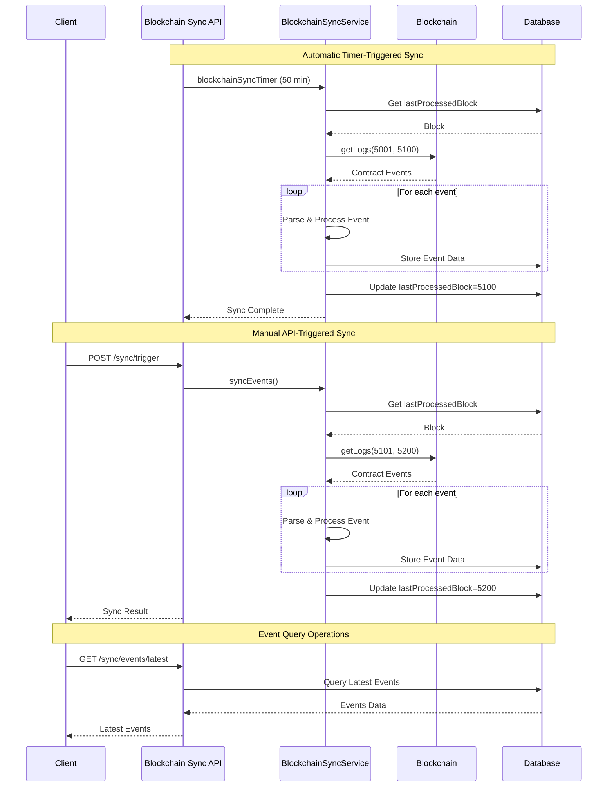

import HeaderTitle from '@/components/title';

<HeaderTitle
  title="Blockchain Sync API Reference"
  source="https://github.com/LED-UP/LED-UP/tree/main/apis/sync"
/>
---


## Overview

The Blockchain Sync API provides a set of HTTP endpoints implemented as Azure Functions for synchronizing, managing, and querying blockchain events within the LEDUP platform. These functions enable real-time monitoring of smart contract events, synchronization between the blockchain and application database, and comprehensive querying capabilities to support business processes that depend on blockchain data.

## Blockchain Sync Workflow



## API Endpoints

### Sync Status

#### Get Sync Status

Retrieves the current status of blockchain synchronization.

**Endpoint:** `GET /sync/status`

**Query Parameters:**

- `contractType` (string, optional): The type of contract to check synchronization status for
- `contractAddress` (string, optional): The address of the contract to check synchronization status for

**Response (200 OK):**

```json
{
  "status": "success",
  "contractType": "DATA_REGISTRY",
  "contractAddress": "0x1234567890abcdef1234567890abcdef12345678",
  "data": {
    "lastProcessedBlock": "15876423",
    "lastProcessedTimestamp": "2023-08-15T14:30:45.123Z",
    "syncStatus": "SYNCED",
    "errorCount": 0,
    "lastError": null,
    "totalEventsProcessed": 1245
  }
}
```

**Error Response (500 Internal Server Error):**

```json
{
  "status": "error",
  "message": "Failed to get sync status: Error connecting to blockchain"
}
```

#### Get Sync State

Retrieves the detailed sync state information.

**Endpoint:** `GET /sync/state`

**Response (200 OK):**

```json
{
  "success": true,
  "syncState": {
    "lastProcessedBlock": "15876423",
    "lastProcessedTimestamp": "2023-08-15T14:30:45.123Z",
    "syncStatus": "SYNCED",
    "errorCount": 0,
    "lastError": null,
    "totalEventsProcessed": 1245
  }
}
```

**Error Response (500 Internal Server Error):**

```json
{
  "success": false,
  "error": "Failed to get sync state",
  "message": "Database connection error"
}
```

### Sync Management

#### Trigger Blockchain Sync

Manually triggers a blockchain synchronization operation.

**Endpoint:** `POST /sync/trigger`

**Response (200 OK):**

```json
{
  "success": true,
  "message": "Blockchain sync triggered successfully",
  "syncResult": {
    "lastProcessedBlock": "15876523",
    "lastProcessedTimestamp": "2023-08-15T14:35:12.456Z",
    "syncStatus": "SYNCED",
    "errorCount": 0,
    "lastError": null,
    "totalEventsProcessed": 1260
  }
}
```

**Error Response (500 Internal Server Error):**

```json
{
  "success": false,
  "error": "Failed to trigger blockchain sync",
  "message": "Error fetching logs from blockchain: Rate limit exceeded"
}
```

#### Reset Sync State

Resets the blockchain sync state to a specific block number.

**Endpoint:** `POST /sync/reset`

**Request Body:**

```json
{
  "blockNumber": 15870000
}
```

**Parameters:**

- `blockNumber` (number, required): The block number to reset the sync state to

**Response (200 OK):**

```json
{
  "success": true,
  "message": "Sync state reset to block 15870000",
  "syncState": {
    "lastProcessedBlock": "15870000",
    "lastProcessedTimestamp": "2023-08-15T14:40:22.789Z",
    "syncStatus": "SYNCED",
    "errorCount": 0,
    "lastError": null
  }
}
```

**Error Response (400 Bad Request):**

```json
{
  "success": false,
  "error": "Invalid block number",
  "message": "blockNumber must be a non-negative integer"
}
```

### Event Queries

#### Get Latest Events

Retrieves the most recent blockchain events.

**Endpoint:** `GET /sync/events/latest`

**Query Parameters:**

- `limit` (number, optional): Maximum number of events to return (default: 10)
- `contractType` (string, optional): The type of contract to retrieve events for

**Response (200 OK):**

```json
{
  "success": true,
  "events": [
    {
      "id": "event-123456",
      "blockNumber": 15876423,
      "transactionHash": "0xabcdef1234567890abcdef1234567890abcdef1234567890abcdef1234567890",
      "eventName": "DataShared",
      "contractAddress": "0x1234567890abcdef1234567890abcdef12345678",
      "timestamp": "2023-08-15T14:30:45.123Z",
      "args": {
        "owner": "0xabcdef1234567890abcdef1234567890abcdef12",
        "consumer": "0x1234567890abcdef1234567890abcdef1234567890",
        "dataId": "data-987654",
        "accessLevel": 2
      }
    },
    {
      "id": "event-123455",
      "blockNumber": 15876422,
      "transactionHash": "0xfedcba0987654321fedcba0987654321fedcba0987654321fedcba0987654321",
      "eventName": "DidRegistered",
      "contractAddress": "0x1234567890abcdef1234567890abcdef12345678",
      "timestamp": "2023-08-15T14:29:45.123Z",
      "args": {
        "did": "did:ledup:123456789",
        "owner": "0xabcdef1234567890abcdef1234567890abcdef12",
        "publicKey": "0x9876543210fedcba9876543210fedcba9876543210fedcba9876543210fedcba"
      }
    }
  ],
  "count": 2
}
```

**Error Response (500 Internal Server Error):**

```json
{
  "success": false,
  "error": "Failed to retrieve latest events",
  "message": "Database query error"
}
```

#### Get Events By Name

Retrieves blockchain events filtered by event name.

**Endpoint:** `GET /sync/events/byName`

**Query Parameters:**

- `eventName` (string, required): The name of the event to filter by (e.g., "DataShared", "DidRegistered")
- `limit` (number, optional): Maximum number of events to return (default: 100)

**Response (200 OK):**

```json
{
  "success": true,
  "events": [
    {
      "id": "event-123456",
      "blockNumber": 15876423,
      "transactionHash": "0xabcdef1234567890abcdef1234567890abcdef1234567890abcdef1234567890",
      "eventName": "DataShared",
      "contractAddress": "0x1234567890abcdef1234567890abcdef12345678",
      "timestamp": "2023-08-15T14:30:45.123Z",
      "args": {
        "owner": "0xabcdef1234567890abcdef1234567890abcdef12",
        "consumer": "0x1234567890abcdef1234567890abcdef1234567890",
        "dataId": "data-987654",
        "accessLevel": 2
      }
    },
    {
      "id": "event-123445",
      "blockNumber": 15876400,
      "transactionHash": "0x1234567890abcdef1234567890abcdef1234567890abcdef1234567890abcdef",
      "eventName": "DataShared",
      "contractAddress": "0x1234567890abcdef1234567890abcdef12345678",
      "timestamp": "2023-08-15T14:25:30.456Z",
      "args": {
        "owner": "0xabcdef1234567890abcdef1234567890abcdef12",
        "consumer": "0x5678901234fedcba5678901234fedcba5678901234",
        "dataId": "data-987655",
        "accessLevel": 1
      }
    }
  ],
  "count": 2
}
```

**Error Response (400 Bad Request):**

```json
{
  "success": false,
  "error": "Missing required parameter",
  "message": "eventName is required"
}
```

#### Get Events By Transaction Hash

Retrieves blockchain events for a specific transaction.

**Endpoint:** `GET /sync/events/byTransaction`

**Query Parameters:**

- `transactionHash` (string, required): The transaction hash to filter by

**Response (200 OK):**

```json
{
  "success": true,
  "events": [
    {
      "id": "event-123456",
      "blockNumber": 15876423,
      "transactionHash": "0xabcdef1234567890abcdef1234567890abcdef1234567890abcdef1234567890",
      "eventName": "DataShared",
      "contractAddress": "0x1234567890abcdef1234567890abcdef12345678",
      "timestamp": "2023-08-15T14:30:45.123Z",
      "args": {
        "owner": "0xabcdef1234567890abcdef1234567890abcdef12",
        "consumer": "0x1234567890abcdef1234567890abcdef1234567890",
        "dataId": "data-987654",
        "accessLevel": 2
      }
    },
    {
      "id": "event-123457",
      "blockNumber": 15876423,
      "transactionHash": "0xabcdef1234567890abcdef1234567890abcdef1234567890abcdef1234567890",
      "eventName": "AccessGranted",
      "contractAddress": "0x1234567890abcdef1234567890abcdef12345678",
      "timestamp": "2023-08-15T14:30:45.123Z",
      "args": {
        "grantedBy": "0xabcdef1234567890abcdef1234567890abcdef12",
        "grantedTo": "0x1234567890abcdef1234567890abcdef1234567890",
        "resourceId": "data-987654",
        "expirationTime": 1723685445
      }
    }
  ],
  "count": 2
}
```

**Error Response (400 Bad Request):**

```json
{
  "success": false,
  "error": "Missing required parameter",
  "message": "transactionHash is required"
}
```

#### Get Completed Blocks

Retrieves information about the most recently processed blockchain blocks.

**Endpoint:** `GET /getCompletedBlocks`

**Response (200 OK):**

```json
{
  "data": [
    {
      "id": "block-15876423",
      "blockNumber": 15876423,
      "processedAt": "2023-08-15T14:30:45.123Z",
      "eventCount": 15
    },
    {
      "id": "block-15876422",
      "blockNumber": 15876422,
      "processedAt": "2023-08-15T14:29:45.123Z",
      "eventCount": 8
    },
    {
      "id": "block-15876421",
      "blockNumber": 15876421,
      "processedAt": "2023-08-15T14:28:45.123Z",
      "eventCount": 12
    }
  ]
}
```

**Error Response (500 Internal Server Error):**

```json
{
  "error": "Error fetching data from database",
  "message": "Failed to retrieve data from IPFS"
}
```

## Security Considerations

### Rate Limiting

- The API implements rate limiting to prevent excessive blockchain queries
- Configurable limits protect against denial-of-service attacks
- Automatic backoff and retry mechanisms ensure reliable operation

### Error Handling

- Comprehensive error handling for blockchain connection issues
- Detailed error logging with context information
- Automatic retry logic for transient errors
- Error reporting with actionable information

### Access Control

- Secure authentication for manual sync trigger operations
- Role-based access control for sync management endpoints
- Event data access restrictions based on user permissions

## Integration Examples

### Monitoring Blockchain Sync Status

```typescript
import axios from 'axios';

/**
 * Retrieves the current blockchain synchronization status
 * @param {string} contractType - Optional contract type to check
 * @returns {Promise<object>} - Sync status information
 */
const getBlockchainSyncStatus = async (contractType = null) => {
  try {
    const url = new URL('/sync/status', process.env.API_BASE_URL);

    if (contractType) {
      url.searchParams.append('contractType', contractType);
    }

    const response = await axios.get(url.toString());

    return response.data.data;
  } catch (error) {
    console.error('Failed to get blockchain sync status:', error.response?.data || error.message);
    throw new Error('Failed to retrieve blockchain sync status');
  }
};

/**
 * Checks if the blockchain sync is running behind the latest block
 * @param {number} maxBlockLag - Maximum acceptable block lag
 * @returns {Promise<boolean>} - True if sync is current, false if lagging
 */
const isSyncCurrent = async (maxBlockLag = 10) => {
  try {
    const syncStatus = await getBlockchainSyncStatus();
    const currentBlock = await getCurrentBlockNumber(); // Implement this function

    const lastProcessedBlock = parseInt(syncStatus.lastProcessedBlock);
    const blockLag = currentBlock - lastProcessedBlock;

    return blockLag <= maxBlockLag;
  } catch (error) {
    console.error('Error checking sync status:', error);
    return false; // Assume sync is not current if we can't check
  }
};

// Usage example
const monitorSyncHealth = async () => {
  try {
    const syncStatus = await getBlockchainSyncStatus();
    console.log('Current Sync Status:', syncStatus);

    const isCurrent = await isSyncCurrent(5);
    if (!isCurrent) {
      console.warn('Blockchain sync is falling behind!');
      // Trigger notification or alert
    } else {
      console.log('Blockchain sync is up to date');
    }

    // Check for errors
    if (syncStatus.errorCount > 0) {
      console.error('Sync has encountered errors:', syncStatus.lastError);
      // Trigger error notification
    }
  } catch (error) {
    console.error('Monitoring error:', error.message);
  }
};
```

### Retrieving and Processing Blockchain Events

```typescript
import axios from 'axios';

/**
 * Retrieves the latest blockchain events
 * @param {number} limit - Maximum number of events to retrieve
 * @param {string} contractType - Optional contract type filter
 * @returns {Promise<Array>} - Array of event objects
 */
const getLatestEvents = async (limit = 10, contractType = null) => {
  try {
    const url = new URL('/sync/events/latest', process.env.API_BASE_URL);

    url.searchParams.append('limit', limit.toString());
    if (contractType) {
      url.searchParams.append('contractType', contractType);
    }

    const response = await axios.get(url.toString());

    return response.data.events;
  } catch (error) {
    console.error('Failed to get latest events:', error.response?.data || error.message);
    throw new Error('Failed to retrieve blockchain events');
  }
};

/**
 * Retrieves events by event name
 * @param {string} eventName - The name of the event to filter by
 * @param {number} limit - Maximum number of events to retrieve
 * @returns {Promise<Array>} - Array of event objects
 */
const getEventsByName = async (eventName, limit = 100) => {
  if (!eventName) {
    throw new Error('Event name is required');
  }

  try {
    const url = new URL('/sync/events/byName', process.env.API_BASE_URL);

    url.searchParams.append('eventName', eventName);
    url.searchParams.append('limit', limit.toString());

    const response = await axios.get(url.toString());

    return response.data.events;
  } catch (error) {
    console.error(`Failed to get ${eventName} events:`, error.response?.data || error.message);
    throw new Error(`Failed to retrieve ${eventName} events`);
  }
};

/**
 * Processes DataShared events to update application state
 * @returns {Promise<void>}
 */
const processDataSharingEvents = async () => {
  try {
    // Get the latest DataShared events
    const events = await getEventsByName('DataShared', 50);

    console.log(`Processing ${events.length} DataShared events`);

    for (const event of events) {
      // Extract relevant information
      const { owner, consumer, dataId, accessLevel } = event.args;

      console.log(`Data ${dataId} shared by ${owner} with ${consumer} at level ${accessLevel}`);

      // Update application state or trigger notifications
      await updateSharingStatus(dataId, owner, consumer, accessLevel);
    }
  } catch (error) {
    console.error('Error processing data sharing events:', error);
  }
};

/**
 * Manually triggers a blockchain sync operation
 * @returns {Promise<object>} - Result of the sync operation
 */
const triggerManualSync = async () => {
  try {
    const response = await axios.post('/sync/trigger');

    console.log('Sync triggered successfully!');
    console.log(`Processed up to block: ${response.data.syncResult.lastProcessedBlock}`);
    console.log(`Events processed: ${response.data.syncResult.totalEventsProcessed}`);

    return response.data.syncResult;
  } catch (error) {
    console.error('Manual sync failed:', error.response?.data || error.message);
    throw new Error('Failed to trigger blockchain sync');
  }
};
```

## Implementation Details

### Blockchain Sync Timer Function

The `blockchainSyncTimer.ts` implements an automatic timer-triggered Azure Function that periodically synchronizes blockchain events:

1. Runs at configurable intervals (default: every 50 minutes)
2. Initializes the blockchain sync service
3. Retrieves the last processed block from the database
4. Fetches new events from the blockchain in configurable chunk sizes
5. Processes and stores events in the database
6. Updates the synchronization state
7. Provides comprehensive logging and error handling

This function ensures that the application database stays in sync with blockchain events without manual intervention.

### Block Processing Strategy

The BlockchainSyncService implements a robust block processing strategy:

1. **Chunk-Based Processing**: Processes blocks in configurable chunks (default: 100 blocks) to avoid timeouts
2. **Incremental Synchronization**: Always starts from the last successfully processed block
3. **Error Resilience**: Implements retry logic for failed operations
4. **Transaction Atomicity**: Ensures all events within a block are processed together
5. **Event Parsing**: Automatically parses event arguments based on contract ABI
6. **State Management**: Maintains detailed synchronization state for monitoring and diagnostics

This approach ensures reliable event processing even in the face of network issues, blockchain reorgs, or other transient failures.

---

© 2025 LEDUP | Documentation for Production Use | Last Updated: April 2025
