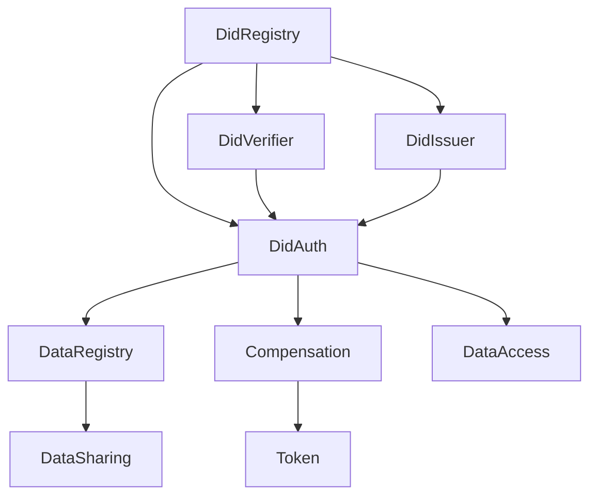
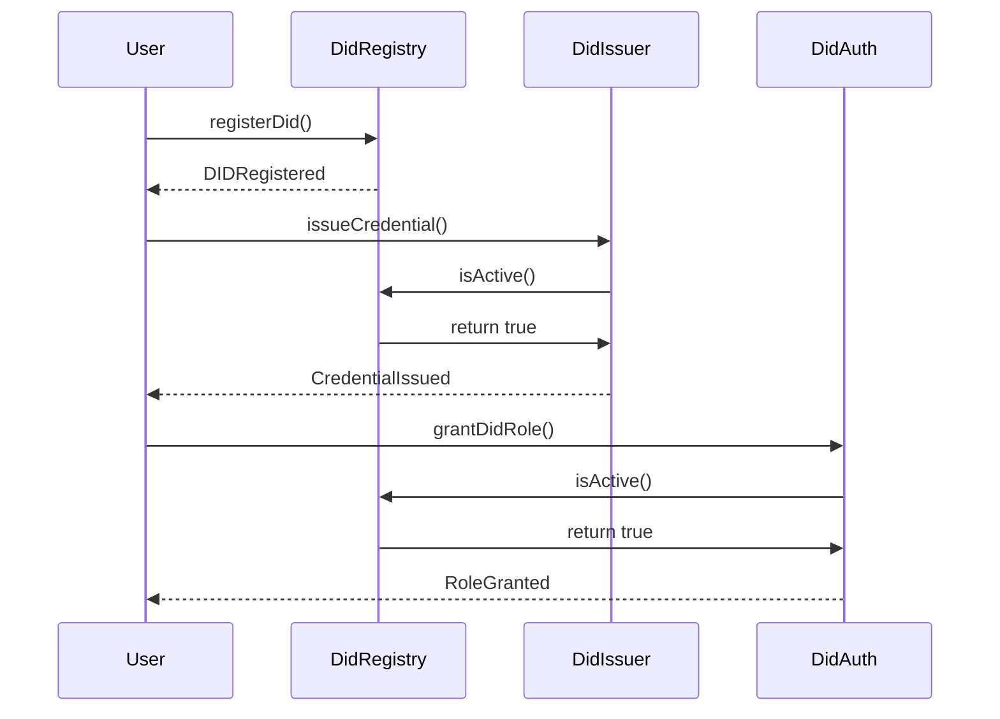
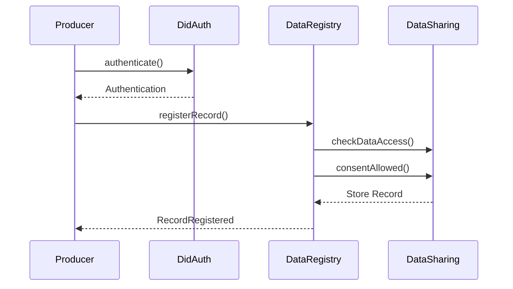
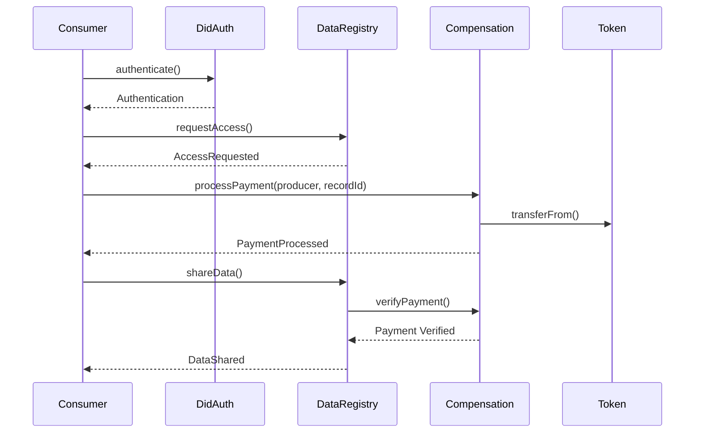
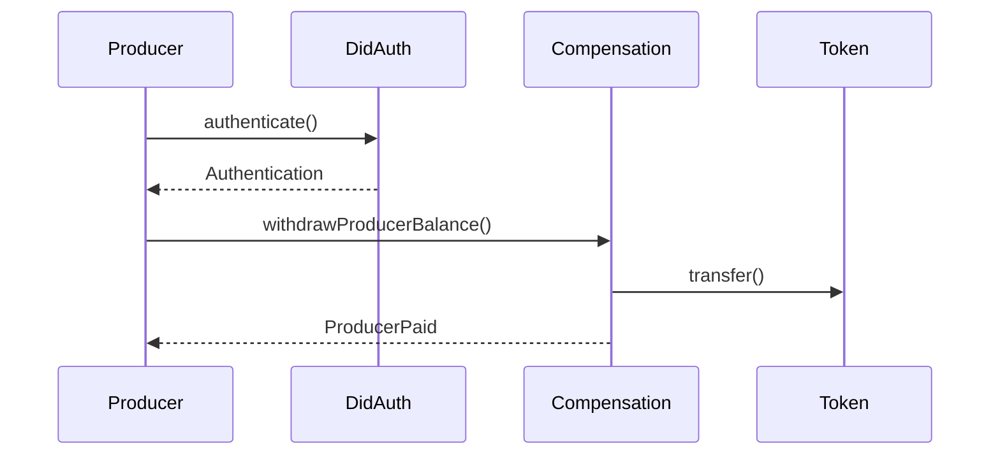
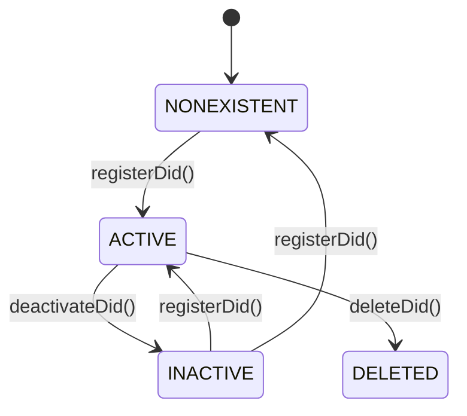
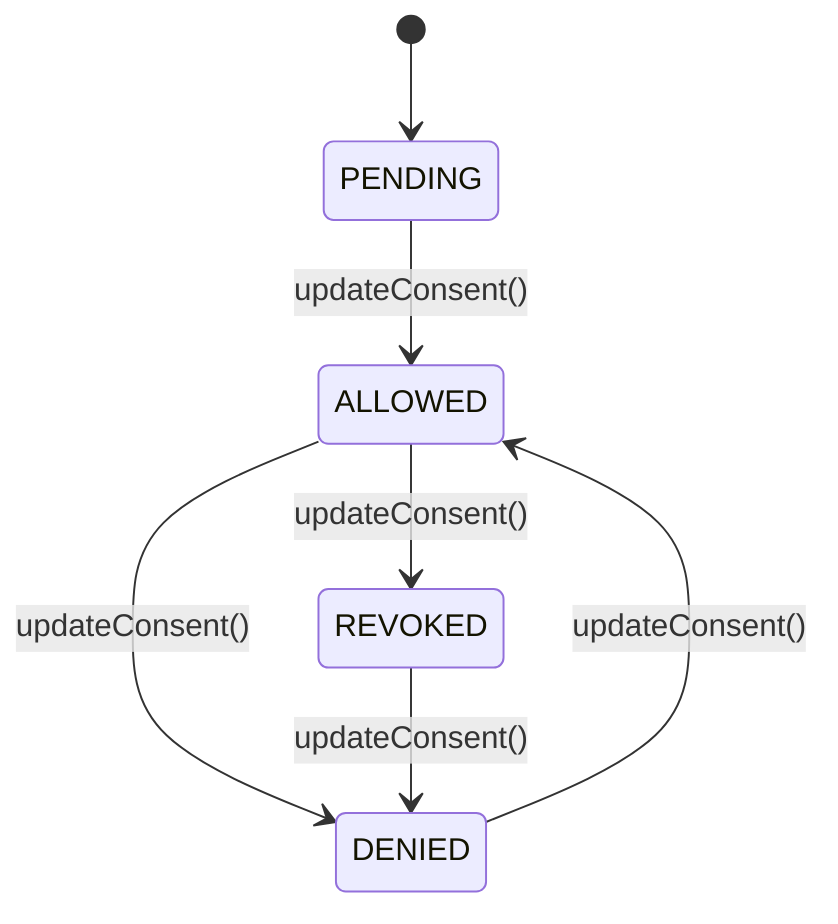
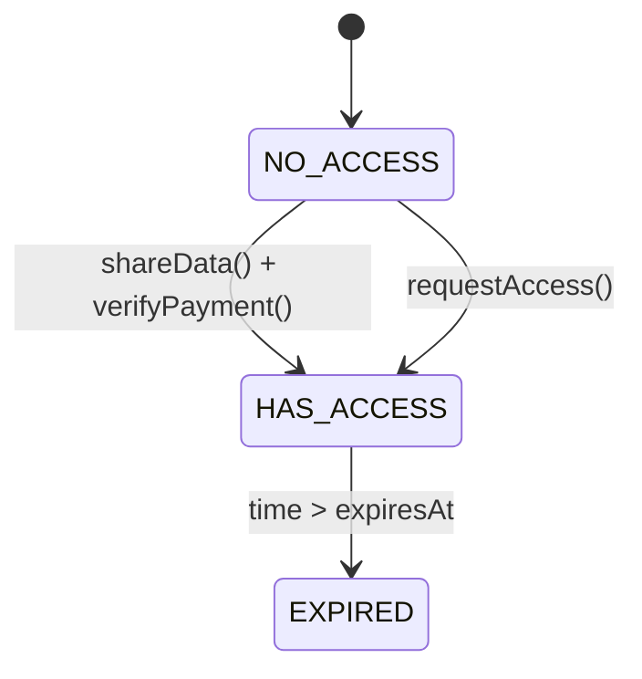

# Contract Interaction Model

This document details how the various smart contracts in the decentralized data sharing system interact with each other, including contract dependencies, sequence diagrams for key workflows, and state transitions.

## Contract Dependency Diagram

The following diagram illustrates the dependencies between the core contracts:

### Key Dependencies:

1. **DidRegistry**: The foundation contract that all identity-related contracts depend on
2. **DidVerifier & DidIssuer**: Depend on DidRegistry for DID verification
3. **DidAuth**: Depends on DidRegistry, DidVerifier, and DidIssuer for authentication
4. **DataRegistry**: Depends on DidAuth for role-based access control
5. **Compensation**: Depends on DidAuth for role verification and Token for payments
6. **DataSharing & DataAccess**: Depend on DataRegistry for record information

## Sequence Diagrams for Key Workflows

### 1. DID Registration and Credential Issuance

### 2. Data Record Registration Process

### 3. Data Access and Payment Flow

### 4. Producer Balance Withdrawal

## State Transition Diagrams

### DID Lifecycle

### Producer Consent States

### Record Access State

## Cross-Contract Function Calls

The table below summarizes the key cross-contract function calls in the system:

| Caller Contract | Called Contract | Function                  | Purpose                                |
|-----------------|----------------|---------------------------|----------------------------------------|
| DidIssuer       | DidRegistry    | isActive()                | Check if DID is active before issuing  |
| DidVerifier     | DidRegistry    | isActive()                | Verify DID status during verification  |
| DidAuth         | DidRegistry    | isActive()                | Verify DID during authentication       |
| DidAuth         | DidVerifier    | verifyCredential()        | Verify credentials during auth         |
| DidAuth         | DidIssuer      | isCredentialValid()       | Check credential validity              |
| DataRegistry    | DidAuth        | authenticate()            | Verify role during data operations     |
| DataRegistry    | DidAuth        | getDidFromAddress()       | Get DID from address                   |
| DataRegistry    | Compensation   | verifyPayment()           | Check payment before granting access   |
| Compensation    | Token          | transferFrom()/transfer() | Process payments and withdrawals       |
| Compensation    | DidAuth        | authenticate()            | Verify roles for payments              |
| Compensation    | DidAuth        | getDidFromAddress()       | Get DID for role verification          |

## Gas Optimization Strategies

The contract interaction design includes several gas optimization strategies:

1. **Minimal Cross-Contract Calls**: Functions are designed to minimize cross-contract calls
2. **Efficient State Management**: State is stored in the most appropriate contract
3. **Batched Operations**: Where possible, operations are batched
4. **Minimal On-Chain Storage**: Using off-chain storage with on-chain references
5. **Optimized Data Types**: Using smaller data types (uint40, uint24, etc.) where appropriate

## Error Handling Across Contracts

The system implements consistent error handling across contract interactions:

1. **Custom Error Types**: Each contract defines specific error types
2. **Revert with Reason**: Functions revert with specific error messages
3. **Function Modifiers**: Common checks are implemented as modifiers
4. **Graceful Delegation**: Contracts handle errors from other contracts gracefully

## Future Interaction Improvements

Future improvements to contract interactions could include:

1. **Enhanced Event-Driven Architecture**: More sophisticated event-based interactions
2. **Interface Standardization**: Standardized interfaces for contract interactions
3. **Proxy Pattern Implementation**: Upgradeable contracts with stable interfaces
4. **Multi-Call Optimization**: Batch transactions for improved efficiency
5. **Layer 2 Integration**: Moving interactions to Layer 2 for reduced costs 
