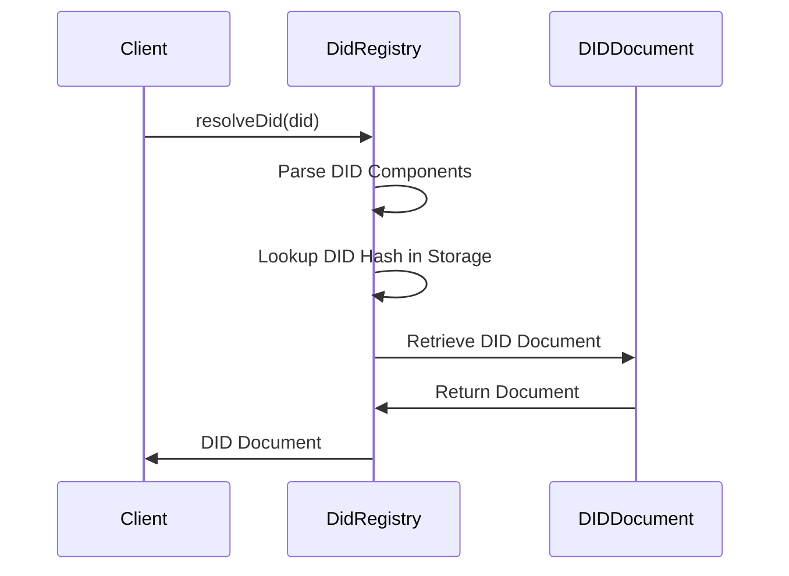
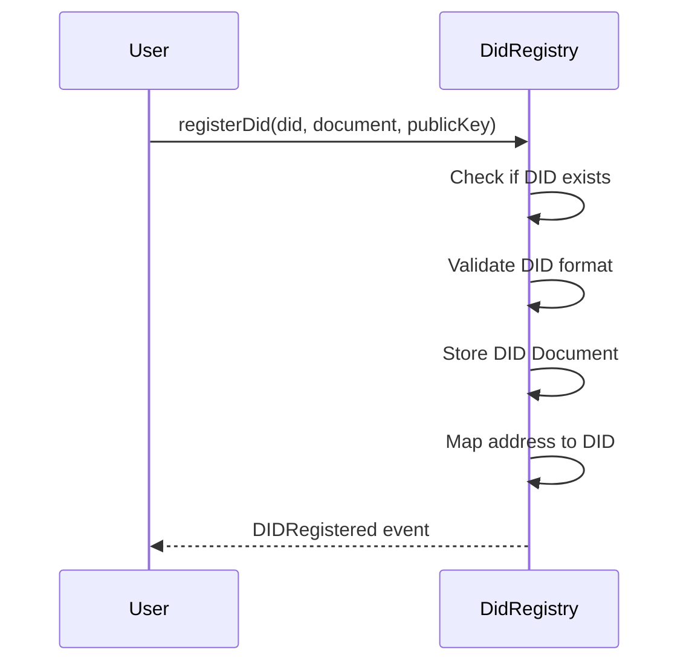

# DID Implementation

This document details how Decentralized Identifiers (DIDs) are implemented in the data sharing system, covering their structure, resolution process, document format, and public key management.

## DID Overview

Decentralized Identifiers (DIDs) are a new type of identifier for verifiable, self-sovereign digital identity. In our system, DIDs serve as the foundation for authentication, authorization, and data ownership. They enable secure, privacy-preserving interactions between system participants without relying on centralized identity providers.

## DID Structure and Format

### DID Syntax

DIDs in the system follow the W3C DID standard format:

```
did:<method>:<network>:<address>
```

Where:
- `did`: The scheme identifier
- `<method>`: The DID method (e.g., "ethr", "example")
- `<network>`: The network identifier (e.g., "mainnet", "testnet")
- `<address>`: The blockchain address or identifier specific to this DID

### Examples

```
did:ethr:mainnet:0x1234567890123456789012345678901234567890
did:example:testnet:0xabcdefabcdefabcdefabcdefabcdefabcdefabcd
```

### Supported DID Methods

The system primarily supports:

1. **did:ethr**: Ethereum-based DIDs tied to Ethereum addresses
2. **did:example**: Testing/demo DIDs used in development environments

The system is designed to be method-agnostic and can be extended to support additional DID methods in the future.

## DID Resolution Process

The resolution process converts a DID into its associated DID Document, which contains the metadata needed to interact with the identity. This process is handled by the DidRegistry contract.

### Resolution Steps



### Resolution Implementation

The resolution process is primarily implemented in the DidRegistry contract through these functions:

```solidity
// Get DID document by DID string
function getDidDocument(string memory did) external view returns (DIDDocument memory)

// Get controller/subject address for a DID
function getController(string memory did) external view returns (address)

// Check if a DID is active
function isActive(string memory did) external view returns (bool)

// Get DID for an address
function addressToDID(address _address) external view returns (string memory)
```

### DID Hash Calculation

To optimize gas usage, DIDs are stored using their keccak256 hash:

```solidity
bytes32 didHash = keccak256(abi.encodePacked(did));
```

This hash serves as the key in storage mappings for efficient lookup.

## DID Document Structure

The DID Document contains metadata about the DID subject. In our system, it's represented by the DIDDocument struct:

```solidity
struct DIDDocument {
    address subject;      // The controller/subject address
    uint40 lastUpdated;   // Timestamp of last update
    bool active;          // Active status flag
    string publicKey;     // Public key string
    string document;      // Document string (JSON)
}
```

### DID Document Fields

- **subject**: The controller address that has permission to update the DID document
- **lastUpdated**: Timestamp when the document was last modified
- **active**: Boolean indicating if the DID is active or deactivated
- **publicKey**: Public key associated with the DID, used for verification
- **document**: JSON string that can contain additional metadata about the DID

### DID Document JSON Format

The `document` field can contain a JSON structure following the W3C DID Document format:

```json
{
  "@context": "https://www.w3.org/ns/did/v1",
  "id": "did:example:testnet:0x1234567890123456789012345678901234567890",
  "authentication": [{
    "id": "did:example:testnet:0x1234567890123456789012345678901234567890#keys-1",
    "type": "EcdsaSecp256k1RecoveryMethod2020",
    "controller": "did:example:testnet:0x1234567890123456789012345678901234567890",
    "publicKeyHex": "0x..."
  }],
  "service": [{
    "id": "did:example:testnet:0x1234567890123456789012345678901234567890#data-sharing",
    "type": "DataSharingService",
    "serviceEndpoint": "https://data.example.com/api"
  }]
}
```

## DID Operations

### DID Creation and Registration



### DID Update

```solidity
function updateDidDocument(
    string calldata did,
    string calldata newDocument,
    string calldata newPublicKey
) external
```

### DID Deactivation and Reactivation

```solidity
function deactivateDid(string calldata did) external

function reactivateDid(string calldata did) external
```

### DID Deletion

```solidity
function deleteDid(string calldata did) external
```

## Public Key Management

Public keys are essential for cryptographic operations within the DID system.

### Public Key Storage

The public key associated with a DID is stored in the DIDDocument structure as a string. This approach allows for flexibility in key formats while keeping gas costs reasonable.

### Public Key Types

The system supports various public key types:

1. **EcdsaSecp256k1**: Standard Ethereum key format
2. **Ed25519**: Edwards-curve Digital Signature Algorithm keys
3. **RSA**: For legacy system compatibility

### Key Rotation and Management

Key rotation is handled through the DID document update process:

1. Generate new key pair
2. Call `updateDidDocument` with the new public key
3. The old key is replaced with the new key
4. The `lastUpdated` timestamp is updated

### Key Usage

Public keys are used for various purposes:

1. **Authentication**: Verifying that operations are performed by the DID controller
2. **Digital Signatures**: Signing data or credentials
3. **Encryption**: Enabling secure data sharing (in advanced implementations)

## Integration with Other Components

### DID and Credential Issuance

DIDs serve as subjects for verifiable credentials in the DidIssuer contract:

```solidity
function issueCredential(
    string calldata credentialType,
    string calldata subject,  // DID of the subject
    bytes32 credentialId
) external
```

### DID Authentication

DidAuth uses DIDs as the primary identifier for authentication:

```solidity
function authenticate(
    string memory did,
    bytes32 role
) public view returns (bool)
```

### DID in Data Records

Producer DIDs are associated with data records:

```solidity
struct ProducerMetadata {
    string did;  // Producer's DID
    // other fields...
}
```

## DID Resolution Performance Optimization

The system optimizes DID resolution through:

1. **Hash-Based Lookups**: Using keccak256 hashes as mapping keys
2. **Address Mapping**: Direct address to DID mapping for common operations
3. **Minimized Storage**: Only essential data stored on-chain
4. **Gas-Optimized Types**: Using compact types like uint40 for timestamps

## Future DID Enhancements

Planned enhancements to the DID implementation include:

1. **Multiple Controller Support**: Allow multiple addresses to control a single DID
2. **Advanced Key Management**: More sophisticated key rotation and revocation
3. **DID Method Expansion**: Support for additional DID methods
4. **Off-Chain Resolution**: Integration with off-chain DID resolvers for cross-chain DIDs
5. **Verifiable Presentations**: Support for DID-based verifiable presentations
6. **Enhanced Privacy**: Zero-knowledge proof integration for privacy-preserving verification 
