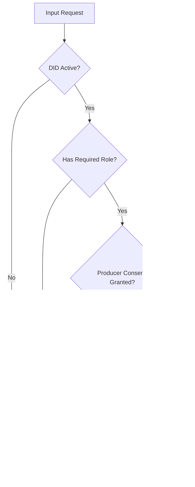

# Security Model

This document provides a detailed overview of the security model implemented in the decentralized data sharing system. The security architecture is designed to protect data integrity, ensure proper authentication and authorization, manage consent, and secure financial transactions.

## Core Security Principles

The system's security model is built upon the following core principles:

1. **Identity-Based Security**: All security starts with validated, verifiable identities
2. **Role-Based Access Control**: Granular permissions based on assigned roles
3. **Credential Verification**: Claims about identity verified through cryptographic credentials
4. **Explicit Consent**: Producer consent required for data sharing
5. **Payment Verification**: Access granted only after verified payment
6. **Minimal On-Chain Data**: Sensitive data stored off-chain with references on-chain
7. **Defense in Depth**: Multiple security layers protecting each operation

## Authentication Flow Using DIDs

### DID Authentication Process

The system implements a comprehensive DID-based authentication flow:

### Authentication Security Layers

1. **DID Validation**: Verifies DID exists and is active in DidRegistry
2. **Credential Verification**: Validates credentials using DidVerifier
3. **Role Verification**: Confirms the DID has the required role in DidAuth
4. **Issuer Trust Verification**: Ensures credentials come from trusted issuers

### Authentication Security Measures

- **Cryptographic Validation**: DID ownership verified through cryptographic means
- **Deactivation Checks**: Prevents authentication with deactivated DIDs
- **Status Tracking**: Maintains current status of DIDs and credentials
- **Event Logging**: Authentication attempts (success/failure) are logged via events

## Role-Based Authorization Mechanisms

### Role Hierarchy

The system implements a role-based authorization model with these primary roles:

### Authorization Enforcement Points

Role-based authorization is enforced at multiple points:

1. **Function Level**: Through modifiers like `onlyOwner`, `withRole(ROLE)`, etc.
2. **Data Record Level**: Producer-specific access to their own records
3. **Payment Level**: Producer/consumer role validation during payments
4. **Administrative Actions**: Admin-only functions for system management

### Role Authorization Flow

### Role-Credential Mapping

The system maps roles to required credential types:

| Role        | Required Credential      |
|-------------|--------------------------|
| PRODUCER    | ProducerCredential       |
| CONSUMER    | ConsumerCredential       |
| PROVIDER    | ProviderCredential       |
| ISSUER      | (Admin assigned)         |
| VERIFIER    | (Admin assigned)         |
| OPERATOR    | (Admin assigned)         |
| ADMIN       | (Owner assigned)         |

## Credential Verification Process

### Credential Structure

Credentials in the system include:

1. **Credential Type**: Defines the type of claim (e.g., ProducerCredential)
2. **Subject DID**: The DID that the credential is about
3. **Credential ID**: Unique identifier for the credential
4. **Issuer**: The entity that issued the credential

### Credential Verification Flow

### Credential Security Measures

1. **Trusted Issuer Registry**: Only credentials from registered trusted issuers are accepted
2. **Credential Validity Checks**: Ensures credentials haven't been revoked
3. **DID Active Verification**: Confirms the subject DID is active
4. **Credential Tracking**: Records which credentials have been issued to prevent duplication

## Data Privacy and Access Control Model

### Data Record Privacy

The system implements a multi-layered privacy approach:

1. **Minimal On-Chain Data**: Only metadata stored on-chain, actual data off-chain via IPFS
2. **Consent-Based Sharing**: Explicit producer consent required for sharing
3. **Time-Limited Access**: Access grants expire after specified duration
4. **Role-Based Access**: Only authorized roles can access specific functions
5. **Producer Control**: Producers maintain control over their data records

### Access Control Mechanisms

### Data Access Layers

The system implements multiple access control layers:

1. **Authentication Layer**: Verifies identity through DIDs
2. **Authorization Layer**: Checks role-based permissions
3. **Consent Layer**: Verifies producer consent status
4. **Payment Layer**: Confirms payment has been processed
5. **Expiration Layer**: Enforces time-based access limitations

## Secure Payment Handling

### Payment Security Flow

### Payment Security Measures

1. **Role Verification**: Ensures payment participants have appropriate roles
2. **SafeERC20**: Uses OpenZeppelin's SafeERC20 for secure token transfers
3. **Payment Records**: Maintains record of payments for verification
4. **Fee Handling**: Securely calculates and collects service fees
5. **Balance Management**: Safely tracks producer balances

### Withdrawal Security

Producer balance withdrawals implement these security features:

1. **Minimum Withdrawal Amount**: Prevents dust attacks and excessive gas costs
2. **Balance Verification**: Ensures sufficient balance before withdrawal
3. **Role Verification**: Confirms withdrawer has producer role
4. **Address Validation**: Prevents withdrawals to invalid addresses

## Security Implementation by Contract

### DidRegistry Security

- **Controller Verification**: Only DID controllers can update their DID documents
- **Status Tracking**: Maintains DID activation status
- **Duplicate Prevention**: Prevents duplicate DID registration
- **Document Integrity**: Maintains consistency of DID documents

### DidVerifier Security

- **Trusted Issuer Registry**: Maintains list of trusted credential issuers
- **Issuer Status Management**: Allows adding/removing trusted issuers
- **Credential Type Validation**: Verifies credentials against registered types

### DidIssuer Security

- **DID Validation**: Validates subject DIDs before credential issuance
- **Credential Tracking**: Prevents duplicate credentials via unique IDs
- **Event Logging**: Records all credential issuance for auditability

### DidAuth Security

- **Role Management**: Secure role assignment and verification
- **Credential Requirements**: Links roles to required credentials
- **Authentication Logic**: Robust DID and role authentication

### DataRegistry Security

- **Access Control**: Multi-layered access control system
- **Producer Verification**: Only producers can update their records
- **Consent Enforcement**: Respects producer consent settings
- **Content Integrity**: Verifies content hashes for data integrity
- **Provider Management**: Secure provider authorization system

### Compensation Security

- **Payment Verification**: Ensures proper payment for data access
- **Balance Protection**: Secures producer balances
- **Role Verification**: Validates producer/consumer roles for payments
- **Fee Calculation**: Secure service fee calculation and collection
- **Withdrawal Controls**: Secure withdrawal process with proper validation

## Potential Security Vulnerabilities and Mitigations

### Centralization Risks

**Vulnerability**: Owner accounts have significant control over the system.

**Mitigation**:
- Implement time-locks for critical administrative functions
- Move toward multi-signature or DAO-based governance
- Implement events for all administrative actions for transparency

### Front-Running

**Vulnerability**: Potential for transaction front-running on price changes or role assignments.

**Mitigation**:
- Implement commit-reveal schemes for sensitive operations
- Use time-delayed operations for critical changes
- Provide grace periods for users to react to parameter changes

### Consent Manipulation

**Vulnerability**: Potential for unauthorized consent manipulation.

**Mitigation**:
- Strict access controls on consent management functions
- Event logging for all consent changes
- Time-locks or cooldown periods for consent changes

### Role Elevation

**Vulnerability**: Unauthorized elevation of privileges through role manipulation.

**Mitigation**:
- Separation of duty in role management
- Comprehensive logging of role changes
- Regular audits of role assignments

## Future Security Enhancements

1. **Advanced Encryption**: Implement on-chain encrypted data sharing
2. **Zero-Knowledge Proofs**: For privacy-preserving credential verification
3. **Multi-Signature Governance**: For critical administrative functions
4. **Proxy-Based Upgradeability**: Allow secure contract upgrades
5. **Enhanced Auditing**: More comprehensive event logging and monitoring
6. **Formal Verification**: Formally verify critical security properties
7. **Hardware Security Integration**: Support for hardware-based key management 
