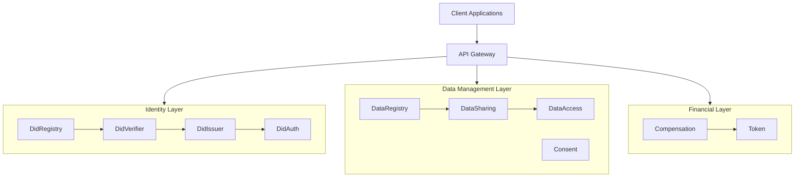
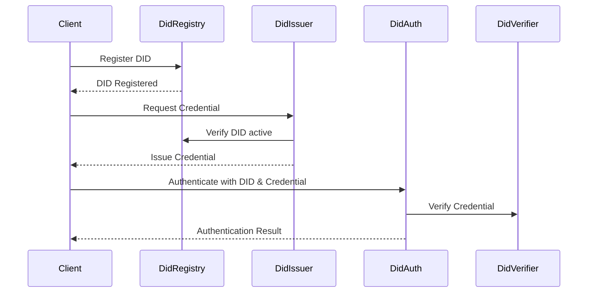
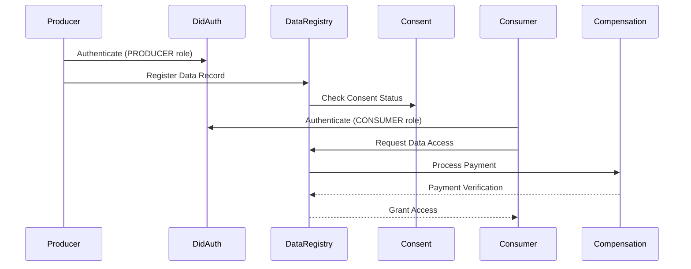

# System Architecture Overview

## Introduction

This document provides a comprehensive overview of the decentralized data sharing system architecture. The system enables secure, consent-based data sharing between producers and consumers while ensuring proper authentication, authorization, and compensation.

The architecture is built on blockchain technology, leveraging Decentralized Identifiers (DIDs) for identity management and smart contracts for governance and business logic. This approach ensures transparency, immutability, and trust in data sharing transactions.

## Core Components

The system consists of several interconnected components, each with specific responsibilities:

### 1. Identity Management Layer

- **DidRegistry**: The foundational component that manages Decentralized Identifiers (DIDs). It handles registration, resolution, and lifecycle management of DIDs within the system.
- **DidVerifier**: Verifies the authenticity of credentials associated with DIDs by checking credential issuers and validity.
- **DidIssuer**: Issues verifiable credentials to DIDs that can be used for authorization and role assignment.

### 2. Authentication & Authorization Layer

- **DidAuth**: The central authentication and authorization service that manages role-based access control using DIDs and credentials.

### 3. Data Management Layer

- **DataRegistry**: The core data registry that manages data record metadata, sharing permissions, and access control.
- **DataSharing**: Handles the mechanisms for securely sharing data between authorized parties.
- **DataAccess**: Controls access to shared data based on permissions and payment verification.

### 4. Financial Layer

- **Compensation**: Manages payments between consumers and producers for data access.
- **Token**: The ERC20 token used for payments within the system.

### 5. Consent Management Layer

- **Consent**: Manages producer consent for data sharing, ensuring data is only shared with proper authorization.

## System Architecture Diagram

## Component Interactions

The system components interact in a layered fashion, with each layer providing services to the layers above it:

1. **Identity Foundation**: DidRegistry, DidVerifier, and DidIssuer form the foundational identity layer.
2. **Authentication**: DidAuth uses the identity layer to authenticate and authorize access.
3. **Data & Consent**: DataRegistry and Consent services use DidAuth to ensure proper access control.
4. **Financial Transactions**: Compensation integrates with DataRegistry to process payments for data access.

### Key Interaction Flows

#### DID Registration and Authentication

#### Data Registration and Sharing

## Core Concepts and Terminology

### Decentralized Identifiers (DIDs)

DIDs are persistent identifiers that enable verifiable, decentralized digital identity. In this system, DIDs follow the format `did:method:network:address` and are used to identify all participants.

### Verifiable Credentials

Digital credentials that are cryptographically secure, privacy respecting, and machine-verifiable. They are issued to DIDs and represent claims about the identity holder.

### Roles

The system defines several roles that determine access permissions:
- **Producer**: Entity that provides data records
- **Consumer**: Entity that accesses data records
- **Provider**: Service provider managing the platform
- **Verifier**: Entity that verifies data records
- **Admin**: System administrator with special privileges

### Consent

Explicit permission from data producers to share their data. Consent can be granted, denied, or revoked at any time.

### Data Records

The core data objects being shared, including metadata, content identifiers (CIDs), and access permissions.

## Web3 Integration Points

The system is built on Ethereum-compatible blockchain technology with several key Web3 integration points:

1. **Smart Contracts**: All core components are implemented as smart contracts on the blockchain.
2. **Wallet Authentication**: Users connect using Web3 wallets for authentication.
3. **Token Payments**: ERC20 tokens are used for compensation.
4. **IPFS Integration**: Content Identifiers (CIDs) point to data stored on IPFS.
5. **Event Monitoring**: System events are monitored via blockchain event logs.

## Security Model

The security architecture is built around several key principles:

1. **Decentralized Identity**: DIDs provide a secure identity foundation
2. **Credential Verification**: Verifiable credentials ensure proper authorization
3. **Role-Based Access Control**: Fine-grained access control through roles
4. **Consent Management**: Explicit consent tracking protects data sovereignty
5. **Payment Verification**: Access is granted only after payment verification

### Security Layers

- **Identity Security**: Secure DID registration and management
- **Authentication Security**: DID-based authentication with credential verification
- **Authorization Security**: Role-based access control with credential requirements
- **Data Security**: Minimal on-chain data with secure off-chain storage
- **Financial Security**: Secure token-based transactions with proper verification

## Scalability Considerations

The system architecture addresses scalability through:

1. **Minimal On-Chain Data**: Only metadata and access records stored on-chain
2. **Off-Chain Content**: Actual data content stored via IPFS
3. **Efficient Storage**: Gas-optimized data structures and mappings
4. **Batched Operations**: Support for batch processing where appropriate
5. **Stateless Authentication**: Authentication can scale independently of data operations

## Fault Tolerance

The system is designed with fault tolerance in mind:

1. **Contract Pause Mechanism**: Critical operations can be paused in emergency
2. **Role Separation**: Compromised roles don't affect entire system
3. **Record Verification**: Data integrity verification through content hashes
4. **Access Expiry**: Time-limited access grants prevent perpetual access
5. **Owner Controls**: Administrative functions for emergency interventions

## System Limitations

Current architectural limitations include:

1. **Centralized Governance**: Owner accounts have significant control
2. **Limited Privacy**: Basic privacy model without advanced encryption
3. **Upgrade Challenges**: Contracts not designed with proxy-based upgradeability
4. **Single Token Model**: Only supports a single payment token type
5. **Gas Costs**: Transaction costs may be significant for frequent operations

## Future Architecture Extensions

The architecture can be extended in several ways:

1. **Decentralized Governance**: DAO-based governance for administrative functions
2. **Advanced Privacy**: Encryption schemes for sensitive data
3. **Layer 2 Scaling**: Integration with Layer 2 solutions for reduced costs
4. **Cross-Chain Support**: Interoperability with multiple blockchain networks
5. **Subscription Models**: Advanced payment models beyond pay-per-access
6. **Data Marketplaces**: Enhanced discovery and marketplace functionality 
