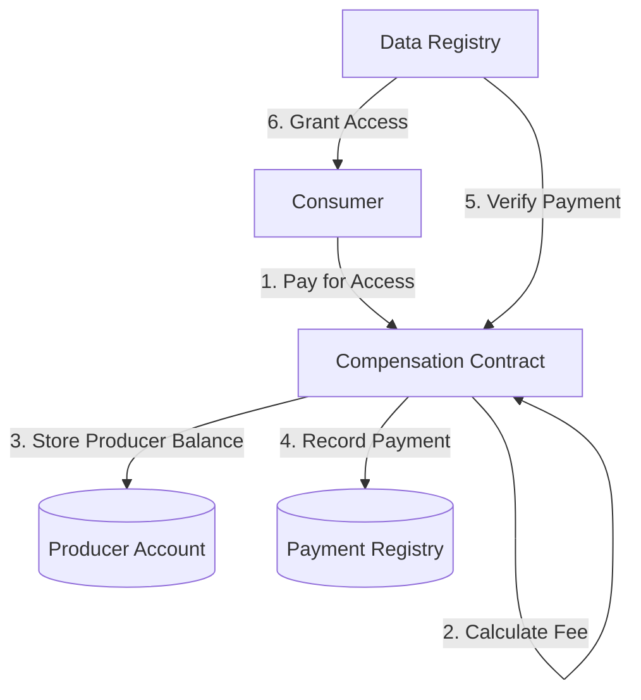
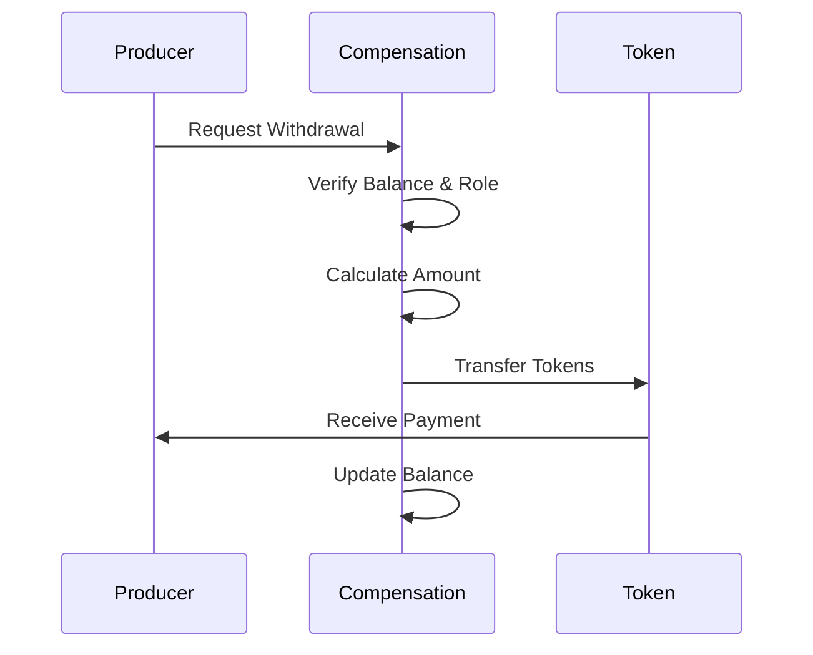
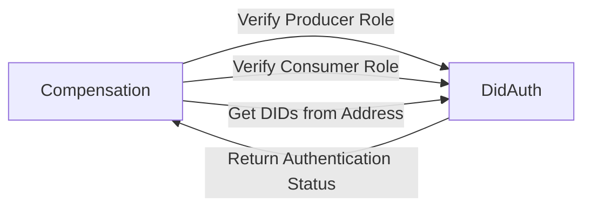
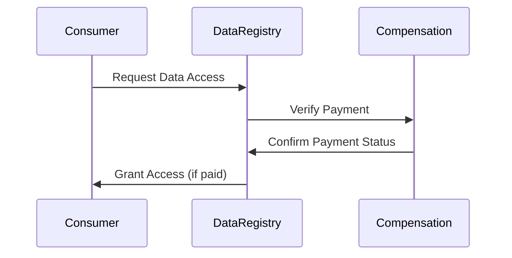
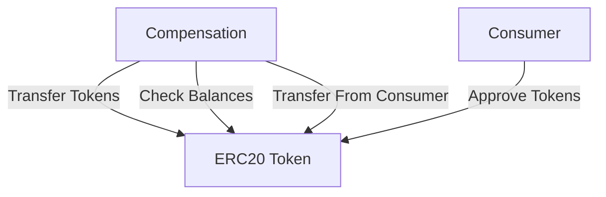
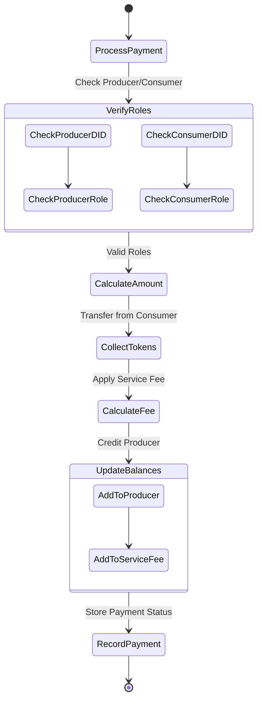

import HeaderTitle from '@/components/title';

<HeaderTitle
  title="Compensation Contract"
  source="https://github.com/LED-UP/LED-UP-SMART-CONTRACTS/tree/main/contracts"
/>

---

**Version:** 1.0.0  
**Last Updated:** March 2025  
**Status:** Production

## Overview

The Compensation contract is a critical component of the LEDUP ecosystem that manages the economic layer of data sharing. It handles payment processing between data consumers and producers, tracks balances, calculates service fees, and ensures fair compensation for health data sharing.

## Key Features

### Payment Processing

The Compensation contract enables secure and transparent payment processing for data access:

- **Token-based payments**: Uses ERC20 tokens for all compensation transactions
- **Record-specific tracking**: Links payments to specific health record IDs
- **Payment verification**: Provides verification mechanisms to confirm payment status

### Balance Management

The contract manages balances for all participants in the system:

- **Producer balances**: Tracks accumulated payments for each data producer
- **Service fee balance**: Collects platform fees from each transaction
- **Withdrawal mechanisms**: Allows producers to withdraw their earned compensation

### Fee Calculation

The contract includes a sophisticated fee calculation system:

- **Percentage-based fees**: Calculates service fees as a percentage of transactions
- **Data size pricing**: Determines payment amounts based on data size
- **Unit price mechanism**: Uses a configurable per-unit price for consistent pricing

### Role-Based Operation

The contract integrates with DidAuth for secure, role-based operation:

- **Producer verification**: Ensures only registered producers can receive payments
- **Consumer verification**: Validates consumer credentials before processing payments
- **Owner administration**: Provides administrative functions limited to contract owner

## Interaction with Other Contracts

The Compensation contract interfaces with several other contracts in the LEDUP ecosystem:

### DidAuth Integration

- **Role verification**: Validates that addresses have appropriate producer/consumer roles
- **DID resolution**: Retrieves DIDs associated with blockchain addresses
- **Authentication**: Ensures operations are performed by properly authenticated entities

### DataRegistry Interaction

- **Payment verification**: Provides verification endpoints for the DataRegistry contract
- **Access control**: Enables the data access gating mechanism based on payment status
- **Record linking**: Associates payments with specific data records

### Token Contract Usage

- **Token transfers**: Handles all token movements between participants
- **Balance checks**: Verifies sufficient funds before processing payments
- **Safe transfers**: Uses SafeERC20 for secure token operations

## Business Logic Flow

The following diagram illustrates the core business logic flow of the Compensation contract:

## Contract Events

The Compensation contract emits events to notify external systems of important state changes:

- **PaymentProcessed**: Triggered when a consumer pays for data access
- **ProducerPaid**: Emitted when a producer withdraws their balance
- **ServiceFeeWithdrawn**: Signals service fee withdrawal by contract owner
- **ServiceFeeChanged**: Indicates a change in the service fee percentage
- **UnitPriceChanged**: Notifies of updates to the unit price for data
- **ProducerRemoved**: Emitted when a producer is removed from the system

## Administrative Functions

The contract includes administrative functions accessible only to the contract owner:

- **Service fee management**: Adjust the percentage fee collected by the platform
- **Unit price control**: Modify the base price per unit of data
- **System pause/unpause**: Temporarily halt sensitive operations if needed
- **Token address updates**: Change the ERC20 token used for payments
- **DidAuth address updates**: Update the reference to the DidAuth contract

## Summary

The Compensation contract is a fundamental building block of the LEDUP platform that:

1. **Facilitates economic incentives** for health data sharing
2. **Ensures transparent and traceable** payment processing
3. **Integrates tightly with identity and data** management components
4. **Provides flexible configuration** options for platform economics
5. **Maintains secure balance management** for all participants

This contract enables the sustainable operation of the LEDUP health data ecosystem by creating a fair value exchange mechanism between data producers and consumers.

---

**© 2025 LEDUP - All rights reserved.**
