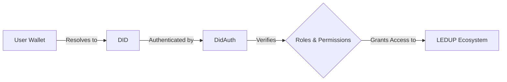
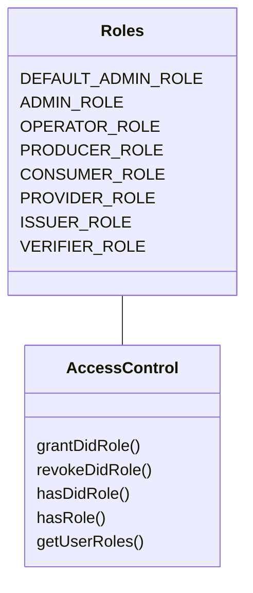
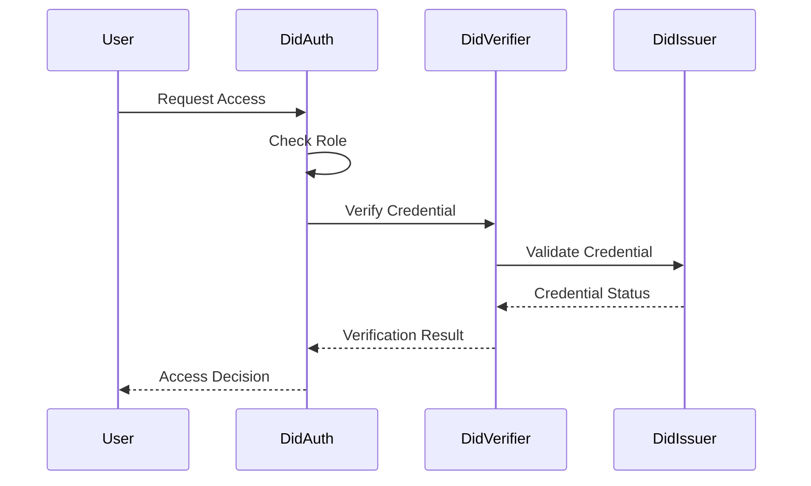
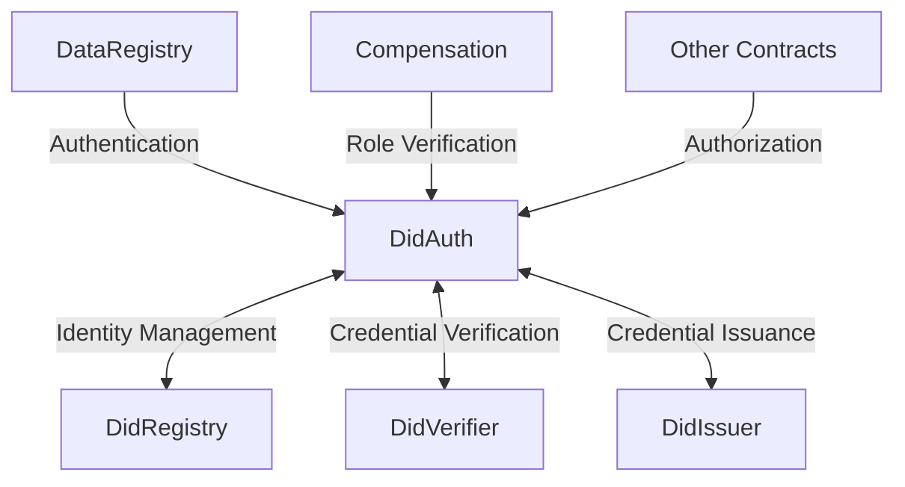
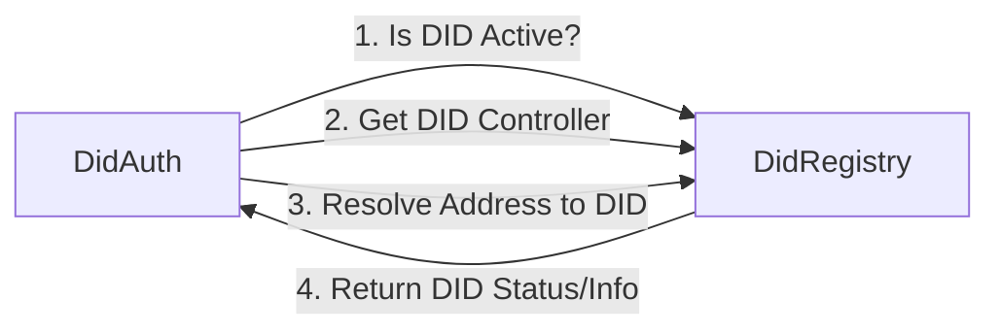
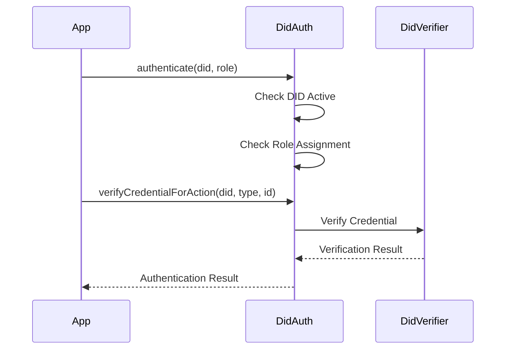
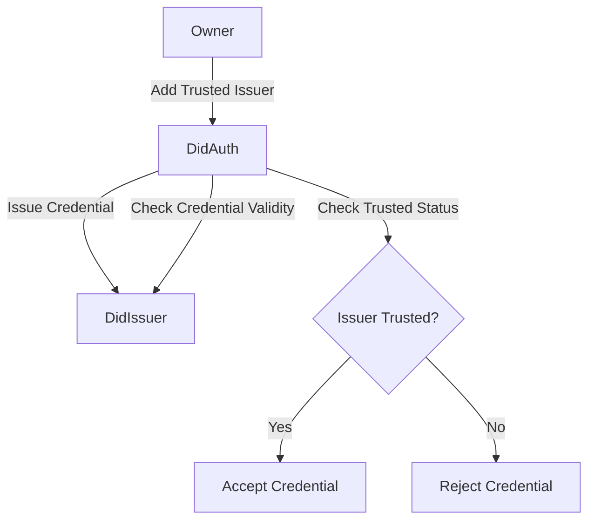
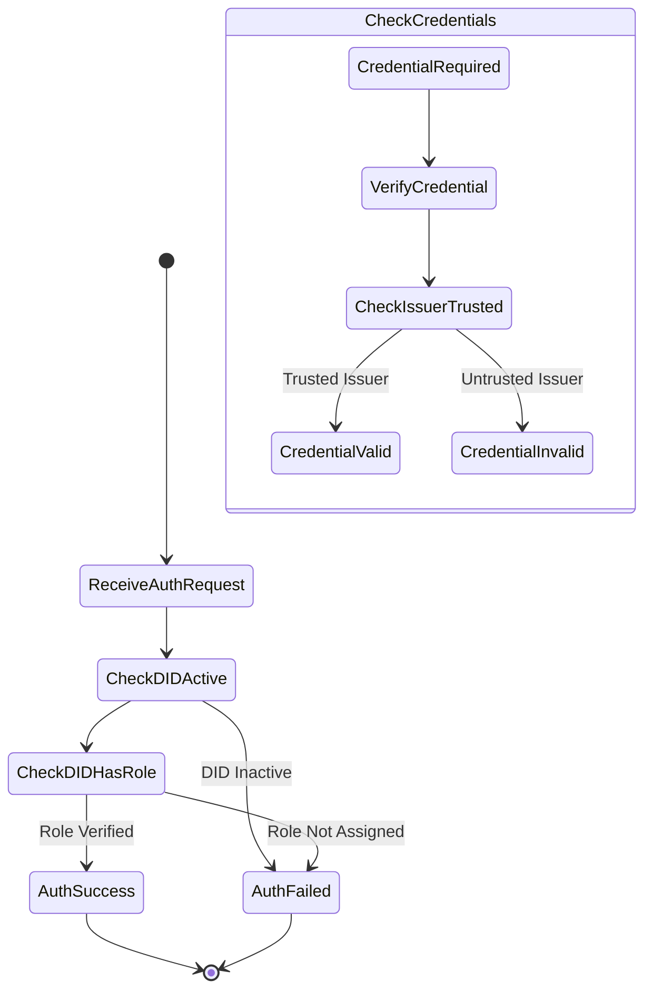

import HeaderTitle from '@/components/title';

<HeaderTitle
  title="LEDUP - DidAuth Contract"
  source="https://github.com/LED-UP/LED-UP-SMART-CONTRACTS/tree/main/contracts"
/>
---


**Version:** 1.0.0  
**Last Updated:** March 2025  
**Status:** Production

## Overview

The DidAuth contract is the identity and authentication cornerstone of the LEDUP ecosystem. It implements Decentralized Identifier (DID) based authentication and authorization with credential verification, enabling secure role-based access control across the platform.

This contract ensures that only authenticated and authorized entities can interact with sensitive health data, maintaining compliance with privacy requirements while enabling the secure sharing of health information.

## Key Features

### DID-Based Authentication

The DidAuth contract implements authentication using DIDs instead of traditional addresses:



- **DID Resolution**: Maps blockchain addresses to DIDs
- **Authentication Logic**: Verifies DID existence and status
- **Role-Based Control**: Manages role assignments and authorization checks
- **Cross-Contract Verification**: Provides authentication services to other contracts

### Role Management

The contract implements a comprehensive role management system:



- **Predefined Roles**: Includes essential roles like Producer, Consumer, Provider, etc.
- **Role Assignment**: Grants or revokes roles to DIDs
- **Role Verification**: Validates if a DID has specific roles
- **Role Querying**: Retrieves all roles assigned to a DID or address

### Credential Verification

The contract implements credential verification for enhanced security:



- **Credential Types**: Maps credential types to specific roles
- **Trusted Issuers**: Manages a registry of trusted credential issuers
- **Verification Logic**: Validates credentials against issuer records
- **Role Requirements**: Associates required credential types with roles

### Multi-Contract Integration

The DidAuth contract serves as the authentication hub for the LEDUP platform:



## Role Definitions

The DidAuth contract defines the following roles:

| Role                 | Description                              | Access Level |
| -------------------- | ---------------------------------------- | ------------ |
| `DEFAULT_ADMIN_ROLE` | System-level administrative role         | Highest      |
| `ADMIN_ROLE`         | Platform administrators                  | High         |
| `OPERATOR_ROLE`      | Day-to-day operation managers            | Medium-High  |
| `PRODUCER_ROLE`      | Health data producers/owners             | Medium       |
| `CONSUMER_ROLE`      | Health data consumers/requestors         | Medium       |
| `PROVIDER_ROLE`      | Healthcare providers with special access | Medium-High  |
| `ISSUER_ROLE`        | Credential issuers                       | High         |
| `VERIFIER_ROLE`      | Credential verifiers                     | Medium-High  |

## Credential Types

The contract defines the following credential types:

| Credential Type       | Description                          | Required For  |
| --------------------- | ------------------------------------ | ------------- |
| `PRODUCER_CREDENTIAL` | Validates data producer status       | PRODUCER_ROLE |
| `CONSUMER_CREDENTIAL` | Validates data consumer status       | CONSUMER_ROLE |
| `PROVIDER_CREDENTIAL` | Validates healthcare provider status | PROVIDER_ROLE |

## Interaction with Other Contracts

### DidRegistry Integration



The DidAuth contract interacts with the DidRegistry for:

- Verifying if DIDs exist and are active
- Resolving addresses to their associated DIDs
- Getting controller information for DIDs

### DidVerifier Integration



The DidAuth contract uses DidVerifier for:

- Validating credentials presented for authentication
- Checking credential validity and status
- Verifying credential-role mapping

### DidIssuer Integration



The DidAuth contract integrates with DidIssuer for:

- Issuing new credentials to DIDs
- Checking if credentials are valid
- Managing trusted issuers for credential types

## Authentication Flow

The following diagram illustrates the authentication flow in the DidAuth contract:



## Authorization Patterns

The DidAuth contract supports several authorization patterns:

1. **Simple Role Check**

   ```solidity
   require(didAuth.authenticate(did, didAuth.PRODUCER_ROLE()), "Not authorized");
   ```

2. **Multiple Role Verification**

   ```solidity
   bytes32[] memory roles = new bytes32[](2);
   roles[0] = didAuth.PRODUCER_ROLE();
   roles[1] = didAuth.PROVIDER_ROLE();

   bytes32[] memory credentialIds = new bytes32[](2);
   credentialIds[0] = producerCredentialId;
   credentialIds[1] = providerCredentialId;

   require(didAuth.hasRequiredRolesAndCredentials(did, roles, credentialIds), "Not authorized");
   ```

3. **Credential-Specific Authorization**
   ```solidity
   require(didAuth.verifyCredentialForAction(did, "ProducerCredential", credentialId), "Invalid credential");
   ```

## Contract Events

The DidAuth contract emits the following events:

- **RoleGranted**: When a role is granted to a DID
- **RoleRevoked**: When a role is revoked from a DID
- **AuthenticationSuccessful**: When a DID successfully authenticates for a role
- **AuthenticationFailed**: When authentication fails for a DID and role
- **CredentialVerified**: When a credential is successfully verified
- **CredentialVerificationFailed**: When credential verification fails

## Administrative Functions

The DidAuth contract includes administrative functions accessible only to the contract owner:

- **setTrustedIssuer**: Manage trusted issuers for credential types
- **setRoleRequirement**: Define credential requirements for roles
- **revokeDidRole**: Remove roles from DIDs
- **issueCredential**: Issue credentials to DIDs

## Integration Patterns

### For Smart Contracts

Other contracts can integrate with DidAuth using:

```solidity
// In contract constructor
DidAuth public didAuth;

constructor(address _didAuthAddress) {
    didAuth = DidAuth(_didAuthAddress);
}

// In function that requires authentication
modifier onlyProducer() {
    string memory callerDid = didAuth.getDidFromAddress(msg.sender);
    if (!didAuth.authenticate(callerDid, didAuth.PRODUCER_ROLE())) {
        revert Unauthorized();
    }
    _;
}
```

### For Applications

Applications can integrate with DidAuth through contract calls:

```typescript
// Check if user has producer role
const didAuthContract = new ethers.Contract(didAuthAddress, DidAuthABI, provider);

const userDid = await didAuthContract.getDidFromAddress(userAddress);
const hasProducerRole = await didAuthContract.authenticate(userDid, await didAuthContract.PRODUCER_ROLE());

if (hasProducerRole) {
  // Allow producer-specific actions
}
```

## Security Considerations

The DidAuth contract implements several security measures:

1. **Role Separation**: Clear separation of concerns between different roles
2. **Credential Verification**: Multi-factor authentication through credentials
3. **Trusted Issuers**: Only trusted entities can issue valid credentials
4. **Active DID Check**: Verifies DIDs are active before authentication
5. **Owner Safeguards**: Administrative functions restricted to contract owner

## Summary

The DidAuth contract is the identity backbone of the LEDUP platform, providing:

1. **Secure Authentication**: Based on decentralized identifiers
2. **Fine-Grained Authorization**: Through role-based access control
3. **Credential Verification**: Additional security layer beyond basic authentication
4. **Platform-Wide Integration**: Central authentication for all LEDUP contracts
5. **Flexible Role Management**: Adaptable to various access patterns

This contract ensures that the LEDUP ecosystem maintains strong identity guarantees while enabling appropriate access to health data according to well-defined roles and permissions.

---

**© 2025 LEDUP - All rights reserved.**
