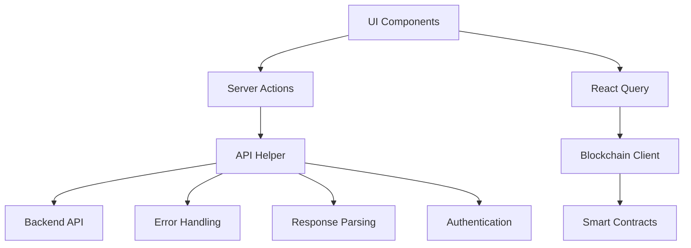

import HeaderTitle from '@/components/title';

<HeaderTitle
  title="API Integration & Services Documentation"
  source="https://github.com/LED-UP/LED-UP/tree/main/frontend"
/>
---


## Overview

This document describes how the LEDUP frontend application communicates with backend services. The application uses a combination of Next.js Server Actions and direct API calls to handle data fetching, mutations, and blockchain interactions.

## API Architecture

The LEDUP application implements a layered API architecture that separates concerns and provides a clean interface for data access:



## Server Actions

The application uses Next.js Server Actions for server-side API operations. These actions are defined in feature-specific `/actions` directories:

```typescript
// features/auth/actions/authenticate.ts
'use server';

import { revalidateTag } from 'next/cache';
import { API_ENDPOINTS } from '../../../lib/config';
import { AuthResponse, User } from '../types';
import { setAuthToken, setRefreshToken } from '../utils';
import { ApiError } from '@/lib/error';
import { fetchWithErrorHandling } from '@/lib/apiHelper';

/**
 * Server action to authenticate a user with their wallet address and signature
 */
export async function authenticate(address: string, signature: string): Promise<User> {
  if (!address || !signature) {
    throw new ApiError('Address and signature are required', 400);
  }

  try {
    const response = await fetchWithErrorHandling<AuthResponse>(API_ENDPOINTS.AUTH.AUTHENTICATE, {
      method: 'POST',
      body: JSON.stringify({ address, signature }),
      cache: 'no-store',
    });

    if (!response.success || !response.data) {
      throw new ApiError(response.message || 'Authentication failed', 401);
    }

    const { accessToken, refreshToken, expiresIn, user } = response.data;

    // Store tokens in cookies
    await setAuthToken(accessToken, expiresIn);
    await setRefreshToken(refreshToken);

    // Revalidate auth-related cache
    revalidateTag('auth');

    return user;
  } catch (error) {
    if (error instanceof ApiError) {
      throw error;
    }

    throw new ApiError(error instanceof Error ? error.message : 'Authentication failed', 401);
  }
}
```

## API Helper

The application implements a centralized API helper function for standardized fetch operations:

```typescript
// lib/apiHelper.ts
import { ApiResponse } from '@/types/api';
import { ApiError } from '@/lib/error';

/**
 * Fetch wrapper with error handling
 */
export async function fetchWithErrorHandling<T>(url: string, options?: RequestInit): Promise<ApiResponse<T>> {
  try {
    // Ensure headers are properly formatted
    const headers = {
      'Content-Type': 'application/json',
      ...(options?.headers || {}),
    };

    const response = await fetch(url, {
      ...options,
      headers,
      next: { tags: ['auth'] },
    });

    // Handle empty responses
    const text = await response.text();

    let data: ApiResponse<T>;

    try {
      data = text ? JSON.parse(text) : { success: false, message: 'Empty response' };
    } catch (parseError) {
      throw new ApiError(`Failed to parse response: ${text.substring(0, 100)}`, response.status);
    }

    if (!response.ok) {
      throw new ApiError(data.message || 'An error occurred', response.status);
    }

    // If the response doesn't have the expected format, wrap it in our standard format
    if (data.success === undefined) {
      return {
        success: true,
        data: data as unknown as T,
        message: 'Success',
      };
    }

    return data as ApiResponse<T>;
  } catch (error) {
    console.error('Fetch error:', error);

    if (error instanceof ApiError) {
      throw error;
    }

    throw new ApiError(error instanceof Error ? error.message : 'An unknown error occurred');
  }
}
```

## Response Format

The application uses a standardized API response format:

```typescript
// types/api.ts
export interface ApiResponse<T = any> {
  success: boolean;
  data?: T;
  message?: string;
  error?: string;
}
```

## Error Handling

The application implements a custom `ApiError` class for handling API errors:

```typescript
// lib/error.ts
export class ApiError extends Error {
  statusCode: number;

  constructor(message: string, statusCode = 500) {
    super(message);
    this.name = 'ApiError';
    this.statusCode = statusCode;
  }
}
```

Server actions handle errors by catching them and transforming them into appropriate ApiError instances.

## API Endpoints Configuration

The application centralizes API endpoint definitions:

```typescript
// lib/config.ts
export const API_ENDPOINTS = {
  AUTH: {
    AUTHENTICATE: `${API_BASE_URL}/auth/authenticate`,
    REFRESH: `${API_BASE_URL}/auth/refresh`,
    LOGOUT: `${API_BASE_URL}/auth/logout`,
    GENERATE_CHALLENGE: `${API_BASE_URL}/auth/challenge`,
  },
  DID: {
    CREATE: `${API_BASE_URL}/did/create`,
    RESOLVE: `${API_BASE_URL}/did/resolve`,
    UPDATE: `${API_BASE_URL}/did/update`,
    DEACTIVATE: `${API_BASE_URL}/did/deactivate`,
  },
  // Other endpoint categories
};
```

## Authentication Integration

The application handles authentication through specialized server actions:

```typescript
// Example actions for authentication flows
export async function generateChallenge(address: string): Promise<string>;
export async function authenticate(address: string, signature: string): Promise<User>;
export async function refreshToken(): Promise<{ accessToken: string; expiresIn: number }>;
export async function logout(): Promise<void>;
```

## Data Registry Integration

The application communicates with the data registry through server actions:

```typescript
// Example data registry actions
export async function registerPatientData(data: PatientData): Promise<{ transactionHash: string }>;
export async function getPatientData(did: string): Promise<PatientData[]>;
```

## Blockchain Service Integration

For blockchain interactions, the application uses a combination of:

1. **Direct Contract Interactions**: Using Wagmi hooks
2. **Server Actions**: For operations that require server-side processing
3. **API Endpoints**: For complex operations or those requiring additional security

```typescript
// Example of blockchain service integration through server actions
export async function registerDid(
  did: string,
  document: string,
  publicKey: string
): Promise<{ transactionHash: string }>;
```

## caching Mechanisms

The application leverages Next.js built-in caching mechanisms:

```typescript
// Example of cache revalidation in server actions
revalidateTag('auth');
```

React Query is used for client-side caching with appropriate configuration for different data types:

```typescript
// Example of React Query configuration
const queryClient = new QueryClient({
  defaultOptions: {
    queries: {
      staleTime: 1000 * 60 * 5, // 5 minutes
      cacheTime: 1000 * 60 * 30, // 30 minutes
    },
  },
});
```

## API Request Flow

1. **Component Request**: UI component calls a server action or React Query hook
2. **Server Action Processing**: Server action performs validation and authorization
3. **API Communication**: Server action communicates with backend API
4. **Response Handling**: Response is parsed and validated
5. **Error Handling**: Errors are caught and transformed
6. **State Update**: Data is returned to the component or cached

## Best Practices

- Use server actions for operations that require server-side processing
- Use React Query for client-side data fetching and caching
- Implement proper error handling and validation
- Utilize appropriate caching strategies
- Centralize API endpoint definitions
- Follow a consistent naming convention for API-related functions

---

**Last Updated:** [Current Date]  
**Contact:** [Contact Information]
