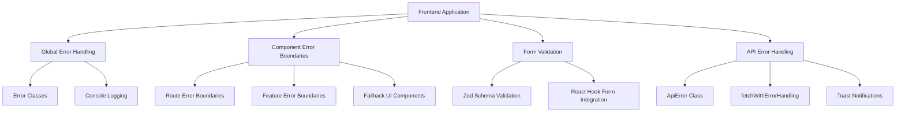

import HeaderTitle from '@/components/title';

<HeaderTitle
  title="Error Handling & Validation Documentation"
  source="https://github.com/LED-UP/LED-UP/tree/main/frontend"
/>
---


## Overview

This document describes the error handling and validation strategies used in the LEDUP frontend application. It covers error boundaries, form validation, API error handling, and user feedback mechanisms.

## Error Handling Architecture

The LEDUP application implements a comprehensive error handling strategy that addresses client-side errors, server-side errors, network issues, and validation errors:



## Custom Error Classes

### ApiError Class

The application uses a custom `ApiError` class for standardized API error handling:

```typescript
// lib/error.ts
export class ApiError extends Error {
  status: number;

  constructor(message: string, status: number = 500) {
    super(message);
    this.name = 'ApiError';
    this.status = status;
  }
}
```

## API Error Handling

### Centralized Error Handling

The application implements a centralized error handling utility for API requests:

```typescript
// lib/apiHelper.ts
import { ApiResponse } from '@/types/api';
import { ApiError } from '@/lib/error';

export async function fetchWithErrorHandling<T>(url: string, options?: RequestInit): Promise<ApiResponse<T>> {
  try {
    // Ensure headers are properly formatted
    const headers = {
      'Content-Type': 'application/json',
      ...(options?.headers || {}),
    };

    const response = await fetch(url, {
      ...options,
      headers,
      next: { tags: ['auth'] },
    });

    // Handle empty responses
    const text = await response.text();

    let data: ApiResponse<T>;

    try {
      data = text ? JSON.parse(text) : { success: false, message: 'Empty response' };
    } catch (parseError) {
      throw new ApiError(`Failed to parse response: ${text.substring(0, 100)}`, response.status);
    }

    if (!response.ok) {
      throw new ApiError(data.message || 'An error occurred', response.status);
    }

    // If the response doesn't have the expected format, wrap it in our standard format
    if (data.success === undefined) {
      return {
        success: true,
        data: data as unknown as T,
        message: 'Success',
      };
    }

    return data as ApiResponse<T>;
  } catch (error) {
    console.error('Fetch error:', error);

    if (error instanceof ApiError) {
      throw error;
    }

    throw new ApiError(error instanceof Error ? error.message : 'An unknown error occurred');
  }
}
```

### Feature-Specific Error Handling

The application also implements feature-specific error handling utilities:

```typescript
// features/data-registry/utils/api.ts
import { ApiError } from '@/lib/error';

export async function fetchWithErrorHandling<T = any>(url: string, options?: RequestInit): Promise<ApiResponse<T>> {
  try {
    const response = await fetch(url, {
      ...options,
      headers: {
        'Content-Type': 'application/json',
        ...options?.headers,
      },
    });

    if (!response.ok) {
      const errorData = await response.json().catch(() => ({}));
      throw new ApiError(errorData.message || `Request failed with status ${response.status}`, response.status);
    }

    const data = await response.json();
    return data as ApiResponse<T>;
  } catch (error) {
    if (error instanceof ApiError) {
      throw error;
    }

    console.error('API request error:', error);
    throw new ApiError(error instanceof Error ? error.message : 'An unexpected error occurred', 500);
  }
}
```

## Error Boundaries

The application uses React Error Boundaries to isolate errors at the component level:

```tsx
// app/(patient)/patient-records/page.tsx
import { ErrorBoundary } from 'react-error-boundary';

// Error fallback
const ErrorFallback = ({ error, resetErrorBoundary }: { error: Error; resetErrorBoundary: () => void }) => (
  <div className="flex flex-col items-center justify-center h-[70vh] p-6 text-center">
    <h2 className="text-2xl font-bold text-red-600 mb-4">Something went wrong</h2>
    <p className="text-gray-700 dark:text-gray-300 mb-6 max-w-md">{error.message}</p>
    <button
      onClick={resetErrorBoundary}
      className="px-4 py-2 bg-primary text-white rounded-md hover:bg-primary/90 transition-colors"
    >
      Try again
    </button>
  </div>
);

const PatientRecordsRoute = () => {
  return (
    <ErrorBoundary
      FallbackComponent={ErrorFallback}
      onReset={() => window.location.reload()}
      onError={(error) => {
        console.error('Patient Records Error:', error);
      }}
    >
      <ProtectedRoute redirectTo="/auth/signin">
        <ToasterWrapper>
          <Suspense fallback={<LoadingFallback />}>
            <PatientRecordsWrapper />
          </Suspense>
        </ToasterWrapper>
      </ProtectedRoute>
    </ErrorBoundary>
  );
};
```

## Form Validation

### Schema-Based Validation with Zod

The application uses Zod for form validation across different features:

```typescript
// features/compensation/schema/payment-form.schema.ts
import { z } from 'zod';

export const PaymentFormSchema = z.object({
  recordId: z.string().min(1, 'Record ID is required').trim(),

  producerAddress: z
    .string()
    .min(1, 'Producer address is required')
    .regex(/^0x[a-fA-F0-9]{40}$/, 'Invalid Ethereum address format')
    .transform((val) => val.toLowerCase()),

  dataSize: z
    .string()
    .min(1, 'Data size is required')
    .refine((val) => !isNaN(Number(val)), {
      message: 'Data size must be a valid number',
    })
    .refine((val) => Number(val) > 0, {
      message: 'Data size must be greater than 0',
    })
    .transform((val) => Number(val)),
});
```

### Nested Form Validation

The application implements nested form validation using Zod's `superRefine` method:

```typescript
// features/circom/components/AgeVerifier.tsx
const formSchema = z
  .object({
    verificationType: z.enum(['1', '2', '3']),
    age: z.coerce.number().min(0).max(120).optional(),
    birthDate: z
      .date()
      .refine((date) => date <= new Date(), {
        message: 'Birth date must be in the past',
      })
      .refine(
        (date) => {
          const year = date.getFullYear();
          return year >= 1900 && year <= 2199;
        },
        {
          message: 'Birth year must be between 1900 and 2199',
        }
      )
      .optional(),
    threshold: z.coerce.number().min(0).max(120),
  })
  .superRefine((data, ctx) => {
    // Conditional validation logic based on verification type
    if (data.verificationType === '1' && data.birthDate === undefined) {
      ctx.addIssue({
        code: z.ZodIssueCode.custom,
        message: 'Birth date is required for simple age verification',
        path: ['birthDate'],
      });
    }

    // Additional conditional validations...
  });
```

### React Hook Form Integration

The application integrates Zod with React Hook Form for form management and validation:

```tsx
// Example usage with React Hook Form
import { useForm } from 'react-hook-form';
import { zodResolver } from '@hookform/resolvers/zod';

type FormValues = z.infer<typeof formSchema>;

const SomeFormComponent = () => {
  const form = useForm<FormValues>({
    resolver: zodResolver(formSchema),
    defaultValues: {
      verificationType: '1',
      threshold: '18',
    },
  });

  // Form handling logic
};
```

## User Feedback Mechanisms

### Toast Notifications

The application implements a custom toast hook for consistent user feedback:

```typescript
// hooks/use-sonner.ts
import { toast as sonnerToast } from 'sonner';

const useSonner = () => {
  const toast = {
    default: (title: string, options?: ToastProps) => {
      return sonnerToast(title, {
        ...options,
        classNames: {
          ...defaultClassNames,
          ...getTypeClassNames(),
          ...options?.classNames,
        },
      });
    },

    success: (title: string, options?: ToastProps) => {
      return sonnerToast.success(title, {
        ...options,
        classNames: {
          ...defaultClassNames,
          ...getTypeClassNames('success'),
          ...options?.classNames,
        },
      });
    },

    error: (title: string, options?: ToastProps) => {
      return sonnerToast.error(title, {
        ...options,
        classNames: {
          ...defaultClassNames,
          ...getTypeClassNames('error'),
          ...options?.classNames,
        },
      });
    },

    // Additional toast methods...
  };

  return { toast };
};
```

### Error Toast Examples

The application uses toast notifications for providing feedback on errors:

```typescript
// Example usage in features
try {
  // Operation logic
} catch (error) {
  console.error('Error updating record with IPFS:', error);
  const parsedError = parseDataRegistryError(error);
  if (parsedError) {
    throw new Error(parsedError.message);
  }
  throw new Error('Failed to update record with IPFS');
}

// In mutation handling
onError: (error: Error) => {
  toast.error(`Failed to update record: ${error.message}`);
};
```

## Blockchain Error Handling

The application implements specialized error handling for blockchain interactions:

```typescript
// helpers/error-handler/BaseErrorHandler.ts
export abstract class BaseErrorHandler {
  protected contract: Contract;

  constructor(contract: Contract) {
    this.contract = contract;
  }

  public parseError(error: any): ParsedContractError {
    try {
      // Error parsing logic for blockchain errors

      return {
        name: customError || errorType,
        args: revertReason ? { reason: revertReason } : {},
        message: revertReason || errorMessage,
        originalError: error,
      };
    } catch (parseError) {
      // If all parsing fails, return a generic error
      return {
        name: CommonErrorTypes.UNKNOWN,
        args: {},
        message: error.message || 'Unknown error',
        originalError: error,
      };
    }
  }

  protected identifyErrorType(errorMessage: string): CommonErrorTypes {
    const lowerCaseMessage = errorMessage.toLowerCase();

    for (const [pattern, errorType] of Object.entries(ERROR_PATTERNS)) {
      if (lowerCaseMessage.includes(pattern.toLowerCase())) {
        return errorType;
      }
    }

    return CommonErrorTypes.UNKNOWN;
  }

  public getUserFriendlyMessage(error: any): string {
    const parsedError = this.parseError(error);
    return parsedError.message || 'An error occurred while processing your transaction';
  }

  // Additional methods...
}
```

## Error Handling in Registration Flow

The application implements domain-specific error handling for the registration flow:

```typescript
// features/registration/components/UserRegistrationForm.tsx
try {
  // Registration logic
} catch (error: any) {
  console.error('Error registering DID:', error);

  // Check for specific error messages
  if (error.message?.includes('already registered') || error.message?.includes('DIDAlreadyRegistered')) {
    setDidExists(true);
    setDid(generateDid());
    toast.info('DID already exists. Proceeding to authentication.');
    setCurrentStep(RegistrationStep.AUTHENTICATE_DID);
  } else if (error.message?.includes('unauthorized') || error.message?.includes('Unauthorized')) {
    toast.error('Your wallet address is already associated with a different DID');
    setError('Your wallet address is already associated with a different DID. Please use a different wallet.');
  } else {
    toast.error(error.message || 'Failed to register DID');
    setError(error.message || 'Unknown error');
  }
} finally {
  setIsProcessing(false);
}
```

## Best Practices

### Error Handling Guidelines

1. **Use ApiError for consistent error representation**:

   ```typescript
   throw new ApiError('Meaningful error message', statusCode);
   ```

2. **Always include error handling in async operations**:

   ```typescript
   try {
     // async operation
   } catch (error) {
     // handle error
   }
   ```

3. **Provide user-friendly error messages**:

   ```typescript
   toast.error('Unable to complete your request', {
     description: 'Please try again or contact support',
   });
   ```

4. **Log detailed error information to console**:

   ```typescript
   console.error('Error context:', {
     operation: 'updateRecord',
     details: error,
   });
   ```

5. **Use Error Boundaries for component-level isolation**:

   ```tsx
   <ErrorBoundary FallbackComponent={ErrorFallback}>
     <ComponentThatMightError />
   </ErrorBoundary>
   ```

6. **Implement domain-specific error handling**:
   ```typescript
   if (error.message.includes('insufficient funds')) {
     // handle insufficient funds error
   } else if (error.message.includes('unauthorized')) {
     // handle unauthorized error
   } else {
     // handle generic error
   }
   ```

## Error Reporting

The application logs errors to the console:

```typescript
console.error('API request error:', error);
```

## Validation Best Practices

1. **Use Zod for schema validation**:

   ```typescript
   const schema = z.object({
     field: z.string().min(1, 'Field is required'),
   });
   ```

2. **Transform data during validation when needed**:

   ```typescript
   field: z.string().transform((val) => val.toLowerCase().trim()),
   ```

3. **Use custom refinements for complex validation logic**:

   ```typescript
   z.string().refine((val) => isValidEthereumAddress(val), {
     message: 'Invalid Ethereum address',
   }),
   ```

4. **Implement multi-field validation with superRefine**:

   ```typescript
   schema.superRefine((data, ctx) => {
     if (data.fieldA && !data.fieldB) {
       ctx.addIssue({
         code: z.ZodIssueCode.custom,
         message: 'Field B is required when Field A is provided',
         path: ['fieldB'],
       });
     }
   }),
   ```

5. **Extract type information from schemas**:
   ```typescript
   type FormValues = z.infer<typeof formSchema>;
   ```

---

**Last Updated:** May 2024  
**Contact:** LED-UP Development Team
