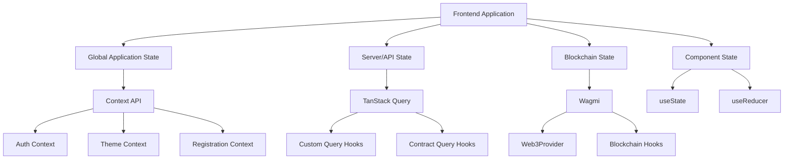

import HeaderTitle from '@/components/title';

<HeaderTitle
  title="State Management Documentation"
  source="https://github.com/LED-UP/LED-UP/tree/main/frontend"
/>
---


## Overview

This document describes the state management approaches used in the LEDUP frontend application. It covers the global and local state management patterns, context API usage, and data flow architecture.

## State Management Architecture

The LEDUP frontend uses a hybrid state management approach that combines:

1. **React Context API**: For global application state (auth, theme, registration flow)
2. **TanStack Query (React Query)**: For server state and data fetching
3. **Wagmi**: For blockchain state management
4. **Local component state**: For UI-specific state

This architecture separates concerns based on the nature of the state:



## Global State Management

### Context API Implementation

The application uses the React Context API for managing global state that needs to be accessed by multiple components.

#### Theme Context

The application implements theme management using Next.js Themes:

```tsx
// theme-provider.tsx
'use client';

import * as React from 'react';
import { ThemeProvider as NextThemesProvider } from 'next-themes';
import { type ThemeProviderProps } from 'next-themes/dist/types';

export function ThemeProvider({ children, ...props }: ThemeProviderProps) {
  return (
    <NextThemesProvider attribute="class" defaultTheme="system" enableSystem {...props}>
      {children}
    </NextThemesProvider>
  );
}
```

#### Registration Context

The registration flow state is managed through a dedicated context:

```tsx
// registration-provider.tsx
'use client';

import { createContext, useContext, ReactNode, useState, useCallback } from 'react';
import { useAccount } from 'wagmi';

// Define the registration steps
export enum RegistrationStep {
  CONNECT_WALLET = 0,
  REGISTER_DID = 1,
  AUTHENTICATE_DID = 2,
  REGISTER_ROLE = 3,
  REGISTER_PRODUCER = 4, // Only for producers
  COMPLETE = 5,
}

// Define the registration context type
interface RegistrationContextType {
  currentStep: RegistrationStep;
  userType: 'consumer' | 'producer';
  did: string | null;
  isWalletConnected: boolean;
  isAuthenticated: boolean;
  isRegistered: boolean;
  isProducerRegistered: boolean;
  error: string | null;
  // Methods for updating state
  setUserType: (type: 'consumer' | 'producer') => void;
  setCurrentStep: (step: RegistrationStep) => void;
  setDid: (did: string | null) => void;
  setIsAuthenticated: (isAuthenticated: boolean) => void;
  setIsRegistered: (isRegistered: boolean) => void;
  setIsProducerRegistered: (isRegistered: boolean) => void;
  setError: (error: string | null) => void;
  nextStep: () => void;
  prevStep: () => void;
  resetRegistration: () => void;
}

// Create the context
const RegistrationContext = createContext<RegistrationContextType>({
  /* default values */
});

// Provider component
export function RegistrationProvider({ children }: { children: ReactNode }) {
  // State implementation
  const { isConnected } = useAccount();
  const [currentStep, setCurrentStep] = useState<RegistrationStep>(RegistrationStep.CONNECT_WALLET);
  const [userType, setUserType] = useState<'consumer' | 'producer'>('consumer');
  // Other state variables...

  // Context methods
  const nextStep = useCallback(() => {
    if (currentStep < RegistrationStep.COMPLETE) {
      setCurrentStep((prev) => prev + 1);
    }
  }, [currentStep]);

  // Other methods...

  return <RegistrationContext.Provider value={contextValue}>{children}</RegistrationContext.Provider>;
}

// Hook to use the registration context
export function useRegistration() {
  return useContext(RegistrationContext);
}
```

#### AuthContext

Authentication state is managed through the AuthContext, which handles user authentication status, roles, and permissions.

## Server State Management

### TanStack Query (React Query)

The application uses TanStack Query for managing server state, including data fetching, caching, and synchronization.

#### Custom Contract Query Hooks

The application implements factory functions to create reusable query hooks for contract interactions:

```tsx
// use-contract-query.ts
import { useQuery } from '@tanstack/react-query';
import { ContractName, ContractReadResponse } from '../features/data-registry/types';
import { getErrorHandler } from '../utils/contract-interaction';

/**
 * Factory function to create a contract query hook
 */
export function createContractQuery<TParams, TData = any>({
  queryFn,
  getQueryKey,
  contractName = ContractName.DataRegistry,
  enabled,
}: CreateContractQueryOptions<TParams, TData>) {
  return function useContractQuery(params: TParams) {
    const errorHandler = getErrorHandler(contractName);

    return useQuery<TData, Error>({
      queryKey: getQueryKey(params),
      queryFn: async () => {
        const response = await queryFn(params);

        if (!response.success) {
          throw new Error(response.error || 'Failed to fetch data');
        }

        return response.data as TData;
      },
      enabled: enabled ? enabled(params) : true,
    });
  };
}

/**
 * Factory function for simpler contract queries
 */
export function createSimpleContractQuery<TParam = string, TData = any>(
  queryFn: (param: TParam) => Promise<ContractReadResponse<TData>>,
  queryKeyPrefix: string,
  contractName = ContractName.DataRegistry
) {
  return createContractQuery<TParam, TData>({
    queryFn,
    getQueryKey: (param) => [queryKeyPrefix, param],
    contractName,
    enabled: (param) => !!param,
  });
}
```

#### Query Key Management

The application organizes query keys by feature domain to avoid key collisions:

```tsx
// Example of query key structure
export const queryKeys = {
  didRegistry: {
    did: 'did-registry-did',
    resolution: 'did-registry-resolution',
    // Other did registry related queries
  },
  dataRegistry: {
    dataset: 'data-registry-dataset',
    consent: 'data-registry-consent',
    // Other data registry related queries
  },
  // Other domains
};
```

## Blockchain State Management

### Wagmi Integration

The application uses Wagmi for blockchain state management, combining it with a custom Web3Provider:

```tsx
// web3-provider.tsx
'use client';

import * as React from 'react';
import { WagmiConfig, createConfig } from 'wagmi';
import { ConnectKitProvider, getDefaultConfig } from 'connectkit';
import { QueryClient, QueryClientProvider } from '@tanstack/react-query';
import { hardhat, sepolia } from 'wagmi/chains';

// Create query client
const queryClient = new QueryClient();

// Configure chains and providers
const chains = [sepolia, hardhat];

const config = createConfig(
  getDefaultConfig({
    walletConnectProjectId: process.env.NEXT_PUBLIC_WALLETCONNECT_PROJECT_ID || '',
    chains,
    appName: 'LED-UP',
    appDescription: 'LED-UP Web Application',
    appUrl: 'https://led-up.io',
    appIcon: 'https://led-up.io/logo.png',
  })
);

export function Web3Provider({ children }: { children: React.ReactNode }) {
  return (
    <WagmiConfig config={config}>
      <QueryClientProvider client={queryClient}>
        <ConnectKitProvider
          theme="auto"
          mode="dark"
          customTheme={
            {
              // Custom theme configuration
            }
          }
        >
          {children}
        </ConnectKitProvider>
      </QueryClientProvider>
    </WagmiConfig>
  );
}
```

### Wallet Connection

The application implements wallet connection through ConnectKit:

```tsx
// wallet-connect.tsx
'use client';

import { ConnectKitButton } from 'connectkit';
import { styled } from 'styled-components';

const StyledButton = styled.button`
  // Custom styling
`;

export function ConnectButton() {
  return (
    <ConnectKitButton.Custom>
      {({ isConnected, isConnecting, show, hide, address, ensName, chain }) => {
        return (
          <StyledButton onClick={show} className="bg-primary hover:bg-primary/90 text-primary-foreground">
            {isConnected ? `${address?.slice(0, 6)}...${address?.slice(-4)}` : 'Connect Wallet'}
          </StyledButton>
        );
      }}
    </ConnectKitButton.Custom>
  );
}
```

## Local State Management

### Component State

For component-specific state, the application uses React's built-in state management hooks:

1. **useState**: For simple state values
2. **useReducer**: For more complex state logic
3. **useEffect**: For state synchronization with side effects

```tsx
// Example of local component state
function ExampleComponent() {
  const [isOpen, setIsOpen] = useState(false);
  const [data, setData] = useState<Data[]>([]);

  // Using state with effects
  useEffect(() => {
    if (isOpen) {
      // Fetch data or perform side effects
    }
  }, [isOpen]);

  return (
    // Component UI
  );
}
```

## Data Flow Architecture

### Unidirectional Data Flow

The application follows React's unidirectional data flow pattern:

1. State changes trigger re-renders
2. Props flow down from parent to child components
3. Events flow up from child to parent components
4. Context provides state without prop drilling

### Data Update Patterns

For updating data, the application uses these patterns:

1. **Context Updates**: For global state
2. **React Query Mutations**: For server state
3. **Wagmi Transactions**: For blockchain state
4. **Local State Setters**: For component state

## Best Practices

### When to Use Each Approach

1. **Context API**: Use for global application state that doesn't change frequently

   - Authentication state
   - Theme preferences
   - User preferences
   - Multi-step flow state

2. **TanStack Query**: Use for server state and data fetching

   - API data that needs caching
   - Data that requires background refreshing
   - Optimistic UI updates

3. **Wagmi**: Use for blockchain interactions

   - Wallet connection
   - Contract interactions
   - Transaction state

4. **Local State**: Use for UI-specific state
   - Form inputs
   - Component visibility
   - Temporary UI state

### Performance Considerations

1. **Context Splitting**: Split contexts to avoid unnecessary re-renders
2. **Memoization**: Use React.memo, useMemo, and useCallback to optimize rendering
3. **Query Configuration**: Configure React Query staleTime and cacheTime appropriately
4. **Selective Reading**: Read only the necessary parts of the state

## Last Updated

Date: [Current Date]

## Contact Information

For questions or updates to this documentation, contact the LEDUP frontend team.
