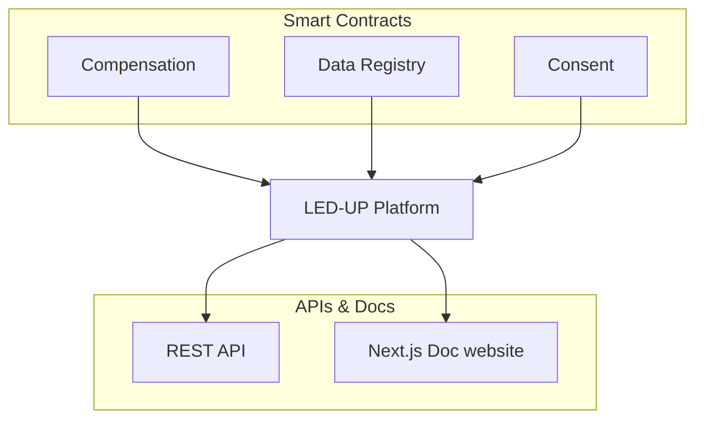

import HeaderTitle from '@/components/title';

<HeaderTitle title="Introduction" />

The LED-UP project provides a decentralized application & a full-fledge serverless APIs using Azure Function. This website
is used a first draft guide for developers to get started with the LED-UP solutions.{' '}

## LED-UP Components

## Quick Start

To start with LED-UP, you can get started from of the following

import Category from '@/components/category';

<Category /

>
