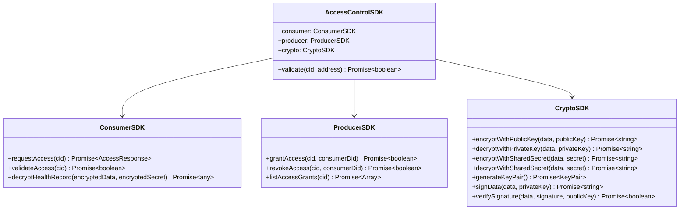

# Access Control SDK Documentation

**Package:** `@ledup/sdk`  
**Module:** `access`  
**Version:** 1.0.0

## Overview

The Access Control SDK provides a comprehensive set of tools for developers to integrate with the LEDUP access control functionality. This SDK simplifies the process of requesting, validating, and managing access to health data stored in the LEDUP system.



## Installation

```bash
npm install @ledup/sdk
```

## SDK Initialization

```typescript
import { LedupSDK } from '@ledup/sdk';

// Initialize the SDK with configuration
const sdk = new LedupSDK({
  apiEndpoint: 'https://api.ledup.io', // API endpoint
  privateKey: '0x123...456', // Optional: Your private key for signing
  provider: window.ethereum, // Optional: Web3 provider
  ipfsGateway: 'https://ipfs.infura.io', // Optional: IPFS gateway
  logLevel: 'error', // Optional: Logging level
});

// Access the access control module
const accessSDK = sdk.access;
```

## Core Modules

### Access Control Module

The Access Control module provides high-level access to validation functionality.

```typescript
// Check if a consumer has access to specific data
const hasAccess = await sdk.access.validate('QmX7DSMHMbH3UTrFAZ7NJ7GKcNNu93uZdYTmAZQ5ECz5Ag', '0x1234...5678');
```

### Consumer Module

The Consumer module provides functionality for data consumers to request and access health data.

```typescript
// Request access to specific health data
const { encryptedData, encryptedSharedSecret } = await sdk.access.consumer.requestAccess(
  'QmX7DSMHMbH3UTrFAZ7NJ7GKcNNu93uZdYTmAZQ5ECz5Ag'
);

// Decrypt the health record data
const healthRecord = await sdk.access.consumer.decryptHealthRecord(encryptedData, encryptedSharedSecret);

// Process the health record
console.log('Patient Name:', healthRecord.name);
console.log('Medical Condition:', healthRecord.condition);
```

### Producer Module

The Producer module provides functionality for data producers to manage access to their health data.

```typescript
// Grant access to a specific consumer
await sdk.access.producer.grantAccess(
  'QmX7DSMHMbH3UTrFAZ7NJ7GKcNNu93uZdYTmAZQ5ECz5Ag',
  'did:ethr:0x1234567890abcdef1234567890abcdef12345678'
);

// Revoke access from a specific consumer
await sdk.access.producer.revokeAccess(
  'QmX7DSMHMbH3UTrFAZ7NJ7GKcNNu93uZdYTmAZQ5ECz5Ag',
  'did:ethr:0x1234567890abcdef1234567890abcdef12345678'
);

// List all access grants for a specific resource
const accessGrants = await sdk.access.producer.listAccessGrants('QmX7DSMHMbH3UTrFAZ7NJ7GKcNNu93uZdYTmAZQ5ECz5Ag');

console.log('Access Grants:', accessGrants);
```

### Crypto Module

The Crypto module provides low-level cryptographic operations required for secure data access.

```typescript
// Generate a new key pair
const { publicKey, privateKey } = await sdk.access.crypto.generateKeyPair();

// Encrypt data with a public key
const encryptedData = await sdk.access.crypto.encryptWithPublicKey('Sensitive health data', publicKey);

// Decrypt data with a private key
const decryptedData = await sdk.access.crypto.decryptWithPrivateKey(encryptedData, privateKey);

// Sign data with a private key
const signature = await sdk.access.crypto.signData('Data to sign', privateKey);

// Verify a signature
const isValid = await sdk.access.crypto.verifySignature('Data to verify', signature, publicKey);
```

## API Reference

### Access Control Module

#### validate

Validates if a consumer has access to specific data.

```typescript
async validate(cid: string, address: string): Promise<boolean>
```

**Parameters:**

- `cid`: Content identifier of the data
- `address`: Consumer's Ethereum address

**Returns:**

- `Promise<boolean>`: True if the consumer has access, false otherwise

**Example:**

```typescript
const hasAccess = await sdk.access.validate(
  'QmX7DSMHMbH3UTrFAZ7NJ7GKcNNu93uZdYTmAZQ5ECz5Ag',
  '0x1234567890abcdef1234567890abcdef12345678'
);

if (hasAccess) {
  console.log('Access granted');
} else {
  console.log('Access denied');
}
```

### Consumer Module

#### requestAccess

Requests access to specific data.

```typescript
async requestAccess(cid: string): Promise<{
  encryptedData: string;
  encryptedSharedSecret: string;
}>
```

**Parameters:**

- `cid`: Content identifier of the data

**Returns:**

- `Promise<object>`: Object containing the encrypted data and the encrypted shared secret

**Example:**

```typescript
const { encryptedData, encryptedSharedSecret } = await sdk.access.consumer.requestAccess(
  'QmX7DSMHMbH3UTrFAZ7NJ7GKcNNu93uZdYTmAZQ5ECz5Ag'
);
```

#### decryptHealthRecord

Decrypts a health record using the encrypted data and shared secret.

```typescript
async decryptHealthRecord(
  encryptedData: string,
  encryptedSharedSecret: string
): Promise<any>
```

**Parameters:**

- `encryptedData`: Data encrypted with the shared secret
- `encryptedSharedSecret`: Shared secret encrypted with the consumer's public key

**Returns:**

- `Promise<any>`: Decrypted health record data

**Example:**

```typescript
const healthRecord = await sdk.access.consumer.decryptHealthRecord(encryptedData, encryptedSharedSecret);

console.log('Patient:', healthRecord.patient);
console.log('Diagnosis:', healthRecord.diagnosis);
```

### Producer Module

#### grantAccess

Grants access to a specific consumer for a specific resource.

```typescript
async grantAccess(cid: string, consumerDid: string): Promise<boolean>
```

**Parameters:**

- `cid`: Content identifier of the data
- `consumerDid`: DID of the consumer to grant access to

**Returns:**

- `Promise<boolean>`: True if access was granted successfully

**Example:**

```typescript
const success = await sdk.access.producer.grantAccess(
  'QmX7DSMHMbH3UTrFAZ7NJ7GKcNNu93uZdYTmAZQ5ECz5Ag',
  'did:ethr:0x1234567890abcdef1234567890abcdef12345678'
);
```

#### revokeAccess

Revokes access from a specific consumer for a specific resource.

```typescript
async revokeAccess(cid: string, consumerDid: string): Promise<boolean>
```

**Parameters:**

- `cid`: Content identifier of the data
- `consumerDid`: DID of the consumer to revoke access from

**Returns:**

- `Promise<boolean>`: True if access was revoked successfully

**Example:**

```typescript
const success = await sdk.access.producer.revokeAccess(
  'QmX7DSMHMbH3UTrFAZ7NJ7GKcNNu93uZdYTmAZQ5ECz5Ag',
  'did:ethr:0x1234567890abcdef1234567890abcdef12345678'
);
```

#### listAccessGrants

Lists all access grants for a specific resource.

```typescript
async listAccessGrants(cid: string): Promise<Array<{
  consumerDid: string;
  grantedAt: number;
  expiresAt: number;
  active: boolean;
}>>
```

**Parameters:**

- `cid`: Content identifier of the data

**Returns:**

- `Promise<Array>`: Array of access grant objects

**Example:**

```typescript
const accessGrants = await sdk.access.producer.listAccessGrants('QmX7DSMHMbH3UTrFAZ7NJ7GKcNNu93uZdYTmAZQ5ECz5Ag');

console.log('Access Grants:', accessGrants);
```

## Complete Integration Example

### React Application Example

```typescript
import React, { useState, useEffect } from 'react';
import { LedupSDK } from '@ledup/sdk';

// Initialize the SDK
const sdk = new LedupSDK({
  apiEndpoint: 'https://api.ledup.io',
  privateKey: localStorage.getItem('privateKey'), // Get from secure storage
});

function HealthRecordViewer({ recordCid, userDid }) {
  const [loading, setLoading] = useState(true);
  const [hasAccess, setHasAccess] = useState(false);
  const [healthRecord, setHealthRecord] = useState(null);
  const [error, setError] = useState(null);

  useEffect(() => {
    async function checkAndLoadRecord() {
      try {
        setLoading(true);

        // 1. Validate access
        const canAccess = await sdk.access.validate(recordCid, userDid);
        setHasAccess(canAccess);

        if (canAccess) {
          // 2. Request access to the data
          const { encryptedData, encryptedSharedSecret } = await sdk.access.consumer.requestAccess(recordCid);

          // 3. Decrypt the health record
          const record = await sdk.access.consumer.decryptHealthRecord(encryptedData, encryptedSharedSecret);

          setHealthRecord(record);
        }
      } catch (err) {
        console.error('Failed to load health record:', err);
        setError(err.message);
      } finally {
        setLoading(false);
      }
    }

    checkAndLoadRecord();
  }, [recordCid, userDid]);

  if (loading) {
    return <div>Loading health record...</div>;
  }

  if (error) {
    return <div>Error: {error}</div>;
  }

  if (!hasAccess) {
    return <div>You do not have access to this health record.</div>;
  }

  return (
    <div className="health-record">
      <h2>Health Record</h2>
      {healthRecord && (
        <div>
          <h3>Patient Information</h3>
          <p>Name: {healthRecord.name}</p>
          <p>ID: {healthRecord.id}</p>

          <h3>Medical Information</h3>
          <p>Diagnosis: {healthRecord.diagnosis}</p>
          <p>Treatment: {healthRecord.treatment}</p>

          {/* Render additional record details */}
        </div>
      )}
    </div>
  );
}

export default HealthRecordViewer;
```

## Error Handling

The SDK provides descriptive error messages for various failure scenarios:

```typescript
try {
  const result = await sdk.access.consumer.requestAccess(cid);
  // Process successful result
} catch (error) {
  if (error.message.includes('Access denied')) {
    // Handle access denied error
    console.error('You do not have permission to access this data');
  } else if (error.message.includes('Missing required parameters')) {
    // Handle invalid request error
    console.error('Invalid request: Missing required parameters');
  } else if (error.message.includes('Authentication failed')) {
    // Handle authentication error
    console.error('Authentication failed. Please check your credentials');
  } else {
    // Handle other errors
    console.error('An error occurred:', error.message);
  }
}
```

## Advanced Configuration

```typescript
const sdkConfig = {
  apiEndpoint: 'https://api.ledup.io',
  privateKey: '0x123...456',
  provider: window.ethereum,
  ipfsGateway: 'https://ipfs.infura.io',
  logLevel: 'debug',
  timeout: 30000, // Timeout in milliseconds
  retries: 3, // Number of retry attempts
  headers: {
    // Additional headers
    'X-Custom-Header': 'value',
  },
  cache: {
    // Cache configuration
    enabled: true,
    maxAge: 300, // Cache expiration in seconds
  },
};

const sdk = new LedupSDK(sdkConfig);
```

## Browser Support

The SDK is compatible with modern browsers that support the Web Crypto API:

- Chrome 37+
- Firefox 34+
- Safari 11+
- Edge 12+

For older browsers, polyfills may be required for certain cryptographic operations.
