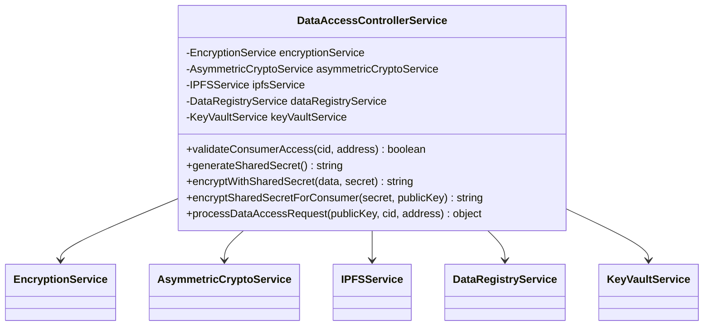

# Data Access Controller

**Component Type:** Service  
**Path:** `/services/access/data-access-controller.service.ts`

## Overview

The Data Access Controller service is the core component responsible for managing secure access to health data stored in the LEDUP system. It implements robust encryption, authentication, and authorization mechanisms to ensure that sensitive health information is shared securely and only with authorized parties.



## Dependencies

The service relies on several other services:

- **EncryptionService**: Handles symmetric encryption/decryption operations
- **AsymmetricCryptoService**: Handles public/private key cryptography
- **IPFSService**: Interacts with IPFS storage for data retrieval
- **DataRegistryService**: Interacts with the blockchain DataRegistry contract
- **KeyVaultService**: Manages secure storage of cryptographic keys

## Methods

### validateConsumerAccess

Validates if a consumer has access rights to specific data.

```typescript
async validateConsumerAccess(cid: string, address: string): Promise<boolean>
```

**Parameters:**

- `cid`: Content identifier of the data
- `address`: Consumer's Ethereum address

**Returns:**

- `Promise<boolean>`: True if the consumer has access, false otherwise

**Example Usage:**

```typescript
const hasAccess = await dataAccessController.validateConsumerAccess(
  'QmX7DSMHMbH3UTrFAZ7NJ7GKcNNu93uZdYTmAZQ5ECz5Ag',
  '0x1234567890abcdef1234567890abcdef12345678'
);

if (hasAccess) {
  // Proceed with data access
} else {
  // Handle access denied
}
```

### generateSharedSecret

Generates a cryptographically secure shared secret for data encryption.

```typescript
async generateSharedSecret(): Promise<string>
```

**Returns:**

- `Promise<string>`: Generated secure shared secret

**Implementation Details:**

- Uses the encryption service to generate a secure random key
- Stores the key securely with expiration time (24 hours)
- Throws an error if key generation fails

### encryptWithSharedSecret

Encrypts data using a provided shared secret.

```typescript
async encryptWithSharedSecret(data: any, secret: string): Promise<string>
```

**Parameters:**

- `data`: Data to encrypt (object or string)
- `secret`: Shared secret for encryption

**Returns:**

- `Promise<string>`: Encrypted data

**Implementation Details:**

- Converts data to string if it's not already
- Uses symmetric encryption with the provided key

### encryptSharedSecretForConsumer

Encrypts a shared secret for a specific consumer using their public key.

```typescript
async encryptSharedSecretForConsumer(secret: string, publicKey: string): Promise<string>
```

**Parameters:**

- `secret`: Shared secret to encrypt
- `publicKey`: Consumer's public key

**Returns:**

- `Promise<string>`: Encrypted shared secret

**Security Considerations:**

- Uses asymmetric encryption to securely share the secret
- Only the holder of the corresponding private key can decrypt

### processDataAccessRequest

Processes a complete data access request from a consumer.

```typescript
async processDataAccessRequest(
  publicKey: string,
  cid: string,
  address: string
): Promise<{ encryptedData: string; encryptedSharedSecret: string }>
```

**Parameters:**

- `publicKey`: Consumer's public key
- `cid`: Content identifier of the requested data
- `address`: Consumer's Ethereum address

**Returns:**

- Object containing:
  - `encryptedData`: Data encrypted with the shared secret
  - `encryptedSharedSecret`: Shared secret encrypted with consumer's public key

**Flow:**

1. Validates consumer access rights
2. Fetches and decrypts data from IPFS
3. Generates a new shared secret
4. Re-encrypts data with the shared secret
5. Encrypts the shared secret with consumer's public key
6. Returns both encrypted data and encrypted shared secret

**Error Handling:**

- Throws 'Access denied' if consumer lacks permissions
- Throws appropriate errors for other failure scenarios

## Security Considerations

1. **Key Management**: Shared secrets are ephemeral and stored securely with expiration
2. **Access Control**: On-chain verification ensures data is only accessible to authorized parties
3. **Encryption**: Multiple layers of encryption protect both data and keys
4. **Error Handling**: Careful error handling prevents information leakage

## Integration Examples

### Complete Data Access Flow

```typescript
// 1. Validate access first (optional pre-check)
const hasAccess = await dataAccessController.validateConsumerAccess(cid, consumerAddress);

if (hasAccess) {
  try {
    // 2. Process the full access request
    const { encryptedData, encryptedSharedSecret } = await dataAccessController.processDataAccessRequest(
      consumerPublicKey,
      cid,
      consumerAddress
    );

    // 3. Return encrypted data and key to consumer
    return {
      success: true,
      data: {
        encryptedData,
        encryptedSharedSecret,
      },
    };
  } catch (error) {
    // Handle errors appropriately
  }
} else {
  // Handle access denied
}
```
