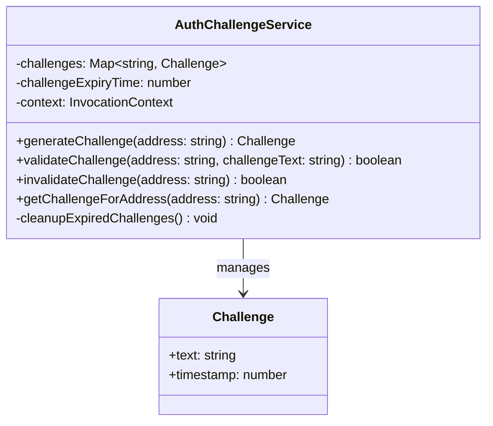
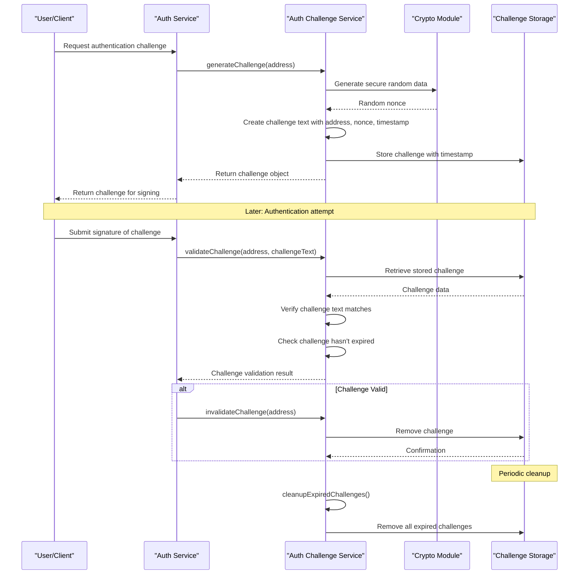
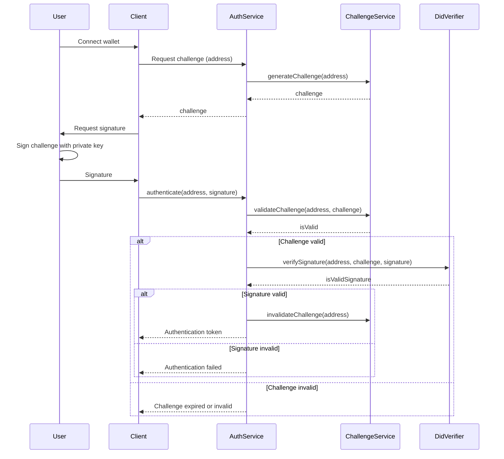

# Auth Challenge Service

**Component Type:** Service  
**Path:** `/services/auth/AuthChallenge.service.ts`

## Overview

The Auth Challenge Service manages the generation, validation, and lifecycle of authentication challenges in the LEDUP system. It provides a secure challenge-response authentication mechanism, where the system issues a time-limited challenge that must be signed by the user's private key to prove ownership of their Ethereum address and corresponding DID (Decentralized Identifier).



## Dependencies

The service has minimal dependencies:

- **InvocationContext**: Provides logging capabilities
- **crypto** (Node.js built-in): For generating cryptographically secure random challenges

## Challenge Management

Authentication challenges in the LEDUP system:



## Methods

### generateChallenge

Generates a new authentication challenge for a specific Ethereum address.

```typescript
public generateChallenge(address: string): Challenge
```

**Parameters:**

- `address`: The Ethereum address for which to generate a challenge

**Returns:**

- `Challenge`: Object containing the challenge text and timestamp

**Challenge Structure:**

```typescript
{
  text: string; // The challenge text to be signed
  timestamp: number; // Creation timestamp (Unix epoch in milliseconds)
}
```

**Challenge Format:**
The generated challenge text follows this format:

```
Sign this message to prove you own the address {address}.
Nonce: {randomNonce}
Timestamp: {timestamp}
Origin: {systemDomain}
```

### validateChallenge

Validates if a provided challenge text matches the stored challenge for an address.

```typescript
public validateChallenge(address: string, challengeText: string): boolean
```

**Parameters:**

- `address`: The Ethereum address for which to validate the challenge
- `challengeText`: The challenge text to validate

**Returns:**

- `boolean`: True if the challenge is valid, false otherwise

**Validation Checks:**

1. Verifies the challenge exists for the given address
2. Confirms the challenge text matches exactly
3. Ensures the challenge has not expired

### invalidateChallenge

Invalidates (removes) a challenge for a specific address.

```typescript
public invalidateChallenge(address: string): boolean
```

**Parameters:**

- `address`: The Ethereum address for which to invalidate the challenge

**Returns:**

- `boolean`: True if the challenge was invalidated, false if no challenge existed

### getChallengeForAddress

Retrieves the current challenge for a specific address.

```typescript
public getChallengeForAddress(address: string): Challenge | null
```

**Parameters:**

- `address`: The Ethereum address for which to retrieve the challenge

**Returns:**

- `Challenge | null`: The challenge object if found, null otherwise

### cleanupExpiredChallenges (private)

Internal method that removes expired challenges from memory.

```typescript
private cleanupExpiredChallenges(): void
```

**Behavior:**

- Automatically called periodically
- Removes challenges that have exceeded the configured expiry time
- Logs the number of expired challenges that were removed

## Authentication Flow

The complete challenge-response authentication flow:



## Security Considerations

The Auth Challenge Service implements several security measures:

1. **Time-Limited Challenges**: Challenges expire after a configurable period (default: 5 minutes)
2. **Single Use**: After successful authentication, the challenge is invalidated
3. **Random Nonce**: Each challenge includes a cryptographically secure random nonce
4. **Address Binding**: Challenges explicitly include the user's address to prevent replay attacks
5. **Origin Binding**: Challenges include the system domain to prevent cross-site attacks
6. **Automatic Cleanup**: Expired challenges are automatically removed from memory

## Configuration Options

The AuthChallengeService can be configured with the following options:

| Parameter             | Description                                                   | Default Value       |
| --------------------- | ------------------------------------------------------------- | ------------------- |
| `challengeExpiryTime` | Time in milliseconds before a challenge expires               | 300000 (5 minutes)  |
| `cleanupInterval`     | Time in milliseconds between expired challenge cleanup cycles | 600000 (10 minutes) |
| `systemDomain`        | Domain name to include in challenge text                      | 'ledup.system'      |

## Integration Examples

### Generating a Challenge

```typescript
// Initialize the Auth Challenge Service
const authChallengeService = new AuthChallengeService(context);

// Generate a challenge for a user
const userAddress = '0x1234567890abcdef1234567890abcdef12345678';
const challenge = authChallengeService.generateChallenge(userAddress);

console.log('Challenge text:', challenge.text);
console.log('Challenge timestamp:', challenge.timestamp);
console.log('Challenge expiry:', new Date(challenge.timestamp + 300000).toISOString());

// Send the challenge to the client for signing
```

### Validating a Signed Challenge

```typescript
// When the client sends back the challenge text and signature
const userAddress = '0x1234567890abcdef1234567890abcdef12345678';
const challengeText = '...'; // The challenge text that was sent to the client

// First, validate that the challenge is still valid
const isChallengeValid = authChallengeService.validateChallenge(userAddress, challengeText);

if (isChallengeValid) {
  // Proceed with signature verification in AuthService
  // ...

  // After successful authentication, invalidate the challenge
  authChallengeService.invalidateChallenge(userAddress);
} else {
  console.error('Challenge validation failed - expired or tampered');
}
```

## Error Handling

The service handles various error conditions:

| Error Condition        | Handling Strategy                                                  |
| ---------------------- | ------------------------------------------------------------------ |
| No challenge found     | Returns null or false depending on the method                      |
| Expired challenge      | Returns false from validation and cleans up the challenge          |
| Invalid challenge text | Returns false from validation                                      |
| Address format errors  | Normalizes addresses to lowercase to avoid case sensitivity issues |

## Performance Considerations

The AuthChallengeService is designed for high performance:

1. **In-Memory Storage**: Challenges are stored in memory for fast access
2. **Periodic Cleanup**: Automatic cleanup prevents memory leaks
3. **Minimal Dependencies**: Minimal external dependencies for high reliability
4. **Low Latency**: Challenge generation and validation are synchronous operations

## Integration with Other Services

The AuthChallengeService integrates with:

1. **AuthService**: For the complete authentication flow
2. **DidVerifierService**: For verifying signatures against challenges
3. **JWTService**: For generating authentication tokens after successful challenge validation
