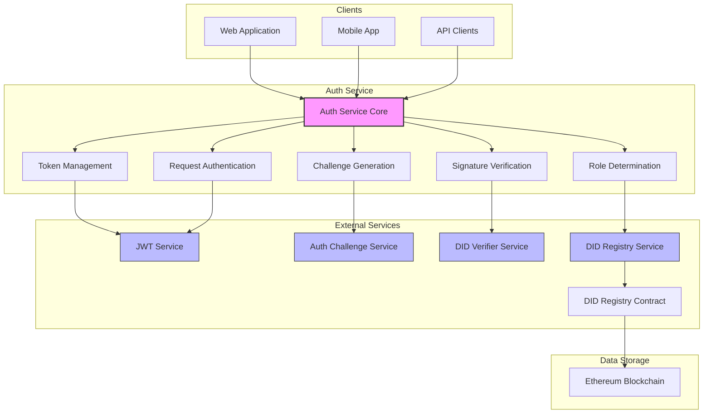
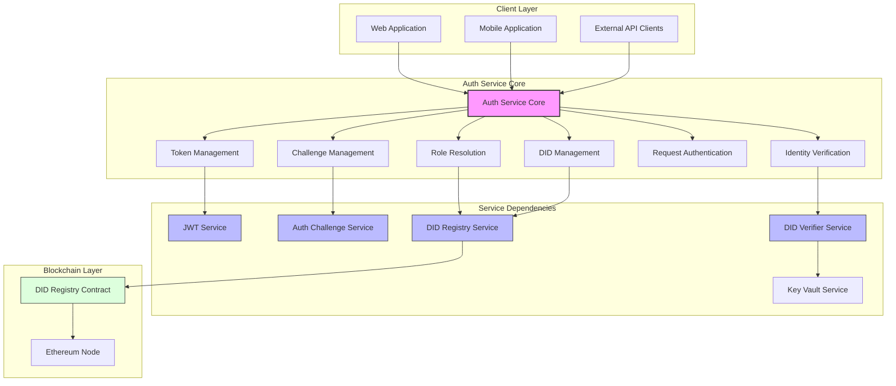
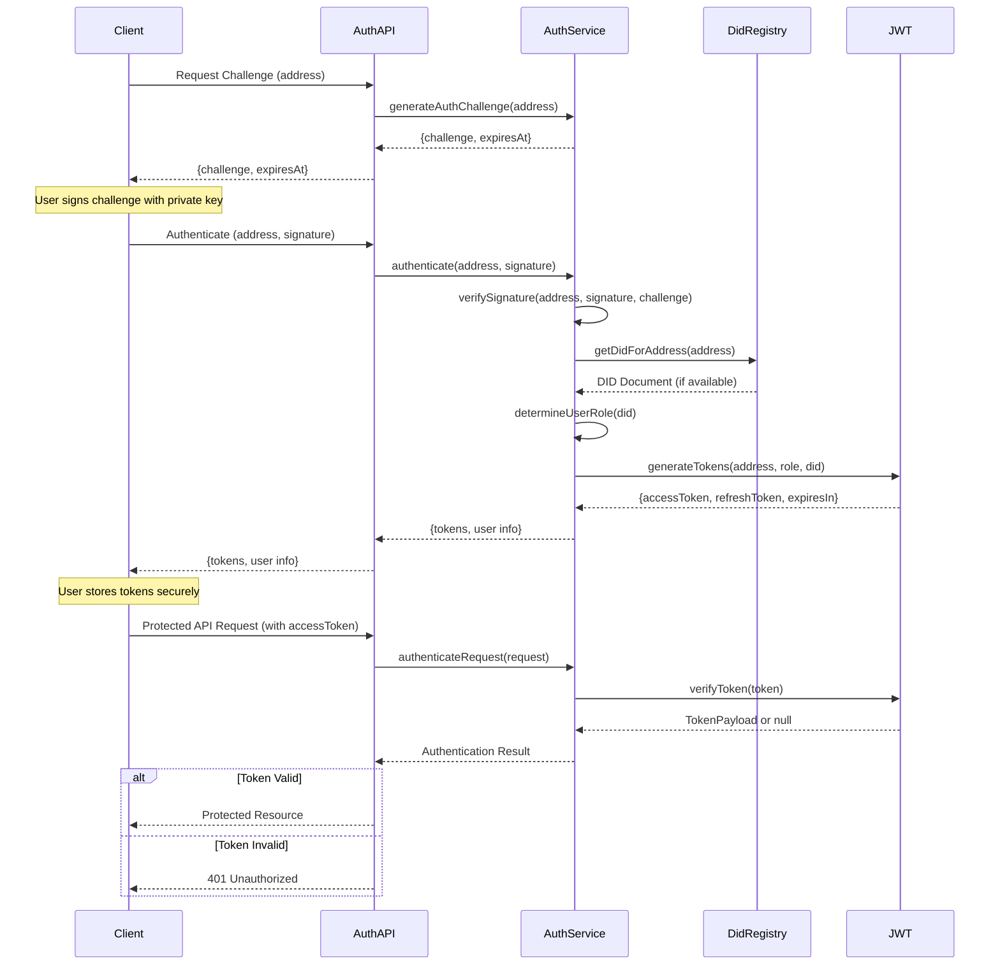
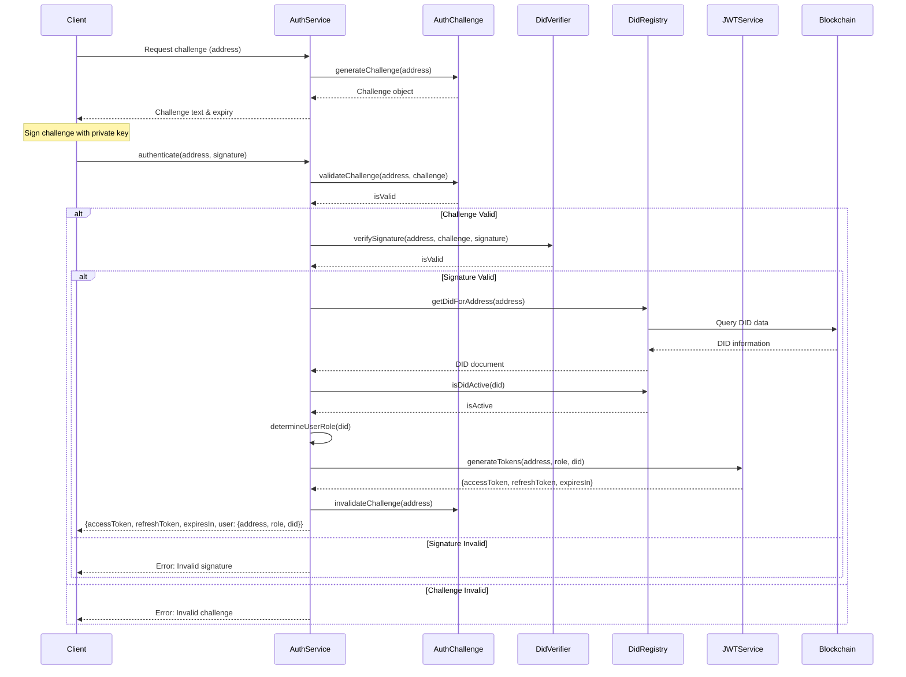

# Auth Service

**Component Type:** Service  
**Path:** `/services/auth/AuthService.ts`

## Overview

The Auth Service is the core component responsible for managing authentication in the LEDUP system. It handles challenge-based authentication, signature verification, DID management, and JWT token handling to create a secure authentication framework.





## Dependencies

The service relies on several other services:

- **DidAuthService**: Handles DID authentication against the blockchain
- **DidRegistryService**: Manages DID registration and retrieval from the blockchain
- **DidVerifierService**: Verifies DID-related signatures
- **JWTService**: Handles JWT token generation and verification

## Methods

### generateAuthChallenge

Generates a challenge for authentication.

```typescript
public generateAuthChallenge(address: string): { challenge: string; expiresAt: number }
```

**Parameters:**

- `address`: The Ethereum address to generate a challenge for

**Returns:**

- Object containing:
  - `challenge`: The generated challenge string
  - `expiresAt`: Timestamp when the challenge expires

**Example Usage:**

```typescript
const { challenge, expiresAt } = authService.generateAuthChallenge('0x1234567890abcdef1234567890abcdef12345678');

console.log(`Challenge: ${challenge}`);
console.log(`Expires at: ${new Date(expiresAt).toLocaleString()}`);
```

### authenticate

Authenticates a user using their Ethereum address and signature.

```typescript
public async authenticate(address: string, signature: string): Promise<AuthResponse>
```

**Parameters:**

- `address`: The user's Ethereum address
- `signature`: The signature of the challenge

**Returns:**

- `Promise<AuthResponse>`: Authentication response containing:
  - `accessToken`: JWT access token
  - `refreshToken`: JWT refresh token
  - `expiresIn`: Token expiration time in seconds
  - `user`: Object containing user information (address, role, DID)

**Error Handling:**

- Throws error if challenge is invalid
- Throws error if signature is invalid
- Throws error if DID is deactivated

**Example Flow:**

1. Gets the challenge for this address
2. Verifies the signature against the challenge
3. Retrieves the DID for the address if available
4. Determines the user's role based on the DID
5. Generates JWT tokens
6. Returns authentication response

### verifyToken

Verifies a JWT token.

```typescript
public verifyToken(token: string): TokenPayload | null
```

**Parameters:**

- `token`: The JWT token to verify

**Returns:**

- `TokenPayload | null`: The decoded token payload if valid, null otherwise

### refreshToken

Refreshes a JWT access token using a refresh token.

```typescript
public async refreshToken(refreshToken: string): Promise<Omit<AuthResponse, 'user'> & { user?: AuthResponse['user'] }>
```

**Parameters:**

- `refreshToken`: The refresh token to use

**Returns:**

- Promise resolving to a partial AuthResponse with new tokens

**Security Considerations:**

- Validates the refresh token
- Retrieves the user information
- Generates new tokens
- Returns new tokens and optionally the user information

### isDidActive

Checks if a DID is active.

```typescript
public async isDidActive(did: string): Promise<boolean>
```

**Parameters:**

- `did`: The DID to check

**Returns:**

- `Promise<boolean>`: True if the DID is active, false otherwise

### getDidForAddress

Retrieves the DID for an Ethereum address.

```typescript
public async getDidForAddress(address: string): Promise<any>
```

**Parameters:**

- `address`: The Ethereum address

**Returns:**

- `Promise<any>`: The DID document for the address

### logout

Logs out a user by invalidating their token.

```typescript
public async logout(address: string, token: string): Promise<boolean>
```

**Parameters:**

- `address`: The user's Ethereum address
- `token`: The JWT token to invalidate

**Returns:**

- `Promise<boolean>`: True if logout was successful, false otherwise

### authenticateRequest

Authenticates an HTTP request using JWT token from headers.

```typescript
public authenticateRequest(request: HttpRequest, requiredRoles?: UserRole[]): HttpResponseInit | null
```

**Parameters:**

- `request`: The HTTP request to authenticate
- `requiredRoles`: Optional array of roles required for access

**Returns:**

- `HttpResponseInit | null`: Error response if authentication fails, null if successful

**Security Flow:**

1. Extracts the token from the Authorization header
2. Verifies the token
3. Checks if the user has the required roles if specified
4. Returns appropriate error response or null if successful

### getUserFromRequest

Extracts user information from an HTTP request.

```typescript
public getUserFromRequest(request: HttpRequest): { address: string; role: UserRole; did: string } | null
```

**Parameters:**

- `request`: The HTTP request

**Returns:**

- User information object if authenticated, null otherwise

## Authentication Flow

The complete authentication flow is illustrated below:



## Error Handling

The AuthService handles various error conditions:

| Error Code                 | Description                     | HTTP Status | Handling Strategy                      |
| -------------------------- | ------------------------------- | ----------- | -------------------------------------- |
| `INVALID_CHALLENGE`        | Challenge not found or expired  | 401         | Request a new challenge                |
| `INVALID_SIGNATURE`        | Signature verification failed   | 401         | Ensure correct private key is used     |
| `DEACTIVATED_USER`         | User's DID is deactivated       | 403         | Contact administrator for reactivation |
| `INVALID_TOKEN`            | JWT token is invalid or expired | 401         | Refresh token or authenticate again    |
| `INSUFFICIENT_PERMISSIONS` | User lacks required role        | 403         | Request necessary permissions          |

## Security Considerations

1. **Challenge Expiration**: Challenges expire after a short period (typically 15 minutes)
2. **Signature Verification**: Uses both on-chain and local verification methods
3. **Role-Based Access Control**: Enforces access based on user roles
4. **Token Management**: Short-lived access tokens with refresh capability
5. **Token Blacklisting**: Invalidates tokens on logout

## Integration Examples

### Authentication Request Flow

```typescript
// 1. Request a challenge
const challengeResponse = await fetch(
  'https://api.ledup.io/auth/challenge?address=0x1234567890abcdef1234567890abcdef12345678'
);
const { challenge } = await challengeResponse.json();

// 2. Sign the challenge with the user's private key
const signature = await wallet.signMessage(challenge);

// 3. Authenticate with the signature
const authResponse = await fetch('https://api.ledup.io/auth/authenticate', {
  method: 'POST',
  headers: { 'Content-Type': 'application/json' },
  body: JSON.stringify({ address: '0x1234567890abcdef1234567890abcdef12345678', signature }),
});

const { accessToken, refreshToken, user } = await authResponse.json();

// 4. Use the access token for subsequent requests
const protectedResponse = await fetch('https://api.ledup.io/protected-resource', {
  headers: { Authorization: `Bearer ${accessToken}` },
});
```

## Complete Authentication Flow

The Auth Service orchestrates the entire authentication process from challenge generation to token issuance:


