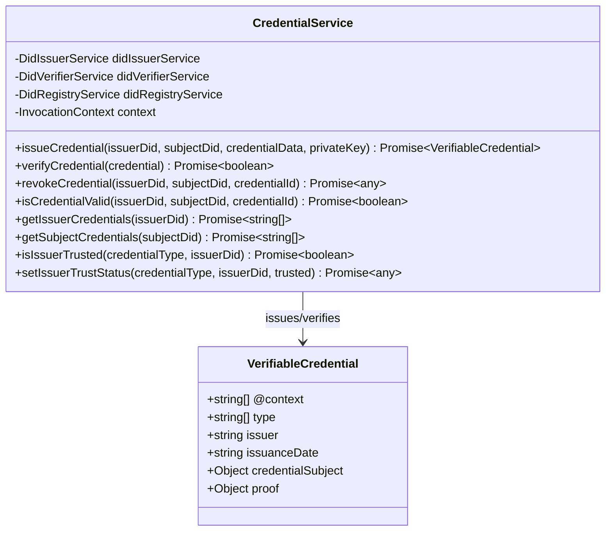
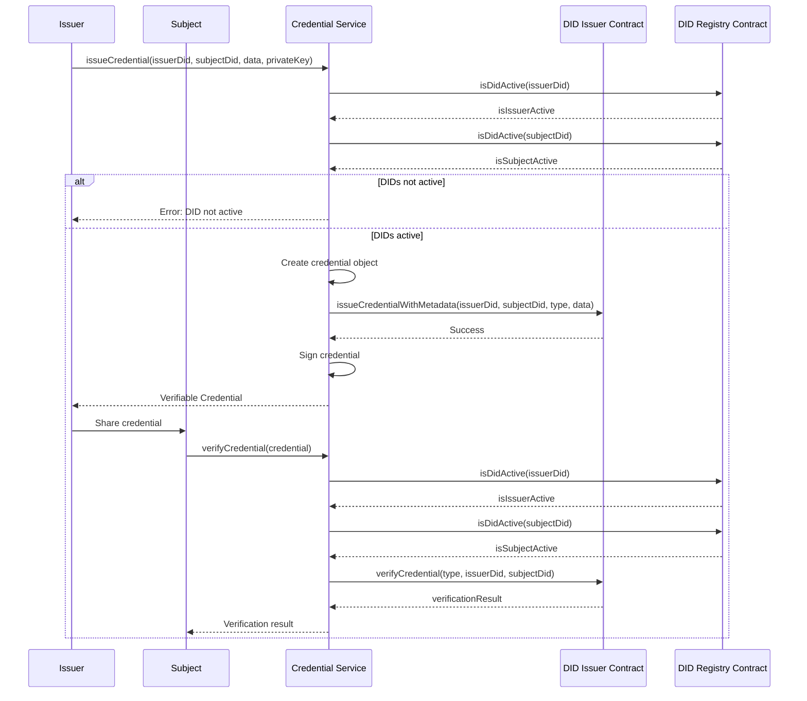
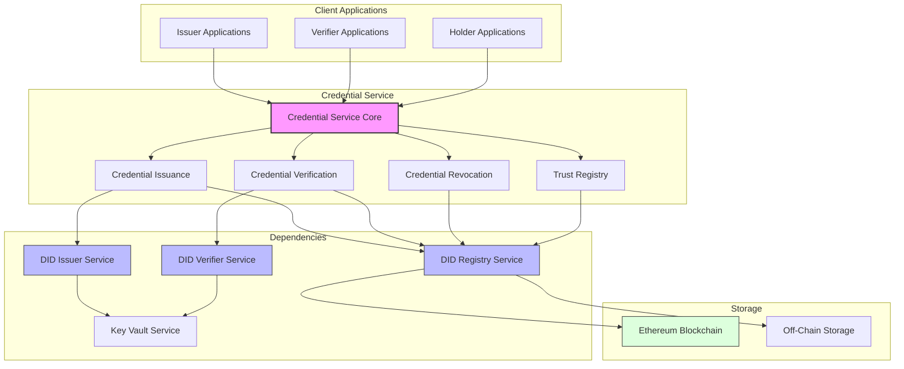
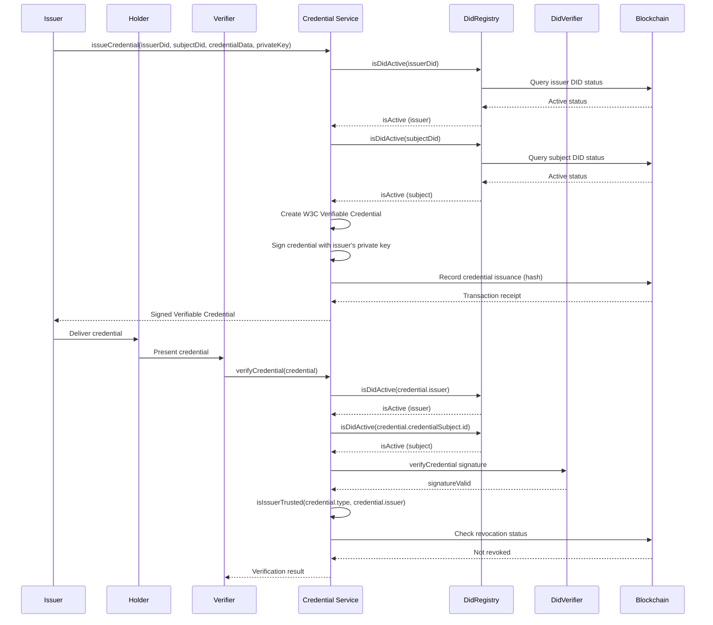
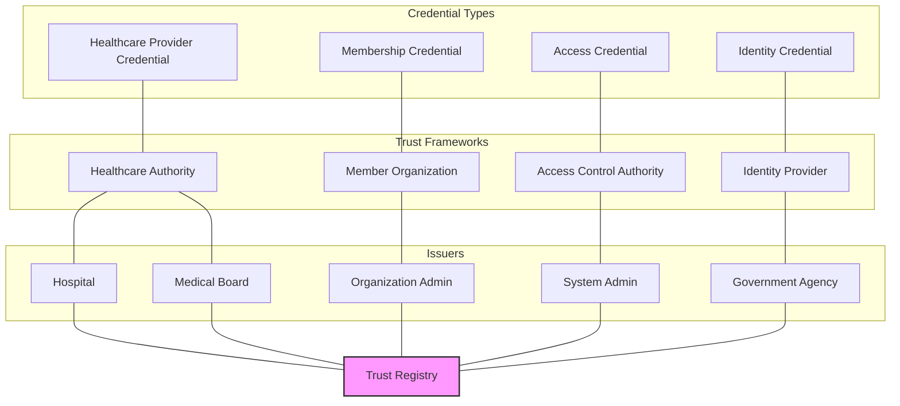

# Credential Service

**Component Type:** Service  
**Path:** `/services/auth/CredentialService.ts`

## Overview

The Credential Service provides functionality for managing Verifiable Credentials within the LEDUP system. It enables issuance, verification, and management of decentralized identity credentials that conform to the W3C Verifiable Credentials Data Model.



## Dependencies

The service relies on several other components:

- **DidIssuerService**: Handles credential issuance on the blockchain
- **DidVerifierService**: Verifies credentials against the blockchain
- **DidRegistryService**: Manages DID information needed for credential operations
- **InvocationContext**: Provides logging capabilities

## Methods

### issueCredential

Issues a verifiable credential from an issuer to a subject.

```typescript
public async issueCredential(
  issuerDid: string,
  subjectDid: string,
  credentialData: any,
  privateKey: string
): Promise<any>
```

**Parameters:**

- `issuerDid`: The DID of the credential issuer
- `subjectDid`: The DID of the credential subject
- `credentialData`: Data to include in the credential (contains type and claims)
- `privateKey`: The private key of the issuer to sign the credential

**Returns:**

- `Promise<any>`: The issued Verifiable Credential

**Issuance Process:**

1. Verifies that both issuer and subject DIDs are active
2. Creates the credential object following W3C VC Data Model
3. Records the credential on the blockchain
4. Signs the credential for off-chain verification
5. Returns the complete Verifiable Credential with proof

**Example Credential Structure:**

```json
{
  "@context": ["https://www.w3.org/2018/credentials/v1"],
  "type": ["VerifiableCredential", "HealthcareProviderCredential"],
  "issuer": "did:ethr:0xab16a96d359ec26a11e2c2b3d8f8b8942d5bfcdb",
  "issuanceDate": "2023-04-12T15:52:30.594Z",
  "credentialSubject": {
    "id": "did:ethr:0x1234567890abcdef1234567890abcdef12345678",
    "name": "Dr. John Smith",
    "specialty": "Cardiology",
    "licenseNumber": "MED12345"
  },
  "proof": {
    "type": "EcdsaSecp256k1Signature2019",
    "created": "2023-04-12T15:52:30.594Z",
    "proofPurpose": "assertionMethod",
    "verificationMethod": "did:ethr:0xab16a96d359ec26a11e2c2b3d8f8b8942d5bfcdb#keys-1",
    "signature": "0x7f9e3266f3f110a40bd1b88c7369f2f4775c2ed672ed37c1b650635e94dc7101..."
  }
}
```

### verifyCredential

Verifies a Verifiable Credential.

```typescript
public async verifyCredential(credential: any): Promise<boolean>
```

**Parameters:**

- `credential`: The Verifiable Credential to verify

**Returns:**

- `Promise<boolean>`: True if the credential is valid, false otherwise

**Verification Steps:**

1. Extracts issuer DID, subject DID, and credential type from the credential
2. Verifies that both issuer and subject DIDs are active
3. Uses the blockchain to verify the credential's validity
4. Returns the verification result

### revokeCredential

Revokes a credential (placeholder for future implementation).

```typescript
public async revokeCredential(
  _issuerDid: string,
  _subjectDid: string,
  _credentialId: string
): Promise<any>
```

**Parameters:**

- `_issuerDid`: The DID of the issuer
- `_subjectDid`: The DID of the subject
- `_credentialId`: The ID of the credential to revoke

**Returns:**

- `Promise<any>`: Status message indicating revocation is not supported

**Note:** This is a placeholder method as the current contract implementation does not support credential revocation.

### isCredentialValid

Checks if a credential is valid.

```typescript
public async isCredentialValid(
  issuerDid: string,
  subjectDid: string,
  credentialId: string
): Promise<boolean>
```

**Parameters:**

- `issuerDid`: The DID of the issuer
- `subjectDid`: The DID of the subject
- `credentialId`: The ID of the credential or credential metadata

**Returns:**

- `Promise<boolean>`: True if the credential is valid, false otherwise

**Validation Process:**

- If the credentialId is in JSON format, it's treated as metadata
- Verifies the credential validity through the blockchain

### getIssuerCredentials

Retrieves credentials issued by a specific issuer.

```typescript
public async getIssuerCredentials(_issuerDid: string): Promise<string[]>
```

**Parameters:**

- `_issuerDid`: The DID of the issuer

**Returns:**

- `Promise<string[]>`: Array of credential IDs or empty array if not supported

### getSubjectCredentials

Retrieves credentials held by a specific subject.

```typescript
public async getSubjectCredentials(_subjectDid: string): Promise<string[]>
```

**Parameters:**

- `_subjectDid`: The DID of the subject

**Returns:**

- `Promise<string[]>`: Array of credential IDs or empty array if not supported

### isIssuerTrusted

Checks if an issuer is trusted for a specific credential type.

```typescript
public async isIssuerTrusted(credentialType: string, issuerDid: string): Promise<boolean>
```

**Parameters:**

- `credentialType`: The type of credential
- `issuerDid`: The DID of the issuer

**Returns:**

- `Promise<boolean>`: True if the issuer is trusted, false otherwise

### setIssuerTrustStatus

Sets the trust status for an issuer for a specific credential type.

```typescript
public async setIssuerTrustStatus(
  credentialType: string,
  issuerDid: string,
  trusted: boolean
): Promise<any>
```

**Parameters:**

- `credentialType`: The type of credential
- `issuerDid`: The DID of the issuer
- `trusted`: Boolean indicating trust status

**Returns:**

- `Promise<any>`: Status of the trust setting operation

## Credential Workflow

The complete credential issuance and verification workflow:



## Integration Examples

### Issuing a Credential

```typescript
// Initialize the Credential Service
const credentialService = new CredentialService(didIssuerService, didVerifierService, didRegistryService, context);

// Issue a healthcare provider credential
const issuerDid = 'did:ethr:0xab16a96d359ec26a11e2c2b3d8f8b8942d5bfcdb';
const subjectDid = 'did:ethr:0x1234567890abcdef1234567890abcdef12345678';
const privateKey = '0x...'; // Issuer's private key

const credentialData = {
  type: 'HealthcareProviderCredential',
  claims: {
    name: 'Dr. John Smith',
    specialty: 'Cardiology',
    licenseNumber: 'MED12345',
    issueDate: '2023-01-15',
    expiryDate: '2025-01-15',
  },
};

try {
  const credential = await credentialService.issueCredential(issuerDid, subjectDid, credentialData, privateKey);

  console.log('Credential issued successfully:', credential);

  // Store or share the credential
} catch (error) {
  console.error('Failed to issue credential:', error);
}
```

### Verifying a Credential

```typescript
// Verify a received credential
try {
  const isValid = await credentialService.verifyCredential(credential);

  if (isValid) {
    console.log('Credential is valid');
    // Process the verified credential
  } else {
    console.log('Credential is invalid');
    // Reject the credential
  }
} catch (error) {
  console.error('Error verifying credential:', error);
}
```

### Checking Trust Status

```typescript
// Check if an issuer is trusted for a specific credential type
const credentialType = 'HealthcareProviderCredential';
const issuerDid = 'did:ethr:0xab16a96d359ec26a11e2c2b3d8f8b8942d5bfcdb';

try {
  const isTrusted = await credentialService.isIssuerTrusted(credentialType, issuerDid);

  if (isTrusted) {
    console.log(`Issuer ${issuerDid} is trusted for ${credentialType}`);
  } else {
    console.log(`Issuer ${issuerDid} is not trusted for ${credentialType}`);
  }
} catch (error) {
  console.error('Error checking trust status:', error);
}
```

## W3C Compliance

This service implements the [W3C Verifiable Credentials Data Model](https://www.w3.org/TR/vc-data-model/) with features including:

1. Standard credential structure with `@context`, `type`, `issuer`, and `credentialSubject`
2. Cryptographic proofs using digital signatures
3. Integration with DID-based identity
4. Machine-verifiable claims

### Credential Types

The service supports various credential types for the LEDUP system:

| Credential Type                | Description                            | Typical Issuer        |
| ------------------------------ | -------------------------------------- | --------------------- |
| `PatientCredential`            | Verifies patient identity              | Healthcare providers  |
| `HealthcareProviderCredential` | Verifies healthcare provider status    | Medical boards        |
| `ResearcherCredential`         | Verifies researcher status             | Research institutions |
| `DataAccessCredential`         | Grants specific data access rights     | Data owners           |
| `ConsentCredential`            | Documents patient consent for data use | Patients              |



## Credential Workflows

The Credential Service manages the entire credential lifecycle:



## Credential Types and Trust Framework

The service supports various credential types, each with specific trust relationships:


