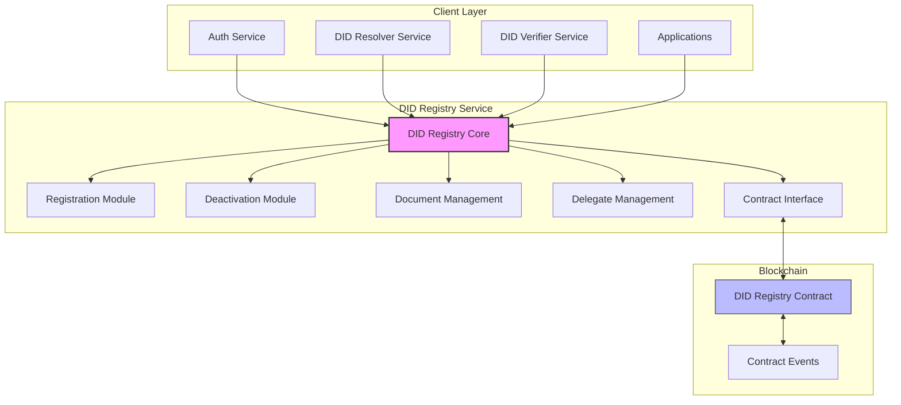
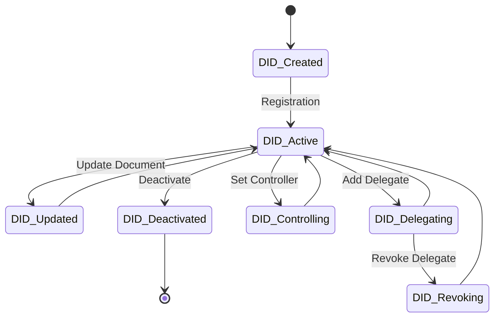
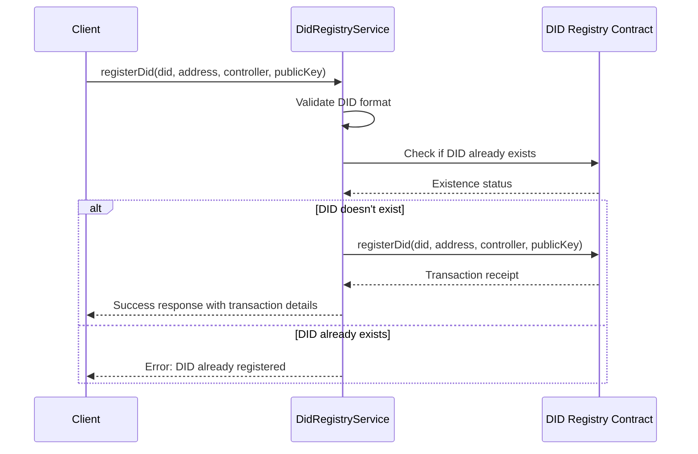
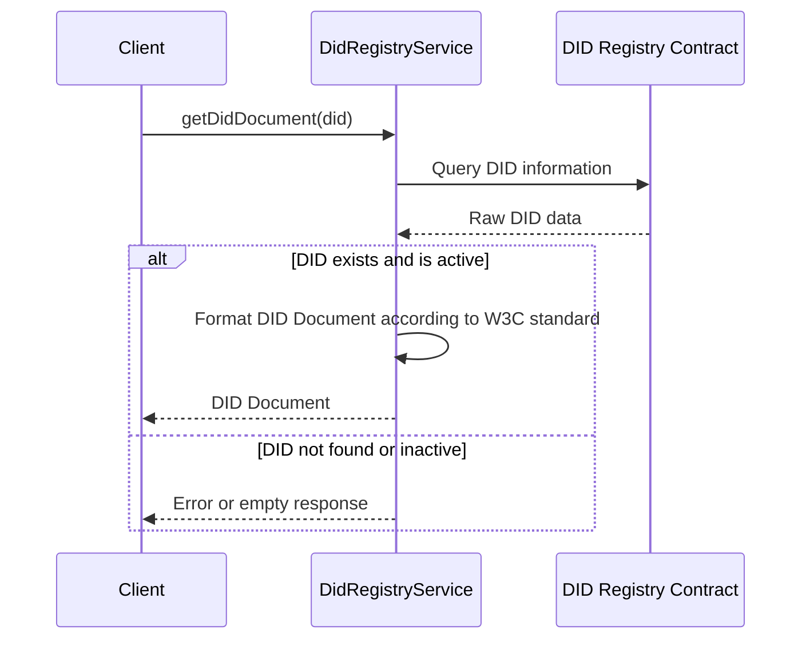
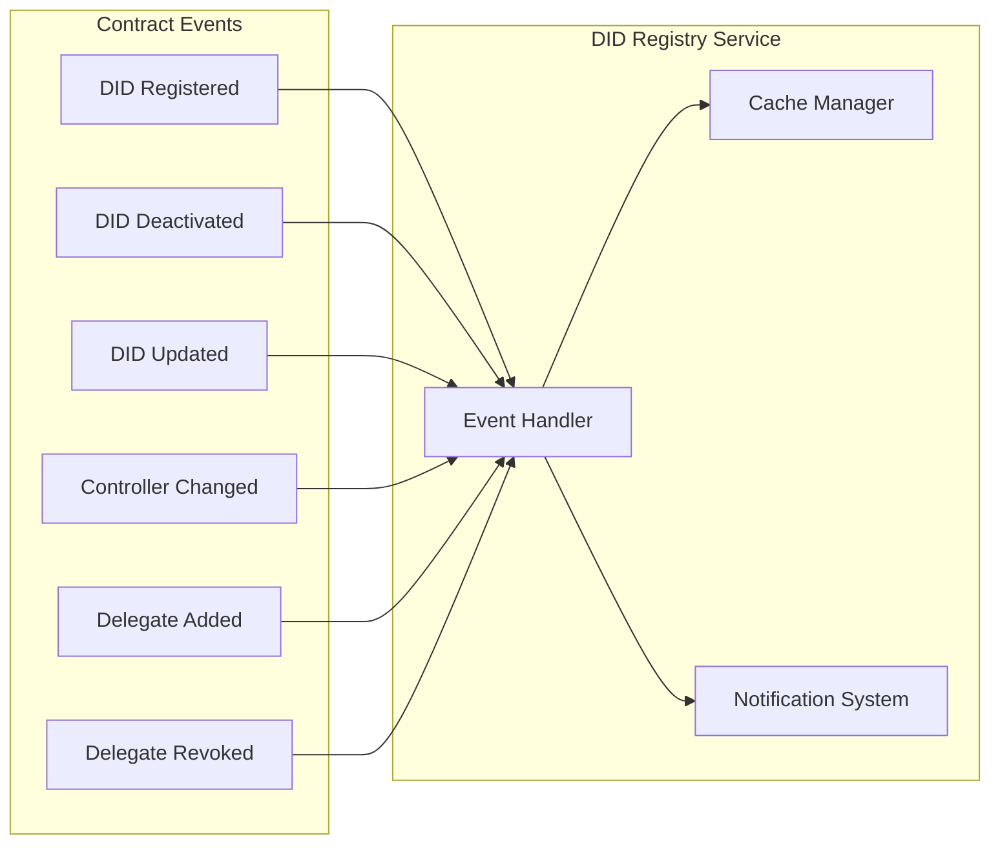
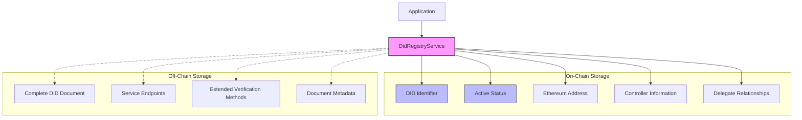

# DID Registry Service

**Component Type:** Service  
**Path:** `/services/auth/DidRegistryService.ts`

## Overview

The DID Registry Service provides the interface between the LEDUP application and the on-chain DID (Decentralized Identifier) Registry smart contract. It enables the creation, management, and verification of decentralized identifiers, forming the cornerstone of the system's identity infrastructure by providing a trusted source of identity information.



## DID Management Flow

The service orchestrates the complete lifecycle of DIDs, from creation to deactivation:



## Dependencies

The service relies on several components:

- **ContractProvider**: Provides access to Ethereum smart contracts
- **ethers.js**: Library for interacting with Ethereum blockchain
- **InvocationContext**: For logging and contextual operations
- **DidRegistryContract**: Smart contract that stores DID information on the blockchain

## Smart Contract Integration

The DidRegistryService interacts with a smart contract deployed on the blockchain that implements the following functionality:

1. **DID Registration**: Records new DIDs and their associated information
2. **DID Deactivation**: Marks DIDs as inactive
3. **DID Document Storage**: Stores and retrieves DID Documents
4. **Delegation Management**: Manages delegated capabilities for DIDs
5. **Controller Management**: Manages controller relationships between DIDs

## Methods

### initialize

Initializes the service by establishing a connection to the DID Registry smart contract.

```typescript
public async initialize(): Promise<void>
```

**Process:**

1. Obtains a contract instance for the DID Registry
2. Verifies the contract is accessible and functional
3. Sets up event listeners if needed

### registerDid

Registers a new DID in the registry.

```typescript
public async registerDid(
  did: string,
  address: string,
  controller?: string,
  publicKey?: string
): Promise<TransactionReceipt>
```

**Parameters:**

- `did`: The DID to register (e.g., `did:ethr:0x1234...`)
- `address`: The Ethereum address associated with the DID
- `controller`: (Optional) The controller DID
- `publicKey`: (Optional) The public key associated with the DID

**Returns:**

- `Promise<TransactionReceipt>`: The transaction receipt from the blockchain

**Registration Process:**

1. Validates the DID format
2. Checks that the DID doesn't already exist
3. Submits a transaction to the smart contract to register the DID
4. Returns the transaction receipt after confirmation

### deactivateDid

Deactivates a DID, rendering it invalid for authentication or other purposes.

```typescript
public async deactivateDid(
  did: string
): Promise<TransactionReceipt>
```

**Parameters:**

- `did`: The DID to deactivate

**Returns:**

- `Promise<TransactionReceipt>`: The transaction receipt from the blockchain

### isDidActive

Checks if a DID is active in the registry.

```typescript
public async isDidActive(
  did: string
): Promise<boolean>
```

**Parameters:**

- `did`: The DID to check

**Returns:**

- `Promise<boolean>`: True if the DID is active, false otherwise

### getDidDocument

Retrieves the DID Document for a specified DID.

```typescript
public async getDidDocument(
  did: string
): Promise<DidDocument>
```

**Parameters:**

- `did`: The DID to retrieve the document for

**Returns:**

- `Promise<DidDocument>`: The DID Document or null if not found

**DID Document Structure:**

```typescript
{
  "@context": ["https://www.w3.org/ns/did/v1"],
  "id": "did:ethr:0x1234567890abcdef1234567890abcdef12345678",
  "controller": ["did:ethr:0xabcdef1234567890abcdef1234567890abcdef"],
  "verificationMethod": [
    {
      "id": "did:ethr:0x1234567890abcdef1234567890abcdef12345678#keys-1",
      "type": "EcdsaSecp256k1VerificationKey2019",
      "controller": "did:ethr:0x1234567890abcdef1234567890abcdef12345678",
      "publicKeyHex": "04a5..."
    }
  ],
  "authentication": [
    "did:ethr:0x1234567890abcdef1234567890abcdef12345678#keys-1"
  ],
  "assertionMethod": [
    "did:ethr:0x1234567890abcdef1234567890abcdef12345678#keys-1"
  ],
  "service": [
    {
      "id": "did:ethr:0x1234567890abcdef1234567890abcdef12345678#endpoint-1",
      "type": "LinkedDomains",
      "serviceEndpoint": "https://example.com"
    }
  ]
}
```

### updateDidDocument

Updates the DID Document for a specified DID.

```typescript
public async updateDidDocument(
  did: string,
  document: DidDocument
): Promise<TransactionReceipt>
```

**Parameters:**

- `did`: The DID to update the document for
- `document`: The new DID Document

**Returns:**

- `Promise<TransactionReceipt>`: The transaction receipt from the blockchain

### getDidsForAddress

Retrieves all DIDs associated with a specific Ethereum address.

```typescript
public async getDidsForAddress(
  address: string
): Promise<string[]>
```

**Parameters:**

- `address`: The Ethereum address to query

**Returns:**

- `Promise<string[]>`: Array of DIDs associated with the address

### getAddressForDid

Retrieves the Ethereum address associated with a specific DID.

```typescript
public async getAddressForDid(
  did: string
): Promise<string>
```

**Parameters:**

- `did`: The DID to query

**Returns:**

- `Promise<string>`: The associated Ethereum address or null if not found

### getControllerForDid

Retrieves the controller DID for a specific DID.

```typescript
public async getControllerForDid(
  did: string
): Promise<string>
```

**Parameters:**

- `did`: The DID to query

**Returns:**

- `Promise<string>`: The controller DID or null if not found

### setController

Sets the controller for a DID.

```typescript
public async setController(
  did: string,
  controllerDid: string
): Promise<TransactionReceipt>
```

**Parameters:**

- `did`: The DID to set the controller for
- `controllerDid`: The controller DID

**Returns:**

- `Promise<TransactionReceipt>`: The transaction receipt from the blockchain

### addDelegate

Adds a delegate to a DID, granting specific capabilities.

```typescript
public async addDelegate(
  did: string,
  delegateType: string,
  delegateDid: string,
  validity: number
): Promise<TransactionReceipt>
```

**Parameters:**

- `did`: The DID to add the delegate to
- `delegateType`: The type of delegation (e.g., 'authentication', 'assertion')
- `delegateDid`: The delegate DID
- `validity`: The validity period in seconds

**Returns:**

- `Promise<TransactionReceipt>`: The transaction receipt from the blockchain

### revokeDelegate

Revokes a delegate from a DID.

```typescript
public async revokeDelegate(
  did: string,
  delegateType: string,
  delegateDid: string
): Promise<TransactionReceipt>
```

**Parameters:**

- `did`: The DID to revoke the delegate from
- `delegateType`: The type of delegation
- `delegateDid`: The delegate DID to revoke

**Returns:**

- `Promise<TransactionReceipt>`: The transaction receipt from the blockchain

### isValidDelegate

Checks if a DID is a valid delegate for another DID.

```typescript
public async isValidDelegate(
  did: string,
  delegateType: string,
  delegateDid: string
): Promise<boolean>
```

**Parameters:**

- `did`: The DID to check the delegate for
- `delegateType`: The type of delegation
- `delegateDid`: The delegate DID to check

**Returns:**

- `Promise<boolean>`: True if the delegate is valid, false otherwise

## DID Registry Workflows

### DID Registration Flow

The process of registering a new DID:



### DID Resolution Flow

The process of resolving a DID to its DID Document:



## Event Handling

The DidRegistryService can subscribe to blockchain events from the DID Registry contract:



1. **DidRegistered**: Emitted when a new DID is registered
2. **DidDeactivated**: Emitted when a DID is deactivated
3. **DidUpdated**: Emitted when a DID Document is updated
4. **ControllerChanged**: Emitted when a DID's controller is changed
5. **DelegateAdded**: Emitted when a delegate is added to a DID
6. **DelegateRevoked**: Emitted when a delegate is revoked from a DID

## Error Handling

The DidRegistryService implements comprehensive error handling:

| Error Condition                | Handling Strategy                                           |
| ------------------------------ | ----------------------------------------------------------- |
| Invalid DID format             | Returns error with validation details                       |
| DID not found                  | Returns null or specific not-found error                    |
| Blockchain transaction failure | Returns error with transaction details                      |
| Smart contract errors          | Translates contract errors to meaningful application errors |
| Network connectivity issues    | Implements retry logic with exponential backoff             |

## Security Considerations

The DidRegistryService implements several security measures:

1. **Access Control**: Only authorized addresses can modify DIDs
2. **Ownership Verification**: Verifies that callers own the DIDs they're modifying
3. **Validation**: Validates all inputs before submitting transactions
4. **Transaction Monitoring**: Monitors transaction status for security analysis

## Integration Examples

### Registering a New DID

```typescript
// Initialize the DID Registry Service
const didRegistryService = new DidRegistryService(contractProvider, context);
await didRegistryService.initialize();

// Register a new DID
const did = 'did:ethr:0x1234567890abcdef1234567890abcdef12345678';
const address = '0x1234567890abcdef1234567890abcdef12345678';
const publicKey = '04a5...'; // Public key in hex format

try {
  const receipt = await didRegistryService.registerDid(did, address, undefined, publicKey);

  console.log('DID registered successfully');
  console.log('Transaction hash:', receipt.transactionHash);

  // Create initial DID Document
  const didDocument = {
    '@context': ['https://www.w3.org/ns/did/v1'],
    id: did,
    controller: [did],
    verificationMethod: [
      {
        id: `${did}#keys-1`,
        type: 'EcdsaSecp256k1VerificationKey2019',
        controller: did,
        publicKeyHex: publicKey,
      },
    ],
    authentication: [`${did}#keys-1`],
    assertionMethod: [`${did}#keys-1`],
  };

  // Update the DID Document
  const updateReceipt = await didRegistryService.updateDidDocument(did, didDocument);
  console.log('DID Document updated successfully');
} catch (error) {
  console.error('DID registration failed:', error);
}
```

### Resolving a DID

```typescript
// Resolve a DID to its DID Document
const did = 'did:ethr:0x1234567890abcdef1234567890abcdef12345678';

try {
  // Check if the DID is active
  const isActive = await didRegistryService.isDidActive(did);

  if (isActive) {
    // Get the DID Document
    const didDocument = await didRegistryService.getDidDocument(did);
    console.log('DID Document:', JSON.stringify(didDocument, null, 2));

    // Get the controller
    const controller = await didRegistryService.getControllerForDid(did);
    console.log('Controller:', controller);

    // Get the address
    const address = await didRegistryService.getAddressForDid(did);
    console.log('Ethereum Address:', address);
  } else {
    console.log('DID is not active');
  }
} catch (error) {
  console.error('DID resolution failed:', error);
}
```

### Managing Delegates

```typescript
// Add a delegate to a DID
const did = 'did:ethr:0x1234567890abcdef1234567890abcdef12345678';
const delegateType = 'authentication';
const delegateDid = 'did:ethr:0xabcdef1234567890abcdef1234567890abcdef';
const validityInSeconds = 86400 * 30; // 30 days

try {
  // Add the delegate
  const addReceipt = await didRegistryService.addDelegate(did, delegateType, delegateDid, validityInSeconds);
  console.log('Delegate added successfully');

  // Check if the delegate is valid
  const isValid = await didRegistryService.isValidDelegate(did, delegateType, delegateDid);
  console.log('Is delegate valid?', isValid);

  // Later, revoke the delegate
  const revokeReceipt = await didRegistryService.revokeDelegate(did, delegateType, delegateDid);
  console.log('Delegate revoked successfully');
} catch (error) {
  console.error('Delegate management failed:', error);
}
```

## On-Chain vs. Off-Chain Storage



The DidRegistryService handles both on-chain and off-chain aspects of DID management:

1. **On-Chain**: Essential DID data (active status, address binding, controller)
2. **Off-Chain**: Extended DID Document (e.g., service endpoints, multiple verification methods)

This hybrid approach optimizes for both security and efficiency, maintaining the integrity of critical identity information on the blockchain while allowing for rich DID Documents without excessive gas costs.
