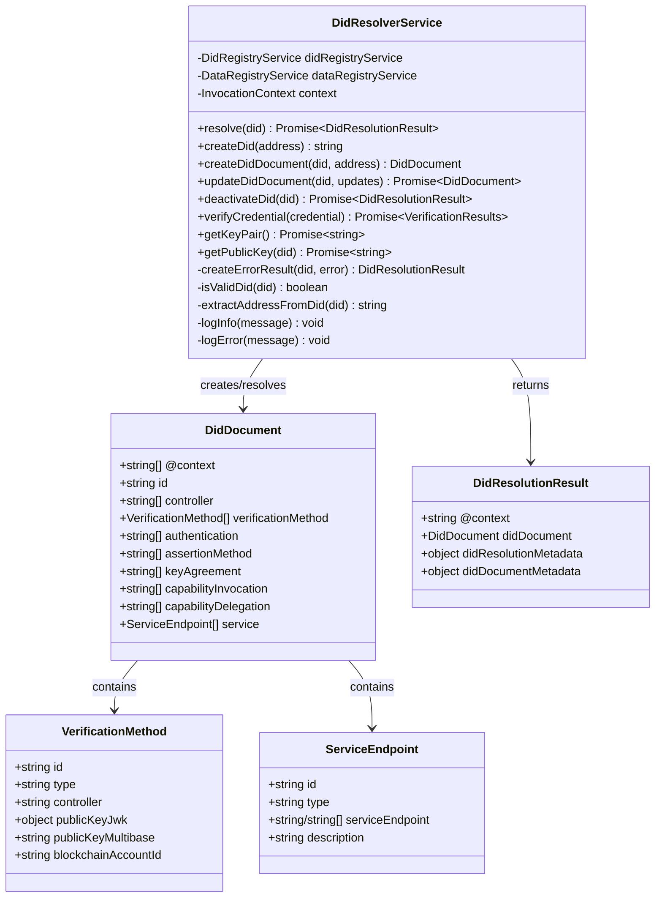
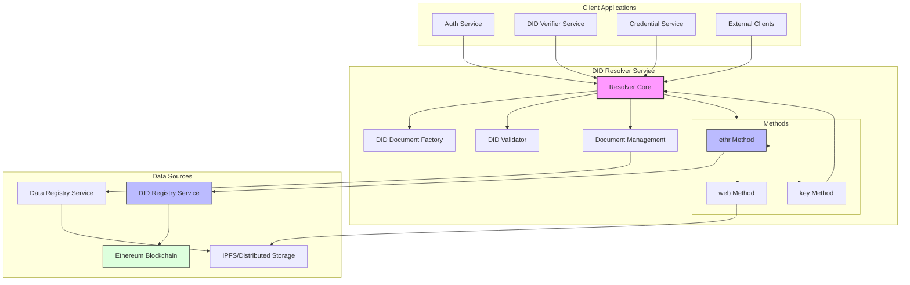
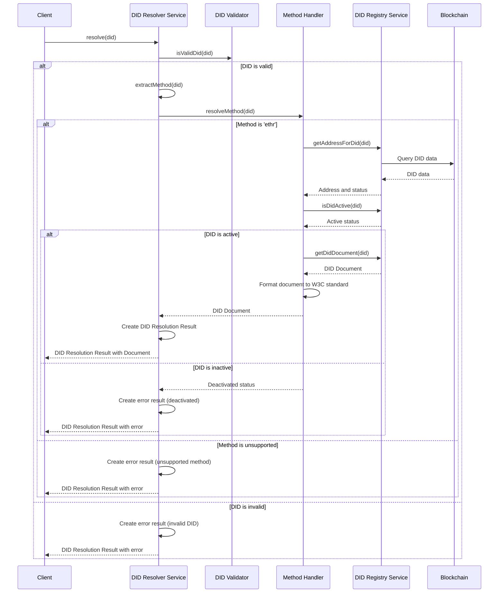
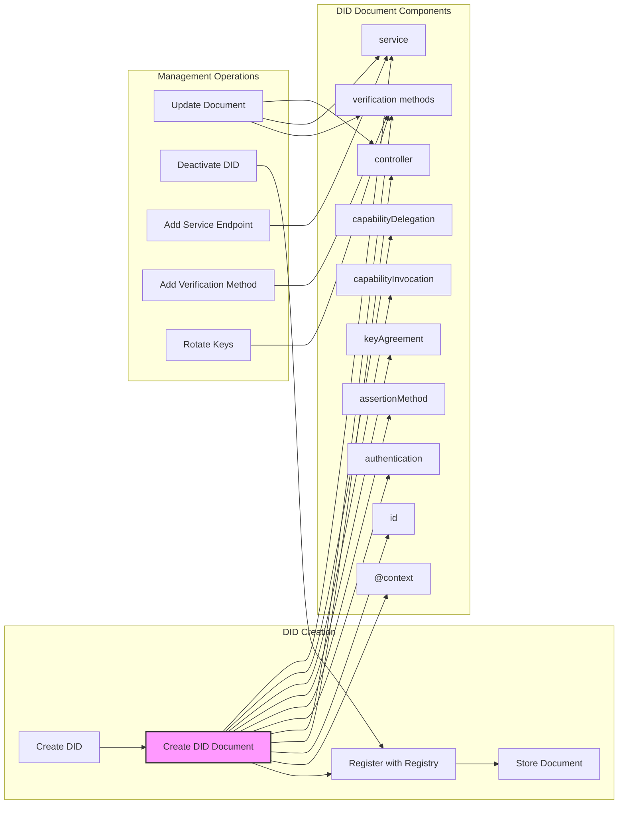
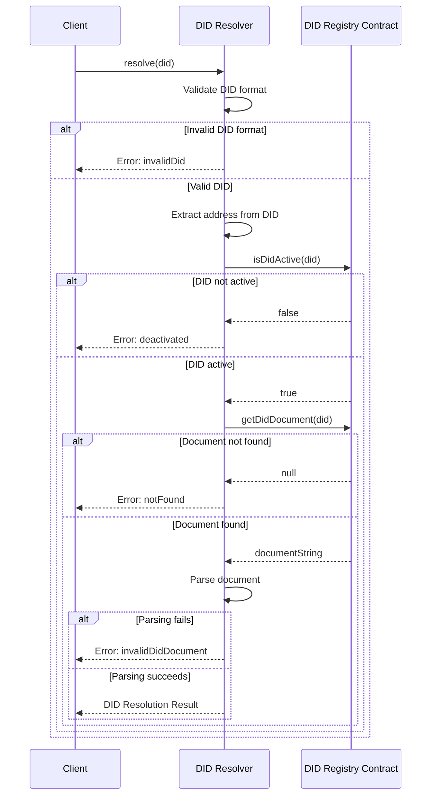

# DID Resolver Service

**Component Type:** Service  
**Path:** `/services/auth/DidResolverService.ts`

## Overview

The DID Resolver Service is responsible for resolving, creating, and managing Decentralized Identifiers (DIDs) within the LEDUP system. It implements W3C DID standard functionality, allowing seamless identity management across the platform.





## DID Resolution Process

The complete DID resolution flow:



## DID Creation and Management

The DID document creation and management process:



## Dependencies

The service relies on several other components:

- **DidRegistryService**: Communicates with the blockchain DID Registry contract
- **DataRegistryService**: (Optional) Provides additional data lookups
- **InvocationContext**: (Optional) Provides logging capabilities

## Data Models

### DID Document

The DID Document follows the W3C DID Core specification structure:

```typescript
interface DidDocument {
  '@context': string[];
  id: string;
  controller?: string[];
  verificationMethod?: VerificationMethod[];
  authentication?: (string | VerificationMethod)[];
  assertionMethod?: (string | VerificationMethod)[];
  keyAgreement?: (string | VerificationMethod)[];
  capabilityInvocation?: (string | VerificationMethod)[];
  capabilityDelegation?: (string | VerificationMethod)[];
  service?: ServiceEndpoint[];
}
```

### Verification Method

Represents cryptographic verification methods within a DID Document:

```typescript
interface VerificationMethod {
  id: string;
  type: string;
  controller: string;
  publicKeyJwk?: {
    kty: string;
    crv: string;
    x: string;
    y?: string;
  };
  publicKeyMultibase?: string;
  blockchainAccountId?: string;
}
```

### Service Endpoint

Defines services associated with the DID:

```typescript
interface ServiceEndpoint {
  id: string;
  type: string;
  serviceEndpoint: string | string[];
  description?: string;
}
```

### DID Resolution Result

The standard format for DID resolution results:

```typescript
interface DidResolutionResult {
  '@context': string;
  didDocument: DidDocument;
  didResolutionMetadata: {
    contentType: string;
    error?: string;
  };
  didDocumentMetadata: {
    created?: string;
    updated?: string;
    deactivated?: boolean;
    versionId?: string;
  };
}
```

## Methods

### resolve

Resolves a DID to its corresponding DID Document.

```typescript
public async resolve(did: string): Promise<DidResolutionResult>
```

**Parameters:**

- `did`: The DID to resolve (e.g., `did:ethr:0x1234567890abcdef1234567890abcdef12345678`)

**Returns:**

- `Promise<DidResolutionResult>`: The DID resolution result containing the DID Document

**Resolution Process:**

1. Validates the DID format
2. Extracts the address from the DID
3. Checks if the DID is active
4. Retrieves the DID Document from the blockchain
5. Parses the DID Document
6. Returns the resolution result

**Error Handling:**

- Returns appropriate error results for invalid DIDs, deactivated DIDs, or not found DIDs

### createDid

Creates a DID from an Ethereum address.

```typescript
public createDid(address: string): string
```

**Parameters:**

- `address`: The Ethereum address

**Returns:**

- `string`: The created DID in the format `did:ethr:{address}`

**Validation:**

- Validates the Ethereum address format before creating the DID

### createDidDocument

Creates a basic DID Document for a new DID.

```typescript
public createDidDocument(did: string, address: string): DidDocument
```

**Parameters:**

- `did`: The DID to create a document for
- `address`: The Ethereum address associated with the DID

**Returns:**

- `DidDocument`: A new DID Document with basic verification methods

**Document Structure:**

- Includes standard W3C DID context
- Sets up verification methods for the Ethereum address
- Configures authentication, assertion, and capability methods

### updateDidDocument

Updates an existing DID Document with new values.

```typescript
public async updateDidDocument(did: string, updates: Partial<DidDocument>): Promise<DidDocument>
```

**Parameters:**

- `did`: The DID to update
- `updates`: Partial DID Document with fields to update

**Returns:**

- `Promise<DidDocument>`: The updated DID Document

**Update Process:**

1. Retrieves the current DID Document
2. Merges the updates with the existing document
3. Updates the document on the blockchain
4. Returns the updated document

### deactivateDid

Deactivates a DID, marking it as no longer active.

```typescript
public async deactivateDid(did: string): Promise<DidResolutionResult>
```

**Parameters:**

- `did`: The DID to deactivate

**Returns:**

- `Promise<DidResolutionResult>`: The resolution result with deactivated status

**Deactivation Process:**

1. Calls the blockchain to deactivate the DID
2. Returns a resolution result indicating deactivation

### verifyCredential

Verifies a Verifiable Credential.

```typescript
public async verifyCredential(credential: VerifiableCredential): Promise<VerificationResults>
```

**Parameters:**

- `credential`: The Verifiable Credential to verify

**Returns:**

- `Promise<VerificationResults>`: Verification results with status and details

**Verification Steps:**

1. Validates the credential structure
2. Checks the issuer's DID status
3. Verifies the credential signature
4. Checks credential status (e.g., revocation)
5. Returns verification results

### getKeyPair

Generates a cryptographic key pair for DID operations.

```typescript
public async getKeyPair(): Promise<string>
```

**Returns:**

- `Promise<string>`: The generated key pair as a JSON string

**Key Pair Generation:**

- Uses the Node.js crypto module to generate a secure key pair
- Returns the key pair in a format suitable for DID operations

### getPublicKey

Retrieves the public key associated with a DID.

```typescript
public async getPublicKey(did: string): Promise<string>
```

**Parameters:**

- `did`: The DID to get the public key for

**Returns:**

- `Promise<string>`: The public key as a string

## Resolution Flow

The DID resolution process follows the W3C DID Resolution specification:



## Error Handling

The service provides standardized error responses:

| Error Code           | Description               | Resolution Response                  |
| -------------------- | ------------------------- | ------------------------------------ |
| `invalidDid`         | DID format is invalid     | Error in didResolutionMetadata       |
| `notFound`           | DID document not found    | Error in didResolutionMetadata       |
| `deactivated`        | DID is deactivated        | Valid document with deactivated flag |
| `invalidDidDocument` | Document cannot be parsed | Error in didResolutionMetadata       |

## Integration Examples

### Resolving a DID

```typescript
// Initialize the DID Resolver Service
const didResolverService = new DidResolverService(didRegistryService);

// Resolve a DID to get its DID Document
try {
  const did = 'did:ethr:0x1234567890abcdef1234567890abcdef12345678';
  const resolutionResult = await didResolverService.resolve(did);

  if (resolutionResult.didResolutionMetadata.error) {
    console.error(`Resolution error: ${resolutionResult.didResolutionMetadata.error}`);
  } else {
    console.log('DID Document:', resolutionResult.didDocument);

    // Check if the DID is deactivated
    if (resolutionResult.didDocumentMetadata.deactivated) {
      console.warn('This DID is deactivated');
    }

    // Extract verification methods
    const verificationMethods = resolutionResult.didDocument.verificationMethod;
    console.log('Verification methods:', verificationMethods);
  }
} catch (error) {
  console.error('DID resolution failed:', error);
}
```

### Creating and Registering a DID

```typescript
// Create a DID for an Ethereum address
const address = '0x1234567890abcdef1234567890abcdef12345678';
const did = didResolverService.createDid(address);

// Create a DID Document
const didDocument = didResolverService.createDidDocument(did, address);

// Register the DID Document (assuming a method exists in the DID Registry Service)
await didRegistryService.registerDid(did, JSON.stringify(didDocument));

console.log(`DID ${did} registered successfully`);
```

### Updating a DID Document

```typescript
// Update a DID Document to add a new service endpoint
const did = 'did:ethr:0x1234567890abcdef1234567890abcdef12345678';

const updates = {
  service: [
    {
      id: `${did}#messaging`,
      type: 'MessagingService',
      serviceEndpoint: 'https://messaging.ledup.io/api',
      description: 'LEDUP secure messaging service',
    },
  ],
};

// Update the DID Document
const updatedDocument = await didResolverService.updateDidDocument(did, updates);

console.log('Updated DID Document:', updatedDocument);
```

## W3C Compliance

This service is designed to comply with:

1. [W3C Decentralized Identifiers (DIDs) v1.0](https://www.w3.org/TR/did-core/)
2. [W3C DID Resolution](https://w3c-ccg.github.io/did-resolution/)
3. [W3C Verifiable Credentials Data Model](https://www.w3.org/TR/vc-data-model/)

The implementation follows the `did:ethr` method specification, which is based on Ethereum addresses.
