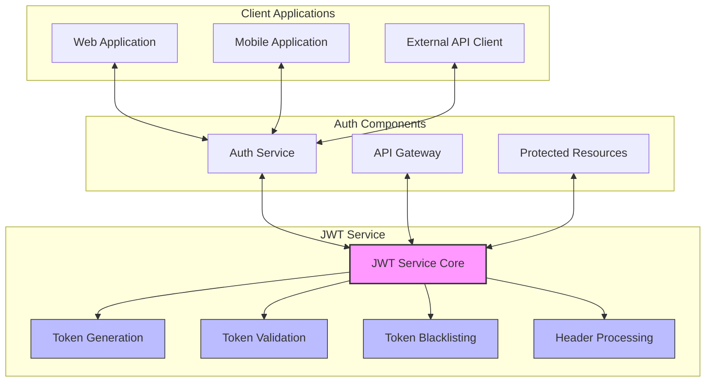
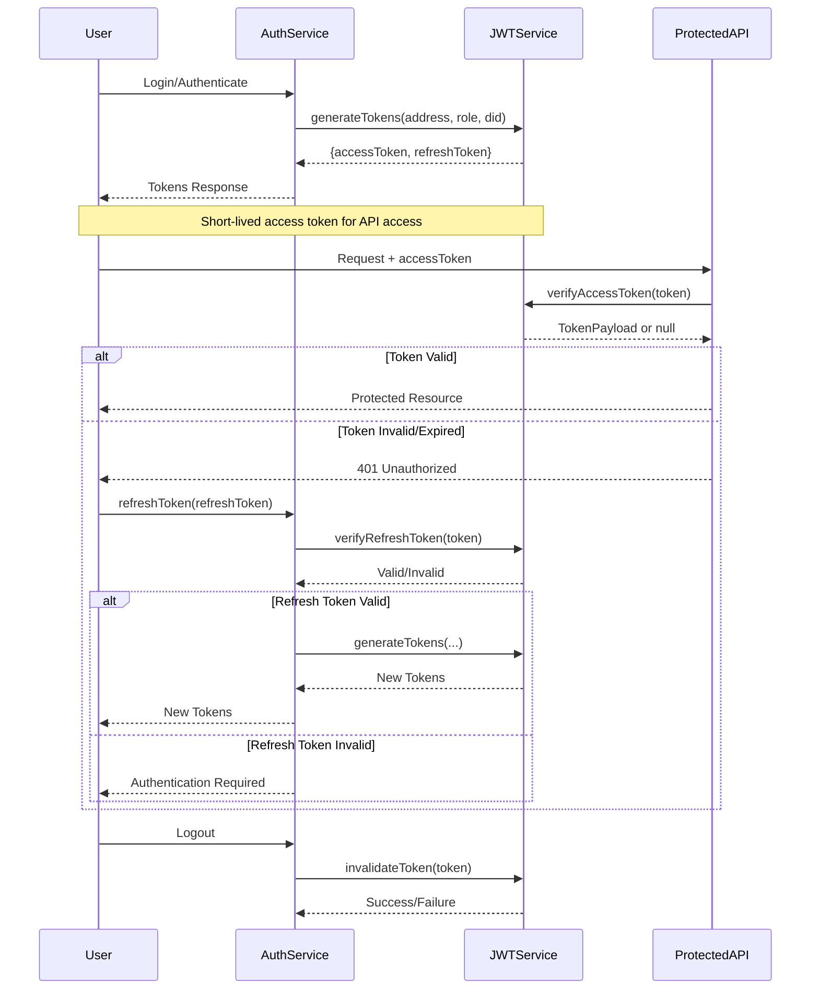
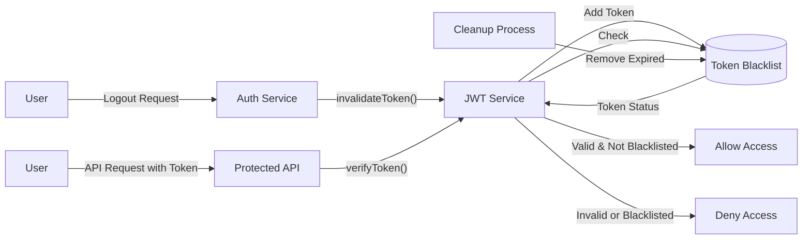

# JWT Service

**Component Type:** Service  
**Path:** `/services/auth/JWTService.ts`

## Overview

The JWT Service is responsible for handling JSON Web Token (JWT) operations within the LEDUP system. It provides functionality for generating, verifying, and managing JWT tokens used for authentication and authorization.



## Token Structure and Flow

The JWT service implements a two-token authentication system:



## Dependencies

The service has minimal external dependencies:

- Node.js **crypto** module for secure random number generation
- **jsonwebtoken** package for JWT operations
- Azure Functions **InvocationContext** for logging

## Configuration

The service is configured with the following parameters, which can be set through environment variables or constructor arguments:

| Parameter            | Environment Variable | Default                   | Description                        |
| -------------------- | -------------------- | ------------------------- | ---------------------------------- |
| Access Token Secret  | `JWT_SECRET`         | "your-secret-key"         | Secret used to sign access tokens  |
| Refresh Token Secret | `JWT_REFRESH_SECRET` | "your-refresh-secret-key" | Secret used to sign refresh tokens |
| Access Token Expiry  | -                    | "1h"                      | Expiration time for access tokens  |
| Refresh Token Expiry | -                    | "7d"                      | Expiration time for refresh tokens |

**Important Security Note**: The default secret keys should only be used for development. In production, secure and strong secret keys should be provided.

## Methods

### generateAccessToken

Generates an access token for a user.

```typescript
public generateAccessToken(address: string, role: UserRole, did?: string): string
```

**Parameters:**

- `address`: The user's Ethereum address
- `role`: The user's role (CONSUMER, PRODUCER, PROVIDER, ADMIN)
- `did`: (Optional) The user's DID

**Returns:**

- `string`: The JWT access token

**Token Payload:**

```json
{
  "sub": "0x1234567890abcdef1234567890abcdef12345678",
  "role": "CONSUMER",
  "did": "did:ethr:0x1234567890abcdef1234567890abcdef12345678",
  "iat": 1617978887,
  "exp": 1617982487
}
```

### generateRefreshToken

Generates a refresh token for a user.

```typescript
public generateRefreshToken(address: string): string
```

**Parameters:**

- `address`: The user's Ethereum address

**Returns:**

- `string`: The JWT refresh token

**Token Payload:**

```json
{
  "sub": "0x1234567890abcdef1234567890abcdef12345678",
  "jti": "b5e8f76d3c8a47e9b1d2a3f4c5e6d7a8",
  "iat": 1617978887,
  "exp": 1618583687
}
```

**Security Features:**

- Includes a unique token ID (jti) to enable token revocation
- Uses a different signing secret than access tokens
- Has a longer expiration time than access tokens

### verifyAccessToken

Verifies an access token.

```typescript
public verifyAccessToken(token: string): TokenPayload | null
```

**Parameters:**

- `token`: The JWT token to verify

**Returns:**

- `TokenPayload | null`: The decoded token payload if valid, null otherwise

**Verification Steps:**

1. Checks if the token is blacklisted
2. Verifies the token signature using the access token secret
3. Checks token expiration
4. Returns the decoded payload or null if verification fails

### verifyRefreshToken

Verifies a refresh token.

```typescript
public verifyRefreshToken(token: string): RefreshTokenPayload | null
```

**Parameters:**

- `token`: The refresh token to verify

**Returns:**

- `RefreshTokenPayload | null`: The decoded refresh token payload if valid, null otherwise

### generateTokens

Generates both access and refresh tokens for a user.

```typescript
public generateTokens(
  address: string,
  role: UserRole,
  did?: string
): {
  accessToken: string;
  refreshToken: string;
  expiresIn: number;
}
```

**Parameters:**

- `address`: The user's Ethereum address
- `role`: The user's role
- `did`: (Optional) The user's DID

**Returns:**

- Object containing:
  - `accessToken`: The generated JWT access token
  - `refreshToken`: The generated JWT refresh token
  - `expiresIn`: The access token expiration time in seconds

### invalidateToken

Invalidates a token by adding it to the blacklist.

```typescript
public async invalidateToken(token: string, address: string): Promise<boolean>
```

**Parameters:**

- `token`: The token to invalidate
- `address`: The associated address (for validation)

**Returns:**

- `Promise<boolean>`: True if the token was invalidated successfully

**Invalidation Process:**

1. Verifies the token belongs to the provided address
2. Adds the token to the blacklist
3. Sets an expiration time for the blacklist entry
4. Returns true if successful

### extractTokenFromHeader

Extracts a JWT token from an Authorization header.

```typescript
public extractTokenFromHeader(authHeader?: string): string | null
```

**Parameters:**

- `authHeader`: The Authorization header value

**Returns:**

- `string | null`: The extracted token or null if not found

**Format Supported:**

- Bearer token format: `Bearer eyJhbGciOiJIUzI1NiIsInR5cCI6IkpXVCJ9...`

### validateTokenFromHeader

Validates a token from an Authorization header.

```typescript
public validateTokenFromHeader(authHeader?: string): TokenPayload
```

**Parameters:**

- `authHeader`: The Authorization header value

**Returns:**

- `TokenPayload`: The decoded token payload

**Throws:**

- `Error` if the header is missing, invalid, or the token is invalid

## Token Management

### Token Blacklisting

The service maintains an in-memory blacklist of invalidated tokens to prevent their reuse:



**Features:**

- Tokens are added to the blacklist on logout or when explicitly invalidated
- Each blacklisted token has an associated expiry time
- A cleanup process removes expired tokens from the blacklist to prevent memory leaks
- Blacklisted tokens are rejected during verification

## Security Considerations

1. **Token Secrets**: Different secrets are used for access and refresh tokens
2. **Token Expiration**: Access tokens have short lifetimes (default 1 hour)
3. **Token Revocation**: Tokens can be invalidated through the blacklist mechanism
4. **Payload Security**: Tokens contain minimal user information to reduce exposure
5. **Header Validation**: Strict Bearer token format enforcement

## Integration Examples

### Token Generation and Verification

```typescript
// Initialize the JWT Service
const jwtService = new JWTService(context);

// Generate tokens for a user
const { accessToken, refreshToken, expiresIn } = jwtService.generateTokens(
  '0x1234567890abcdef1234567890abcdef12345678',
  UserRole.CONSUMER,
  'did:ethr:0x1234567890abcdef1234567890abcdef12345678'
);

// Later, verify the access token
const payload = jwtService.verifyAccessToken(accessToken);

if (payload) {
  console.log('Token is valid');
  console.log(`User: ${payload.sub}`);
  console.log(`Role: ${payload.role}`);
} else {
  console.log('Token is invalid or expired');
}
```

### Token Refresh Flow

```typescript
// When the access token expires, use the refresh token to get new tokens
try {
  // Extract refresh token from request
  const refreshToken = req.body.refreshToken;

  // Verify the refresh token
  const refreshPayload = jwtService.verifyRefreshToken(refreshToken);

  if (!refreshPayload) {
    return { status: 401, body: { error: 'Invalid refresh token' } };
  }

  // Generate new tokens
  const {
    accessToken,
    refreshToken: newRefreshToken,
    expiresIn,
  } = jwtService.generateTokens(
    refreshPayload.sub,
    userRole, // You need to retrieve or determine the user's role
    userDid // You need to retrieve the user's DID if available
  );

  // Return the new tokens
  return {
    status: 200,
    body: { accessToken, refreshToken: newRefreshToken, expiresIn },
  };
} catch (error) {
  return { status: 500, body: { error: 'Token refresh failed' } };
}
```

### Request Authentication

```typescript
// Authenticate a request using the JWT service
function authenticateRequest(req) {
  const authHeader = req.headers.authorization;

  try {
    // Validate the token from the Authorization header
    const payload = jwtService.validateTokenFromHeader(authHeader);

    // User is authenticated, proceed with handling the request
    return { user: { address: payload.sub, role: payload.role, did: payload.did } };
  } catch (error) {
    // Handle authentication errors
    if (error.message.includes('No Authorization header')) {
      return { status: 401, error: 'Authentication required' };
    } else if (error.message.includes('Invalid Authorization header')) {
      return { status: 401, error: 'Invalid authentication format' };
    } else {
      return { status: 401, error: 'Authentication failed' };
    }
  }
}
```
