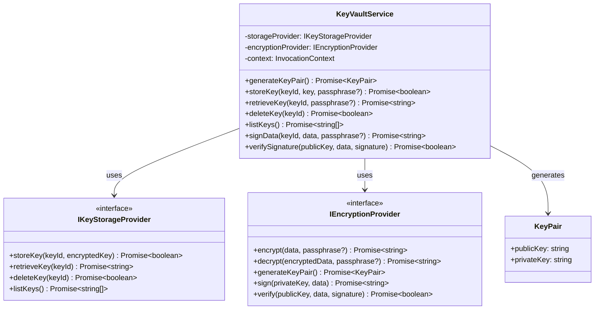
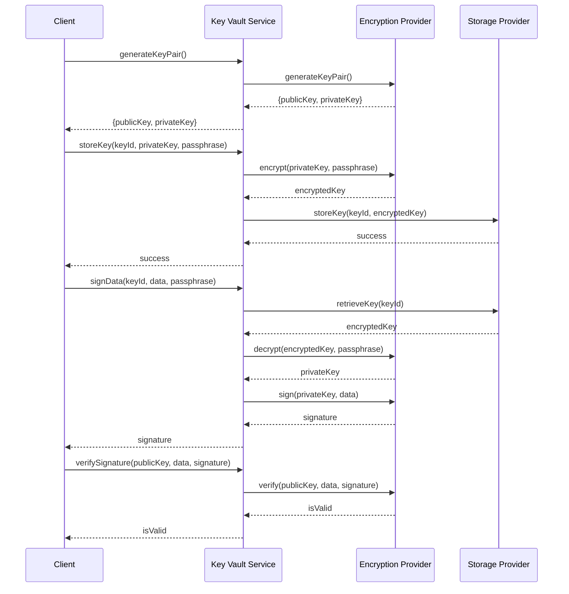
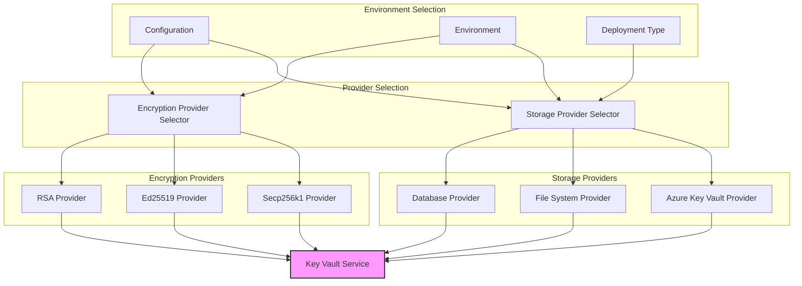

# Key Vault Service

**Component Type:** Service  
**Path:** `/services/auth/KeyVault.service.ts`

## Overview

The Key Vault Service provides secure cryptographic key management functionality for the LEDUP system. It enables the generation, storage, retrieval, and management of cryptographic keys used for signing and verifying operations in DID (Decentralized Identifier) management, authentication, and credential issuance processes.



## Dependencies

The service relies on two key abstractions:

- **IKeyStorageProvider**: Interface for the storage backend that physically stores encrypted keys
- **IEncryptionProvider**: Interface for cryptographic operations (encryption, decryption, signing, verification)
- **InvocationContext**: For logging and contextual operations

## Key Storage Providers

The KeyVaultService supports different storage backends for flexibility and security:

1. **AzureKeyVaultProvider**: Uses Azure Key Vault for secure cloud storage
2. **FileSystemProvider**: Stores encrypted keys on the local filesystem (for development)
3. **DatabaseProvider**: Stores encrypted keys in a database

## Encryption Providers

The system supports multiple cryptographic implementations:

1. **Secp256k1Provider**: Default provider for Ethereum-compatible cryptography
2. **Ed25519Provider**: Alternative for enhanced security in specific scenarios
3. **RSAProvider**: For compatibility with certain legacy systems

## Methods

### generateKeyPair

Generates a new cryptographic key pair.

```typescript
public async generateKeyPair(): Promise<KeyPair>
```

**Returns:**

- `Promise<KeyPair>`: Object containing publicKey and privateKey strings

**Process:**

1. Delegates to the configured encryption provider to generate a key pair
2. Returns the generated key pair

### storeKey

Securely stores a cryptographic key.

```typescript
public async storeKey(
  keyId: string,
  key: string,
  passphrase?: string
): Promise<boolean>
```

**Parameters:**

- `keyId`: Unique identifier for the key
- `key`: The cryptographic key to store (often a private key)
- `passphrase`: Optional passphrase for additional encryption

**Returns:**

- `Promise<boolean>`: True if storage is successful, false otherwise

**Process:**

1. Encrypts the key using the encryption provider
2. Stores the encrypted key in the storage provider
3. Returns the success status

### retrieveKey

Retrieves and decrypts a stored key.

```typescript
public async retrieveKey(
  keyId: string,
  passphrase?: string
): Promise<string>
```

**Parameters:**

- `keyId`: Identifier of the key to retrieve
- `passphrase`: Optional passphrase needed for decryption

**Returns:**

- `Promise<string>`: The decrypted key

**Process:**

1. Retrieves the encrypted key from the storage provider
2. Decrypts the key using the encryption provider
3. Returns the decrypted key

### deleteKey

Removes a key from storage.

```typescript
public async deleteKey(keyId: string): Promise<boolean>
```

**Parameters:**

- `keyId`: Identifier of the key to delete

**Returns:**

- `Promise<boolean>`: True if deletion is successful, false otherwise

### listKeys

Lists all stored key identifiers.

```typescript
public async listKeys(): Promise<string[]>
```

**Returns:**

- `Promise<string[]>`: Array of key identifiers

### signData

Signs data using a stored private key.

```typescript
public async signData(
  keyId: string,
  data: string | Buffer,
  passphrase?: string
): Promise<string>
```

**Parameters:**

- `keyId`: Identifier of the private key to use for signing
- `data`: Data to sign (string or Buffer)
- `passphrase`: Optional passphrase to decrypt the private key

**Returns:**

- `Promise<string>`: The cryptographic signature

**Process:**

1. Retrieves and decrypts the private key
2. Signs the data using the encryption provider
3. Returns the signature

### verifySignature

Verifies a signature against data using a public key.

```typescript
public async verifySignature(
  publicKey: string,
  data: string | Buffer,
  signature: string
): Promise<boolean>
```

**Parameters:**

- `publicKey`: Public key to use for verification
- `data`: Original data that was signed
- `signature`: Signature to verify

**Returns:**

- `Promise<boolean>`: True if the signature is valid, false otherwise

## Key Management Workflow

The key management process in the LEDUP system:



## Encryption and Storage Provider Selection

The Key Vault Service is designed with flexible provider architecture:



## Key Rotation and Security

The Key Vault Service implements several security best practices:

1. **Key Rotation**: Supports automatic and manual key rotation
2. **Encrypted Storage**: Keys are always encrypted at rest
3. **Secure Passphrase Management**: Optional passphrase protection for keys
4. **Minimal Key Exposure**: Private keys are decrypted only when needed
5. **Audit Logging**: All key operations are logged for audit purposes

## Error Handling

The KeyVaultService implements comprehensive error handling:

| Error Condition      | Status Code | Error Message                          |
| -------------------- | ----------- | -------------------------------------- |
| Key not found        | 404         | Key with ID '{keyId}' not found        |
| Invalid passphrase   | 401         | Invalid passphrase for key '{keyId}'   |
| Storage failure      | 500         | Failed to store key '{keyId}'          |
| Encryption failure   | 500         | Failed to encrypt data                 |
| Decryption failure   | 500         | Failed to decrypt key '{keyId}'        |
| Signing failure      | 500         | Failed to sign data with key '{keyId}' |
| Verification failure | 400         | Failed to verify signature             |

## Integration Examples

### Generating and Storing a Key Pair

```typescript
// Initialize the Key Vault Service
const keyVaultService = new KeyVaultService(storageProvider, encryptionProvider, context);

// Generate a new key pair
try {
  const keyPair = await keyVaultService.generateKeyPair();
  console.log('Public Key:', keyPair.publicKey);

  // Store the private key securely
  const keyId = 'did-signing-key-1';
  const passphrase = 'secure-passphrase'; // Optional, but recommended

  const success = await keyVaultService.storeKey(keyId, keyPair.privateKey, passphrase);

  if (success) {
    console.log(`Private key stored successfully with ID: ${keyId}`);
  } else {
    console.error('Failed to store private key');
  }

  // The public key can be shared and doesn't need to be stored in the vault
} catch (error) {
  console.error('Key generation or storage failed:', error);
}
```

### Signing and Verifying Data

```typescript
// Sign data with a stored key
const keyId = 'did-signing-key-1';
const passphrase = 'secure-passphrase';
const dataToSign = JSON.stringify({
  did: 'did:ethr:0x1234567890abcdef1234567890abcdef12345678',
  timestamp: Date.now(),
});

try {
  // Sign the data
  const signature = await keyVaultService.signData(keyId, dataToSign, passphrase);
  console.log('Signature:', signature);

  // Retrieve the public key (could be stored elsewhere or retrieved from the DID document)
  const publicKey = '04a5...'; // Public key corresponding to the private key

  // Verify the signature
  const isValid = await keyVaultService.verifySignature(publicKey, dataToSign, signature);

  if (isValid) {
    console.log('Signature is valid');
  } else {
    console.log('Signature verification failed');
  }
} catch (error) {
  console.error('Signing or verification failed:', error);
}
```

### Key Management Operations

```typescript
// List all stored keys
try {
  const keys = await keyVaultService.listKeys();
  console.log('Stored keys:', keys);

  // Delete a key that's no longer needed
  if (keys.includes('old-key-id')) {
    const deleted = await keyVaultService.deleteKey('old-key-id');

    if (deleted) {
      console.log('Old key deleted successfully');
    } else {
      console.log('Failed to delete old key');
    }
  }
} catch (error) {
  console.error('Key management operation failed:', error);
}
```

## Security Considerations

When using the Key Vault Service, consider these security aspects:

1. **Physical Security**: Ensure the storage medium is physically secure
2. **Network Security**: Use TLS for all communication with remote key stores
3. **Access Control**: Implement proper access controls to key storage
4. **Passphrase Management**: Use secure passphrase management practices
5. **Key Lifecycle**: Implement proper key lifecycle management including rotation
6. **Backup Strategy**: Implement secure backup strategies for critical keys
7. **Separation of Concerns**: Use different keys for different purposes
