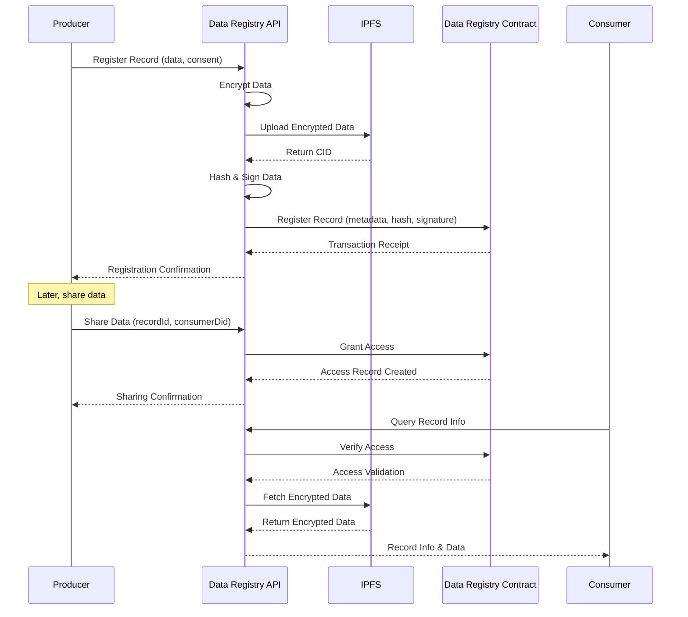

# Data Registry API Reference

## Overview

The Data Registry API provides a set of HTTP endpoints implemented as Azure Functions for managing health data records on the LEDUP platform. These functions enable secure data registration, sharing, querying, and management with blockchain-based verification and access control.

## Data Registry Workflow



## API Endpoints

### Record Management

#### Register Producer Record

Registers a new health data record for a producer, encrypting the data and storing it on IPFS.

**Endpoint:** `POST /data-registry/producer/register-record`

**Request Body:**

```json
{
  "ownerDid": "did:ledup:producer:123456789",
  "producer": "0x1234567890abcdef1234567890abcdef12345678",
  "consent": 1,
  "data": {
    "id": "record-123456",
    "resourceType": "HealthRecord",
    "content": {
      "patientId": "patient-987654",
      "observations": [
        {
          "code": "8867-4",
          "value": 72,
          "unit": "bpm"
        }
      ]
    }
  }
}
```

**Parameters:**

- `ownerDid` (string, required): Decentralized Identifier of the producer/owner
- `producer` (string, required): Ethereum address of the data producer
- `consent` (number, required): Consent status (0 = Not Given, 1 = Given, 2 = Revoked)
- `data` (object, required): The health data to register, containing at minimum:
  - `id` (string, required): Unique identifier for the record
  - `resourceType` (string, required): Type of the health resource

**Response (200 OK):**

```json
{
  "success": true,
  "data": {
    "receipt": {
      "transactionHash": "0x1234567890abcdef1234567890abcdef1234567890abcdef1234567890abcdef",
      "blockNumber": 12345678,
      "events": {
        "RecordRegistered": {
          "recordId": "record-123456",
          "producer": "0x1234567890abcdef1234567890abcdef12345678",
          "ownerDid": "did:ledup:producer:123456789"
        }
      }
    },
    "recordData": {
      "recordId": "record-123456",
      "producer": "0x1234567890abcdef1234567890abcdef12345678",
      "signature": "0x1234567890abcdef1234567890abcdef1234567890abcdef1234567890abcdef1b",
      "resourceType": "HealthRecord",
      "consent": 1,
      "metadata": {
        "url": "https://ipfs.io/ipfs/QmX1bUuJBkHnBUHFG8qxvLsBQPtLkxXp6DuXwVQESEzMVL",
        "cid": "QmX1bUuJBkHnBUHFG8qxvLsBQPtLkxXp6DuXwVQESEzMVL",
        "hash": "0x7b226964223a2272656332222c22726573736f75726365223a2274797022c2269642273a2"
      }
    }
  }
}
```

**Error Response (500 Internal Server Error):**

```json
{
  "success": false,
  "error": "Error registering producer record",
  "message": "Failed to register producer record"
}
```

#### Share Data

Shares a data record with a specific consumer by granting them access rights.

**Endpoint:** `POST /data-registry/share-data`

**Request Body:**

```json
{
  "recordId": "record-123456",
  "consumerDid": "did:ledup:consumer:987654321",
  "ownerDid": "did:ledup:producer:123456789"
}
```

**Parameters:**

- `recordId` (string, required): Unique identifier of the record to share
- `consumerDid` (string, required): Decentralized Identifier of the consumer to grant access
- `ownerDid` (string, required): Decentralized Identifier of the record owner

**Response (200 OK):**

```json
{
  "success": true,
  "data": {
    "receipt": {
      "transactionHash": "0x1234567890abcdef1234567890abcdef1234567890abcdef1234567890abcdef",
      "blockNumber": 12345678,
      "events": {
        "DataShared": {
          "recordId": "record-123456",
          "ownerDid": "did:ledup:producer:123456789",
          "consumerDid": "did:ledup:consumer:987654321",
          "expirationTime": 36000
        }
      }
    },
    "recordId": "record-123456",
    "consumerDid": "did:ledup:consumer:987654321",
    "ownerDid": "did:ledup:producer:123456789"
  }
}
```

**Error Response (500 Internal Server Error):**

```json
{
  "success": false,
  "error": "Failed to share data: access denied",
  "message": "Failed to share data"
}
```

#### Update Producer Record

Updates an existing health data record with new data.

**Endpoint:** `PUT /data-registry/producer/update-record`

**Request Body:**

```json
{
  "recordId": "record-123456",
  "producer": "0x1234567890abcdef1234567890abcdef12345678",
  "ownerDid": "did:ledup:producer:123456789",
  "data": {
    "id": "record-123456",
    "resourceType": "HealthRecord",
    "content": {
      "patientId": "patient-987654",
      "observations": [
        {
          "code": "8867-4",
          "value": 75,
          "unit": "bpm"
        }
      ]
    }
  }
}
```

**Parameters:**

- `recordId` (string, required): Unique identifier of the record to update
- `producer` (string, required): Ethereum address of the data producer
- `ownerDid` (string, required): Decentralized Identifier of the record owner
- `data` (object, required): The updated health data

**Response (200 OK):**

```json
{
  "success": true,
  "data": {
    "receipt": {
      "transactionHash": "0x1234567890abcdef1234567890abcdef1234567890abcdef1234567890abcdef",
      "blockNumber": 12345678,
      "events": {
        "RecordUpdated": {
          "recordId": "record-123456",
          "producer": "0x1234567890abcdef1234567890abcdef12345678",
          "ownerDid": "did:ledup:producer:123456789"
        }
      }
    },
    "recordData": {
      "recordId": "record-123456",
      "producer": "0x1234567890abcdef1234567890abcdef12345678",
      "signature": "0x1234567890abcdef1234567890abcdef1234567890abcdef1234567890abcdef1b",
      "metadata": {
        "url": "https://ipfs.io/ipfs/QmY9cxiHqTFoWamkQVkpmmqzBrY3WEeCURGALSxu5EgLdT",
        "cid": "QmY9cxiHqTFoWamkQVkpmmqzBrY3WEeCURGALSxu5EgLdT",
        "hash": "0x7b226964223a2272656332222c22726573736f75726365223a2274797022c2269642273a2"
      }
    }
  }
}
```

**Error Response (500 Internal Server Error):**

```json
{
  "success": false,
  "error": "Error updating producer record",
  "message": "Failed to update producer record"
}
```

### Record Queries

#### Get Producer Records

Retrieves all records associated with a specific producer.

**Endpoint:** `GET /data-registry/producer/records?producer={producer}`

**Query Parameters:**

- `producer` (string, required): Ethereum address of the data producer

**Response (200 OK):**

```json
{
  "success": true,
  "data": {
    "status": 1,
    "consent": 1,
    "records": [
      {
        "signature": "0x1234567890abcdef1234567890abcdef1234567890abcdef1234567890abcdef1b",
        "resourceType": "HealthRecord",
        "cid": "QmX1bUuJBkHnBUHFG8qxvLsBQPtLkxXp6DuXwVQESEzMVL",
        "url": "https://ipfs.io/ipfs/QmX1bUuJBkHnBUHFG8qxvLsBQPtLkxXp6DuXwVQESEzMVL",
        "hash": "0x7b226964223a2272656332222c22726573736f75726365223a2274797022c2269642273a2",
        "isVerified": false
      }
    ],
    "recordIds": ["record-123456"],
    "nonce": 1
  }
}
```

**Error Response (500 Internal Server Error):**

```json
{
  "success": false,
  "error": "Error retrieving producer records",
  "message": "Failed to retrieve producer records"
}
```

#### Get Producer Record Info

Retrieves detailed information about a specific producer record.

**Endpoint:** `GET /data-registry/producer/record-info?producer={producer}&recordId={recordId}`

**Query Parameters:**

- `producer` (string, required): Ethereum address of the data producer
- `recordId` (string, required): Unique identifier of the record

**Response (200 OK):**

```json
{
  "success": true,
  "data": {
    "signature": "0x1234567890abcdef1234567890abcdef1234567890abcdef1234567890abcdef1b",
    "resourceType": "HealthRecord",
    "metadata": {
      "url": "https://ipfs.io/ipfs/QmX1bUuJBkHnBUHFG8qxvLsBQPtLkxXp6DuXwVQESEzMVL",
      "cid": "QmX1bUuJBkHnBUHFG8qxvLsBQPtLkxXp6DuXwVQESEzMVL",
      "hash": "0x7b226964223a2272656332222c22726573736f75726365223a2274797022c2269642273a2"
    },
    "status": 1,
    "consent": 1,
    "lastUpdated": 1648641321
  }
}
```

**Error Response (500 Internal Server Error):**

```json
{
  "success": false,
  "error": "Error retrieving producer record info",
  "message": "Failed to retrieve producer record info"
}
```

#### Get Record Info

Retrieves general information about a record without producer-specific details.

**Endpoint:** `GET /data-registry/record-info?recordId={recordId}`

**Query Parameters:**

- `recordId` (string, required): Unique identifier of the record

**Response (200 OK):**

```json
{
  "success": true,
  "data": {
    "producer": "0x1234567890abcdef1234567890abcdef12345678",
    "provider": "0x9876543210fedcba9876543210fedcba98765432",
    "resourceType": "HealthRecord",
    "status": 1,
    "createdAt": 1648641321,
    "lastUpdated": 1648641321
  }
}
```

**Error Response (500 Internal Server Error):**

```json
{
  "success": false,
  "error": "Error retrieving record info",
  "message": "Failed to retrieve record info"
}
```

#### Get Total Records Count

Retrieves the total count of records in the registry.

**Endpoint:** `GET /data-registry/total-records-count`

**Response (200 OK):**

```json
{
  "success": true,
  "data": {
    "count": 42
  }
}
```

**Error Response (500 Internal Server Error):**

```json
{
  "success": false,
  "error": "Error retrieving total records count",
  "message": "Failed to retrieve total records count"
}
```

### Record Status Management

#### Update Producer Record Status

Updates the status of a producer's record.

**Endpoint:** `PUT /data-registry/producer/record-status`

**Request Body:**

```json
{
  "recordId": "record-123456",
  "producer": "0x1234567890abcdef1234567890abcdef12345678",
  "status": 2
}
```

**Parameters:**

- `recordId` (string, required): Unique identifier of the record
- `producer` (string, required): Ethereum address of the data producer
- `status` (number, required): New status value (1 = Active, 2 = Inactive, 3 = Archived)

**Response (200 OK):**

```json
{
  "success": true,
  "data": {
    "receipt": {
      "transactionHash": "0x1234567890abcdef1234567890abcdef1234567890abcdef1234567890abcdef",
      "blockNumber": 12345678,
      "events": {
        "RecordStatusUpdated": {
          "recordId": "record-123456",
          "producer": "0x1234567890abcdef1234567890abcdef12345678",
          "oldStatus": 1,
          "newStatus": 2
        }
      }
    },
    "recordId": "record-123456",
    "producer": "0x1234567890abcdef1234567890abcdef12345678",
    "oldStatus": 1,
    "newStatus": 2
  }
}
```

**Error Response (500 Internal Server Error):**

```json
{
  "success": false,
  "error": "Error updating producer record status",
  "message": "Failed to update producer record status"
}
```

#### Get Producer Record Status

Retrieves the current status of a producer's record.

**Endpoint:** `GET /data-registry/producer/record-status?producer={producer}&recordId={recordId}`

**Query Parameters:**

- `producer` (string, required): Ethereum address of the data producer
- `recordId` (string, required): Unique identifier of the record

**Response (200 OK):**

```json
{
  "success": true,
  "data": {
    "status": 2,
    "description": "Inactive"
  }
}
```

**Error Response (500 Internal Server Error):**

```json
{
  "success": false,
  "error": "Error retrieving producer record status",
  "message": "Failed to retrieve producer record status"
}
```

### Metadata Management

#### Update Producer Record Metadata

Updates the metadata of a producer's record without changing the data itself.

**Endpoint:** `PUT /data-registry/producer/record-metadata`

**Request Body:**

```json
{
  "recordId": "record-123456",
  "producer": "0x1234567890abcdef1234567890abcdef12345678",
  "metadata": {
    "tags": ["cardiology", "heart-rate"],
    "category": "vital-signs",
    "description": "Heart rate monitoring data"
  }
}
```

**Parameters:**

- `recordId` (string, required): Unique identifier of the record
- `producer` (string, required): Ethereum address of the data producer
- `metadata` (object, required): The updated metadata object

**Response (200 OK):**

```json
{
  "success": true,
  "data": {
    "receipt": {
      "transactionHash": "0x1234567890abcdef1234567890abcdef1234567890abcdef1234567890abcdef",
      "blockNumber": 12345678,
      "events": {
        "RecordMetadataUpdated": {
          "recordId": "record-123456",
          "producer": "0x1234567890abcdef1234567890abcdef12345678"
        }
      }
    },
    "recordId": "record-123456",
    "producer": "0x1234567890abcdef1234567890abcdef12345678",
    "metadata": {
      "url": "https://ipfs.io/ipfs/QmZ9cxiHqTFoWamkQVkpmmqzBrY3WEeCURGALSxu5EgLdT",
      "cid": "QmZ9cxiHqTFoWamkQVkpmmqzBrY3WEeCURGALSxu5EgLdT",
      "hash": "0x8c226964223a2272656332222c22726573736f75726365223a2274797022c2269642273a2"
    }
  }
}
```

**Error Response (500 Internal Server Error):**

```json
{
  "success": false,
  "error": "Error updating producer record metadata",
  "message": "Failed to update producer record metadata"
}
```

#### Update Provider Record Schema

Updates the schema definition for a provider's record type.

**Endpoint:** `PUT /data-registry/provider/record-schema`

**Request Body:**

```json
{
  "provider": "0x9876543210fedcba9876543210fedcba98765432",
  "resourceType": "HealthRecord",
  "schemaUrl": "https://schema.ledup.io/healthrecord-v2.json"
}
```

**Parameters:**

- `provider` (string, required): Ethereum address of the healthcare provider
- `resourceType` (string, required): Type of the health resource
- `schemaUrl` (string, required): URL to the JSON Schema definition

**Response (200 OK):**

```json
{
  "success": true,
  "data": {
    "receipt": {
      "transactionHash": "0x1234567890abcdef1234567890abcdef1234567890abcdef1234567890abcdef",
      "blockNumber": 12345678,
      "events": {
        "ProviderSchemaUpdated": {
          "provider": "0x9876543210fedcba9876543210fedcba98765432",
          "resourceType": "HealthRecord",
          "schemaUrl": "https://schema.ledup.io/healthrecord-v2.json"
        }
      }
    },
    "provider": "0x9876543210fedcba9876543210fedcba98765432",
    "resourceType": "HealthRecord",
    "schemaUrl": "https://schema.ledup.io/healthrecord-v2.json"
  }
}
```

**Error Response (500 Internal Server Error):**

```json
{
  "success": false,
  "error": "Error updating provider record schema",
  "message": "Failed to update provider record schema"
}
```

### Consent Management

#### Update Producer Consent

Updates the consent status for a producer.

**Endpoint:** `PUT /data-registry/producer/consent`

**Request Body:**

```json
{
  "producer": "0x1234567890abcdef1234567890abcdef12345678",
  "consent": 2
}
```

**Parameters:**

- `producer` (string, required): Ethereum address of the data producer
- `consent` (number, required): New consent status (0 = Not Given, 1 = Given, 2 = Revoked)

**Response (200 OK):**

```json
{
  "success": true,
  "data": {
    "receipt": {
      "transactionHash": "0x1234567890abcdef1234567890abcdef1234567890abcdef1234567890abcdef",
      "blockNumber": 12345678,
      "events": {
        "ProducerConsentUpdated": {
          "producer": "0x1234567890abcdef1234567890abcdef12345678",
          "oldConsent": 1,
          "newConsent": 2
        }
      }
    },
    "producer": "0x1234567890abcdef1234567890abcdef12345678",
    "oldConsent": 1,
    "newConsent": 2
  }
}
```

**Error Response (500 Internal Server Error):**

```json
{
  "success": false,
  "error": "Error updating producer consent",
  "message": "Failed to update producer consent"
}
```

### Verification

#### Verify Data

Verifies the authenticity and integrity of a producer's data record.

**Endpoint:** `POST /data-registry/verify-data`

**Request Body:**

```json
{
  "recordId": "record-123456",
  "producer": "0x1234567890abcdef1234567890abcdef12345678",
  "data": {
    "id": "record-123456",
    "resourceType": "HealthRecord",
    "content": {
      "patientId": "patient-987654",
      "observations": [
        {
          "code": "8867-4",
          "value": 72,
          "unit": "bpm"
        }
      ]
    }
  }
}
```

**Parameters:**

- `recordId` (string, required): Unique identifier of the record
- `producer` (string, required): Ethereum address of the data producer
- `data` (object, required): The data to verify against the stored record

**Response (200 OK):**

```json
{
  "success": true,
  "data": {
    "isValid": true,
    "recordId": "record-123456",
    "producer": "0x1234567890abcdef1234567890abcdef12345678",
    "verificationDetails": {
      "hashMatch": true,
      "signatureMatch": true,
      "recordExists": true
    }
  }
}
```

**Error Response (500 Internal Server Error):**

```json
{
  "success": false,
  "error": "Error verifying data",
  "message": "Failed to verify data"
}
```

### Producer Registration

#### Check Producer Exists

Checks if a producer is registered in the system.

**Endpoint:** `GET /data-registry/producer-exists?producer={producer}`

**Query Parameters:**

- `producer` (string, required): Ethereum address of the data producer

**Response (200 OK):**

```json
{
  "success": true,
  "data": {
    "exists": true,
    "producer": "0x1234567890abcdef1234567890abcdef12345678",
    "registeredSince": 1648641321
  }
}
```

**Error Response (500 Internal Server Error):**

```json
{
  "success": false,
  "error": "Error checking producer existence",
  "message": "Failed to check if producer exists"
}
```

#### Register Producer

Registers a new producer in the system.

**Endpoint:** `POST /data-registry/register-producer`

**Request Body:**

```json
{
  "producer": "0x1234567890abcdef1234567890abcdef12345678",
  "ownerDid": "did:ledup:producer:123456789",
  "metadata": {
    "name": "John Doe",
    "email": "john.doe@example.com"
  }
}
```

**Parameters:**

- `producer` (string, required): Ethereum address of the data producer
- `ownerDid` (string, required): Decentralized Identifier of the producer/owner
- `metadata` (object, optional): Additional producer metadata

**Response (200 OK):**

```json
{
  "success": true,
  "data": {
    "receipt": {
      "transactionHash": "0x1234567890abcdef1234567890abcdef1234567890abcdef1234567890abcdef",
      "blockNumber": 12345678,
      "events": {
        "ProducerRegistered": {
          "producer": "0x1234567890abcdef1234567890abcdef12345678",
          "ownerDid": "did:ledup:producer:123456789"
        }
      }
    },
    "producer": "0x1234567890abcdef1234567890abcdef12345678",
    "ownerDid": "did:ledup:producer:123456789"
  }
}
```

**Error Response (500 Internal Server Error):**

```json
{
  "success": false,
  "error": "Error registering producer",
  "message": "Failed to register producer"
}
```

### System Management

#### Get Pause State

Retrieves the current pause state of the Data Registry contract.

**Endpoint:** `GET /data-registry/pause-state`

**Response (200 OK):**

```json
{
  "success": true,
  "data": {
    "isPaused": false
  }
}
```

**Error Response (500 Internal Server Error):**

```json
{
  "success": false,
  "error": "Error retrieving pause state",
  "message": "Failed to retrieve pause state"
}
```

#### Change Pause State

Updates the pause state of the Data Registry contract.

**Endpoint:** `PUT /data-registry/pause-state`

**Request Body:**

```json
{
  "paused": true
}
```

**Parameters:**

- `paused` (boolean, required): New pause state (true to pause, false to unpause)

**Response (200 OK):**

```json
{
  "success": true,
  "data": {
    "receipt": {
      "transactionHash": "0x1234567890abcdef1234567890abcdef1234567890abcdef1234567890abcdef",
      "blockNumber": 12345678,
      "events": {
        "Paused": {
          "account": "0x9876543210fedcba9876543210fedcba98765432"
        }
      }
    },
    "paused": true
  }
}
```

**Error Response (500 Internal Server Error):**

```json
{
  "success": false,
  "error": "Error changing pause state",
  "message": "Failed to change pause state"
}
```

## Security Considerations

### Authentication

- Administrative functions like changing the pause state require appropriate authorization roles.
- Record updates can only be made by the producer who owns the record or an authorized provider.
- Access to records is controlled through blockchain-based permissions and verified for each request.

### Data Encryption

- All health data is encrypted before being stored on IPFS.
- Data is signed with the producer's private key to ensure authenticity.
- Hash verification is used to ensure data integrity throughout its lifecycle.

### Access Control

- Data sharing is explicitly managed through blockchain-based access control.
- Records can only be shared by the owner with specific consumer DIDs.
- Access can be time-limited using expiration settings.

## Integration Examples

### Registering and Updating Health Records

```typescript
import axios from 'axios';

/**
 * Registers a new health record
 * @param {object} recordData - The record data and metadata
 * @returns {Promise<object>} - Record registration result
 */
const registerHealthRecord = async (recordData) => {
  try {
    const response = await axios.post('/data-registry/producer/register-record', recordData);
    return response.data.data;
  } catch (error) {
    console.error('Record registration failed:', error.response?.data || error.message);
    throw new Error('Failed to register health record');
  }
};

/**
 * Updates an existing health record
 * @param {object} updateData - The updated record data
 * @returns {Promise<object>} - Record update result
 */
const updateHealthRecord = async (updateData) => {
  try {
    const response = await axios.put('/data-registry/producer/update-record', updateData);
    return response.data.data;
  } catch (error) {
    console.error('Record update failed:', error.response?.data || error.message);
    throw new Error('Failed to update health record');
  }
};

// Usage example
const main = async () => {
  const producerAddress = '0x1234567890abcdef1234567890abcdef12345678';
  const ownerDid = 'did:ledup:producer:123456789';

  try {
    // Register a new health record
    const healthRecord = {
      ownerDid,
      producer: producerAddress,
      consent: 1,
      data: {
        id: `record-${Date.now()}`,
        resourceType: 'HealthRecord',
        content: {
          patientId: 'patient-987654',
          observations: [
            {
              code: '8867-4',
              value: 72,
              unit: 'bpm',
            },
          ],
        },
      },
    };

    const registration = await registerHealthRecord(healthRecord);
    console.log('Record registered successfully!');
    console.log(`Record ID: ${registration.recordData.recordId}`);
    console.log(`Transaction hash: ${registration.receipt.transactionHash}`);

    // Later, update the record
    const recordId = registration.recordData.recordId;
    const updatedRecord = {
      recordId,
      producer: producerAddress,
      ownerDid,
      data: {
        id: recordId,
        resourceType: 'HealthRecord',
        content: {
          patientId: 'patient-987654',
          observations: [
            {
              code: '8867-4',
              value: 75, // Updated value
              unit: 'bpm',
            },
            {
              code: '9279-1', // Added new observation
              value: 98.6,
              unit: 'F',
            },
          ],
        },
      },
    };

    const update = await updateHealthRecord(updatedRecord);
    console.log('Record updated successfully!');
    console.log(`Transaction hash: ${update.receipt.transactionHash}`);
  } catch (error) {
    console.error('Error:', error.message);
  }
};
```

### Sharing and Verifying Data

```typescript
import axios from 'axios';

/**
 * Shares a health record with a consumer
 * @param {string} recordId - The record ID to share
 * @param {string} consumerDid - The consumer's DID
 * @param {string} ownerDid - The owner's DID
 * @returns {Promise<object>} - Sharing result
 */
const shareHealthRecord = async (recordId, consumerDid, ownerDid) => {
  try {
    const response = await axios.post('/data-registry/share-data', {
      recordId,
      consumerDid,
      ownerDid,
    });
    return response.data.data;
  } catch (error) {
    console.error('Data sharing failed:', error.response?.data || error.message);
    throw new Error('Failed to share health record');
  }
};

/**
 * Verifies the integrity of a health record
 * @param {string} recordId - The record ID to verify
 * @param {string} producer - The producer's address
 * @param {object} data - The data to verify
 * @returns {Promise<object>} - Verification result
 */
const verifyHealthRecord = async (recordId, producer, data) => {
  try {
    const response = await axios.post('/data-registry/verify-data', {
      recordId,
      producer,
      data,
    });
    return response.data.data;
  } catch (error) {
    console.error('Data verification failed:', error.response?.data || error.message);
    throw new Error('Failed to verify health record');
  }
};

// Usage example
const main = async () => {
  const recordId = 'record-123456';
  const producerAddress = '0x1234567890abcdef1234567890abcdef12345678';
  const ownerDid = 'did:ledup:producer:123456789';
  const consumerDid = 'did:ledup:consumer:987654321';

  try {
    // Share the record with a consumer
    const sharingResult = await shareHealthRecord(recordId, consumerDid, ownerDid);
    console.log('Record shared successfully!');
    console.log(`Transaction hash: ${sharingResult.receipt.transactionHash}`);

    // Later, verify the record integrity
    const recordData = {
      id: recordId,
      resourceType: 'HealthRecord',
      content: {
        patientId: 'patient-987654',
        observations: [
          {
            code: '8867-4',
            value: 75,
            unit: 'bpm',
          },
        ],
      },
    };

    const verificationResult = await verifyHealthRecord(recordId, producerAddress, recordData);

    if (verificationResult.isValid) {
      console.log('Record verified successfully!');
      console.log('Hash match:', verificationResult.verificationDetails.hashMatch);
      console.log('Signature match:', verificationResult.verificationDetails.signatureMatch);
    } else {
      console.warn('Record verification failed.');
      console.warn('Verification details:', verificationResult.verificationDetails);
    }
  } catch (error) {
    console.error('Error:', error.message);
  }
};
```

## Implementation Details

### Register Producer Record Function

The register producer record function (`registerProducerRecord.ts`) handles the complete workflow for storing health data:

1. Receives the record data including ownerDid, producer address, consent status, and the health data
2. Encrypts the data using a secure encryption key
3. Uploads the encrypted data to IPFS and receives a Content Identifier (CID)
4. Hashes the original data and signs it with the system wallet
5. Creates a metadata object with the IPFS URL, CID, and data hash
6. Initializes the DataRegistryService with the contract address and ABI
7. Registers the producer record on the blockchain with all the necessary information
8. Returns a structured response with the transaction receipt and record details

This function ensures secure and verifiable storage of health data with clear ownership tracking.

### Share Data Function

The share data function (`shareData.ts`) enables controlled access to health records:

1. Receives the record ID, consumer DID, and owner DID from the request
2. Initializes the DataRegistryService with the contract address and ABI
3. Calls the smart contract to create an access record with the specified expiration time
4. Returns a structured response with the transaction receipt and sharing details

This function implements the core data sharing capability of the LEDUP platform, enabling secure and controlled access to health data.

---

© 2025 LEDUP | Documentation for Production Use | Last Updated: March 2025
