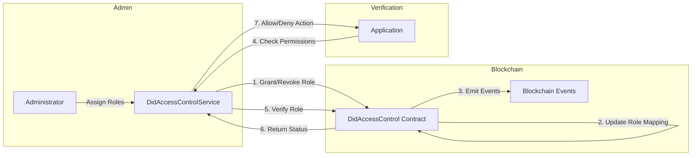
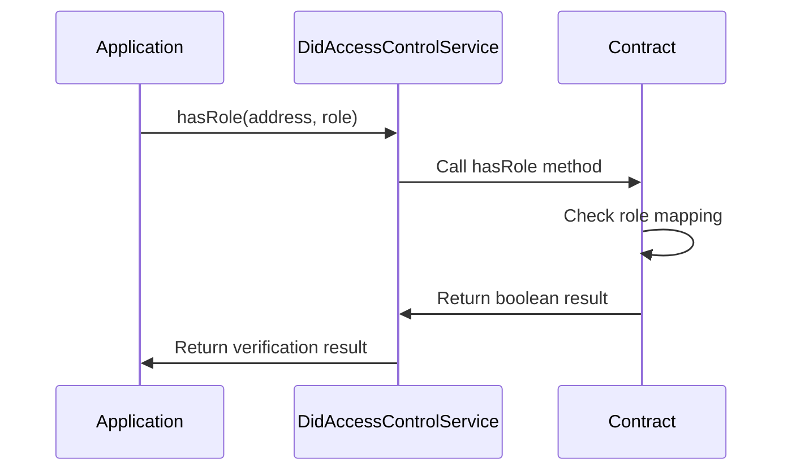
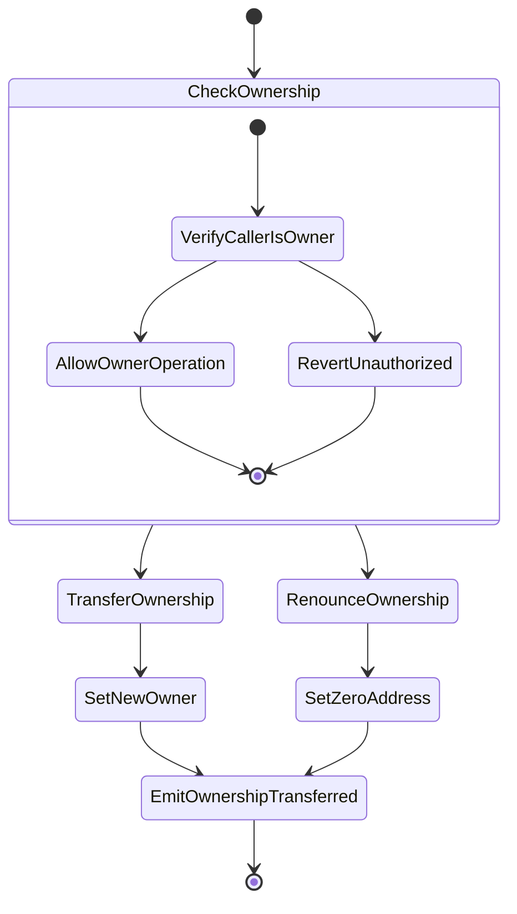
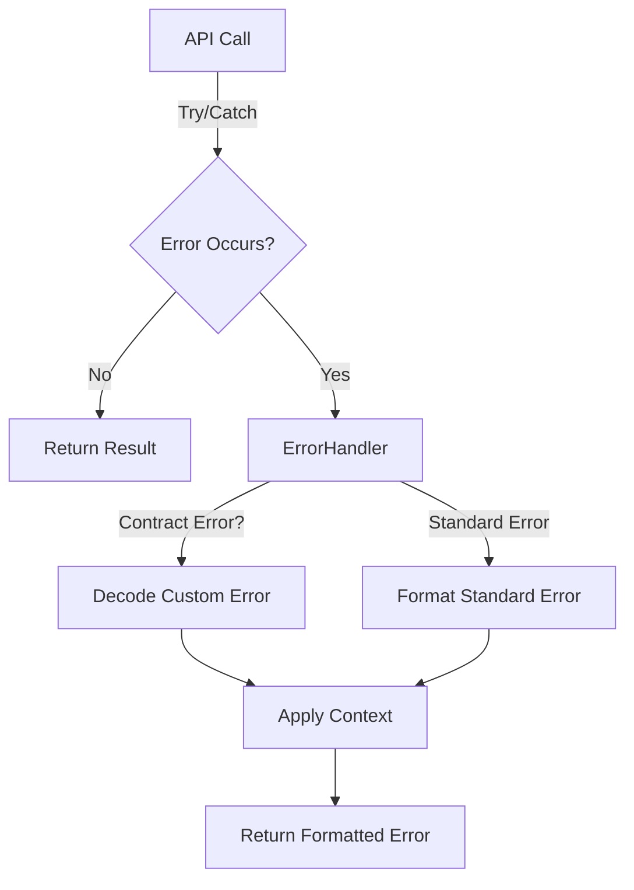
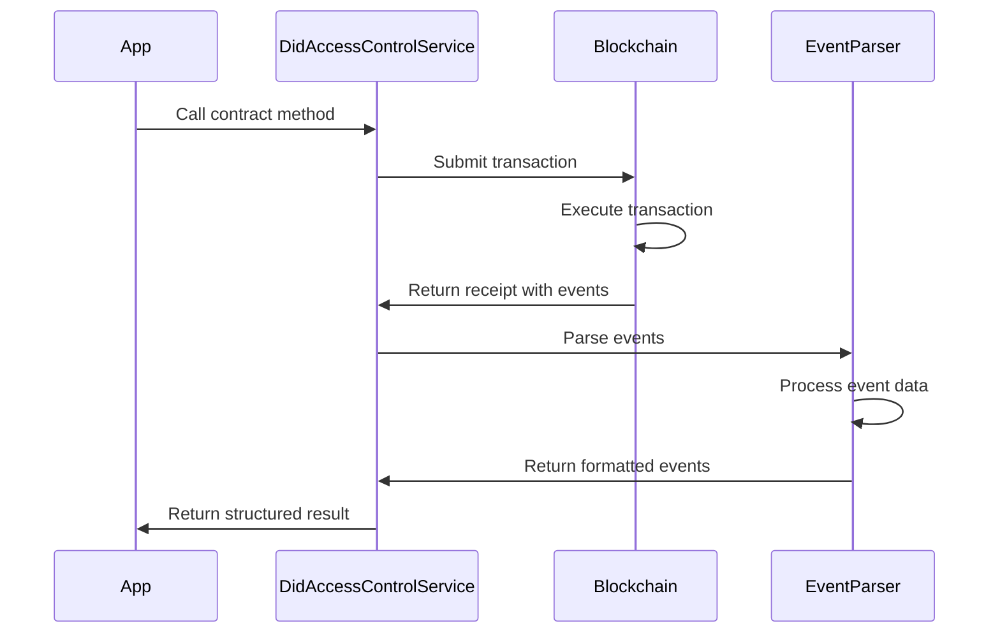

# LEDUP - DID Access Control Service API

**Version:** 1.0.0  
**Last Updated:** March 2025  
**Status:** Production

## Overview

The DID Access Control Service provides a TypeScript interface for interacting with the DidAccessControl smart contract in the LEDUP ecosystem. This service manages role-based access control for addresses and DIDs, enabling secure authorization across the platform and determining what actions different participants can perform.

## Key Features

### Role Management



The service enables comprehensive role management for addresses:

```typescript
// Grant producer role to an address
const grantResult = await didAccessControlService.grantRole('0x1234567890AbCdEf1234567890aBcDeF12345678', 'PRODUCER');
console.log(`Role granted: ${grantResult.description}`);

// Revoke consumer role from an address
const revokeResult = await didAccessControlService.revokeRole('0x1234567890AbCdEf1234567890aBcDeF12345678', 'CONSUMER');
console.log(`Role revoked: ${revokeResult.description}`);
```

### Role Verification



The service provides convenient methods to check roles:

```typescript
// Check if an address has a specific role
const hasRole = await didAccessControlService.hasRole('0x1234567890AbCdEf1234567890aBcDeF12345678', 'CONSUMER');
console.log(`Has consumer role: ${hasRole}`);

// Use helper methods for specific roles
const isProducer = await didAccessControlService.isProducer('0x1234567890AbCdEf1234567890aBcDeF12345678');
console.log(`Is producer: ${isProducer}`);

// Get the primary role for an address
const userRole = await didAccessControlService.getRoleForAddress('0x1234567890AbCdEf1234567890aBcDeF12345678');
console.log(`User role: ${userRole}`);
```

### Ownership Management



The service allows management of contract ownership:

```typescript
// Transfer ownership to a new address
const transferResult = await didAccessControlService.transferOwnership('0xNewOwnerAddress1234567890AbCdEf1234567890');
console.log(`Ownership transferred: ${transferResult.description}`);

// Renounce ownership (sets owner to zero address)
const renounceResult = await didAccessControlService.renounceOwnership();
console.log(`Ownership renounced: ${renounceResult.description}`);
```

## Error Handling

The DID Access Control Service includes robust error handling through the `DidAccessControlErrorHandler` class, which translates blockchain errors into user-friendly messages.



### Common Errors

The service handles the following contract-specific errors:

| Error Code                          | Description             | User-Friendly Message                                           |
| ----------------------------------- | ----------------------- | --------------------------------------------------------------- |
| `AccessControl__AddressZero`        | Zero address provided   | "Invalid address: Cannot use the zero address"                  |
| `AccessControl__RoleRevoked`        | Role already revoked    | "Role already revoked: The address doesn't have this role"      |
| `AccessControl__RoleAlreadyGranted` | Role already granted    | "Role already granted: The address already has this role"       |
| `AccessControlUnauthorizedAccount`  | Caller lacks permission | "Unauthorized: Account has insufficient permissions"            |
| `OwnableUnauthorizedAccount`        | Caller is not owner     | "Unauthorized: Only the contract owner can perform this action" |
| `OwnableInvalidOwner`               | Invalid owner address   | "Invalid owner: The provided address cannot be the owner"       |

### Error Handling Example

```typescript
try {
  // Attempt to grant a role without proper permissions
  await didAccessControlService.grantRole('0xSomeAddress', 'ADMIN');
} catch (error) {
  console.error(error.message);
  // Output: "Unauthorized: Only the contract owner can perform this action"

  // Check for specific error type
  if (didAccessControlService.isErrorType(error, 'OwnableUnauthorizedAccount')) {
    console.log('You need to be the contract owner to perform this action');
  }
}
```

## Event Parsing

The service includes a comprehensive event parsing system through the `DidAccessControlEventParser` class, which transforms blockchain events into structured and informative data objects.



### Supported Events

The service parses the following contract events:

| Event Name             | Description                    | Enriched Data                                     |
| ---------------------- | ------------------------------ | ------------------------------------------------- |
| `RoleGranted`          | Emitted when a role is granted | Role, account, sender, timestamp, description     |
| `RoleRevoked`          | Emitted when a role is revoked | Role, account, sender, timestamp, description     |
| `OwnershipTransferred` | Emitted when ownership changes | Previous owner, new owner, timestamp, description |

### Event Listening

The service provides a method to listen for events:

```typescript
// Listen for role granted events
const unsubscribe = didAccessControlService.listenForEvents(
  'RoleGranted',
  { role: 'PRODUCER' }, // Optional filter
  (event) => {
    console.log(`Role granted event: ${event.description}`);
    console.log(`Address: ${event.account}, Role: ${event.role}`);
  }
);

// Later, when done listening
unsubscribe();
```

## API Reference

### DidAccessControlService

```typescript
class DidAccessControlService {
  /**
   * Creates a new instance of the DidAccessControlService
   * @param contractAddress The address of the DID Access Control contract
   * @param abi The ABI of the DID Access Control contract
   */
  constructor(contractAddress: string, abi: any);

  /**
   * Grants a role to an address
   * @param address The address to grant the role to
   * @param role The role to grant
   * @returns A promise that resolves to the formatted transaction receipt
   */
  async grantRole(address: string, role: string): Promise<Record<string, any>>;

  /**
   * Revokes a role from an address
   * @param address The address to revoke the role from
   * @param role The role to revoke
   * @returns A promise that resolves to the formatted transaction receipt
   */
  async revokeRole(address: string, role: string): Promise<Record<string, any>>;

  /**
   * Checks if an address has a specific role
   * @param address The address to check
   * @param role The role to check for
   * @returns A promise that resolves to a boolean indicating if the address has the role
   */
  async hasRole(address: string, role: string): Promise<boolean>;

  /**
   * Checks if an address has the producer role
   * @param address The address to check
   * @returns A promise that resolves to a boolean indicating if the address has the producer role
   */
  async isProducer(address: string): Promise<boolean>;

  /**
   * Checks if an address has the consumer role
   * @param address The address to check
   * @returns A promise that resolves to a boolean indicating if the address has the consumer role
   */
  async isConsumer(address: string): Promise<boolean>;

  /**
   * Checks if an address has the service provider role
   * @param address The address to check
   * @returns A promise that resolves to a boolean indicating if the address has the service provider role
   */
  async isServiceProvider(address: string): Promise<boolean>;

  /**
   * Checks if an address has the admin role
   * @param address The address to check
   * @returns A promise that resolves to a boolean indicating if the address has the admin role
   */
  async isAdmin(address: string): Promise<boolean>;

  /**
   * Gets the role for an address
   * @param address The address to check
   * @returns A promise that resolves to the user role, or null if no role is found
   */
  async getRoleForAddress(address: string): Promise<UserRole | null>;

  /**
   * Transfers ownership of the contract to a new owner
   * @param newOwner The address of the new owner
   * @returns A promise that resolves to the formatted transaction receipt
   */
  async transferOwnership(newOwner: string): Promise<Record<string, any>>;

  /**
   * Renounces ownership of the contract
   * @returns A promise that resolves to the formatted transaction receipt
   */
  async renounceOwnership(): Promise<Record<string, any>>;

  /**
   * Checks if a specific error occurred
   * @param error The error to check
   * @param errorName The name of the error to check for
   * @returns True if the error matches the specified name
   */
  isErrorType(error: any, errorName: string): boolean;

  /**
   * Listens for events from the contract
   * @param eventName The name of the event to listen for
   * @param filter Optional filter for the event
   * @param callback Callback function to handle the parsed event
   * @returns A function to remove the event listener
   */
  listenForEvents(eventName: string, filter: any, callback: (event: any) => void): () => void;
}
```

### Types

```typescript
/**
 * Enumeration of user roles in the system
 */
enum UserRole {
  PRODUCER = 'PRODUCER',
  CONSUMER = 'CONSUMER',
  PROVIDER = 'PROVIDER',
  ADMIN = 'ADMIN',
}
```

## Integration Examples

### Role Assignment and Verification

```typescript
import { DidAccessControlService } from './services/contracts';
import { UserRole } from './types/auth-types';

// Initialize the service
const didAccessControlService = new DidAccessControlService(
  '0x1234567890AbCdEf1234567890aBcDeF12345678',
  didAccessControlAbi
);

// Assign roles to different participants
async function setupRoles() {
  try {
    // Grant producer role to a data provider
    const producerResult = await didAccessControlService.grantRole('0xProducerAddress', UserRole.PRODUCER);
    console.log(`Producer role granted: ${producerResult.description}`);

    // Grant consumer role to a data consumer
    const consumerResult = await didAccessControlService.grantRole('0xConsumerAddress', UserRole.CONSUMER);
    console.log(`Consumer role granted: ${consumerResult.description}`);

    return { producerResult, consumerResult };
  } catch (error) {
    console.error('Error setting up roles:', error.message);
    throw error;
  }
}

// Check user permissions before allowing an action
async function checkUserPermission(address, requiredRole) {
  try {
    const hasRole = await didAccessControlService.hasRole(address, requiredRole);

    if (hasRole) {
      console.log(`User ${address} has permission for role ${requiredRole}`);
      return true;
    } else {
      console.log(`User ${address} does not have required role ${requiredRole}`);
      return false;
    }
  } catch (error) {
    console.error('Permission check failed:', error.message);
    return false;
  }
}
```

### Role-Based Action Control

```typescript
// Implement role-based access control in your application
async function controlDataAccess(userAddress, dataId) {
  try {
    // Check if the user is a consumer
    const isConsumer = await didAccessControlService.isConsumer(userAddress);

    if (isConsumer) {
      console.log(`User ${userAddress} is authorized to access data ${dataId}`);
      return {
        authorized: true,
        data: await fetchData(dataId),
      };
    } else {
      console.log(`User ${userAddress} is not authorized to access data ${dataId}`);
      return {
        authorized: false,
        message: 'You must have the CONSUMER role to access this data',
      };
    }
  } catch (error) {
    console.error('Authorization check failed:', error.message);
    return {
      authorized: false,
      message: 'Error checking authorization',
    };
  }
}

// Check for multiple roles
async function getUserDashboard(userAddress) {
  try {
    const role = await didAccessControlService.getRoleForAddress(userAddress);

    switch (role) {
      case UserRole.PRODUCER:
        return loadProducerDashboard(userAddress);
      case UserRole.CONSUMER:
        return loadConsumerDashboard(userAddress);
      case UserRole.PROVIDER:
        return loadProviderDashboard(userAddress);
      case UserRole.ADMIN:
        return loadAdminDashboard(userAddress);
      default:
        return loadGuestDashboard();
    }
  } catch (error) {
    console.error('Error loading dashboard:', error.message);
    return loadErrorDashboard(error.message);
  }
}
```

### Administrative Functions

```typescript
// Administrative functions
async function transferContractControl(currentOwner, newOwner) {
  try {
    // Verify current owner has admin role
    const isAdmin = await didAccessControlService.isAdmin(currentOwner);

    if (!isAdmin) {
      throw new Error('Only administrators can transfer contract control');
    }

    // Transfer ownership
    const result = await didAccessControlService.transferOwnership(newOwner);
    console.log(`Ownership transferred: ${result.description}`);

    // Grant admin role to new owner
    await didAccessControlService.grantRole(newOwner, UserRole.ADMIN);

    return result;
  } catch (error) {
    console.error('Error transferring control:', error.message);
    throw error;
  }
}
```

## Summary

The DID Access Control Service provides a robust interface for role-based access control in the LEDUP platform, enabling:

1. **Fine-grained permission management** through role assignment and revocation
2. **Simplified role verification** with convenient helper methods
3. **Contract ownership management** for administrative control
4. **Comprehensive error handling** with user-friendly messages
5. **Event-based monitoring** for auditing role changes

This service is essential for enforcing access control policies across the platform, ensuring that only authorized users can perform specific actions with health data and system functions.

---

**© 2025 LEDUP - All rights reserved.**
