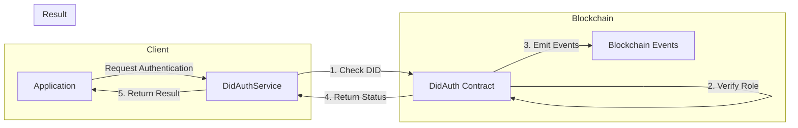
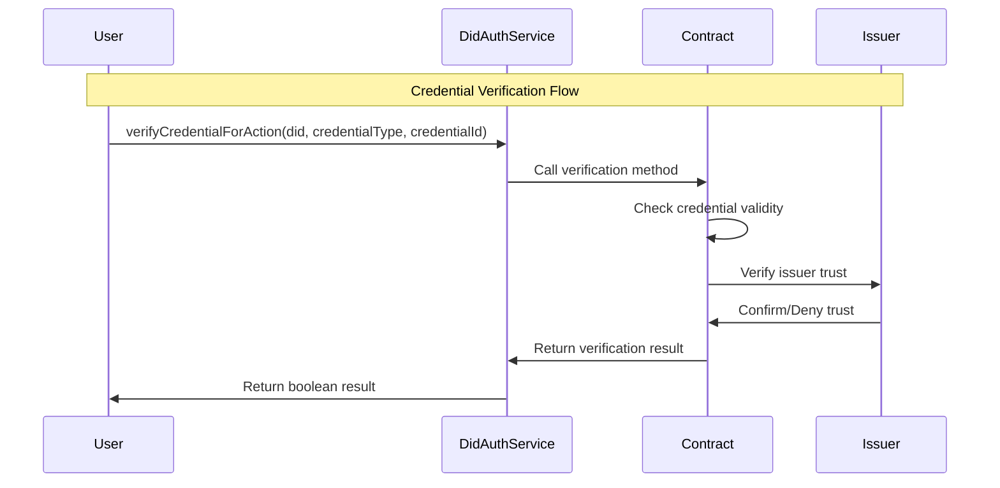
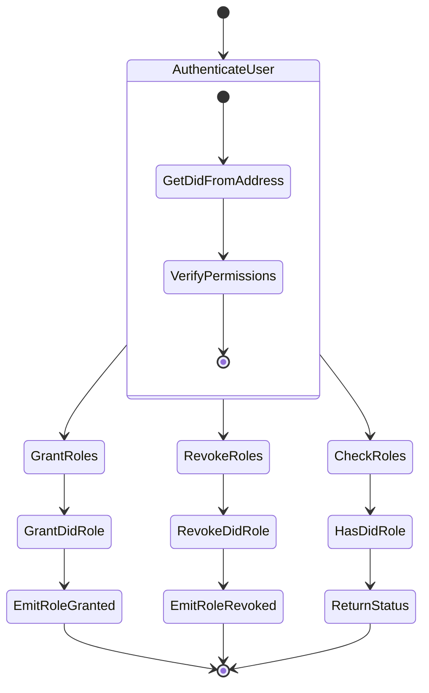
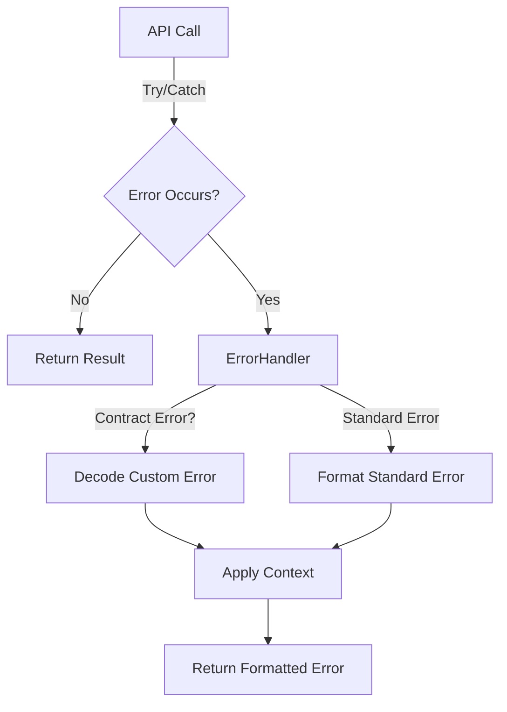
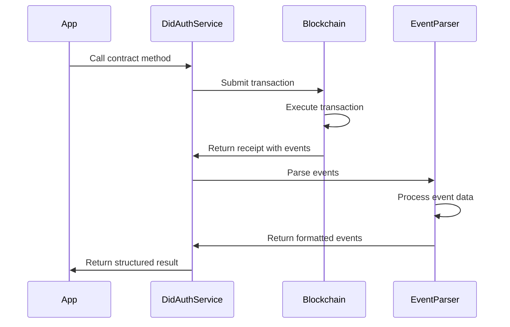

# LEDUP - DID Authentication Service API

**Version:** 1.0.0  
**Last Updated:** March 2025  
**Status:** Production

## Overview

The DID Authentication Service provides a TypeScript interface for interacting with the DidAuth smart contract in the LEDUP ecosystem. This service handles authentication and authorization using Decentralized Identifiers (DIDs), manages roles and credentials, and provides secure access control for the platform.

## Key Features

### Role-Based Authentication



The service enables secure role-based authentication:

```typescript
// Authenticate a DID for a specific role
const isAuthorized = await didAuthService.authenticate('did:ledup:user123', didAuthService.PRODUCER_ROLE);

if (isAuthorized) {
  console.log('User is authorized as a producer');
} else {
  console.log('User is not authorized as a producer');
}
```

### Credential Verification



The service provides methods for verifying credentials:

```typescript
// Verify a credential for an action
const isValid = await didAuthService.verifyCredentialForAction(
  'did:ledup:user123',
  didAuthService.PRODUCER_CREDENTIAL,
  'credential-567'
);

console.log(`Credential verification status: ${isValid ? 'Valid' : 'Invalid'}`);
```

### Role Management



The service enables role management for DIDs:

```typescript
// Grant a role to a DID (requires admin permission)
const grantResult = await didAuthService.grantDidRole('did:ledup:user123', didAuthService.CONSUMER_ROLE);
console.log(`Role granted: ${grantResult.description}`);

// Check if a DID has a role
const hasRole = await didAuthService.hasDidRole('did:ledup:user123', didAuthService.CONSUMER_ROLE);
console.log(`Has consumer role: ${hasRole}`);

// Revoke a role from a DID (requires admin permission)
const revokeResult = await didAuthService.revokeDidRole('did:ledup:user123', didAuthService.CONSUMER_ROLE);
console.log(`Role revoked: ${revokeResult.description}`);
```

## Error Handling

The DID Authentication Service includes robust error handling through the `DidAuthErrorHandler` class, which translates blockchain errors into user-friendly messages.



### Common Errors

The service handles the following contract-specific errors:

| Error Code                              | Description              | User-Friendly Message                                                  |
| --------------------------------------- | ------------------------ | ---------------------------------------------------------------------- |
| `DidAuth__Unauthorized`                 | User lacks permissions   | "Unauthorized: You do not have permission to perform this action"      |
| `DidAuth__InvalidDID`                   | DID format is invalid    | "Invalid DID: The DID format is invalid or does not exist"             |
| `DidAuth__DeactivatedDID`               | DID has been deactivated | "Deactivated DID: The DID has been deactivated and cannot be used"     |
| `DidAuth__InvalidCredential`            | Credential is invalid    | "Invalid credential: The credential is invalid or has expired"         |
| `DidAuth__InvalidRole`                  | Role doesn't exist       | "Invalid role: The specified role is invalid or does not exist"        |
| `DidAuth__CredentialVerificationFailed` | Verification failed      | "Credential verification failed: The credential could not be verified" |

### Error Handling Example

```typescript
try {
  await didAuthService.grantDidRole('did:ledup:user123', didAuthService.ADMIN_ROLE);
} catch (error) {
  console.error(error.message);
  // Output: "Unauthorized: You do not have permission to perform this action"
}
```

## Event Parsing

The service includes a comprehensive event parsing system through the `DidAuthEventParser` class, which transforms blockchain events into structured and informative data objects.



### Supported Events

The service parses the following contract events:

| Event Name                     | Description                                | Enriched Data                                          |
| ------------------------------ | ------------------------------------------ | ------------------------------------------------------ |
| `AuthenticationSuccessful`     | Emitted when authentication succeeds       | DID, role, timestamp, description                      |
| `AuthenticationFailed`         | Emitted when authentication fails          | DID, role, reason, timestamp                           |
| `CredentialVerified`           | Emitted when a credential is verified      | DID, credential type, credential ID, timestamp         |
| `CredentialVerificationFailed` | Emitted when credential verification fails | DID, credential type, credential ID, reason, timestamp |
| `RoleGranted`                  | Emitted when a role is granted             | DID, role, grantor, timestamp                          |
| `RoleRevoked`                  | Emitted when a role is revoked             | DID, role, revoker, timestamp                          |

### Event Listening

The service provides a method to listen for events:

```typescript
// Listen for authentication events
const unsubscribe = didAuthService.listenForEvents(
  'AuthenticationSuccessful',
  { did: 'did:ledup:user123' }, // Optional filter
  (event) => {
    console.log(`Authentication event: ${event.description}`);
    console.log(`Role: ${event.role}, Timestamp: ${event.timestamp}`);
  }
);

// Later, when done listening
unsubscribe();
```

## API Reference

### DidAuthService

```typescript
class DidAuthService {
  // Role constants to match the contract
  public readonly ADMIN_ROLE: string;
  public readonly PRODUCER_ROLE: string;
  public readonly CONSUMER_ROLE: string;
  public readonly PROVIDER_ROLE: string;
  public readonly ISSUER_ROLE: string;
  public readonly OPERATOR_ROLE: string;
  public readonly VERIFIER_ROLE: string;
  public readonly DEFAULT_ADMIN_ROLE: string;

  // Credential type constants
  public readonly PRODUCER_CREDENTIAL: string;
  public readonly CONSUMER_CREDENTIAL: string;
  public readonly PROVIDER_CREDENTIAL: string;

  /**
   * Creates a new instance of the DidAuthService
   * @param contractAddress The address of the DID Auth contract
   * @param abi The ABI of the DID Auth contract
   */
  constructor(contractAddress: string, abi: any);

  /**
   * Authenticates a DID with a specific role
   * @param did The DID to authenticate
   * @param role The role to authenticate the DID with (bytes32 hash)
   * @returns A promise that resolves to a boolean indicating if the authentication was successful
   */
  async authenticate(did: string, role: string): Promise<boolean>;

  /**
   * Gets the DID for an Ethereum address
   * @param address The Ethereum address to get the DID for
   * @returns A promise that resolves to the DID string
   */
  async getDidFromAddress(address: string): Promise<string>;

  /**
   * Gets the required credential type for a role
   * @param role The role to get the credential type for (bytes32 hash)
   * @returns A promise that resolves to the credential type string
   */
  async getRequiredCredentialForRole(role: string): Promise<string>;

  /**
   * Verifies a credential for a specific action
   * @param did The DID to verify the credential for
   * @param credentialType The type of credential to verify
   * @param credentialId The ID of the credential to verify
   * @returns A promise that resolves to a boolean indicating if the credential is valid
   */
  async verifyCredentialForAction(did: string, credentialType: string, credentialId: string): Promise<boolean>;

  /**
   * Checks if a DID has the required roles and credentials
   * @param did The DID to check
   * @param roles An array of roles to check (bytes32 hashes)
   * @param credentialIds An array of credential IDs to check
   * @returns A promise that resolves to a boolean indicating if the DID has all required roles and credentials
   */
  async hasRequiredRolesAndCredentials(did: string, roles: string[], credentialIds: string[]): Promise<boolean>;

  /**
   * Checks if a DID has a specific role
   * @param did The DID to check
   * @param role The role to check for (bytes32 hash)
   * @returns A promise that resolves to a boolean indicating if the DID has the role
   */
  async hasDidRole(did: string, role: string): Promise<boolean>;

  /**
   * Grants a role to a DID
   * @param did The DID to grant the role to
   * @param role The role to grant (bytes32 hash)
   * @returns A promise that resolves to the formatted transaction receipt
   */
  async grantDidRole(did: string, role: string): Promise<Record<string, any>>;

  /**
   * Revokes a role from a DID
   * @param did The DID to revoke the role from
   * @param role The role to revoke (bytes32 hash)
   * @returns A promise that resolves to the formatted transaction receipt
   */
  async revokeDidRole(did: string, role: string): Promise<Record<string, any>>;

  /**
   * Sets the requirement for a role
   * @param role The role to set the requirement for (bytes32 hash)
   * @param requirement The requirement string
   * @returns A promise that resolves to the formatted transaction receipt
   */
  async setRoleRequirement(role: string, requirement: string): Promise<Record<string, any>>;

  /**
   * Gets the requirement for a role
   * @param role The role to get the requirement for (bytes32 hash)
   * @returns A promise that resolves to the requirement string
   */
  async getRoleRequirement(role: string): Promise<string>;

  /**
   * Checks if an issuer is trusted for a credential type
   * @param credentialType The type of credential
   * @param issuer The address of the issuer
   * @returns A promise that resolves to a boolean indicating if the issuer is trusted
   */
  async isTrustedIssuer(credentialType: string, issuer: string): Promise<boolean>;

  /**
   * Sets whether an issuer is trusted for a credential type
   * @param credentialType The type of credential
   * @param issuer The address of the issuer
   * @param trusted Whether the issuer should be trusted
   * @returns A promise that resolves to the formatted transaction receipt
   */
  async setTrustedIssuer(credentialType: string, issuer: string, trusted: boolean): Promise<Record<string, any>>;

  /**
   * Issues a credential to a DID
   * @param credentialType The type of credential to issue
   * @param did The DID to issue the credential to
   * @param credentialId The ID of the credential
   * @returns A promise that resolves to the formatted transaction receipt
   */
  async issueCredential(credentialType: string, did: string, credentialId: string): Promise<Record<string, any>>;

  /**
   * Gets the DID of the caller
   * @returns A promise that resolves to the caller's DID
   */
  async getCallerDid(): Promise<string>;

  /**
   * Resolves a DID to an Ethereum address
   * @param did The DID to resolve
   * @returns A promise that resolves to the Ethereum address
   */
  async resolveDid(did: string): Promise<string>;

  /**
   * Authenticates a DID with a specific role (alias for authenticate)
   * @param did The DID to authenticate
   * @param role The role to authenticate with
   * @returns A promise that resolves to a boolean indicating if the authentication was successful
   */
  async authenticateDid(did: string, role: string): Promise<boolean>;

  /**
   * Gets all roles assigned to a DID
   * @param did The DID to get roles for
   * @returns A promise that resolves to an array of role strings
   */
  async getUserRolesByDid(did: string): Promise<string[]>;

  /**
   * Gets all roles assigned to an Ethereum address
   * @param address The Ethereum address to get roles for
   * @returns A promise that resolves to an array of role strings
   */
  async getUserRolesByAddress(address: string): Promise<string[]>;

  /**
   * Checks if an error is of a specific type
   * @param error The error to check
   * @param errorName The name of the error
   * @returns A boolean indicating if the error is of the specified type
   */
  isErrorType(error: any, errorName: string): boolean;

  /**
   * Listens for contract events
   * @param eventName The name of the event to listen for
   * @param filter Optional filter for the events
   * @param callback The callback function to call when events are emitted
   * @returns A function to unsubscribe from the events
   */
  listenForEvents(eventName: string, filter: any, callback: (event: any) => void): () => void;
}
```

## Integration Examples

### Basic Authentication

```typescript
import { DidAuthService } from './services/contracts';

// Initialize the service
const didAuthService = new DidAuthService('0x1234567890AbCdEf1234567890aBcDeF12345678', didAuthAbi);

// Authenticate a user for a specific role
async function authenticateUser(did, role) {
  try {
    const isAuthenticated = await didAuthService.authenticate(did, role);

    if (isAuthenticated) {
      console.log(`User ${did} authenticated successfully for role ${role}`);
      return true;
    } else {
      console.log(`User ${did} failed authentication for role ${role}`);
      return false;
    }
  } catch (error) {
    console.error('Authentication error:', error.message);
    return false;
  }
}

// Check user roles
async function checkUserRoles(address) {
  try {
    // Get DID from address
    const did = await didAuthService.getDidFromAddress(address);

    // Get all roles assigned to the DID
    const roles = await didAuthService.getUserRolesByDid(did);

    console.log(`User ${did} has the following roles:`);
    roles.forEach((role) => console.log(`- ${role}`));

    return roles;
  } catch (error) {
    console.error('Error checking roles:', error.message);
    return [];
  }
}
```

### Credential Management

```typescript
// Verify a credential
async function verifyCredential(did, type, id) {
  try {
    const isValid = await didAuthService.verifyCredentialForAction(did, type, id);

    if (isValid) {
      console.log(`Credential ${id} of type ${type} is valid for ${did}`);
    } else {
      console.log(`Credential ${id} of type ${type} is not valid for ${did}`);
    }

    return isValid;
  } catch (error) {
    console.error('Credential verification error:', error.message);
    return false;
  }
}

// Issue a credential (requires ISSUER_ROLE)
async function issueNewCredential(did, type, id) {
  try {
    const result = await didAuthService.issueCredential(type, did, id);
    console.log(`Credential issued: ${result.description}`);
    return result;
  } catch (error) {
    console.error('Error issuing credential:', error.message);
    throw error;
  }
}
```

### Role Administration

```typescript
// Add a trusted issuer (requires ADMIN_ROLE)
async function addTrustedIssuer(issuerAddress, credentialType) {
  try {
    const result = await didAuthService.setTrustedIssuer(credentialType, issuerAddress, true);

    console.log(`Added trusted issuer ${issuerAddress} for ${credentialType}`);
    return result;
  } catch (error) {
    console.error('Error adding trusted issuer:', error.message);
    throw error;
  }
}

// Set a role requirement (requires ADMIN_ROLE)
async function setRoleRequirement(role, requirement) {
  try {
    const result = await didAuthService.setRoleRequirement(role, requirement);
    console.log(`Set requirement ${requirement} for role ${role}`);
    return result;
  } catch (error) {
    console.error('Error setting role requirement:', error.message);
    throw error;
  }
}
```

## Summary

The DID Authentication Service provides a comprehensive interface for identity and access management in the LEDUP platform, enabling:

1. **Secure role-based authentication** using decentralized identifiers
2. **Flexible credential verification** for different actions and permissions
3. **Role management** for granting and revoking access
4. **Trusted issuer management** for credential verification
5. **Event-based monitoring** of authentication and authorization activities

This service forms the foundation of the LEDUP security model, ensuring that only authorized participants can access sensitive health data and system functions.

---

**© 2025 LEDUP - All rights reserved.**
