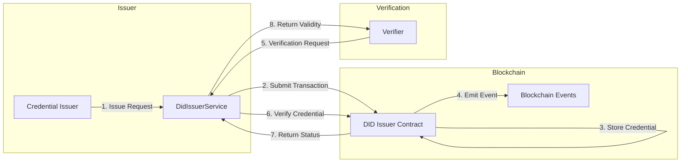
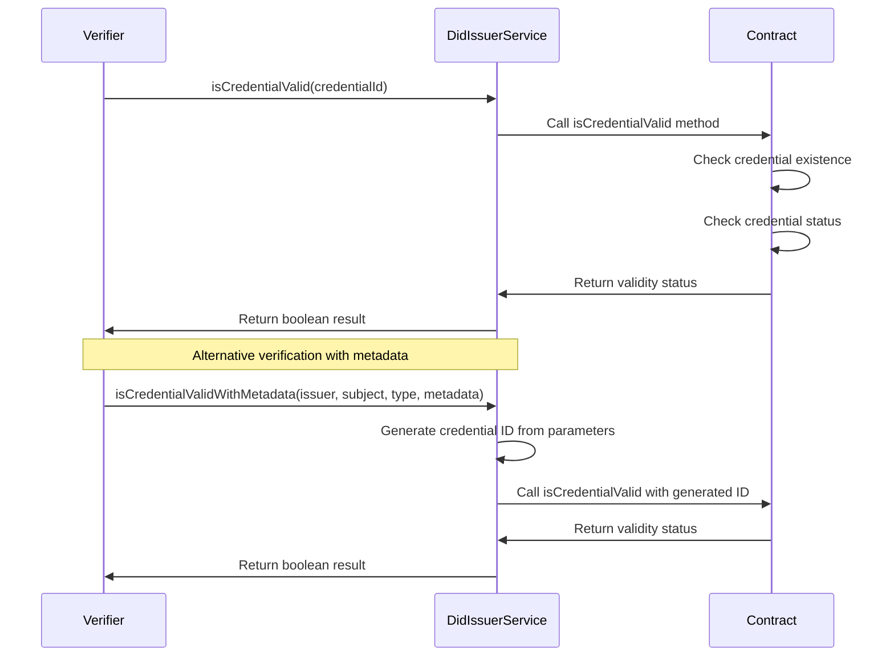
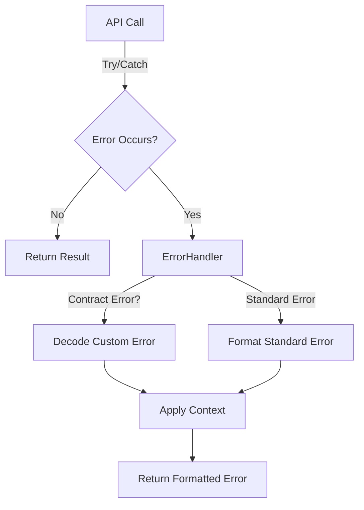
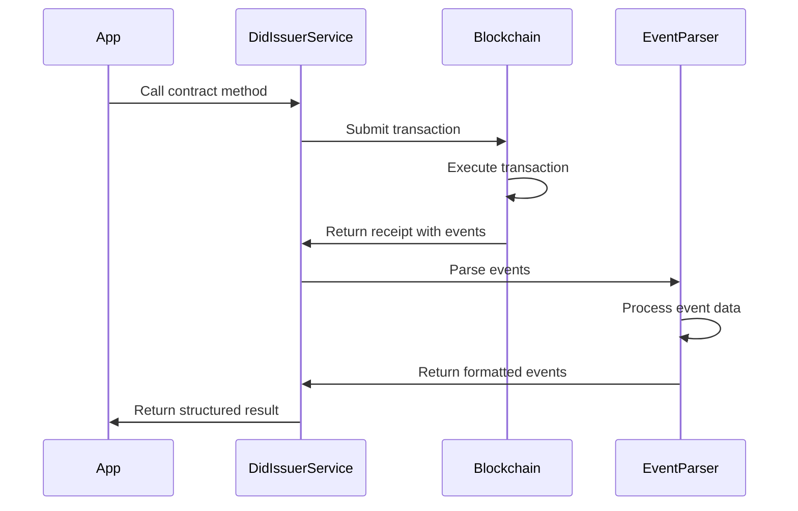

# LEDUP - DID Issuer Service API

**Version:** 1.0.0  
**Last Updated:** March 2025  
**Status:** Production

## Overview

The DID Issuer Service provides a TypeScript interface for interacting with the DID Issuer smart contract in the LEDUP ecosystem. This service manages the issuance and verification of verifiable credentials, enabling the creation of trust relationships and attestations across the platform.

## Key Features

### Credential Issuance



The service provides methods for issuing verifiable credentials:

```typescript
// Issue a credential with a specific credential ID
const issueResult = await didIssuerService.issueCredential(
  'HealthRecordAccess', // Credential type
  'did:ledup:subject123', // Subject DID
  '0x4a5c8eb84f3a62e9398aa7a5c7eb92f10a0c8c91f896f363f8d2e6e797ac48c4' // Credential ID
);
console.log(`Credential issued: ${issueResult.description}`);

// Issue a credential with auto-generated credential ID from metadata
const metadataIssueResult = await didIssuerService.issueCredentialWithMetadata(
  'did:ledup:issuer456', // Issuer DID
  'did:ledup:subject123', // Subject DID
  'HealthRecordAccess', // Credential type
  JSON.stringify({
    // Metadata
    accessLevel: 'read',
    expiration: '2025-12-31T23:59:59Z',
    records: ['record123', 'record456'],
  })
);
console.log(`Credential with metadata issued: ${metadataIssueResult.description}`);
```

### Credential Verification



The service enables verification of issued credentials:

```typescript
// Verify a credential using its ID
const isValid = await didIssuerService.isCredentialValid(
  '0x4a5c8eb84f3a62e9398aa7a5c7eb92f10a0c8c91f896f363f8d2e6e797ac48c4' // Credential ID
);
console.log(`Credential validity: ${isValid ? 'Valid' : 'Invalid'}`);

// Verify a credential using the same parameters used for issuance
const isMetadataValid = await didIssuerService.isCredentialValidWithMetadata(
  'did:ledup:issuer456', // Issuer DID
  'did:ledup:subject123', // Subject DID
  'HealthRecordAccess', // Credential type
  JSON.stringify({
    // Metadata (must match original)
    accessLevel: 'read',
    expiration: '2025-12-31T23:59:59Z',
    records: ['record123', 'record456'],
  })
);
console.log(`Credential validity (via metadata): ${isMetadataValid ? 'Valid' : 'Invalid'}`);
```

## Error Handling

The DID Issuer Service includes robust error handling through the `DidIssuerErrorHandler` class, which translates blockchain errors into user-friendly messages.



### Common Errors

The service handles the following contract-specific errors:

| Error Code                           | Description               | User-Friendly Message                                                          |
| ------------------------------------ | ------------------------- | ------------------------------------------------------------------------------ |
| `DidIssuer__InvalidSubject`          | Subject DID is invalid    | "Invalid subject: The subject DID is invalid or not active"                    |
| `DidIssuer__CredentialAlreadyIssued` | Credential already exists | "Credential already issued: A credential with this ID has already been issued" |
| `DidIssuer__Unauthorized`            | Caller lacks permission   | "Unauthorized: You do not have permission to perform this action"              |
| `DidIssuer__InvalidCredential`       | Credential is invalid     | "Invalid credential: The credential does not exist or is not valid"            |

### Error Handling Example

```typescript
try {
  // Try to issue a credential that already exists
  await didIssuerService.issueCredential(
    'HealthRecordAccess',
    'did:ledup:subject123',
    '0x4a5c8eb84f3a62e9398aa7a5c7eb92f10a0c8c91f896f363f8d2e6e797ac48c4'
  );
} catch (error) {
  console.error(error.message);
  // Output: "Credential already issued: A credential with this ID has already been issued"

  // Check for specific error type
  if (didIssuerService.isErrorType(error, 'DidIssuer__CredentialAlreadyIssued')) {
    console.log('Please use a different credential ID or verify the existing credential');
  }
}
```

## Event Parsing

The service includes an event parsing system through the `DidIssuerEventParser` class, which transforms blockchain events into structured data objects.



### Supported Events

The service parses the following contract events:

| Event Name         | Description                         | Enriched Data                                                           |
| ------------------ | ----------------------------------- | ----------------------------------------------------------------------- |
| `CredentialIssued` | Emitted when a credential is issued | Issuer, subject, credential type, credential ID, timestamp, description |

### Event Listening

The service provides a method to listen for credential events:

```typescript
// Listen for credential issuance events
const unsubscribe = didIssuerService.listenForEvents(
  'CredentialIssued',
  { subject: 'did:ledup:subject123' }, // Optional filter
  (event) => {
    console.log(`Credential issued event: ${event.description}`);
    console.log(`Credential type: ${event.credentialType}`);
    console.log(`Credential ID: ${event.credentialId}`);
  }
);

// Later, when done listening
unsubscribe();
```

## API Reference

### DidIssuerService

```typescript
class DidIssuerService {
  /**
   * Creates a new instance of the DidIssuerService
   * @param contractAddress The address of the DID Issuer contract
   * @param abi The ABI of the DID Issuer contract
   */
  constructor(contractAddress: string, abi: any);

  /**
   * Issues a credential to a subject
   * @param credentialType The type of credential to issue
   * @param subject The DID of the subject
   * @param credentialId The unique identifier of the credential (bytes32)
   * @returns A promise that resolves to the formatted transaction receipt
   */
  async issueCredential(credentialType: string, subject: string, credentialId: string): Promise<Record<string, any>>;

  /**
   * Helper method to issue a credential with additional metadata
   * This is a wrapper around the issueCredential method that generates a credentialId from the provided data
   * @param issuerDid The DID of the issuer
   * @param subjectDid The DID of the subject
   * @param credentialType The type of credential to issue
   * @param metadata Additional metadata for the credential
   * @returns A promise that resolves to the formatted transaction receipt
   */
  async issueCredentialWithMetadata(
    issuerDid: string,
    subjectDid: string,
    credentialType: string,
    metadata: string
  ): Promise<Record<string, any>>;

  /**
   * Checks if a credential is valid
   * @param credentialId The unique identifier of the credential (bytes32)
   * @returns A promise that resolves to a boolean indicating if the credential is valid
   */
  async isCredentialValid(credentialId: string): Promise<boolean>;

  /**
   * Helper method to check if a credential is valid using metadata
   * This is a wrapper around the isCredentialValid method that generates a credentialId from the provided data
   * @param issuerDid The DID of the issuer
   * @param subjectDid The DID of the subject
   * @param credentialType The type of credential
   * @param metadata Additional metadata for the credential
   * @returns A promise that resolves to a boolean indicating if the credential is valid
   */
  async isCredentialValidWithMetadata(
    issuerDid: string,
    subjectDid: string,
    credentialType: string,
    metadata: string
  ): Promise<boolean>;

  /**
   * Checks if a specific error occurred
   * @param error The error to check
   * @param errorName The name of the error to check for
   * @returns True if the error matches the specified name
   */
  isErrorType(error: any, errorName: string): boolean;

  /**
   * Listens for events from the contract
   * @param eventName The name of the event to listen for
   * @param filter Optional filter for the event
   * @param callback Callback function to handle the parsed event
   * @returns A function to remove the event listener
   */
  listenForEvents(eventName: string, filter: any, callback: (event: any) => void): () => void;
}
```

## Integration Examples

### Creating and Verifying Health Credentials

```typescript
import { DidIssuerService } from './services/contracts';

// Initialize the service
const didIssuerService = new DidIssuerService('0x1234567890AbCdEf1234567890aBcDeF12345678', didIssuerAbi);

// Issue health data access credentials
async function issueHealthCredentials() {
  try {
    // Prepare metadata for the credential
    const metadata = JSON.stringify({
      accessLevel: 'read',
      provider: 'Hospital A',
      department: 'Cardiology',
      expiration: new Date(Date.now() + 30 * 24 * 60 * 60 * 1000).toISOString(), // 30 days
      dataCategories: ['vitals', 'medications', 'lab_results'],
    });

    // Issue the credential
    const issueResult = await didIssuerService.issueCredentialWithMetadata(
      'did:ledup:issuer_hospital_a',
      'did:ledup:patient123',
      'HealthDataAccess',
      metadata
    );

    console.log(`Health credential issued: ${issueResult.description}`);
    console.log(`Transaction hash: ${issueResult.transactionHash}`);

    // The credentialId is included in the event data
    const credentialId = issueResult.events[0].credentialId;
    console.log(`Credential ID: ${credentialId}`);

    return { issueResult, credentialId };
  } catch (error) {
    console.error('Error issuing health credential:', error.message);
    throw error;
  }
}

// Verify a health credential
async function verifyHealthCredential(credentialId) {
  try {
    // Verify using the credential ID
    const isValid = await didIssuerService.isCredentialValid(credentialId);

    if (isValid) {
      console.log(`Credential ${credentialId} is valid`);
    } else {
      console.log(`Credential ${credentialId} is not valid`);
    }

    return isValid;
  } catch (error) {
    console.error('Error verifying health credential:', error.message);

    // Check for specific error
    if (didIssuerService.isErrorType(error, 'DidIssuer__InvalidCredential')) {
      console.log('The credential does not exist or has been revoked');
    }

    throw error;
  }
}
```

### Managing Multiple Credential Types

```typescript
// Issue different types of credentials to a subject
async function issueDifferentCredentials(subjectDid) {
  try {
    // Issue identity verification credential
    const identityMetadata = JSON.stringify({
      verificationType: 'government_id',
      verificationDate: new Date().toISOString(),
      verificationLevel: 'high',
      issuerName: 'Government Authority',
    });

    const identityCredential = await didIssuerService.issueCredentialWithMetadata(
      'did:ledup:gov_authority',
      subjectDid,
      'IdentityVerification',
      identityMetadata
    );
    console.log(`Identity credential issued: ${identityCredential.description}`);

    // Issue professional qualification credential
    const qualificationMetadata = JSON.stringify({
      qualification: 'Medical Doctor',
      specialization: 'Cardiology',
      issuanceDate: new Date().toISOString(),
      licenseNumber: 'MD12345',
      expirationDate: new Date(Date.now() + 365 * 24 * 60 * 60 * 1000).toISOString(), // 1 year
    });

    const qualificationCredential = await didIssuerService.issueCredentialWithMetadata(
      'did:ledup:medical_board',
      subjectDid,
      'ProfessionalQualification',
      qualificationMetadata
    );
    console.log(`Qualification credential issued: ${qualificationCredential.description}`);

    // Issue data access credential
    const accessMetadata = JSON.stringify({
      accessLevel: 'admin',
      dataCategory: 'patient_records',
      department: 'Cardiology',
      expiration: new Date(Date.now() + 90 * 24 * 60 * 60 * 1000).toISOString(), // 90 days
    });

    const accessCredential = await didIssuerService.issueCredentialWithMetadata(
      'did:ledup:hospital_admin',
      subjectDid,
      'DataAccess',
      accessMetadata
    );
    console.log(`Access credential issued: ${accessCredential.description}`);

    return {
      identityCredential,
      qualificationCredential,
      accessCredential,
    };
  } catch (error) {
    console.error('Error issuing credentials:', error.message);
    throw error;
  }
}
```

### Listening for Credential Events

```typescript
// Monitor credential issuance for a specific subject
function monitorSubjectCredentials(subjectDid) {
  console.log(`Starting credential monitoring for subject: ${subjectDid}`);

  // Set up event listener
  const unsubscribe = didIssuerService.listenForEvents(
    'CredentialIssued',
    { subject: subjectDid }, // Filter by subject
    (event) => {
      console.log('New credential issued:');
      console.log(`- Type: ${event.credentialType}`);
      console.log(`- ID: ${event.credentialId}`);
      console.log(`- Timestamp: ${new Date(event.timestamp * 1000).toLocaleString()}`);

      // Perform verification immediately
      didIssuerService
        .isCredentialValid(event.credentialId)
        .then((isValid) => {
          console.log(`- Validity check: ${isValid ? 'Valid' : 'Invalid'}`);
        })
        .catch((error) => {
          console.error(`- Error verifying: ${error.message}`);
        });
    }
  );

  // Return the unsubscribe function
  return {
    stopMonitoring: () => {
      unsubscribe();
      console.log(`Stopped credential monitoring for subject: ${subjectDid}`);
    },
  };
}
```

## Summary

The DID Issuer Service provides a powerful interface for issuing and verifying credentials in the LEDUP ecosystem, enabling:

1. **Trusted attestations** for identity, qualifications, and data access rights
2. **Cryptographic verification** of credentials using blockchain technology
3. **Metadata-rich credentials** that can contain detailed information while maintaining security
4. **Real-time monitoring** of credential issuance through event listeners

This service forms a key component of the LEDUP identity infrastructure, providing a secure and verifiable way to establish trust relationships between different entities in the ecosystem.

---

**© 2025 LEDUP - All rights reserved.**
