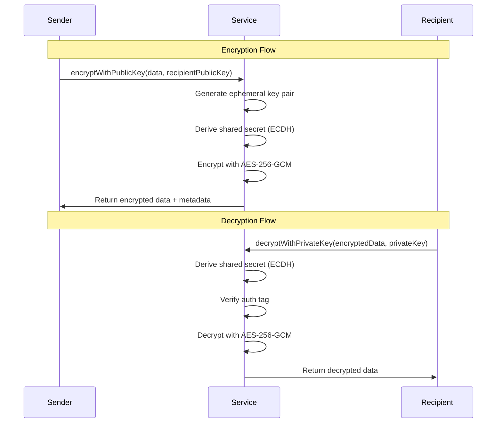

# LEDUP - Asymmetric Cryptography Service API

**Version:** 1.0.0  
**Last Updated:** March 2025  
**Status:** Production

## Overview

The Asymmetric Cryptography Service provides a TypeScript interface for performing public-key cryptographic operations in the LEDUP ecosystem. This service supports both secp256k1 (used in Bitcoin/Ethereum) and ed25519 (EdDSA) curves, enabling secure key generation, encryption, decryption, and digital signatures.

## Key Features

### Key Generation and Management


The service provides comprehensive key pair management:

```typescript
// Generate a new key pair
const keyPair = asymmetricCryptoService.generateKeyPair();
console.log('Public Key:', keyPair.publicKey);
console.log('Private Key:', keyPair.privateKey);

// Verify a public key
const isValid = asymmetricCryptoService.isValidPublicKey(publicKey);
console.log('Public key is valid:', isValid);

// Derive public key from private key
const derivedPublicKey = asymmetricCryptoService.derivePublicKey(privateKey);
```

### Asymmetric Encryption



The service enables secure asymmetric encryption:

```typescript
// Encrypt data with recipient's public key
const encryptedData = asymmetricCryptoService.encryptWithPublicKey('Hello, world!', recipientPublicKey);
console.log('Encrypted data:', encryptedData);

// Decrypt data with recipient's private key
const decryptedData = asymmetricCryptoService.decryptWithPrivateKey(encryptedData, recipientPrivateKey);
console.log('Decrypted data:', decryptedData);

// Encrypt large data (hybrid encryption)
const { encryptedData, encryptedSymmetricKey } = asymmetricCryptoService.encryptLargeData(
  largeData,
  recipientPublicKey
);

// Decrypt large data
const decryptedLargeData = asymmetricCryptoService.decryptLargeData(
  encryptedData,
  encryptedSymmetricKey,
  recipientPrivateKey
);
```

### Digital Signatures


The service provides digital signature functionality:

```typescript
// Sign data with private key
const signature = asymmetricCryptoService.sign('Hello, world!', privateKey);
console.log('Signature:', signature);

// Verify signature with public key
const isValid = asymmetricCryptoService.verify('Hello, world!', signature, publicKey);
console.log('Signature is valid:', isValid);
```

## API Reference

### AsymmetricCryptoService

```typescript
class AsymmetricCryptoService {
  /**
   * Creates a new instance of the AsymmetricCryptoService
   * @param curveType - The elliptic curve to use (default: CurveType.SECP256K1)
   */
  constructor(curveType: CurveType = CurveType.SECP256K1);

  /**
   * Encrypts data using a public key
   * @param data - The data to encrypt
   * @param publicKey - The recipient's public key in hex format
   * @returns The encrypted data as a JSON string
   */
  encryptWithPublicKey(data: string, publicKey: string): string;

  /**
   * Decrypts data using a private key
   * @param encryptedData - The encrypted data as a JSON string
   * @param privateKey - The recipient's private key in hex format
   * @returns The decrypted data
   */
  decryptWithPrivateKey(encryptedData: string, privateKey: string): string;

  /**
   * Generates an elliptic curve key pair
   * @returns An object containing the public and private keys in hex format
   */
  generateKeyPair(): { publicKey: string; privateKey: string };

  /**
   * Verifies if a public key is valid
   * @param publicKey - The public key to verify in hex format
   * @returns True if the public key is valid, false otherwise
   */
  isValidPublicKey(publicKey: string): boolean;

  /**
   * Derives a public key from a private key
   * @param privateKey - The private key in hex format
   * @returns The corresponding public key in hex format
   */
  derivePublicKey(privateKey: string): string;

  /**
   * Signs data using a private key
   * @param data - The data to sign
   * @param privateKey - The signer's private key in hex format
   * @returns The signature in hex format
   */
  sign(data: string | Buffer, privateKey: string): string;

  /**
   * Verifies a signature
   * @param data - The original data
   * @param signature - The signature to verify
   * @param publicKey - The signer's public key in hex format
   * @returns True if the signature is valid, false otherwise
   */
  verify(data: string | Buffer, signature: string, publicKey: string): boolean;

  /**
   * Encrypts large data using hybrid encryption
   * @param data - The data to encrypt
   * @param publicKey - The recipient's public key in hex format
   * @returns Object containing the encrypted data and encrypted symmetric key
   */
  encryptLargeData(
    data: string,
    publicKey: string
  ): {
    encryptedData: string;
    encryptedSymmetricKey: string;
  };

  /**
   * Decrypts large data using hybrid encryption
   * @param encryptedData - The encrypted data
   * @param encryptedSymmetricKey - The encrypted symmetric key
   * @param privateKey - The recipient's private key in hex format
   * @returns The decrypted data
   */
  decryptLargeData(encryptedData: string, encryptedSymmetricKey: string, privateKey: string): string;

  /**
   * Gets the current curve type
   * @returns The curve type being used
   */
  getCurveType(): CurveType;
}
```

### Types and Enums

```typescript
/**
 * Supported elliptic curves
 */
enum CurveType {
  SECP256K1 = 'secp256k1',
  ED25519 = 'ed25519',
}

/**
 * Output of asymmetric encryption
 */
type AsymmetricEncryptOutput = {
  ephemeralPublicKey: string; // Ephemeral public key used in ECDH
  iv: string; // Initialization vector
  authTag: string; // Authentication tag
  encrypted: string; // Encrypted data
};
```

## Integration Examples

### Basic Key Management

```typescript
import { AsymmetricCryptoService, CurveType } from './services/crypto';

// Initialize service with secp256k1 curve
const cryptoService = new AsymmetricCryptoService(CurveType.SECP256K1);

// Generate and manage keys
async function manageKeys() {
  try {
    // Generate a new key pair
    const keyPair = cryptoService.generateKeyPair();
    console.log('Generated key pair:', keyPair);

    // Verify the public key
    const isValid = cryptoService.isValidPublicKey(keyPair.publicKey);
    console.log('Public key is valid:', isValid);

    // Derive public key from private key
    const derivedPublicKey = cryptoService.derivePublicKey(keyPair.privateKey);
    console.log('Derived public key matches:', derivedPublicKey === keyPair.publicKey);

    return keyPair;
  } catch (error) {
    console.error('Key management failed:', error.message);
    throw error;
  }
}
```

### Secure Message Exchange

```typescript
// Encrypt and decrypt messages
async function exchangeSecureMessages(senderKeyPair, recipientKeyPair) {
  try {
    const message = 'This is a secret message!';

    // Sender encrypts message with recipient's public key
    const encryptedData = cryptoService.encryptWithPublicKey(message, recipientKeyPair.publicKey);
    console.log('Encrypted message:', encryptedData);

    // Recipient decrypts message with their private key
    const decryptedMessage = cryptoService.decryptWithPrivateKey(encryptedData, recipientKeyPair.privateKey);
    console.log('Decrypted message:', decryptedMessage);

    // Verify the message was decrypted correctly
    console.log('Message integrity verified:', message === decryptedMessage);

    return { encryptedData, decryptedMessage };
  } catch (error) {
    console.error('Message exchange failed:', error.message);
    throw error;
  }
}
```

### Digital Signatures and Verification

```typescript
// Sign and verify data
async function signAndVerifyData(signerKeyPair) {
  try {
    const data = 'Important document content';

    // Sign the data
    const signature = cryptoService.sign(data, signerKeyPair.privateKey);
    console.log('Generated signature:', signature);

    // Verify the signature
    const isValid = cryptoService.verify(data, signature, signerKeyPair.publicKey);
    console.log('Signature is valid:', isValid);

    // Try to verify with tampered data
    const tamperedData = 'Modified document content';
    const isValidTampered = cryptoService.verify(tamperedData, signature, signerKeyPair.publicKey);
    console.log('Tampered data signature is valid:', isValidTampered); // Should be false

    return { signature, isValid };
  } catch (error) {
    console.error('Signature operations failed:', error.message);
    throw error;
  }
}
```

### Large Data Encryption

```typescript
// Encrypt and decrypt large data using hybrid encryption
async function handleLargeData(recipientKeyPair) {
  try {
    const largeData = 'Very large data content...'; // Could be file content

    // Encrypt large data
    const { encryptedData, encryptedSymmetricKey } = cryptoService.encryptLargeData(
      largeData,
      recipientKeyPair.publicKey
    );
    console.log('Encrypted large data:', { encryptedData, encryptedSymmetricKey });

    // Decrypt large data
    const decryptedData = cryptoService.decryptLargeData(
      encryptedData,
      encryptedSymmetricKey,
      recipientKeyPair.privateKey
    );
    console.log('Decrypted large data:', decryptedData);

    // Verify data integrity
    console.log('Large data integrity verified:', largeData === decryptedData);

    return { encryptedData, encryptedSymmetricKey, decryptedData };
  } catch (error) {
    console.error('Large data handling failed:', error.message);
    throw error;
  }
}
```

## Security Considerations

1. **Key Management**

   - Keep private keys secure and never share them
   - Use secure key storage mechanisms
   - Rotate keys periodically

2. **Encryption**

   - Always use fresh ephemeral keys for each encryption
   - Verify authentication tags to ensure data integrity
   - Use hybrid encryption for large data

3. **Signatures**

   - Always verify signatures before trusting data
   - Use deterministic signatures when possible
   - Include timestamps or nonces to prevent replay attacks

4. **Curve Selection**
   - Use secp256k1 for blockchain compatibility
   - Use ed25519 for general-purpose signatures
   - Never use deprecated curves

## Summary

The Asymmetric Cryptography Service provides a robust foundation for secure communication in the LEDUP ecosystem, enabling:

1. **Secure key generation** and management
2. **Public-key encryption** for confidential data exchange
3. **Digital signatures** for data authenticity and integrity
4. **Hybrid encryption** for efficient large data handling
5. **Multi-curve support** for different use cases

This service is essential for establishing secure communication channels and verifying the authenticity of data and participants in the platform.

---

**© 2025 LEDUP - All rights reserved.**
