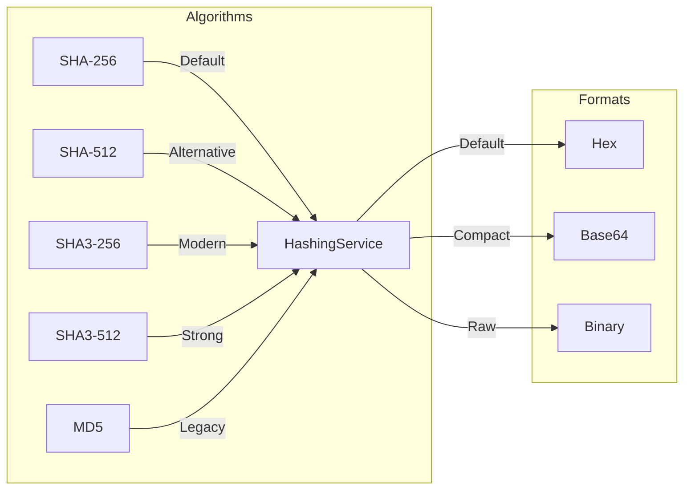
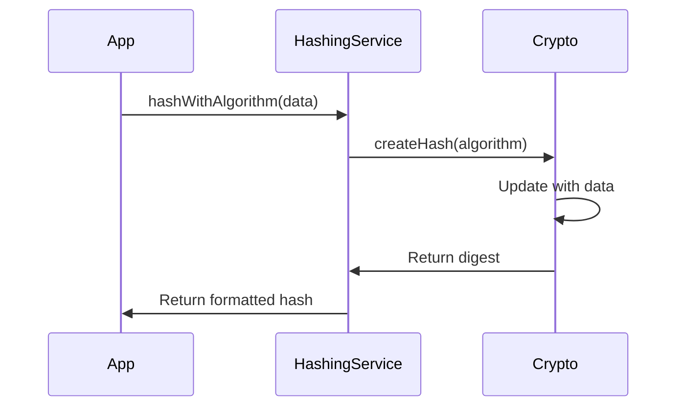
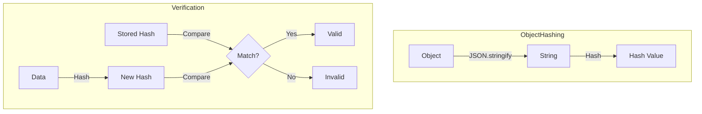
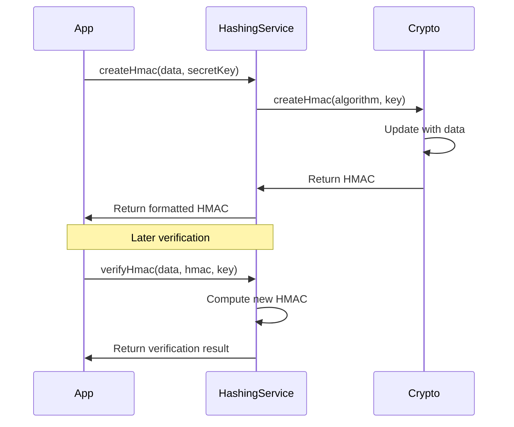

# LEDUP - Hashing Service API

**Version:** 1.0.0  
**Last Updated:** March 2025  
**Status:** Production

## Overview

The Hashing Service provides a TypeScript interface for performing cryptographic hashing operations in the LEDUP ecosystem. This service supports multiple hash algorithms (SHA-256, SHA-512, SHA3-256, SHA3-512) and provides various output formats (hex, base64, binary) for data integrity and verification purposes.

## Key Features

### Hash Algorithms



The service supports multiple hash algorithms and formats:

```typescript
// Available algorithms
enum HashAlgorithm {
  SHA256 = 'sha256', // Default, widely used
  SHA512 = 'sha512', // Stronger variant
  SHA3_256 = 'sha3-256', // Modern, quantum-resistant
  SHA3_512 = 'sha3-512', // Stronger quantum-resistant
  MD5 = 'md5', // Legacy (not recommended)
}

// Output formats
enum HashEncoding {
  HEX = 'hex', // Default, human-readable
  BASE64 = 'base64', // Compact representation
  BINARY = 'binary', // Raw binary output
}

// Initialize with specific algorithm and encoding
const hashService = new HashingService(HashAlgorithm.SHA3_256, HashEncoding.HEX);
```

### Basic Hashing



The service provides multiple hashing methods:

```typescript
// Hash data with different formats
const binaryHash = await hashService.hashData('Hello, world!');
const hexHash = await hashService.hashHex('Hello, world!');
const base64Hash = await hashService.hashBase64('Hello, world!');

// Hash with specific algorithm and encoding
const customHash = await hashService.hashWithAlgorithm('Hello, world!', HashAlgorithm.SHA512, HashEncoding.BASE64);
```

### Object Hashing and Verification



The service enables object hashing and hash verification:

```typescript
// Hash an object
const obj = { id: 1, name: 'test' };
const objHash = await hashService.hashObject(obj);
console.log('Object hash:', objHash);

// Verify a hash
const isValid = await hashService.verifyHash('Hello, world!', hexHash, HashAlgorithm.SHA256, HashEncoding.HEX);
console.log('Hash is valid:', isValid);
```

### HMAC Support



The service provides HMAC functionality:

```typescript
// Create an HMAC
const hmac = await hashService.createHmac('Message', 'secret-key', HashAlgorithm.SHA256, HashEncoding.HEX);
console.log('HMAC:', hmac);

// Verify an HMAC
const isValidHmac = await hashService.verifyHmac('Message', hmac, 'secret-key', HashAlgorithm.SHA256, HashEncoding.HEX);
console.log('HMAC is valid:', isValidHmac);
```

## API Reference

### HashingService

```typescript
class HashingService {
  /**
   * Creates a new instance of the HashingService
   * @param defaultAlgorithm - The default hashing algorithm to use
   * @param defaultEncoding - The default output encoding to use
   */
  constructor(defaultAlgorithm: HashAlgorithm = HashAlgorithm.SHA256, defaultEncoding: HashEncoding = HashEncoding.HEX);

  /**
   * Hashes data using SHA-256 and returns binary format
   * @param data - The data to hash
   * @returns Promise resolving to binary hash
   */
  async hashData(data: string): Promise<BinaryLike>;

  /**
   * Hashes data using SHA-256 and returns hex format
   * @param data - The data to hash
   * @returns Promise resolving to hex hash
   */
  async hashHex(data: string): Promise<string>;

  /**
   * Hashes data using SHA-256 and returns base64 format
   * @param data - The data to hash
   * @returns Promise resolving to base64 hash
   */
  async hashBase64(data: string): Promise<string>;

  /**
   * Hashes data with specified algorithm and encoding
   * @param data - The data to hash
   * @param algorithm - The hashing algorithm to use
   * @param encoding - The output encoding format
   * @returns Promise resolving to formatted hash
   */
  async hashWithAlgorithm(
    data: string,
    algorithm?: HashAlgorithm,
    encoding?: HashEncoding
  ): Promise<string | BinaryLike>;

  /**
   * Hashes an object by converting to JSON
   * @param obj - The object to hash
   * @param algorithm - The hashing algorithm to use
   * @param encoding - The output encoding format
   * @returns Promise resolving to formatted hash
   */
  async hashObject(obj: Record<string, any>, algorithm?: HashAlgorithm, encoding?: HashEncoding): Promise<string>;

  /**
   * Verifies if data matches a hash
   * @param data - The data to verify
   * @param hash - The hash to compare against
   * @param algorithm - The hashing algorithm to use
   * @param encoding - The encoding of the hash
   * @returns Promise resolving to boolean
   */
  async verifyHash(data: string, hash: string, algorithm?: HashAlgorithm, encoding?: HashEncoding): Promise<boolean>;

  /**
   * Creates an HMAC for data using a secret key
   * @param data - The data to create HMAC for
   * @param secretKey - The secret key to use
   * @param algorithm - The hashing algorithm to use
   * @param encoding - The output encoding format
   * @returns Promise resolving to HMAC string
   */
  async createHmac(
    data: string,
    secretKey: string,
    algorithm?: HashAlgorithm,
    encoding?: HashEncoding
  ): Promise<string>;

  /**
   * Verifies an HMAC
   * @param data - The original data
   * @param hmac - The HMAC to verify
   * @param secretKey - The secret key used
   * @param algorithm - The hashing algorithm used
   * @param encoding - The encoding of the HMAC
   * @returns Promise resolving to boolean
   */
  async verifyHmac(
    data: string,
    hmac: string,
    secretKey: string,
    algorithm?: HashAlgorithm,
    encoding?: HashEncoding
  ): Promise<boolean>;

  /**
   * Hashes a file buffer
   * @param buffer - The file buffer to hash
   * @param algorithm - The hashing algorithm to use
   * @param encoding - The output encoding format
   * @returns Promise resolving to formatted hash
   */
  async hashBuffer(buffer: Buffer, algorithm?: HashAlgorithm, encoding?: HashEncoding): Promise<string>;

  /**
   * Creates a salted hash
   * @param data - The data to hash
   * @param salt - The salt to use
   * @param algorithm - The hashing algorithm to use
   * @param encoding - The output encoding format
   * @returns Promise resolving to formatted hash
   */
  async hashWithSalt(data: string, salt: string, algorithm?: HashAlgorithm, encoding?: HashEncoding): Promise<string>;
}
```

### Types and Enums

```typescript
/**
 * Supported hash algorithms
 */
enum HashAlgorithm {
  SHA256 = 'sha256',
  SHA512 = 'sha512',
  SHA3_256 = 'sha3-256',
  SHA3_512 = 'sha3-512',
  MD5 = 'md5',
}

/**
 * Supported output encodings
 */
enum HashEncoding {
  HEX = 'hex',
  BASE64 = 'base64',
  BINARY = 'binary',
}
```

## Integration Examples

### Basic Data Hashing

```typescript
import { HashingService, HashAlgorithm, HashEncoding } from './services/crypto';

// Initialize service
const hashService = new HashingService(HashAlgorithm.SHA256, HashEncoding.HEX);

// Hash data in different formats
async function hashData() {
  try {
    const data = 'Important data to hash';

    // Get hash in different formats
    const hexHash = await hashService.hashHex(data);
    console.log('Hex hash:', hexHash);

    const base64Hash = await hashService.hashBase64(data);
    console.log('Base64 hash:', base64Hash);

    const binaryHash = await hashService.hashData(data);
    console.log('Binary hash length:', binaryHash.length);

    // Use different algorithm
    const sha3Hash = await hashService.hashWithAlgorithm(data, HashAlgorithm.SHA3_256, HashEncoding.HEX);
    console.log('SHA3-256 hash:', sha3Hash);

    return { hexHash, base64Hash, binaryHash, sha3Hash };
  } catch (error) {
    console.error('Hashing failed:', error.message);
    throw error;
  }
}
```

### File Integrity Verification

```typescript
// Verify file integrity using hashes
async function verifyFileIntegrity(fileBuffer: Buffer, storedHash: string) {
  try {
    // Hash the file
    const fileHash = await hashService.hashBuffer(fileBuffer, HashAlgorithm.SHA256, HashEncoding.HEX);
    console.log('Computed file hash:', fileHash);

    // Verify against stored hash
    const isValid = fileHash === storedHash;
    console.log('File integrity:', isValid ? 'Valid' : 'Corrupted');

    // Alternative using verifyHash
    const verifyResult = await hashService.verifyHash(
      fileBuffer.toString(),
      storedHash,
      HashAlgorithm.SHA256,
      HashEncoding.HEX
    );
    console.log('Verification result:', verifyResult);

    return { fileHash, isValid, verifyResult };
  } catch (error) {
    console.error('File verification failed:', error.message);
    throw error;
  }
}
```

### Message Authentication

```typescript
// Use HMAC for message authentication
async function authenticateMessage(message: string, secretKey: string) {
  try {
    // Create HMAC
    const hmac = await hashService.createHmac(message, secretKey, HashAlgorithm.SHA256, HashEncoding.HEX);
    console.log('Generated HMAC:', hmac);

    // Later, verify the message
    const isValid = await hashService.verifyHmac(message, hmac, secretKey, HashAlgorithm.SHA256, HashEncoding.HEX);
    console.log('Message authentication:', isValid ? 'Valid' : 'Invalid');

    // Try with tampered message
    const tamperedMessage = message + ' tampered';
    const isValidTampered = await hashService.verifyHmac(
      tamperedMessage,
      hmac,
      secretKey,
      HashAlgorithm.SHA256,
      HashEncoding.HEX
    );
    console.log('Tampered message:', isValidTampered ? 'Valid' : 'Invalid');

    return { hmac, isValid, isValidTampered };
  } catch (error) {
    console.error('Message authentication failed:', error.message);
    throw error;
  }
}
```

### Object Hashing

```typescript
// Hash complex objects
async function handleObjectHashing() {
  try {
    const object = {
      id: 123,
      name: 'Test Object',
      data: {
        field1: 'value1',
        field2: 42,
        timestamp: new Date().toISOString(),
      },
    };

    // Hash the object
    const objectHash = await hashService.hashObject(object, HashAlgorithm.SHA256, HashEncoding.HEX);
    console.log('Object hash:', objectHash);

    // Hash modified object
    const modifiedObject = { ...object, data: { ...object.data, field2: 43 } };
    const modifiedHash = await hashService.hashObject(modifiedObject, HashAlgorithm.SHA256, HashEncoding.HEX);
    console.log('Modified object hash:', modifiedHash);
    console.log('Hashes differ:', objectHash !== modifiedHash);

    return { objectHash, modifiedHash };
  } catch (error) {
    console.error('Object hashing failed:', error.message);
    throw error;
  }
}
```

## Security Considerations

1. **Algorithm Selection**

   - Use SHA-256 or stronger for general purposes
   - Use SHA3 for future-proof security
   - Avoid MD5 except for legacy compatibility
   - Consider output size requirements

2. **Hash Usage**

   - Never use plain hashes for passwords
   - Use HMAC for message authentication
   - Verify hash lengths and formats
   - Handle timing attacks in comparisons

3. **Salt Management**

   - Use unique salts for each hash
   - Store salts securely with hashes
   - Use sufficient salt length
   - Never reuse salts

4. **Performance**
   - Cache frequently used hashes
   - Use appropriate algorithm for data size
   - Consider async operations for large data
   - Monitor hash computation time

## Summary

The Hashing Service provides a robust foundation for data integrity and verification in the LEDUP ecosystem, enabling:

1. **Secure hash generation** with multiple algorithms
2. **Flexible output formats** for different use cases
3. **Message authentication** with HMAC support
4. **Object and file hashing** capabilities
5. **Hash verification** utilities

This service is essential for ensuring data integrity, verifying file contents, and implementing secure message authentication throughout the platform.

---

**© 2025 LEDUP - All rights reserved.**
