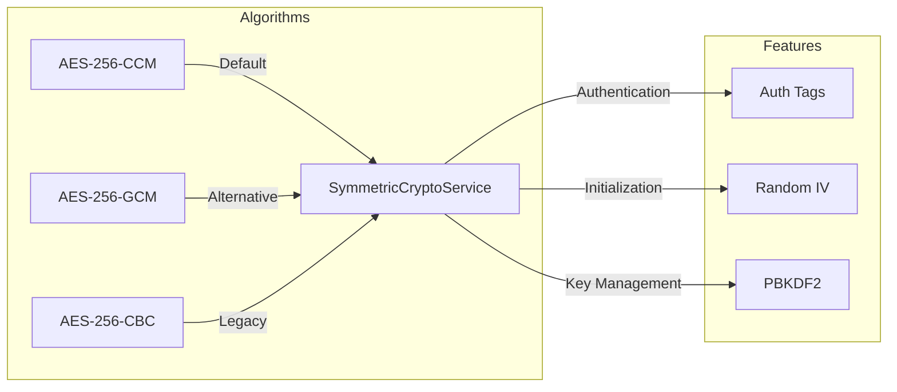
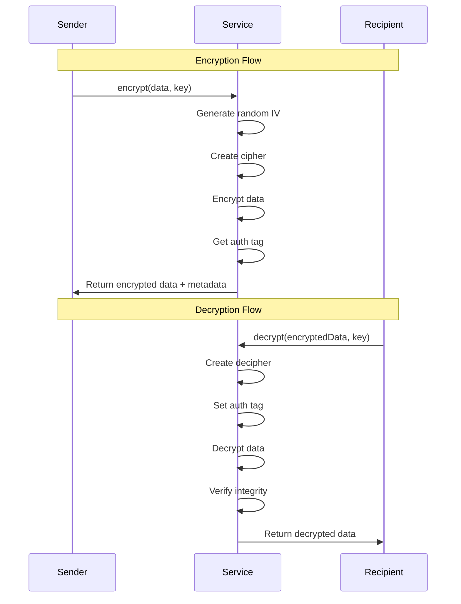
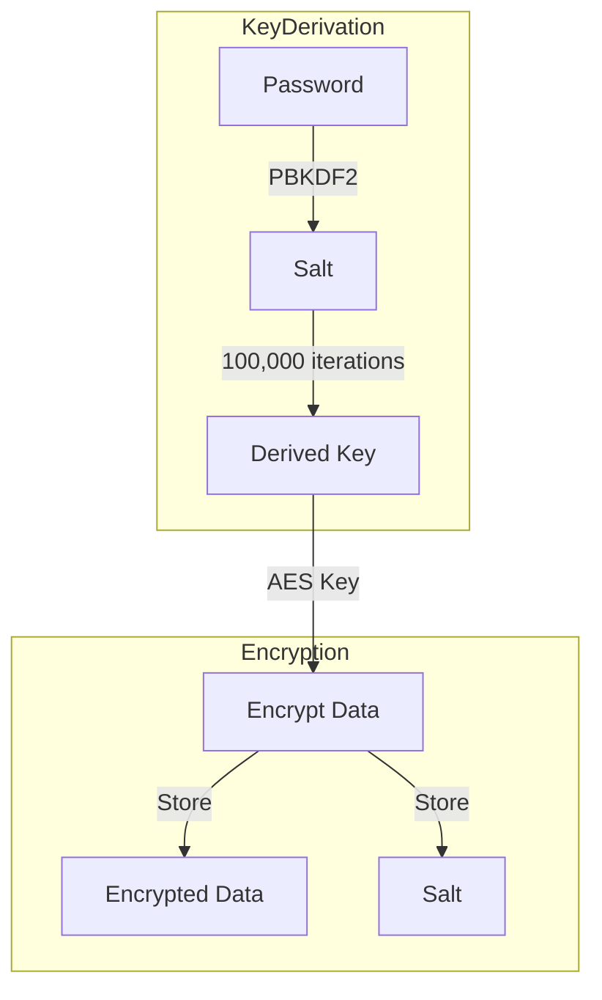

# LEDUP - Symmetric Cryptography Service API

**Version:** 1.0.0  
**Last Updated:** March 2025  
**Status:** Production

## Overview

The Symmetric Cryptography Service provides a TypeScript interface for performing symmetric encryption operations in the LEDUP ecosystem. This service supports multiple AES encryption modes (CCM, GCM, CBC) and provides secure key generation, encryption, and decryption capabilities with authentication.

## Key Features

### Encryption Algorithms



The service supports multiple encryption modes:

```typescript
// Available algorithms
enum SymmetricAlgorithm {
  AES_256_CCM = 'aes-256-ccm', // Default, authenticated encryption
  AES_256_GCM = 'aes-256-gcm', // Alternative authenticated encryption
  AES_256_CBC = 'aes-256-cbc', // Legacy mode (without authentication)
}

// Initialize with specific algorithm
const cryptoService = new SymmetricCryptoService(SymmetricAlgorithm.AES_256_GCM);
```

### Encryption and Decryption



The service provides secure symmetric encryption:

```typescript
// Generate a random encryption key
const key = cryptoService.generateKey();
console.log('Generated key:', key.toString('hex'));

// Encrypt data
const encryptedData = cryptoService.encrypt('Hello, world!', key, SymmetricAlgorithm.AES_256_GCM);
console.log('Encrypted data:', encryptedData);

// Decrypt data
const decryptedData = cryptoService.decrypt(encryptedData, key, SymmetricAlgorithm.AES_256_GCM);
console.log('Decrypted data:', decryptedData);
```

### Password-Based Encryption



The service enables password-based encryption:

```typescript
// Encrypt data with a password
const encryptedWithPassword = await cryptoService.encryptWithPassword(
  'Secret message',
  'user-password-123',
  SymmetricAlgorithm.AES_256_GCM
);
console.log('Encrypted with password:', encryptedWithPassword);

// Decrypt data with the same password
const decryptedWithPassword = await cryptoService.decryptWithPassword(
  encryptedWithPassword,
  'user-password-123',
  SymmetricAlgorithm.AES_256_GCM
);
console.log('Decrypted with password:', decryptedWithPassword);
```

## API Reference

### SymmetricCryptoService

```typescript
class SymmetricCryptoService {
  /**
   * Creates a new instance of the SymmetricCryptoService
   * @param defaultAlgorithm - The default encryption algorithm to use
   */
  constructor(defaultAlgorithm: SymmetricAlgorithm = SymmetricAlgorithm.AES_256_CCM);

  /**
   * Encrypts data using a symmetric key
   * @param data - The data to encrypt
   * @param key - The encryption key (32 bytes for AES-256)
   * @param algorithm - The encryption algorithm to use
   * @returns Object containing IV, encrypted data, and auth tag
   */
  encrypt(data: string, key: CipherKey, algorithm?: SymmetricAlgorithm): SymmetricEncryptOutput;

  /**
   * Decrypts data using a symmetric key
   * @param data - Object containing IV, encrypted data, and auth tag
   * @param key - The decryption key
   * @param algorithm - The encryption algorithm that was used
   * @returns The decrypted data
   */
  decrypt(data: SymmetricEncryptOutput, key: CipherKey, algorithm?: SymmetricAlgorithm): string;

  /**
   * Converts a hex string to a CipherKey
   * @param key - The encryption key in hex format
   * @returns The key as a Buffer
   */
  toCipherKey(key: string): CipherKey;

  /**
   * Generates a random key suitable for symmetric encryption
   * @returns A random 32-byte key as a Buffer
   */
  generateKey(): CipherKey;

  /**
   * Generates a random key and returns it as a hex string
   * @returns A random 32-byte key as a hex string
   */
  generateKeyAsHex(): string;

  /**
   * Encrypts data with a key provided as a hex string
   * @param data - The data to encrypt
   * @param hexKey - The encryption key as a hex string
   * @param algorithm - The encryption algorithm to use
   * @returns Object containing IV, encrypted data, and auth tag
   */
  encryptWithHexKey(data: string, hexKey: string, algorithm?: SymmetricAlgorithm): SymmetricEncryptOutput;

  /**
   * Decrypts data with a key provided as a hex string
   * @param data - Object containing IV, encrypted data, and auth tag
   * @param hexKey - The decryption key as a hex string
   * @param algorithm - The encryption algorithm that was used
   * @returns The decrypted data
   */
  decryptWithHexKey(data: SymmetricEncryptOutput, hexKey: string, algorithm?: SymmetricAlgorithm): string;

  /**
   * Encrypts data and returns result as a single string
   * @param data - The data to encrypt
   * @param key - The encryption key
   * @param algorithm - The encryption algorithm to use
   * @returns JSON string containing encrypted data and metadata
   */
  encryptToString(data: string, key: CipherKey, algorithm?: SymmetricAlgorithm): string;

  /**
   * Decrypts data from a string format
   * @param encryptedString - JSON string containing encrypted data and metadata
   * @param key - The decryption key
   * @param algorithm - The encryption algorithm that was used
   * @returns The decrypted data
   */
  decryptFromString(encryptedString: string, key: CipherKey, algorithm?: SymmetricAlgorithm): string;

  /**
   * Derives an encryption key from a password
   * @param password - The password to derive the key from
   * @param salt - Optional salt (generated if not provided)
   * @returns Object containing the derived key and salt
   */
  deriveKeyFromPassword(password: string, salt?: Buffer): { key: CipherKey; salt: Buffer };

  /**
   * Encrypts data using a password
   * @param data - The data to encrypt
   * @param password - The password to use
   * @param algorithm - The encryption algorithm to use
   * @returns Object containing encrypted data, IV, auth tag, and salt
   */
  encryptWithPassword(
    data: string,
    password: string,
    algorithm?: SymmetricAlgorithm
  ): SymmetricEncryptOutput & { salt: string };

  /**
   * Decrypts data using a password
   * @param data - Object containing encrypted data, IV, auth tag, and salt
   * @param password - The password to use
   * @param algorithm - The encryption algorithm that was used
   * @returns The decrypted data
   */
  decryptWithPassword(
    data: SymmetricEncryptOutput & { salt: string },
    password: string,
    algorithm?: SymmetricAlgorithm
  ): string;
}
```

### Types and Enums

```typescript
/**
 * Supported encryption algorithms
 */
enum SymmetricAlgorithm {
  AES_256_CCM = 'aes-256-ccm',
  AES_256_GCM = 'aes-256-gcm',
  AES_256_CBC = 'aes-256-cbc',
}

/**
 * Output of symmetric encryption
 */
type SymmetricEncryptOutput = {
  iv: string; // Initialization vector
  encrypted: string; // Encrypted data
  tag: string; // Authentication tag
};
```

## Integration Examples

### Basic Encryption and Decryption

```typescript
import { SymmetricCryptoService, SymmetricAlgorithm } from './services/crypto';

// Initialize service with GCM mode
const cryptoService = new SymmetricCryptoService(SymmetricAlgorithm.AES_256_GCM);

// Basic encryption and decryption
async function encryptAndDecrypt() {
  try {
    // Generate a random key
    const key = cryptoService.generateKey();
    const data = 'Sensitive information';

    // Encrypt the data
    const encrypted = cryptoService.encrypt(data, key);
    console.log('Encrypted data:', encrypted);

    // Decrypt the data
    const decrypted = cryptoService.decrypt(encrypted, key);
    console.log('Decrypted data:', decrypted);

    // Verify the decryption
    console.log('Data integrity verified:', data === decrypted);

    return { key, encrypted, decrypted };
  } catch (error) {
    console.error('Encryption/decryption failed:', error.message);
    throw error;
  }
}
```

### Password-Based File Encryption

```typescript
// Encrypt and decrypt files using a password
async function encryptFile(fileContent: string, password: string) {
  try {
    // Encrypt the file content with a password
    const encrypted = await cryptoService.encryptWithPassword(fileContent, password, SymmetricAlgorithm.AES_256_GCM);
    console.log('File encrypted successfully');

    // Store the encrypted data
    const encryptedFile = JSON.stringify(encrypted);
    console.log('Encrypted file data:', encryptedFile);

    // Later, decrypt the file
    const decrypted = await cryptoService.decryptWithPassword(
      JSON.parse(encryptedFile),
      password,
      SymmetricAlgorithm.AES_256_GCM
    );
    console.log('File decrypted successfully');

    // Verify the file content
    console.log('File integrity verified:', fileContent === decrypted);

    return { encrypted, decrypted };
  } catch (error) {
    console.error('File encryption failed:', error.message);
    throw error;
  }
}
```

### Key Management and Storage

```typescript
// Manage and store encryption keys
async function manageKeys() {
  try {
    // Generate a new key
    const key = cryptoService.generateKey();
    const hexKey = key.toString('hex');
    console.log('Generated key (hex):', hexKey);

    // Store the key (in a secure manner)
    const storedKey = hexKey;

    // Later, retrieve and use the key
    const retrievedKey = cryptoService.toCipherKey(storedKey);
    console.log('Retrieved key matches:', Buffer.compare(key, retrievedKey) === 0);

    // Encrypt data with the retrieved key
    const encrypted = cryptoService.encrypt('Test data', retrievedKey);
    console.log('Encryption with retrieved key successful');

    return { hexKey, encrypted };
  } catch (error) {
    console.error('Key management failed:', error.message);
    throw error;
  }
}
```

### String Format Encryption

```typescript
// Use string format for easy storage/transmission
async function useStringFormat() {
  try {
    const key = cryptoService.generateKey();
    const data = 'Data to be stored';

    // Encrypt to string format
    const encryptedString = cryptoService.encryptToString(data, key);
    console.log('Encrypted string:', encryptedString);

    // Store or transmit the encrypted string...

    // Later, decrypt from string format
    const decrypted = cryptoService.decryptFromString(encryptedString, key);
    console.log('Decrypted data:', decrypted);

    return { encryptedString, decrypted };
  } catch (error) {
    console.error('String format encryption failed:', error.message);
    throw error;
  }
}
```

## Security Considerations

1. **Key Management**

   - Use secure key storage mechanisms
   - Never store encryption keys alongside encrypted data
   - Use key derivation for password-based encryption
   - Rotate keys periodically

2. **Algorithm Selection**

   - Use CCM or GCM modes for authenticated encryption
   - Avoid CBC mode unless required for legacy compatibility
   - Always use random IVs for each encryption
   - Verify authentication tags when decrypting

3. **Password Security**

   - Use strong passwords
   - Implement rate limiting for password-based operations
   - Store salts alongside encrypted data
   - Use sufficient iterations in key derivation

4. **Data Handling**
   - Clear sensitive data from memory after use
   - Implement secure error handling
   - Use secure random number generation
   - Validate decrypted data integrity

## Summary

The Symmetric Cryptography Service provides a robust foundation for secure data encryption in the LEDUP ecosystem, enabling:

1. **Secure data encryption** with multiple algorithm options
2. **Password-based encryption** for user-friendly security
3. **Key generation and management** utilities
4. **Authenticated encryption** for data integrity
5. **Flexible data formats** for storage and transmission

This service is essential for protecting sensitive data at rest and ensuring data integrity throughout the platform.

---

**© 2025 LEDUP - All rights reserved.**
