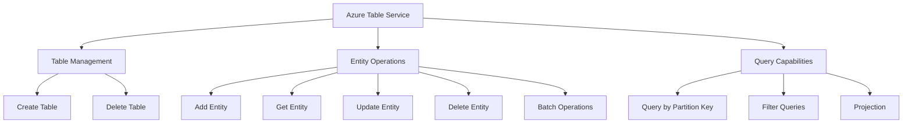
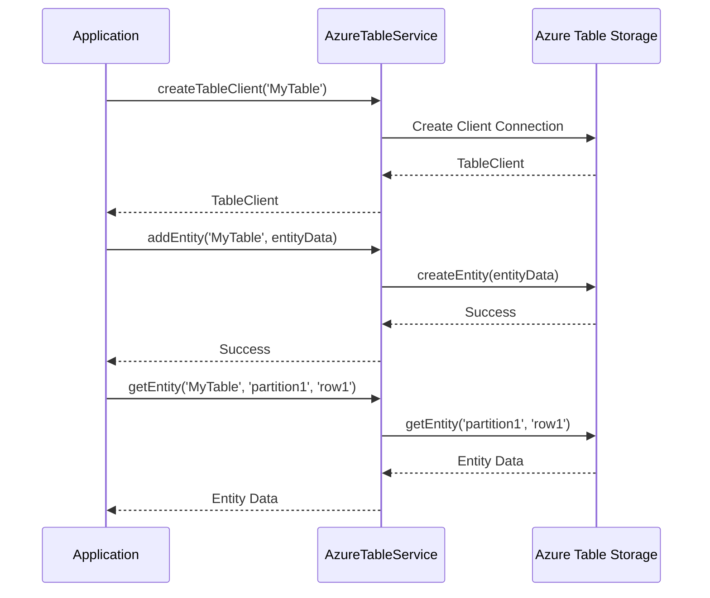

# AzureTableService

## Overview

The `AzureTableService` provides a streamlined interface for interacting with Azure Table Storage within the LEDUP ecosystem. It encapsulates common table operations such as creating tables, adding/updating/deleting entities, and performing queries, simplifying the integration with Microsoft's cloud storage solution. The service is designed to handle the persistence of blockchain events, configuration data, and other structured information that benefits from a NoSQL approach.

## Key Features

### Table Management



The service provides comprehensive table management capabilities:

- Table creation for new data structures
- Table deletion for cleanup operations
- Table client generation for entity operations

### Entity Operations



The service provides a full suite of entity operations:

- Adding new entities to tables
- Retrieving entities by partition and row keys
- Updating existing entities with merge or replace strategies
- Deleting entities from tables
- Performing batch operations for multiple entities

### Query Capabilities

The `AzureTableService` includes flexible query capabilities:

- Partition key filtering for efficient data access
- OData filter expressions for complex query conditions
- Property selection for optimized data transfer
- Pagination support for large result sets

## API Reference

### Table Management

#### `createTable()`

```typescript
async function createTable(tableName: string): Promise<void>;
```

Creates a new table in Azure Table Storage if it does not already exist.

| Parameter | Type   | Description                     |
| --------- | ------ | ------------------------------- |
| tableName | string | The name of the table to create |

#### `createTableClient()`

```typescript
async function createTableClient(tableName: string): Promise<TableClient>;
```

Creates a TableClient instance for interacting with a specified table.

| Parameter | Type   | Description                            |
| --------- | ------ | -------------------------------------- |
| tableName | string | The name of the table to interact with |

Returns: A Promise resolving to a TableClient instance.

#### `deleteTable()`

```typescript
async function deleteTable(tableName: string): Promise<any>;
```

Deletes a table from Azure Table Storage.

| Parameter | Type   | Description                     |
| --------- | ------ | ------------------------------- |
| tableName | string | The name of the table to delete |

### Entity Operations

#### `addEntity()`

```typescript
async function addEntity(tableName: string, entity: any): Promise<any>;
```

Adds an entity to the specified table in Azure Table Storage.

| Parameter | Type   | Description                                             |
| --------- | ------ | ------------------------------------------------------- |
| tableName | string | The name of the table to add the entity to              |
| entity    | any    | The entity to add, must contain partitionKey and rowKey |

#### `getEntity()`

```typescript
async function getEntity(tableName: string, partitionKey: string, rowKey: string): Promise<any>;
```

Retrieves an entity from the specified table using its partitionKey and rowKey.

| Parameter    | Type   | Description                                       |
| ------------ | ------ | ------------------------------------------------- |
| tableName    | string | The name of the table to retrieve the entity from |
| partitionKey | string | The partition key of the entity                   |
| rowKey       | string | The row key of the entity                         |

Returns: A Promise resolving to the retrieved entity.

#### `updateEntity()`

```typescript
async function updateEntity(tableName: string, entity: any): Promise<any>;
```

Updates an existing entity in the specified table.

| Parameter | Type   | Description                                                      |
| --------- | ------ | ---------------------------------------------------------------- |
| tableName | string | The name of the table containing the entity to update            |
| entity    | any    | The updated entity object (must contain partitionKey and rowKey) |

#### `deleteEntity()`

```typescript
async function deleteEntity(tableName: string, partitionKey: string, rowKey: string): Promise<any>;
```

Deletes an entity from the specified table using its partitionKey and rowKey.

| Parameter    | Type   | Description                                     |
| ------------ | ------ | ----------------------------------------------- |
| tableName    | string | The name of the table to delete the entity from |
| partitionKey | string | The partition key of the entity                 |
| rowKey       | string | The row key of the entity                       |

#### `performBatchAction()`

```typescript
async function performBatchAction(tableName: string, entities: TransactionAction[]): Promise<any>;
```

Performs a batch action on a specified table, allowing multiple entities to be created or modified in a single operation.

| Parameter | Type                | Description                                                                               |
| --------- | ------------------- | ----------------------------------------------------------------------------------------- |
| tableName | string              | The name of the table for the batch operation                                             |
| entities  | TransactionAction[] | An array of TransactionAction objects representing the entities to be created or modified |

### Query Operations

#### `queryEntities()`

```typescript
async function queryEntities(
  tableName: string,
  topN: number,
  partitionKey: string,
  filter?: string,
  select?: string[]
): Promise<TableEntityResult<any>>;
```

Queries a set of entities from a specified table in Azure Table Storage based on partition key and optional filters.

| Parameter    | Type     | Description                                        |
| ------------ | -------- | -------------------------------------------------- |
| tableName    | string   | The name of the table to query                     |
| topN         | number   | The maximum number of entities to return           |
| partitionKey | string   | The partition key to filter the entities by        |
| filter       | string   | Optional OData filter string to apply to the query |
| select       | string[] | Optional array of property names to select         |

Returns: A Promise resolving to an array of entities matching the query.

## Configuration

The `AzureTableService` is configured using environment variables:

| Environment Variable    | Description                                                                                  |
| ----------------------- | -------------------------------------------------------------------------------------------- |
| TABLE_ACCOUNT_ENDPOINT  | The endpoint URL for the Azure Table Storage account                                         |
| TABLE_ACCOUNT_NAME      | The name of the Azure Table Storage account                                                  |
| TABLE_ACCOUNT_KEY       | The access key for the Azure Table Storage account                                           |
| TABLE_CONNECTION_STRING | The connection string for the Azure Table Storage account (alternative to endpoint/name/key) |

## Integration Examples

### Basic Table and Entity Management

```typescript
import {
  createTable,
  addEntity,
  getEntity,
  updateEntity,
  deleteEntity,
} from '@ledup/api/services/db/AzureTableService';

// Create a new table
await createTable('UserPreferences');

// Add a new entity
const userPreference = {
  partitionKey: 'user123',
  rowKey: 'theme',
  value: 'dark',
  timestamp: new Date().toISOString(),
};

await addEntity('UserPreferences', userPreference);

// Retrieve the entity
const storedPreference = await getEntity('UserPreferences', 'user123', 'theme');
console.log(storedPreference.value); // 'dark'

// Update the entity
storedPreference.value = 'light';
await updateEntity('UserPreferences', storedPreference);

// Delete the entity when no longer needed
await deleteEntity('UserPreferences', 'user123', 'theme');
```

### Batch Operations

```typescript
import { performBatchAction } from '@ledup/api/services/db/AzureTableService';
import { TransactionAction } from '@azure/data-tables';

// Prepare multiple operations
const batchOperations: TransactionAction[] = [
  {
    type: 'create',
    entity: {
      partitionKey: 'user123',
      rowKey: 'email',
      value: 'user@example.com',
    },
  },
  {
    type: 'create',
    entity: {
      partitionKey: 'user123',
      rowKey: 'phone',
      value: '+1234567890',
    },
  },
  {
    type: 'upsert',
    entity: {
      partitionKey: 'user123',
      rowKey: 'address',
      value: '123 Main St',
    },
  },
];

// Execute the batch operation
await performBatchAction('UserProfile', batchOperations);
```

### Query Operations

```typescript
import { queryEntities } from '@ledup/api/services/db/AzureTableService';

// Query entities with filtering and projection
const events = await queryEntities(
  'BlockchainEvents', // Table name
  100, // Maximum number of results
  'Transfer', // Partition key
  "Timestamp ge datetime'2023-01-01T00:00:00Z'", // Filter
  ['rowKey', 'blockNumber', 'transactionHash'] // Properties to select
);

// Process the results
for (const event of events) {
  console.log(`Event ${event.rowKey} at block ${event.blockNumber}`);
}
```

### Event Storage Implementation

```typescript
import { createTableClient, getEntity, updateEntity } from '@ledup/api/services/db/AzureTableService';
import { randomUUID } from 'crypto';

// Store a blockchain event
async function storeEvent(event) {
  try {
    const tableClient = await createTableClient('BlockchainEvents');

    // Format the entity
    const entity = {
      partitionKey: event.eventName,
      rowKey: randomUUID(),
      transactionHash: event.transactionHash,
      blockNumber: event.blockNumber,
      timestamp: new Date().toISOString(),
      data: JSON.stringify(event.data),
    };

    // Store in Azure Table Storage
    await tableClient.createEntity(entity);

    return { id: entity.rowKey, ...event };
  } catch (error) {
    console.error('Error storing event:', error);
    throw error;
  }
}

// Update event processing status
async function updateEventStatus(partitionKey, rowKey, status) {
  try {
    // Get the current entity
    const entity = await getEntity('BlockchainEvents', partitionKey, rowKey);

    // Update the status
    entity.status = status;
    entity.processedAt = new Date().toISOString();

    // Save the updated entity
    await updateEntity('BlockchainEvents', entity);

    return true;
  } catch (error) {
    console.error('Error updating event status:', error);
    throw error;
  }
}
```

## Best Practices

### Partition Strategy

Design your partition key strategy to optimize performance:

- Use partition keys that evenly distribute data
- Group related entities under the same partition key
- Avoid partition key patterns that result in hot partitions
- Consider time-based partitioning for event data

### Entity Design

Follow these guidelines for entity design:

- Keep entities small for better performance
- Use a consistent schema within partitions
- Denormalize data when appropriate
- Store less frequently accessed data in separate tables

### Error Handling

Implement robust error handling:

- Catch and handle specific Azure Table Storage exceptions
- Implement retry logic for transient failures
- Log detailed error information for troubleshooting
- Use transactions for atomic multi-entity operations

## Summary

The `AzureTableService` provides a streamlined interface for Azure Table Storage operations within the LEDUP ecosystem. It simplifies common table and entity operations, enabling efficient storage and retrieval of structured NoSQL data. The service is particularly well-suited for blockchain event storage, configuration management, and other scenarios requiring high-throughput, cost-effective data persistence with flexible schemas.

---

© 2025 LEDUP | Documentation for Production Use | Last Updated: March 2025
