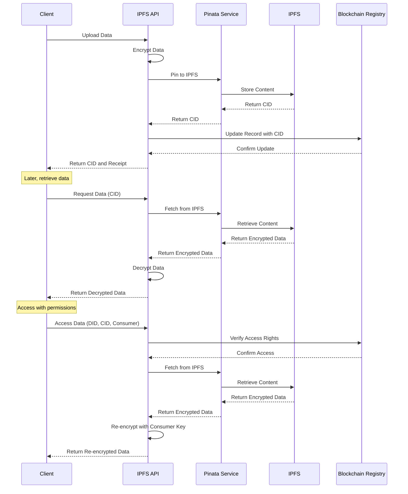

# IPFS API Reference

## Overview

The IPFS API provides a set of HTTP endpoints implemented as Azure Functions for interacting with the InterPlanetary File System (IPFS) within the LEDUP platform. These functions enable secure data storage, retrieval, encryption/decryption, and management of health data stored on IPFS with integration to blockchain records.

## IPFS Workflow



## API Endpoints

### Data Storage

#### Update Blockchain (Pin to IPFS)

Uploads data to IPFS, encrypts it, and returns the CID for blockchain storage.

**Endpoint:** `POST /ipfs/pin`

**Request Body:**

```json
{
  "owner": "0x1234567890abcdef1234567890abcdef12345678",
  "data": {
    "id": "record-123456",
    "resourceType": "HealthRecord",
    "content": {
      "patientId": "patient-987654",
      "observations": [
        {
          "code": "8867-4",
          "value": 72,
          "unit": "bpm"
        }
      ]
    }
  },
  "resourceType": 1
}
```

**Parameters:**

- `owner` (string, required): The Ethereum address of the content owner
- `data` (object, required): The data to upload and encrypt
- `resourceType` (number, required): Identifier for the type of resource being stored

**Response (200 OK):**

```json
{
  "success": true,
  "data": {
    "cid": "QmX1bUuJBkHnBUHFG8qxvLsBQPtLkxXp6DuXwVQESEzMVL",
    "url": "https://ipfs.io/ipfs/QmX1bUuJBkHnBUHFG8qxvLsBQPtLkxXp6DuXwVQESEzMVL",
    "hash": "0x7b226964223a2272656332222c22726573736f75726365223a2274797022c2269642273a2",
    "size": 1024,
    "timestamp": 1648641321
  }
}
```

**Error Response (500 Internal Server Error):**

```json
{
  "success": false,
  "error": "Error uploading data to IPFS",
  "message": "Failed to encrypt and upload data"
}
```

### Data Retrieval

#### Get Data

Retrieves raw data from IPFS without decryption.

**Endpoint:** `GET /ipfs/getData?cid={cid}`

**Query Parameters:**

- `cid` (string, required): The Content Identifier (CID) of the IPFS content to retrieve

**Response (200 OK):**

```json
{
  "success": true,
  "data": {
    "raw": "eyJlbmNyeXB0ZWREYXRhIjoiZUp5TFZTdklPLy8vK0xVWU1hRWRjMnZEazlPOWNpdzJhaWh2NWd3PT0iLCJpdiI6IjhXM1ZkTFZmR1JZUm81UFEiLCJzYWx0IjoiR3g0UURXRWgzVGNkVkdMSyJ9",
    "metadata": {
      "cid": "QmX1bUuJBkHnBUHFG8qxvLsBQPtLkxXp6DuXwVQESEzMVL",
      "created": "2023-04-01T12:30:45Z"
    }
  }
}
```

**Error Response (404 Not Found):**

```json
{
  "success": false,
  "error": "CID not found",
  "message": "The requested CID could not be found on IPFS"
}
```

#### Get IPFS Data (with Decryption)

Retrieves and decrypts data from IPFS.

**Endpoint:** `POST /getData`

**Request Body:**

```json
{
  "cid": "QmX1bUuJBkHnBUHFG8qxvLsBQPtLkxXp6DuXwVQESEzMVL"
}
```

**Parameters:**

- `cid` (string, required): The Content Identifier (CID) of the encrypted IPFS content

**Response (200 OK):**

```json
{
  "success": true,
  "data": {
    "decrypted": {
      "id": "record-123456",
      "resourceType": "HealthRecord",
      "content": {
        "patientId": "patient-987654",
        "observations": [
          {
            "code": "8867-4",
            "value": 72,
            "unit": "bpm"
          }
        ]
      }
    },
    "raw": "eyJlbmNyeXB0ZWREYXRhIjoiZUp5TFZTdklPLy8vK0xVWU1hRWRjMnZEazlPOWNpdzJhaWh2NWd3PT0iLCJpdiI6IjhXM1ZkTFZmR1JZUm81UFEiLCJzYWx0IjoiR3g0UURXRWgzVGNkVkdMSyJ9"
  }
}
```

**Error Response (500 Internal Server Error):**

```json
{
  "success": false,
  "error": "Failed to decrypt data",
  "message": "The data could not be decrypted"
}
```

#### Get Bulk Data

Retrieves multiple IPFS data items in a single request.

**Endpoint:** `POST /ipfs/getBulkData`

**Request Body:**

```json
{
  "cids": ["QmX1bUuJBkHnBUHFG8qxvLsBQPtLkxXp6DuXwVQESEzMVL", "QmY9cxiHqTFoWamkQVkpmmqzBrY3WEeCURGALSxu5EgLdT"]
}
```

**Parameters:**

- `cids` (array, required): Array of Content Identifiers (CIDs) to retrieve

**Response (200 OK):**

```json
{
  "success": true,
  "data": {
    "QmX1bUuJBkHnBUHFG8qxvLsBQPtLkxXp6DuXwVQESEzMVL": {
      "data": {
        "id": "record-123456",
        "resourceType": "HealthRecord",
        "content": {
          "patientId": "patient-987654",
          "observations": [
            {
              "code": "8867-4",
              "value": 72,
              "unit": "bpm"
            }
          ]
        }
      },
      "raw": "eyJlbmNyeXB0ZWREYXRhIjoiZUp5TFZTdklPLy8vK0xVWU1hRWRjMnZEazlPOWNpdzJhaWh2NWd3PT0iLCJpdiI6IjhXM1ZkTFZmR1JZUm81UFEiLCJzYWx0IjoiR3g0UURXRWgzVGNkVkdMSyJ9"
    },
    "QmY9cxiHqTFoWamkQVkpmmqzBrY3WEeCURGALSxu5EgLdT": {
      "data": {
        "id": "record-789012",
        "resourceType": "HealthRecord",
        "content": {
          "patientId": "patient-987654",
          "observations": [
            {
              "code": "9279-1",
              "value": 98.6,
              "unit": "F"
            }
          ]
        }
      },
      "raw": "eyJlbmNyeXB0ZWREYXRhIjoiZUp5TFZTdklPLy8vK0xVWU1qRWRjMnZEazlPOWNpdzJhaWh2NWd3PT0iLCJpdiI6IjhXM1ZkTFZmR1JZUm81UFEiLCJzYWx0IjoiR3g0UURXRWgzVGNkVkdMSyJ9"
    }
  }
}
```

**Error Response (500 Internal Server Error):**

```json
{
  "success": false,
  "error": "Error retrieving bulk IPFS data",
  "message": "Failed to retrieve one or more requested CIDs"
}
```

### Access Control

#### Access Data

Retrieves and decrypts data from IPFS, verifying access rights and re-encrypting with the requester's public key.

**Endpoint:** `POST /ipfs/accessData`

**Request Body:**

```json
{
  "did": "did:ledup:consumer:987654321",
  "cid": "QmX1bUuJBkHnBUHFG8qxvLsBQPtLkxXp6DuXwVQESEzMVL",
  "consumerAddress": "0x9876543210fedcba9876543210fedcba98765432",
  "recordId": "record-123456"
}
```

**Parameters:**

- `did` (string, required): Decentralized Identifier of the requesting consumer
- `cid` (string, required): Content Identifier (CID) of the requested IPFS content
- `consumerAddress` (string, required): Ethereum address of the consumer
- `recordId` (string, required): ID of the record being accessed

**Response (200 OK):**

```json
{
  "success": true,
  "data": {
    "id": "record-123456",
    "resourceType": "HealthRecord",
    "content": {
      "patientId": "patient-987654",
      "observations": [
        {
          "code": "8867-4",
          "value": 72,
          "unit": "bpm"
        }
      ]
    }
  },
  "recordId": "record-123456",
  "accessDetails": {
    "accessLevel": 2,
    "expiration": 1681373321
  },
  "message": "Health record data retrieved successfully"
}
```

**Error Response (403 Forbidden):**

```json
{
  "success": false,
  "message": "You do not have permission to view this health record data"
}
```

### Data Management

#### Delete IPFS Data

Unpins data from IPFS using the provided CID.

**Endpoint:** `DELETE /ipfs/{cid}`

**Path Parameters:**

- `cid` (string, required): Content Identifier (CID) to unpin from IPFS

**Response (200 OK):**

```json
{
  "success": true,
  "message": "Data successfully unpinned from IPFS",
  "data": {
    "status": "unpinned",
    "cid": "QmX1bUuJBkHnBUHFG8qxvLsBQPtLkxXp6DuXwVQESEzMVL"
  }
}
```

**Error Response (404 Not Found):**

```json
{
  "success": false,
  "error": "CID not found",
  "message": "The specified CID could not be found"
}
```

## Security Considerations

### Encryption

- All health data is encrypted before being stored on IPFS using AES-256 encryption
- Symmetric encryption keys are securely managed and never exposed in responses
- Re-encryption is performed for authorized consumers using their public keys

### Access Control

- Access to IPFS data is verified through the blockchain before retrieval
- Checks for access rights, expiration, and revocation status are performed for each request
- Data is only re-encrypted for authorized consumers with valid DIDs

### Error Handling

- All functions include comprehensive error handling for invalid inputs
- Sensitive errors are sanitized before being returned in responses
- Failed decryption attempts do not reveal encryption keys or methods

## Integration Examples

### Uploading and Retrieving Health Data

```typescript
import axios from 'axios';

/**
 * Uploads health data to IPFS and updates blockchain records
 * @param {object} healthData - The health data to store
 * @param {string} ownerAddress - Ethereum address of the data owner
 * @returns {Promise<object>} - IPFS storage result
 */
const uploadHealthData = async (healthData, ownerAddress) => {
  try {
    const response = await axios.post('/ipfs/pin', {
      owner: ownerAddress,
      data: healthData,
      resourceType: 1, // HealthRecord type
    });

    return response.data.data;
  } catch (error) {
    console.error('Data upload failed:', error.response?.data || error.message);
    throw new Error('Failed to upload health data to IPFS');
  }
};

/**
 * Retrieves and decrypts health data from IPFS
 * @param {string} cid - Content Identifier (CID) of the IPFS content
 * @returns {Promise<object>} - Decrypted health data
 */
const retrieveHealthData = async (cid) => {
  try {
    const response = await axios.post('/getData', { cid });

    return response.data.data.decrypted;
  } catch (error) {
    console.error('Data retrieval failed:', error.response?.data || error.message);
    throw new Error('Failed to retrieve health data from IPFS');
  }
};

// Usage example
const main = async () => {
  const ownerAddress = '0x1234567890abcdef1234567890abcdef12345678';

  try {
    // Create a health record
    const healthRecord = {
      id: `record-${Date.now()}`,
      resourceType: 'HealthRecord',
      content: {
        patientId: 'patient-987654',
        observations: [
          {
            code: '8867-4',
            value: 72,
            unit: 'bpm',
          },
        ],
      },
    };

    // Upload to IPFS
    const uploadResult = await uploadHealthData(healthRecord, ownerAddress);
    console.log('Data uploaded successfully!');
    console.log(`CID: ${uploadResult.cid}`);
    console.log(`URL: ${uploadResult.url}`);

    // Later, retrieve the data
    const retrievedData = await retrieveHealthData(uploadResult.cid);
    console.log('Data retrieved successfully!');
    console.log('Health Record:', retrievedData);
  } catch (error) {
    console.error('Error:', error.message);
  }
};
```

### Accessing Data with Permissions

```typescript
import axios from 'axios';

/**
 * Access health data with permissions verification
 * @param {string} consumerDid - DID of the consumer requesting access
 * @param {string} cid - Content Identifier (CID) of the IPFS content
 * @param {string} consumerAddress - Ethereum address of the consumer
 * @param {string} recordId - ID of the record being accessed
 * @returns {Promise<object>} - Health data accessible to the consumer
 */
const accessHealthData = async (consumerDid, cid, consumerAddress, recordId) => {
  try {
    const response = await axios.post('/ipfs/accessData', {
      did: consumerDid,
      cid,
      consumerAddress,
      recordId,
    });

    return {
      data: response.data.data,
      accessDetails: response.data.accessDetails,
    };
  } catch (error) {
    if (error.response?.status === 403) {
      console.warn('Access denied:', error.response.data.message);
      return { denied: true, reason: error.response.data.message };
    }

    console.error('Error accessing data:', error.response?.data || error.message);
    throw new Error('Failed to access health data');
  }
};

/**
 * Retrieve multiple health records in bulk
 * @param {string[]} cids - Array of Content Identifiers (CIDs)
 * @returns {Promise<object>} - Map of CIDs to their respective data
 */
const retrieveBulkHealthData = async (cids) => {
  try {
    const response = await axios.post('/ipfs/getBulkData', { cids });

    // Transform the response to extract just the decrypted data
    const result = {};
    for (const [cid, item] of Object.entries(response.data.data)) {
      result[cid] = item.data;
    }

    return result;
  } catch (error) {
    console.error('Bulk data retrieval failed:', error.response?.data || error.message);
    throw new Error('Failed to retrieve bulk health data from IPFS');
  }
};

// Usage example
const main = async () => {
  const consumerDid = 'did:ledup:consumer:987654321';
  const consumerAddress = '0x9876543210fedcba9876543210fedcba98765432';
  const recordId = 'record-123456';
  const cid = 'QmX1bUuJBkHnBUHFG8qxvLsBQPtLkxXp6DuXwVQESEzMVL';

  try {
    // Access health data with permissions
    const accessResult = await accessHealthData(consumerDid, cid, consumerAddress, recordId);

    if (accessResult.denied) {
      console.warn(`Access denied: ${accessResult.reason}`);
    } else {
      console.log('Health data accessed successfully!');
      console.log('Health Record:', accessResult.data);
      console.log('Access Level:', accessResult.accessDetails.accessLevel);
      console.log('Expires:', new Date(accessResult.accessDetails.expiration * 1000).toLocaleString());
    }

    // Retrieve multiple records in bulk
    const bulkCids = [
      'QmX1bUuJBkHnBUHFG8qxvLsBQPtLkxXp6DuXwVQESEzMVL',
      'QmY9cxiHqTFoWamkQVkpmmqzBrY3WEeCURGALSxu5EgLdT',
    ];

    const bulkData = await retrieveBulkHealthData(bulkCids);
    console.log('Bulk data retrieved successfully!');
    console.log(`Retrieved ${Object.keys(bulkData).length} records`);

    // Process each record
    for (const [cid, data] of Object.entries(bulkData)) {
      console.log(`Record from CID ${cid.substring(0, 10)}...:`);
      console.log(`- ID: ${data.id}`);
      console.log(`- Type: ${data.resourceType}`);
      console.log(`- Observations: ${data.content.observations?.length || 0}`);
    }
  } catch (error) {
    console.error('Error:', error.message);
  }
};
```

## Implementation Details

### Update Blockchain Function

The update blockchain function (`updateBlockchain.ts`) handles the complete workflow for storing data on IPFS:

1. Receives the data and owner information
2. Encrypts the data using a secure encryption key
3. Uploads the encrypted data to IPFS via Pinata
4. Creates a metadata object with the IPFS URL, CID, and content hash
5. Returns a structured response with all the necessary information for blockchain storage

This function ensures secure and verifiable storage of health data with proper encryption and pinning.

### Access Data Function

The access data function (`accessData.ts`) implements the secure access control workflow:

1. Receives the DID, CID, consumer address, and record ID from the request
2. Retrieves the public key associated with the consumer's DID
3. Verifies access permissions using the Data Registry contract
4. Checks if access is currently valid (not revoked or expired)
5. Retrieves the encrypted data from IPFS
6. Re-encrypts the data using the consumer's public key
7. Returns the re-encrypted data with access details

This function ensures that only authorized consumers can access health data, with proper encryption for secure transmission.

---

© 2025 LEDUP | Documentation for Production Use | Last Updated: March 2025
