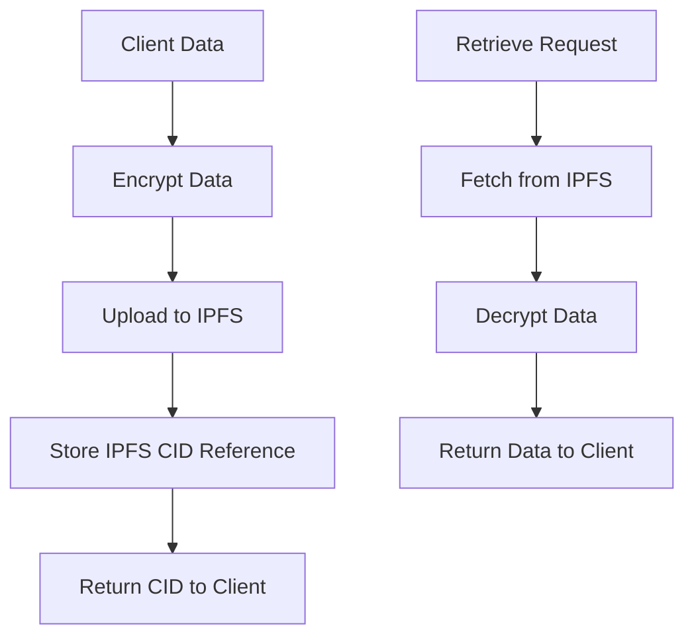
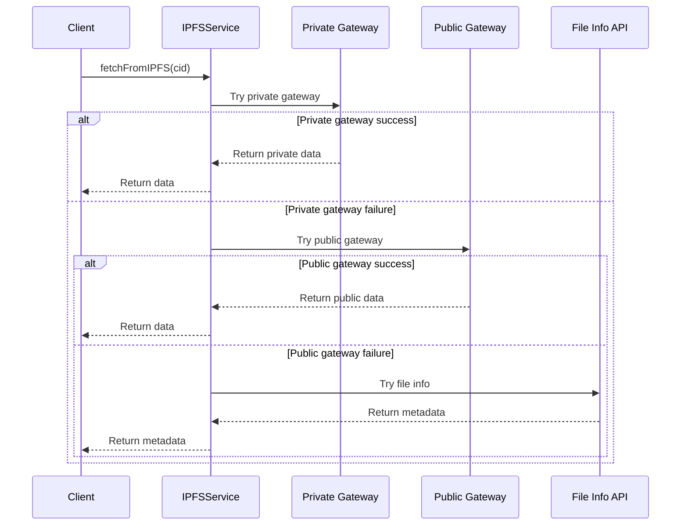

# IPFSService

## Overview

The `IPFSService` provides a comprehensive interface for interacting with the InterPlanetary File System (IPFS) within the LEDUP ecosystem. It handles data storage, retrieval, and management with a focus on security through encryption. The service integrates with Pinata SDK for reliable IPFS pinning and gateway access, while providing methods for encryption, decryption, and efficient data handling.

## Key Features

### Secure Data Storage



The service provides secure data storage capabilities:

- Symmetric encryption for data before IPFS upload
- Support for blockchain-verified data with digital signatures
- Metadata preservation for secure retrieval

### Multiple Retrieval Methods



The service implements a comprehensive fault-tolerant retrieval strategy:

- Tries private gateway first for restricted content
- Falls back to public gateway for publicly accessible content
- Uses file info API as a last resort to retrieve metadata

### Batch Processing

The `IPFSService` supports efficient bulk operations for both upload and retrieval:

- Controlled parallelism to avoid API rate limits
- Batched processing with progress tracking
- Comprehensive error handling per item

### HTTP API Integration

The service includes HTTP request handlers for integration with web applications:

- RESTful API for data retrieval and management
- Support for both single and bulk operations
- JWT authentication and authorization

## API Reference

### Constructor

```typescript
constructor();
```

Creates a new instance of `IPFSService` with configuration from environment variables.

### Retrieval Methods

#### `fetchFromIPFS()`

```typescript
async fetchFromIPFS(cid: string, context?: InvocationContext): Promise<any>
```

Fetches data from IPFS using the provided CID (Content Identifier).

| Parameter | Type              | Description                                             |
| --------- | ----------------- | ------------------------------------------------------- |
| cid       | string            | The Content Identifier for the data stored on IPFS      |
| context   | InvocationContext | Optional Azure Functions invocation context for logging |

Returns: A Promise resolving with the fetched data from IPFS.

#### `fetchBulkFromIPFS()`

```typescript
async fetchBulkFromIPFS(cids: string[], context?: InvocationContext): Promise<Record<string, any>>
```

Fetches data for multiple CIDs from IPFS in batches.

| Parameter | Type              | Description                                             |
| --------- | ----------------- | ------------------------------------------------------- |
| cids      | string[]          | Array of Content Identifiers to fetch from IPFS         |
| context   | InvocationContext | Optional Azure Functions invocation context for logging |

Returns: A Promise resolving with a map of CID to fetched data.

#### `fetchAndDecrypt()`

```typescript
async fetchAndDecrypt(
  cid: string,
  context?: InvocationContext
): Promise<{ data: any; raw: any; error?: boolean; message?: string }>
```

Fetches and decrypts data from IPFS.

| Parameter | Type              | Description                                             |
| --------- | ----------------- | ------------------------------------------------------- |
| cid       | string            | The Content Identifier for the encrypted data           |
| context   | InvocationContext | Optional Azure Functions invocation context for logging |

Returns: A Promise resolving to an object containing both the decrypted data and the raw encrypted data.

#### `fetchAndDecryptBulk()`

```typescript
async fetchAndDecryptBulk(
  cids: string[],
  context?: InvocationContext
): Promise<Record<string, { data: any; raw: any; error?: boolean; message?: string }>>
```

Fetches and decrypts multiple data items from IPFS.

| Parameter | Type              | Description                                             |
| --------- | ----------------- | ------------------------------------------------------- |
| cids      | string[]          | Array of Content Identifiers to fetch and decrypt       |
| context   | InvocationContext | Optional Azure Functions invocation context for logging |

Returns: A Promise resolving to a map of CID to result objects.

#### `fetchFromIPFSAndReencrypt()`

```typescript
async fetchFromIPFSAndReencrypt(
  publicKey: string,
  cid: string,
  context?: InvocationContext
): Promise<any>
```

Fetches data from IPFS, decrypts it, and re-encrypts it with a provided public key.

| Parameter | Type              | Description                                             |
| --------- | ----------------- | ------------------------------------------------------- |
| publicKey | string            | The public key to use for re-encryption                 |
| cid       | string            | The Content Identifier for the data stored on IPFS      |
| context   | InvocationContext | Optional Azure Functions invocation context for logging |

Returns: A Promise resolving with the re-encrypted data.

### Upload Methods

#### `uploadToIPFS()`

```typescript
async uploadToIPFS(data: any, context?: InvocationContext): Promise<any>
```

Uploads JSON data to IPFS using Pinata's pinning service.

| Parameter | Type              | Description                                             |
| --------- | ----------------- | ------------------------------------------------------- |
| data      | any               | The data object to be uploaded to IPFS                  |
| context   | InvocationContext | Optional Azure Functions invocation context for logging |

Returns: A Promise resolving to the response data from the IPFS API.

#### `encryptAndUpload()`

```typescript
async encryptAndUpload(data: BlockchainUpdateRequest, context?: InvocationContext): Promise<any>
```

Encrypts and uploads data to IPFS.

| Parameter | Type                    | Description                                             |
| --------- | ----------------------- | ------------------------------------------------------- |
| data      | BlockchainUpdateRequest | The data to be encrypted and uploaded                   |
| context   | InvocationContext       | Optional Azure Functions invocation context for logging |

Returns: A Promise resolving to the response data from the IPFS API.

### Management Methods

#### `unpinFromIPFS()`

```typescript
async unpinFromIPFS(cid: string, context?: InvocationContext): Promise<any>
```

Unpins data from IPFS to allow garbage collection.

| Parameter | Type              | Description                                             |
| --------- | ----------------- | ------------------------------------------------------- |
| cid       | string            | The Content Identifier of the data to unpin             |
| context   | InvocationContext | Optional Azure Functions invocation context for logging |

Returns: A Promise resolving to the response from the IPFS API.

### HTTP Handlers

#### `handleGetIPFSData()`

```typescript
async handleGetIPFSData(
  request: HttpRequest,
  context: InvocationContext
): Promise<HttpResponseInit>
```

Handles HTTP requests to retrieve data from IPFS.

| Parameter | Type              | Description                        |
| --------- | ----------------- | ---------------------------------- |
| request   | HttpRequest       | The HTTP request                   |
| context   | InvocationContext | Azure Functions invocation context |

Returns: A Promise resolving to an HTTP response.

#### `handleGetBulkData()`

```typescript
async handleGetBulkData(
  request: HttpRequest,
  context: InvocationContext
): Promise<HttpResponseInit>
```

Handles HTTP requests to retrieve multiple data items from IPFS.

| Parameter | Type              | Description                        |
| --------- | ----------------- | ---------------------------------- |
| request   | HttpRequest       | The HTTP request                   |
| context   | InvocationContext | Azure Functions invocation context |

Returns: A Promise resolving to an HTTP response.

#### `handleGetData()`

```typescript
async handleGetData(
  request: HttpRequest,
  context: InvocationContext
): Promise<HttpResponseInit>
```

Handles HTTP requests to retrieve and decrypt data from IPFS.

| Parameter | Type              | Description                        |
| --------- | ----------------- | ---------------------------------- |
| request   | HttpRequest       | The HTTP request                   |
| context   | InvocationContext | Azure Functions invocation context |

Returns: A Promise resolving to an HTTP response.

#### `handleDeleteIPFS()`

```typescript
async handleDeleteIPFS(
  request: HttpRequest,
  context: InvocationContext
): Promise<HttpResponseInit>
```

Handles HTTP requests to delete (unpin) data from IPFS.

| Parameter | Type              | Description                        |
| --------- | ----------------- | ---------------------------------- |
| request   | HttpRequest       | The HTTP request                   |
| context   | InvocationContext | Azure Functions invocation context |

Returns: A Promise resolving to an HTTP response.

#### `handleUpdateBlockchain()`

```typescript
async handleUpdateBlockchain(
  request: HttpRequest,
  context: InvocationContext
): Promise<HttpResponseInit>
```

Handles HTTP requests to update blockchain data.

| Parameter | Type              | Description                        |
| --------- | ----------------- | ---------------------------------- |
| request   | HttpRequest       | The HTTP request                   |
| context   | InvocationContext | Azure Functions invocation context |

Returns: A Promise resolving to an HTTP response.

## Data Types

### BlockchainUpdateRequest

```typescript
interface BlockchainUpdateRequest {
  resource: Record<string, any>;
  metadata: {
    name: string;
    resourceType: string;
    owner: string;
    timestamp: number;
    contentHash: string;
    signature: string;
  };
  [key: string]: any;
}
```

## Configuration

The `IPFSService` is configured using environment variables:

| Environment Variable | Description                                                  |
| -------------------- | ------------------------------------------------------------ |
| PINATA_API_JWT       | JWT token for authenticating with Pinata                     |
| IPFS_GATEWAY_URL     | Custom IPFS gateway URL (defaults to 'gateway.pinata.cloud') |
| ENCRYPTION_KEY       | Key used for encrypting and decrypting data                  |

## Integration Examples

### Basic Data Upload and Retrieval

```typescript
import { IPFSService } from '@ledup/api/services/ipfs';

// Create a new IPFS service instance
const ipfsService = new IPFSService();

// Upload data to IPFS
const uploadResult = await ipfsService.uploadToIPFS({
  message: 'Hello, IPFS!',
  timestamp: Date.now(),
});

console.log(`Data uploaded with CID: ${uploadResult.cid}`);

// Later, retrieve the data
const fetchedData = await ipfsService.fetchFromIPFS(uploadResult.cid);
console.log(fetchedData);
```

### Encrypt and Upload Sensitive Data

```typescript
import { IPFSService } from '@ledup/api/services/ipfs';

// Create a new IPFS service instance
const ipfsService = new IPFSService();

// Prepare data with blockchain verification metadata
const sensitiveData = {
  resource: {
    patientId: 'P12345',
    recordType: 'medical',
    data: {
      bloodType: 'O+',
      allergies: ['penicillin', 'peanuts'],
    },
  },
  metadata: {
    name: 'Patient Medical Record',
    resourceType: 'MedicalRecord',
    owner: 'did:ethr:0x1234567890abcdef1234567890abcdef12345678',
    timestamp: Date.now(),
    contentHash: '0xabcdef123456', // Calculated content hash
    signature: '0x9876543210fedcba', // Digital signature
  },
};

// Encrypt and upload the data
const uploadResult = await ipfsService.encryptAndUpload(sensitiveData);

console.log(`Encrypted data uploaded with CID: ${uploadResult.cid}`);

// Later, fetch and decrypt the data
const { data: decryptedData } = await ipfsService.fetchAndDecrypt(uploadResult.cid);
console.log(decryptedData);
```

### Bulk Data Processing

```typescript
import { IPFSService } from '@ledup/api/services/ipfs';

// Create a new IPFS service instance
const ipfsService = new IPFSService();

// Array of CIDs to fetch
const cids = [
  'QmX1bUuJBkHnBUHFG8qxvLsBQPtLkxXp6DuXwVQESEzMVL',
  'QmYwAPJzv5CZsnA625s3Xf2nemtYgPpHdWEz79ojWnPbdG',
  'QmZ4tDuvesekSs4qM5ZBKpXiZGun7S2CYtEZRB3DYXkjGx',
];

// Fetch and decrypt multiple items in bulk
const bulkResults = await ipfsService.fetchAndDecryptBulk(cids);

// Process the results
for (const cid of cids) {
  if (bulkResults[cid].error) {
    console.error(`Error with CID ${cid}: ${bulkResults[cid].message}`);
  } else {
    console.log(`Data for CID ${cid}:`, bulkResults[cid].data);
  }
}
```

### API Integration with Azure Functions

```typescript
import { app, HttpRequest, HttpResponseInit, InvocationContext } from '@azure/functions';
import { IPFSService } from '@ledup/api/services/ipfs';

const ipfsService = new IPFSService();

app.http('getIpfsData', {
  methods: ['GET'],
  authLevel: 'function',
  handler: async (request: HttpRequest, context: InvocationContext): Promise<HttpResponseInit> => {
    return await ipfsService.handleGetIPFSData(request, context);
  },
});

app.http('getBulkIpfsData', {
  methods: ['POST'],
  authLevel: 'function',
  handler: async (request: HttpRequest, context: InvocationContext): Promise<HttpResponseInit> => {
    return await ipfsService.handleGetBulkData(request, context);
  },
});
```

## Error Handling

The `IPFSService` implements robust error handling:

- Graceful degradation when content isn't found
- Detailed error messages with original and normalized CIDs
- Multiple fallback mechanisms for content retrieval
- Error objects with consistent structure for client consumption

## Best Practices

### Performance Optimization

- Use batch operations for multiple CIDs
- Control concurrency to avoid rate limits
- Verify content availability after uploading

### Security Considerations

- Always encrypt sensitive data before uploading
- Store encryption keys securely (e.g., in Azure Key Vault)
- Validate signatures for blockchain-verified data
- Use proper authentication for HTTP handlers

## Summary

The `IPFSService` provides a robust and secure interface for IPFS operations within the LEDUP ecosystem. It handles the complexities of content addressing, encryption, and distributed storage, allowing applications to store and retrieve data with confidence. The service's fault-tolerant design ensures reliable operation even in challenging network conditions, while its encryption capabilities protect sensitive information throughout its lifecycle.

---

© 2025 LEDUP | Documentation for Production Use | Last Updated: March 2025
