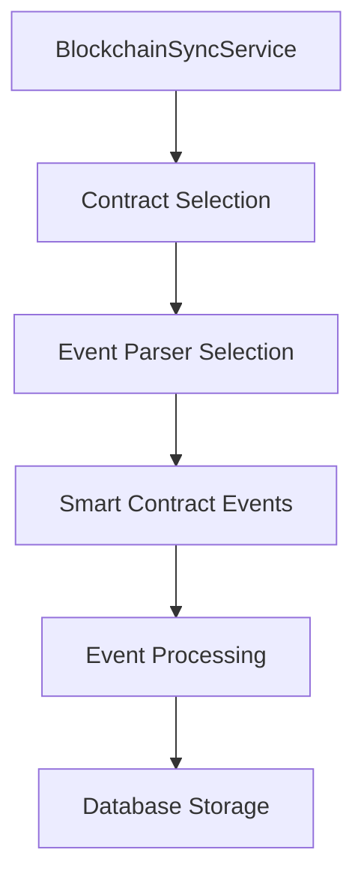
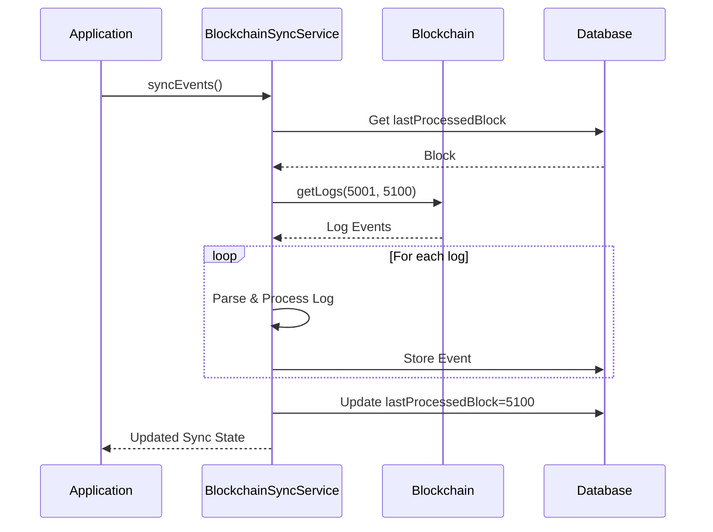

# BlockchainSyncService

## Overview

The `BlockchainSyncService` provides a robust solution for syncing and managing blockchain events within the LEDUP ecosystem. It tracks, processes, and persists events from smart contracts with support for error handling, retry logic, and efficient batch processing. The service maintains synchronization state between the blockchain and the application database, ensuring that all relevant contract events are captured and made available for business processes.

## Key Features

### Configurable Contract Event Tracking



The service can be configured to track events from different smart contracts:

- Data Registry contract (default)
- DID Registry contract
- Custom contract configurations
- Event-specific parsing and handling

### Incremental & Resilient Synchronization



The service implements a battle-tested synchronization strategy:

- Incremental processing of block ranges to avoid timeouts
- Resilient error handling with configurable retry logic
- Detailed sync state tracking with error information
- Support for full and partial synchronization

### Comprehensive Query Capabilities

The `BlockchainSyncService` provides various methods to query blockchain events:

- By event name (e.g., "DidRegistered", "DataShared")
- By block range
- By transaction hash
- Latest events with configurable limits
- Events with parsed arguments for easier consumption

## API Reference

### Constructor

```typescript
constructor(
  contractType: ContractType = ContractType.DATA_REGISTRY,
  contractAddress: string = DATA_REGISTRY_CONTRACT_ADDRESS,
  maxBlocksPerSync: number = 100,
  maxRetryAttempts: number = 3,
  retryDelayMs: number = 2000
)
```

Creates a new instance of BlockchainSyncService.

| Parameter        | Type         | Description                                                                               |
| ---------------- | ------------ | ----------------------------------------------------------------------------------------- |
| contractType     | ContractType | The type of contract to sync events from (default: DATA_REGISTRY)                         |
| contractAddress  | string       | The address of the contract to sync events from (default: DATA_REGISTRY_CONTRACT_ADDRESS) |
| maxBlocksPerSync | number       | Maximum number of blocks to process in a single sync operation (default: 100)             |
| maxRetryAttempts | number       | Maximum number of retry attempts for failed operations (default: 3)                       |
| retryDelayMs     | number       | Delay in milliseconds between retry attempts (default: 2000)                              |

### Initialization & Sync Methods

#### `initialize()`

```typescript
async initialize(): Promise<void>
```

Initializes the blockchain sync service by creating necessary tables and initial state.

Returns: A Promise that resolves when initialization is complete.

#### `syncEvents()`

```typescript
async syncEvents(context: InvocationContext): Promise<BlockchainSyncState>
```

Syncs blockchain events from the last processed block to the latest block.

| Parameter | Type              | Description                        |
| --------- | ----------------- | ---------------------------------- |
| context   | InvocationContext | The invocation context for logging |

Returns: A Promise that resolves with the updated synchronization state.

#### `performFullSync()`

```typescript
async performFullSync(startBlock: number, context: InvocationContext): Promise<void>
```

Performs a full sync of blockchain events from a specific block.

| Parameter  | Type              | Description                        |
| ---------- | ----------------- | ---------------------------------- |
| startBlock | number            | The block to start syncing from    |
| context    | InvocationContext | The invocation context for logging |

Returns: A Promise that resolves when the sync is complete.

#### `resetSyncState()`

```typescript
async resetSyncState(blockNumber: number): Promise<void>
```

Resets the blockchain sync state to a specific block.

| Parameter   | Type   | Description                  |
| ----------- | ------ | ---------------------------- |
| blockNumber | number | The block number to reset to |

Returns: A Promise that resolves when the reset is complete.

### State Management Methods

#### `getSyncState()`

```typescript
async getSyncState(): Promise<BlockchainSyncState>
```

Gets the current blockchain sync state.

Returns: A Promise that resolves with the current blockchain sync state.

#### `getLastProcessedBlock()`

```typescript
async getLastProcessedBlock(): Promise<number>
```

Gets the last processed block number.

Returns: A Promise that resolves with the last processed block number.

### Event Query Methods

#### `getEventsByName()`

```typescript
async getEventsByName(eventName: string, limit: number = 100): Promise<BlockchainRecordType[]>
```

Gets blockchain events by event name.

| Parameter | Type   | Description                                           |
| --------- | ------ | ----------------------------------------------------- |
| eventName | string | The name of the event to filter by                    |
| limit     | number | The maximum number of events to return (default: 100) |

Returns: A Promise that resolves with an array of matching events.

#### `getEventsByBlockRange()`

```typescript
async getEventsByBlockRange(
  fromBlock: number,
  toBlock: number,
  limit: number = 100
): Promise<BlockchainRecordType[]>
```

Gets blockchain events within a block range.

| Parameter | Type   | Description                                           |
| --------- | ------ | ----------------------------------------------------- |
| fromBlock | number | The starting block number                             |
| toBlock   | number | The ending block number                               |
| limit     | number | The maximum number of events to return (default: 100) |

Returns: A Promise that resolves with an array of events within the block range.

#### `getLatestEvents()`

```typescript
async getLatestEvents(limit: number = 10): Promise<BlockchainRecordType[]>
```

Gets the latest blockchain events.

| Parameter | Type   | Description                                          |
| --------- | ------ | ---------------------------------------------------- |
| limit     | number | The maximum number of events to return (default: 10) |

Returns: A Promise that resolves with an array of the latest events.

#### `getEventsByTransactionHash()`

```typescript
async getEventsByTransactionHash(transactionHash: string): Promise<BlockchainRecordType[]>
```

Gets blockchain events by transaction hash.

| Parameter       | Type   | Description                       |
| --------------- | ------ | --------------------------------- |
| transactionHash | string | The transaction hash to filter by |

Returns: A Promise that resolves with an array of events from the transaction.

#### `getEventsWithParsedArgs()`

```typescript
async getEventsWithParsedArgs(limit: number = 10): Promise<any[]>
```

Gets blockchain events with parsed arguments for easy frontend consumption.

| Parameter | Type   | Description                                          |
| --------- | ------ | ---------------------------------------------------- |
| limit     | number | The maximum number of events to return (default: 10) |

Returns: A Promise that resolves with an array of events with parsed arguments.

### Contract Information Methods

#### `getContractType()`

```typescript
getContractType(): ContractType
```

Gets the contract type being used by this service.

Returns: The contract type.

#### `getContractAddress()`

```typescript
getContractAddress(): string
```

Gets the contract address being used by this service.

Returns: The contract address.

#### `getEventParser()`

```typescript
getEventParser(): BaseEventParser
```

Gets the event parser being used by this service.

Returns: The event parser.

## Data Types

### BlockchainSyncState

```typescript
interface BlockchainSyncState {
  partitionKey: string;
  rowKey: string;
  lastProcessedBlock: string;
  lastProcessedBlockHash: string;
  lastProcessedTimestamp: string;
  lastSyncedEventName?: string;
  lastSyncedTransactionHash?: string;
  syncStatus: 'SYNCING' | 'SYNCED' | 'ERROR';
  errorMessage?: string;
  totalEventsProcessed: number;
}
```

### BlockchainRecordType

```typescript
interface BlockchainRecordType {
  id?: string;
  partitionKey?: string;
  rowKey?: string;
  transactionHash: string;
  blockHash: string;
  blockNumber: string;
  eAddress: string;
  eData: string;
  topics: string;
  args: string;
  eSignature: string;
  eName: string;
  eTopic: string;
  eTimestamp: string;
}
```

## Configuration

The `BlockchainSyncService` can be configured with several parameters:

| Parameter        | Description                                                    | Default                        |
| ---------------- | -------------------------------------------------------------- | ------------------------------ |
| contractType     | The type of contract to sync events from                       | ContractType.DATA_REGISTRY     |
| contractAddress  | The address of the contract to sync events from                | DATA_REGISTRY_CONTRACT_ADDRESS |
| maxBlocksPerSync | Maximum number of blocks to process in a single sync operation | 100                            |
| maxRetryAttempts | Maximum number of retry attempts for failed operations         | 3                              |
| retryDelayMs     | Delay in milliseconds between retry attempts                   | 2000                           |

## Integration Examples

### Basic Initialization and Synchronization

```typescript
import { BlockchainSyncService } from '@ledup/api/services/sync';
import { ContractType } from '@ledup/api/helpers/ContractHandlerFactory';
import { InvocationContext } from '@azure/functions';

// Create a new blockchain sync service instance
const syncService = new BlockchainSyncService(
  ContractType.DATA_REGISTRY, // Contract type
  '0x1234567890abcdef1234567890abcdef12345678', // Contract address
  50, // Max blocks per sync
  5, // Max retry attempts
  3000 // Retry delay in ms
);

// Initialize the service
await syncService.initialize();

// Create a mock context for logging
const mockContext: InvocationContext = {
  log: console.log,
  error: console.error,
  info: console.info,
  // ... other context properties
};

// Perform synchronization
const syncState = await syncService.syncEvents(mockContext);
console.log(`Sync completed with status: ${syncState.syncStatus}`);
```

### Scheduled Synchronization with Azure Functions

```typescript
import { app, timer, InvocationContext } from '@azure/functions';
import { BlockchainSyncService } from '@ledup/api/services/sync';

// Create a singleton instance for reuse
const syncService = new BlockchainSyncService();

// Initialize on first load
syncService.initialize().catch(console.error);

// Schedule regular sync every 5 minutes
app.timer('scheduledSync', {
  schedule: '0 */5 * * * *',
  handler: async (timer: Timer, context: InvocationContext): Promise<void> => {
    try {
      context.log('Starting scheduled blockchain sync');
      const syncState = await syncService.syncEvents(context);
      context.log(`Sync completed with status: ${syncState.syncStatus}`);

      if (syncState.syncStatus === 'ERROR') {
        context.error(`Sync error: ${syncState.errorMessage}`);
      } else {
        context.log(`Processed up to block ${syncState.lastProcessedBlock}`);
      }
    } catch (error) {
      context.error(`Unhandled error in scheduled sync: ${error}`);
    }
  },
});
```

### Monitoring and Query Example

```typescript
import { BlockchainSyncService } from '@ledup/api/services/sync';

async function monitorDataRegistryEvents(): Promise<void> {
  const syncService = new BlockchainSyncService();

  // Get sync status
  const syncState = await syncService.getSyncState();
  console.log(`Current sync status: ${syncState.syncStatus}`);
  console.log(`Last processed block: ${syncState.lastProcessedBlock}`);

  // Get recent 'DataShared' events
  const dataSharedEvents = await syncService.getEventsByName('DataShared', 10);
  console.log(`Found ${dataSharedEvents.length} recent DataShared events`);

  // Process events
  for (const event of dataSharedEvents) {
    const args = JSON.parse(event.args);
    console.log(`Data shared by ${args.owner} at block ${event.blockNumber}`);
    console.log(`Transaction hash: ${event.transactionHash}`);
  }

  // Get events with parsed arguments for easier consumption
  const parsedEvents = await syncService.getEventsWithParsedArgs(5);
  console.log('Recent events with parsed arguments:', parsedEvents);
}
```

### Full Sync with Progress Reporting

```typescript
import { BlockchainSyncService } from '@ledup/api/services/sync';

async function performFullResync(startBlock: number): Promise<void> {
  const syncService = new BlockchainSyncService();

  // Create a context with progress reporting
  const context = {
    log: (message: string) => {
      console.log(`[${new Date().toISOString()}] ${message}`);
    },
    error: (message: string) => {
      console.error(`[${new Date().toISOString()}] ERROR: ${message}`);
    },
  };

  // Reset sync state to start fresh
  await syncService.resetSyncState(startBlock - 1);

  // Start the full sync process
  console.log(`Starting full sync from block ${startBlock}`);

  // Set up progress tracking
  const startTime = Date.now();
  const progressInterval = setInterval(async () => {
    const currentState = await syncService.getSyncState();
    const elapsedMinutes = (Date.now() - startTime) / 60000;
    const blocksProcessed = parseInt(currentState.lastProcessedBlock) - startBlock + 1;
    const eventsProcessed = currentState.totalEventsProcessed;

    console.log(`
Progress Update:
- Status: ${currentState.syncStatus}
- Current Block: ${currentState.lastProcessedBlock}
- Blocks Processed: ${blocksProcessed}
- Events Processed: ${eventsProcessed}
- Elapsed Time: ${elapsedMinutes.toFixed(2)} minutes
- Blocks/Minute: ${(blocksProcessed / elapsedMinutes).toFixed(2)}
    `);
  }, 10000);

  try {
    // Perform the full sync
    await syncService.performFullSync(startBlock, context as any);

    // Get final stats
    const finalState = await syncService.getSyncState();
    const totalTime = (Date.now() - startTime) / 60000;

    console.log(`
Sync Complete!
- Final Block: ${finalState.lastProcessedBlock}
- Total Events: ${finalState.totalEventsProcessed}
- Total Time: ${totalTime.toFixed(2)} minutes
    `);
  } catch (error) {
    console.error(`Sync failed: ${error}`);
  } finally {
    clearInterval(progressInterval);
  }
}
```

## Error Handling

The `BlockchainSyncService` implements robust error handling strategies:

- **Retry Logic**: Automatically retries blockchain operations that fail due to network issues.
- **Sync State Tracking**: Records detailed error information in the sync state for diagnostics.
- **Partial Processing**: Continues processing other events even if a single event fails.
- **Validation**: Checks for NaN and other invalid values to prevent common errors.
- **Graceful Degradation**: Updates the sync state even when errors occur, avoiding stuck states.

## Performance Considerations

For optimal performance:

- Adjust `maxBlocksPerSync` based on your network capabilities and event density
- Use smaller values (10-50) for high-frequency events
- Use larger values (100-500) for sparse events or fast networks
- Implement monitoring to detect stuck or failed sync processes
- Consider using multiple instances for different contract types
- Schedule regular sync processes rather than continuous polling

## Summary

The `BlockchainSyncService` provides a robust foundation for tracking and processing blockchain events within the LEDUP ecosystem. Its configurable nature, resilient error handling, and comprehensive query capabilities make it suitable for a wide range of blockchain monitoring scenarios. The service is designed to operate reliably in production environments, handling network disruptions, high event volumes, and other real-world challenges.

---

© 2025 LEDUP | Documentation for Production Use | Last Updated: March 2025
