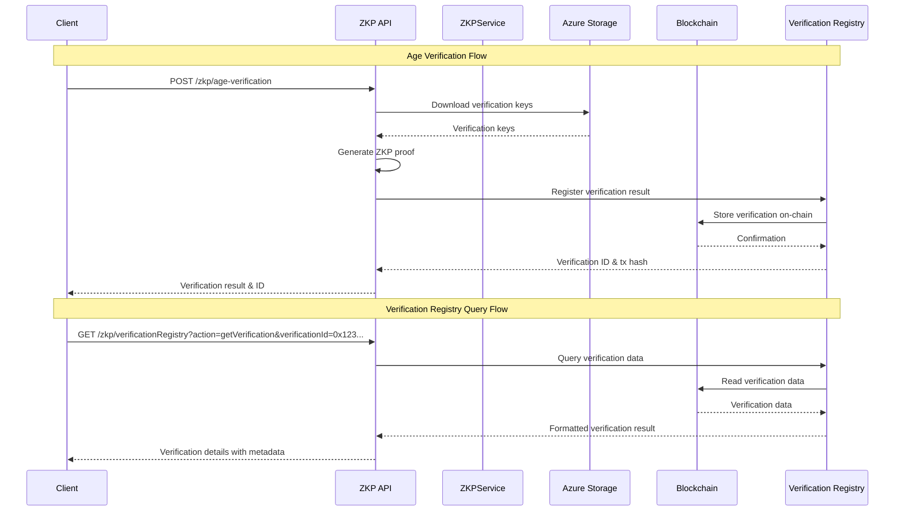

# Zero-Knowledge Proof (ZKP) API Reference

## Overview

The Zero-Knowledge Proof (ZKP) API provides a set of HTTP endpoints implemented as Azure Functions for creating, verifying, and managing zero-knowledge proofs within the LEDUP platform. These functions enable privacy-preserving verification of sensitive claims (like age, data integrity, and health record authenticity) without revealing the underlying data, combining the security of blockchain with the privacy of zero-knowledge cryptography.

## ZKP Verification Workflow



## API Endpoints

### Age Verification

Generates and registers a zero-knowledge proof for age-related claims without revealing the actual age.

**Endpoint:** `POST /zkp/age-verification`

**Request Body:**

```json
{
  "verificationType": 1,
  "age": 25,
  "threshold": 18,
  "subject": "0x1234567890abcdef1234567890abcdef12345678",
  "expirationDays": 90,
  "metadata": {
    "purpose": "Account registration",
    "applicationId": "app-12345"
  }
}
```

**Parameters:**

- `verificationType` (number, required): Type of age verification (1 = simple age check, 2 = birth date verification, 3 = age bracket determination)
- `age` (number, conditional): The age to verify (required for type 1)
- `threshold` (number, conditional): The age threshold to check against (required for type 1)
- `birthDate` (number, conditional): Birth date in unix timestamp (required for type 2)
- `currentDate` (number, conditional): Current date in unix timestamp (required for type 2)
- `subject` (string, required): Ethereum address of the subject being verified
- `expirationDays` (number, optional): Days until the verification expires (0 = never expire)
- `metadata` (object, optional): Additional information about the verification

**Response (200 OK):**

```json
{
  "success": true,
  "verificationId": "0xabcdef1234567890abcdef1234567890abcdef1234567890abcdef1234567890",
  "transactionHash": "0x1234567890abcdef1234567890abcdef1234567890abcdef1234567890abcdef",
  "result": true,
  "metadata": {
    "purpose": "Account registration",
    "applicationId": "app-12345",
    "verificationType": 1,
    "threshold": 18
  }
}
```

**Error Response (400 Bad Request):**

```json
{
  "error": "Age and threshold are required for simple age verification"
}
```

### Hash Verification

Verifies data integrity using zero-knowledge proofs, proving that a hash matches a known value without revealing the original data.

**Endpoint:** `POST /zkp/hash-verification`

**Request Body:**

```json
{
  "hash": "0x1234567890abcdef1234567890abcdef1234567890abcdef1234567890abcdef",
  "expectedHash": "0x1234567890abcdef1234567890abcdef1234567890abcdef1234567890abcdef",
  "subject": "0x1234567890abcdef1234567890abcdef12345678",
  "expirationDays": 180,
  "metadata": {
    "documentType": "Medical record",
    "documentId": "med-12345"
  }
}
```

**Parameters:**

- `hash` (string, required): The hash to verify
- `expectedHash` (string, required): The expected hash value
- `subject` (string, required): Ethereum address of the subject
- `expirationDays` (number, optional): Days until the verification expires
- `metadata` (object, optional): Additional information about the verification

**Response (200 OK):**

```json
{
  "success": true,
  "verificationId": "0xabcdef1234567890abcdef1234567890abcdef1234567890abcdef1234567890",
  "transactionHash": "0x1234567890abcdef1234567890abcdef1234567890abcdef1234567890abcdef",
  "result": true,
  "metadata": {
    "documentType": "Medical record",
    "documentId": "med-12345"
  }
}
```

**Error Response (400 Bad Request):**

```json
{
  "error": "Hash and expected hash are required"
}
```

### FHIR Verification

Verifies specific fields in FHIR health records using zero-knowledge proofs, allowing privacy-preserving health data verification.

**Endpoint:** `POST /zkp/fhir-verification`

**Request Body:**

```json
{
  "fhirData": {
    "resourceType": "Observation",
    "id": "blood-pressure",
    "status": "final",
    "code": {
      "coding": [
        {
          "system": "http://loinc.org",
          "code": "85354-9",
          "display": "Blood pressure"
        }
      ]
    },
    "valueQuantity": {
      "value": 120,
      "unit": "mmHg",
      "system": "http://unitsofmeasure.org"
    }
  },
  "fieldPath": "valueQuantity.value",
  "expectedValue": 120,
  "subject": "0x1234567890abcdef1234567890abcdef12345678",
  "expirationDays": 365,
  "metadata": {
    "provider": "Hospital XYZ",
    "recordDate": "2023-08-15T14:30:45.123Z"
  }
}
```

**Parameters:**

- `fhirData` (object, required): The FHIR resource data
- `fieldPath` (string, required): Path to the field to verify
- `expectedValue` (any, required): Expected value of the field
- `subject` (string, required): Ethereum address of the subject
- `expirationDays` (number, optional): Days until the verification expires
- `metadata` (object, optional): Additional information about the verification

**Response (200 OK):**

```json
{
  "success": true,
  "verificationId": "0xabcdef1234567890abcdef1234567890abcdef1234567890abcdef1234567890",
  "transactionHash": "0x1234567890abcdef1234567890abcdef1234567890abcdef1234567890abcdef",
  "result": true,
  "metadata": {
    "provider": "Hospital XYZ",
    "recordDate": "2023-08-15T14:30:45.123Z",
    "fieldPath": "valueQuantity.value",
    "expectedValue": 120
  }
}
```

**Error Response (400 Bad Request):**

```json
{
  "error": "FHIR data and field path are required"
}
```

### Verification Registry

#### Query Verification

Retrieves information about a specific verification.

**Endpoint:** `GET /zkp/verificationRegistry`

**Query Parameters:**

- `action` (string, required): Set to "getVerification"
- `verificationId` (string, required): ID of the verification to retrieve

**Response (200 OK):**

```json
{
  "subject": "0x1234567890abcdef1234567890abcdef12345678",
  "verificationType": "age",
  "verificationId": "0xabcdef1234567890abcdef1234567890abcdef1234567890abcdef1234567890",
  "timestamp": 1689433845,
  "expirationTime": 1697209845,
  "result": true,
  "revoked": false,
  "metadata": {
    "verificationType": 1,
    "threshold": 18,
    "purpose": "Account registration"
  }
}
```

**Error Response (400 Bad Request):**

```json
{
  "error": "Verification ID is required"
}
```

#### Check Verification Validity

Checks if a verification is currently valid.

**Endpoint:** `GET /zkp/verificationRegistry`

**Query Parameters:**

- `action` (string, required): Set to "isVerificationValid"
- `verificationId` (string, required): ID of the verification to check

**Response (200 OK):**

```json
{
  "isValid": true
}
```

**Error Response (400 Bad Request):**

```json
{
  "error": "Verification ID is required"
}
```

#### Get Subject Verifications

Retrieves all verifications for a specific subject.

**Endpoint:** `GET /zkp/verificationRegistry`

**Query Parameters:**

- `action` (string, required): Set to "getSubjectVerifications"
- `subject` (string, required): Ethereum address of the subject

**Response (200 OK):**

```json
{
  "verifications": [
    "0xabcdef1234567890abcdef1234567890abcdef1234567890abcdef1234567890",
    "0xfedcba0987654321fedcba0987654321fedcba0987654321fedcba0987654321"
  ]
}
```

**Error Response (400 Bad Request):**

```json
{
  "error": "Subject address is required"
}
```

#### Register Verification

Manually registers a verification in the registry.

**Endpoint:** `POST /zkp/verificationRegistry`

**Request Body:**

```json
{
  "action": "registerVerification",
  "subject": "0x1234567890abcdef1234567890abcdef12345678",
  "verificationType": "custom",
  "result": true,
  "expirationTime": 1697209845,
  "metadata": {
    "customField1": "value1",
    "customField2": "value2"
  }
}
```

**Parameters:**

- `action` (string, required): Set to "registerVerification"
- `subject` (string, required): Ethereum address of the subject
- `verificationType` (string, required): Type of verification
- `result` (boolean, required): Result of the verification
- `expirationTime` (number, optional): Unix timestamp when the verification expires
- `metadata` (object, optional): Additional metadata

**Response (200 OK):**

```json
{
  "success": true,
  "verificationId": "0xabcdef1234567890abcdef1234567890abcdef1234567890abcdef1234567890",
  "transactionHash": "0x1234567890abcdef1234567890abcdef1234567890abcdef1234567890abcdef"
}
```

**Error Response (400 Bad Request):**

```json
{
  "error": "Subject address and verification type are required"
}
```

#### Revoke Verification

Revokes an existing verification.

**Endpoint:** `POST /zkp/verificationRegistry`

**Request Body:**

```json
{
  "action": "revokeVerification",
  "verificationId": "0xabcdef1234567890abcdef1234567890abcdef1234567890abcdef1234567890"
}
```

**Parameters:**

- `action` (string, required): Set to "revokeVerification"
- `verificationId` (string, required): ID of the verification to revoke

**Response (200 OK):**

```json
{
  "success": true,
  "transactionHash": "0x1234567890abcdef1234567890abcdef1234567890abcdef1234567890abcdef"
}
```

**Error Response (400 Bad Request):**

```json
{
  "error": "Verification ID is required"
}
```

### Verifier Factory

#### Deploy Age Verifier

Deploys a new age verifier contract.

**Endpoint:** `POST /zkp/verifier-factory`

**Request Body:**

```json
{
  "action": "deployAgeVerifier",
  "verifierAddress": "0x9876543210fedcba9876543210fedcba9876543210"
}
```

**Parameters:**

- `action` (string, required): Set to "deployAgeVerifier"
- `verifierAddress` (string, required): Address of the ZoKrates-generated verifier contract

**Response (200 OK):**

```json
{
  "success": true,
  "verifierAddress": "0x1234567890abcdef1234567890abcdef12345678",
  "transactionHash": "0x1234567890abcdef1234567890abcdef1234567890abcdef1234567890abcdef"
}
```

**Error Response (400 Bad Request):**

```json
{
  "error": "Verifier address is required"
}
```

## Security Considerations

### Data Privacy

- ZKP operations ensure that sensitive data is never exposed on-chain
- All proofs are generated locally within the Azure Function execution environment
- Original data is never stored, only cryptographic proofs
- Temporary files are securely deleted after use

### Verification Key Security

- Verification keys are stored in secure Azure Blob Storage
- Keys are accessible only to authenticated Azure Functions
- Regular rotation of keys is supported through the verifier factory

### Blockchain Integration

- On-chain verification results are stored in a secure verification registry
- Verifier contracts are deployed through a factory pattern for modularity
- Role-based access control for administrative operations
- Verification expiration times prevent stale data from being used

### Error Handling

- Comprehensive error handling to prevent leaked information
- Function-level authentication prevents unauthorized access
- Detailed error logging with sensitive data redaction
- Circuit-specific validation rules

## Integration Examples

### Verifying User Age for Account Registration

```typescript
import axios from 'axios';

/**
 * Verifies a user's age without revealing the actual age
 * @param {number} userAge - The user's age
 * @param {number} requiredAge - The minimum required age
 * @param {string} userAddress - User's blockchain address
 * @returns {Promise<string>} - Verification ID if successful
 */
const verifyUserAge = async (userAge, requiredAge, userAddress) => {
  try {
    const response = await axios.post('/zkp/age-verification', {
      verificationType: 1, // Simple age verification
      age: userAge,
      threshold: requiredAge,
      subject: userAddress,
      expirationDays: 365, // Valid for 1 year
      metadata: {
        purpose: 'Account registration',
        applicationId: 'signup-flow',
      },
    });

    if (response.data.success && response.data.result === true) {
      console.log('Age verification successful!');
      console.log(`Verification ID: ${response.data.verificationId}`);
      console.log(`Transaction hash: ${response.data.transactionHash}`);

      // Store the verification ID in the user profile
      await updateUserProfile(userAddress, {
        ageVerificationId: response.data.verificationId,
      });

      return response.data.verificationId;
    } else {
      console.error('Age verification failed');
      throw new Error('Age verification failed');
    }
  } catch (error) {
    console.error('Error during age verification:', error.response?.data || error.message);
    throw new Error('Failed to verify age');
  }
};

/**
 * Checks if a user has a valid age verification
 * @param {string} userAddress - User's blockchain address
 * @returns {Promise<boolean>} - True if verification is valid
 */
const checkAgeVerification = async (userAddress) => {
  try {
    // Get all verifications for the user
    const verificationResponse = await axios.get('/zkp/verificationRegistry', {
      params: {
        action: 'getSubjectVerifications',
        subject: userAddress,
      },
    });

    const verificationIds = verificationResponse.data.verifications;

    // Check if any verification is valid
    for (const verificationId of verificationIds) {
      const validityResponse = await axios.get('/zkp/verificationRegistry', {
        params: {
          action: 'isVerificationValid',
          verificationId,
        },
      });

      if (validityResponse.data.isValid) {
        // Get verification details
        const detailResponse = await axios.get('/zkp/verificationRegistry', {
          params: {
            action: 'getVerification',
            verificationId,
          },
        });

        // Check if it's an age verification
        if (detailResponse.data.verificationType === 'age') {
          return true;
        }
      }
    }

    return false;
  } catch (error) {
    console.error('Error checking age verification:', error.response?.data || error.message);
    return false;
  }
};
```

### Verifying Health Record Integrity

```typescript
import axios from 'axios';
import { ethers } from 'ethers';

/**
 * Verifies the integrity of a health record using ZKP
 * @param {object} healthRecord - The FHIR health record
 * @param {string} patientAddress - Patient's blockchain address
 * @returns {Promise<string>} - Verification ID if successful
 */
const verifyHealthRecord = async (healthRecord, patientAddress) => {
  try {
    // Extract the field to verify (e.g., blood pressure)
    const bloodPressure = healthRecord.valueQuantity?.value;
    if (!bloodPressure) {
      throw new Error('Health record missing required data');
    }

    // Create a request to verify the FHIR data
    const response = await axios.post('/zkp/fhir-verification', {
      fhirData: healthRecord,
      fieldPath: 'valueQuantity.value',
      expectedValue: bloodPressure,
      subject: patientAddress,
      expirationDays: 365,
      metadata: {
        provider: healthRecord.performer?.[0]?.display || 'Unknown',
        recordDate: healthRecord.effectiveDateTime,
        recordType: healthRecord.code?.coding?.[0]?.display || 'Unknown',
      },
    });

    if (response.data.success) {
      console.log('Health record verification successful!');
      console.log(`Verification ID: ${response.data.verificationId}`);

      // Store the verification result in the patient's record
      await updatePatientRecord(patientAddress, {
        verificationId: response.data.verificationId,
        recordId: healthRecord.id,
        verifiedAt: new Date().toISOString(),
      });

      return response.data.verificationId;
    } else {
      throw new Error('Health record verification failed');
    }
  } catch (error) {
    console.error('Error verifying health record:', error.response?.data || error.message);
    throw new Error('Failed to verify health record');
  }
};

/**
 * Creates a hash of a health record for verification
 * @param {object} healthRecord - The health record to hash
 * @returns {string} - The hash of the health record
 */
const hashHealthRecord = (healthRecord) => {
  const recordString = JSON.stringify(healthRecord);
  return ethers.keccak256(ethers.toUtf8Bytes(recordString));
};
```

## Implementation Details

### ZKP Service Architecture

The ZKP API is built on a modular architecture with several key components:

1. **ZKP Base Service**: Core functions for interacting with ZKP smart contracts
2. **Verifier Factory Service**: Manages deployment of specialized verifier contracts
3. **Verification Registry Service**: Tracks and manages verification results
4. **Specialized Verifiers**: Custom verifiers for specific use cases (age, hash, FHIR)

### On-chain and Off-chain Processing

The API uses a hybrid approach combining on-chain and off-chain processing:

1. **On-chain Components**:

   - Verification registry for storing verification results
   - Verifier factory for deploying specialized verifiers
   - Verification results accessible through smart contracts

2. **Off-chain Components**:
   - ZoKrates ZKP generation in Azure Functions
   - Verification key storage in Azure Blob Storage
   - Circuit-specific validation logic
   - Metadata processing and enrichment

### Verification Workflow

The verification process follows these steps:

1. Client submits data for verification through the appropriate API endpoint
2. Azure Function downloads required verification keys from secure storage
3. Function generates a zero-knowledge proof using ZoKrates
4. Proof is verified locally to ensure correctness
5. Verification result is registered on the blockchain
6. Temporary files are securely cleaned up
7. Client receives verification ID and transaction details

This architecture ensures that sensitive data never leaves the client, while still providing verifiable proof of claims that can be independently validated on the blockchain.

---

© 2025 LEDUP | Documentation for Production Use | Last Updated: April 2025
