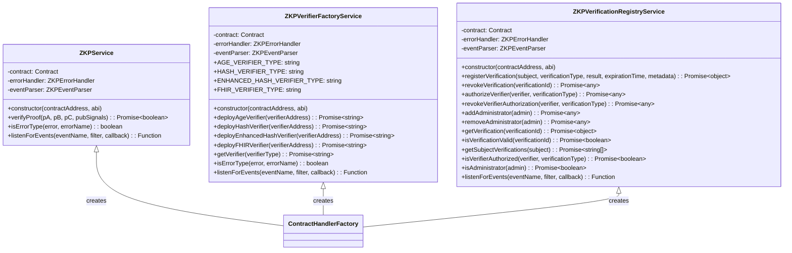

# Zero-Knowledge Proof (ZKP) Services Reference

## Overview

The LEDUP platform implements a set of TypeScript service classes that provide a robust interface for interacting with Zero-Knowledge Proof (ZKP) functionality on the blockchain. These services abstract the complexity of ZKP operations, smart contract interactions, and event handling into clean, reusable components that can be leveraged throughout the application.

## Service Architecture



## Core Services

### ZKPService

The `ZKPService` class provides core functionality for interacting with ZKP-capable smart contracts. It handles the verification of zero-knowledge proofs on the blockchain.

#### Constructor

```typescript
constructor(contractAddress: string, abi: any)
```

Creates a new instance of the ZKPService.

| Parameter       | Type   | Description                     |
| --------------- | ------ | ------------------------------- |
| contractAddress | string | The address of the ZKP contract |
| abi             | any    | The ABI of the ZKP contract     |

#### Methods

##### verifyProof

```typescript
async verifyProof(
  pA: [bigint, bigint],
  pB: [[bigint, bigint], [bigint, bigint]],
  pC: [bigint, bigint],
  pubSignals: [bigint]
): Promise<boolean>
```

Verifies a zero-knowledge proof on the blockchain.

| Parameter  | Type                                 | Description                     |
| ---------- | ------------------------------------ | ------------------------------- |
| pA         | [bigint, bigint]                     | The first part of the proof     |
| pB         | [[bigint, bigint], [bigint, bigint]] | The second part of the proof    |
| pC         | [bigint, bigint]                     | The third part of the proof     |
| pubSignals | [bigint]                             | The public signals of the proof |

Returns: A Promise that resolves to a boolean indicating if the proof is valid.

##### isErrorType

```typescript
isErrorType(error: any, errorName: string): boolean
```

Checks if a specific error occurred during contract interaction.

| Parameter | Type   | Description                        |
| --------- | ------ | ---------------------------------- |
| error     | any    | The error to check                 |
| errorName | string | The name of the error to check for |

Returns: True if the error matches the specified name.

##### listenForEvents

```typescript
listenForEvents(eventName: string, filter: any = {}, callback: (event: any) => void): () => void
```

Listens for events from the contract.

| Parameter | Type     | Description                                  |
| --------- | -------- | -------------------------------------------- |
| eventName | string   | The name of the event to listen for          |
| filter    | any      | Optional filter for the event                |
| callback  | function | Callback function to handle the parsed event |

Returns: A function to remove the event listener.

### ZKPVerifierFactoryService

The `ZKPVerifierFactoryService` class is responsible for deploying and managing different types of ZKP verifier contracts on the blockchain. It acts as a factory for specialized verifiers.

#### Static Constants

- `AGE_VERIFIER_TYPE`: Identifier for age verification contracts
- `HASH_VERIFIER_TYPE`: Identifier for hash verification contracts
- `ENHANCED_HASH_VERIFIER_TYPE`: Identifier for enhanced hash verification contracts
- `FHIR_VERIFIER_TYPE`: Identifier for FHIR data verification contracts

#### Constructor

```typescript
constructor(contractAddress: string, abi: any)
```

Creates a new instance of the ZKPVerifierFactoryService.

| Parameter       | Type   | Description                                      |
| --------------- | ------ | ------------------------------------------------ |
| contractAddress | string | The address of the ZKP Verifier Factory contract |
| abi             | any    | The ABI of the ZKP Verifier Factory contract     |

#### Methods

##### deployAgeVerifier

```typescript
async deployAgeVerifier(verifierAddress: string): Promise<string>
```

Deploys an Age Verifier contract.

| Parameter       | Type   | Description                                             |
| --------------- | ------ | ------------------------------------------------------- |
| verifierAddress | string | The address of the ZoKrates-generated verifier contract |

Returns: A Promise that resolves to the address of the deployed Age Verifier contract.

##### deployHashVerifier

```typescript
async deployHashVerifier(verifierAddress: string): Promise<string>
```

Deploys a Hash Verifier contract.

| Parameter       | Type   | Description                                             |
| --------------- | ------ | ------------------------------------------------------- |
| verifierAddress | string | The address of the ZoKrates-generated verifier contract |

Returns: A Promise that resolves to the address of the deployed Hash Verifier contract.

##### deployEnhancedHashVerifier

```typescript
async deployEnhancedHashVerifier(verifierAddress: string): Promise<string>
```

Deploys an Enhanced Hash Verifier contract.

| Parameter       | Type   | Description                                             |
| --------------- | ------ | ------------------------------------------------------- |
| verifierAddress | string | The address of the ZoKrates-generated verifier contract |

Returns: A Promise that resolves to the address of the deployed Enhanced Hash Verifier contract.

##### deployFHIRVerifier

```typescript
async deployFHIRVerifier(verifierAddress: string): Promise<string>
```

Deploys a FHIR Verifier contract.

| Parameter       | Type   | Description                                             |
| --------------- | ------ | ------------------------------------------------------- |
| verifierAddress | string | The address of the ZoKrates-generated verifier contract |

Returns: A Promise that resolves to the address of the deployed FHIR Verifier contract.

##### getVerifier

```typescript
async getVerifier(verifierType: string): Promise<string>
```

Gets the address of a verifier from the registry.

| Parameter    | Type   | Description              |
| ------------ | ------ | ------------------------ |
| verifierType | string | The type of the verifier |

Returns: A Promise that resolves to the address of the verifier.

### ZKPVerificationRegistryService

The `ZKPVerificationRegistryService` class manages the storage and retrieval of verification results on the blockchain. It provides a comprehensive set of methods for registering, revoking, and querying verification data.

#### Constructor

```typescript
constructor(contractAddress: string, abi: any)
```

Creates a new instance of the ZKPVerificationRegistryService.

| Parameter       | Type   | Description                                           |
| --------------- | ------ | ----------------------------------------------------- |
| contractAddress | string | The address of the ZKP Verification Registry contract |
| abi             | any    | The ABI of the ZKP Verification Registry contract     |

#### Methods

##### registerVerification

```typescript
async registerVerification(
  subject: string,
  verificationType: string,
  result: boolean,
  expirationTime: number,
  metadata: any
): Promise<{ verificationId: string; transactionReceipt: any }>
```

Registers a new verification result.

| Parameter        | Type    | Description                                        |
| ---------------- | ------- | -------------------------------------------------- |
| subject          | string  | Address of the subject being verified              |
| verificationType | string  | Type of verification (e.g., "age", "hash", "fhir") |
| result           | boolean | Result of the verification                         |
| expirationTime   | number  | When the verification expires (0 = never)          |
| metadata         | any     | Additional metadata about the verification         |

Returns: A Promise that resolves to an object containing the verification ID and transaction receipt.

##### revokeVerification

```typescript
async revokeVerification(verificationId: string): Promise<any>
```

Revokes a verification.

| Parameter      | Type   | Description                      |
| -------------- | ------ | -------------------------------- |
| verificationId | string | ID of the verification to revoke |

Returns: A Promise that resolves to the transaction receipt.

##### authorizeVerifier

```typescript
async authorizeVerifier(verifier: string, verificationType: string): Promise<any>
```

Authorizes a verifier for a specific verification type.

| Parameter        | Type   | Description             |
| ---------------- | ------ | ----------------------- |
| verifier         | string | Address of the verifier |
| verificationType | string | Type of verification    |

Returns: A Promise that resolves to the transaction receipt.

##### revokeVerifierAuthorization

```typescript
async revokeVerifierAuthorization(verifier: string, verificationType: string): Promise<any>
```

Revokes a verifier's authorization for a specific verification type.

| Parameter        | Type   | Description             |
| ---------------- | ------ | ----------------------- |
| verifier         | string | Address of the verifier |
| verificationType | string | Type of verification    |

Returns: A Promise that resolves to the transaction receipt.

##### addAdministrator

```typescript
async addAdministrator(admin: string): Promise<any>
```

Adds an administrator.

| Parameter | Type   | Description                         |
| --------- | ------ | ----------------------------------- |
| admin     | string | Address of the administrator to add |

Returns: A Promise that resolves to the transaction receipt.

##### removeAdministrator

```typescript
async removeAdministrator(admin: string): Promise<any>
```

Removes an administrator.

| Parameter | Type   | Description                            |
| --------- | ------ | -------------------------------------- |
| admin     | string | Address of the administrator to remove |

Returns: A Promise that resolves to the transaction receipt.

##### getVerification

```typescript
async getVerification(verificationId: string): Promise<any>
```

Gets a verification result.

| Parameter      | Type   | Description            |
| -------------- | ------ | ---------------------- |
| verificationId | string | ID of the verification |

Returns: A Promise that resolves to the verification result object.

##### isVerificationValid

```typescript
async isVerificationValid(verificationId: string): Promise<boolean>
```

Checks if a verification is valid.

| Parameter      | Type   | Description            |
| -------------- | ------ | ---------------------- |
| verificationId | string | ID of the verification |

Returns: A Promise that resolves to a boolean indicating if the verification is valid.

##### getSubjectVerifications

```typescript
async getSubjectVerifications(subject: string): Promise<string[]>
```

Gets all verifications for a subject.

| Parameter | Type   | Description            |
| --------- | ------ | ---------------------- |
| subject   | string | Address of the subject |

Returns: A Promise that resolves to an array of verification IDs.

##### isVerifierAuthorized

```typescript
async isVerifierAuthorized(verifier: string, verificationType: string): Promise<boolean>
```

Checks if a verifier is authorized for a specific verification type.

| Parameter        | Type   | Description             |
| ---------------- | ------ | ----------------------- |
| verifier         | string | Address of the verifier |
| verificationType | string | Type of verification    |

Returns: A Promise that resolves to a boolean indicating if the verifier is authorized.

##### isAdministrator

```typescript
async isAdministrator(admin: string): Promise<boolean>
```

Checks if an address is an administrator.

| Parameter | Type   | Description      |
| --------- | ------ | ---------------- |
| admin     | string | Address to check |

Returns: A Promise that resolves to a boolean indicating if the address is an administrator.

## Usage Examples

### Verifying a ZK Proof

```typescript
import { ZKPService } from '../services';
import { VERIFIER_CONTRACT_ADDRESS, VERIFIER_ABI } from '../constants';

async function verifyProof(proof: any, publicSignals: any): Promise<boolean> {
  try {
    // Initialize the ZKP service
    const zkpService = new ZKPService(VERIFIER_CONTRACT_ADDRESS, VERIFIER_ABI);

    // Extract proof components
    const { pA, pB, pC } = proof;

    // Verify the proof
    const isValid = await zkpService.verifyProof(pA, pB, pC, publicSignals);

    if (isValid) {
      console.log('Proof is valid!');
    } else {
      console.log('Proof verification failed.');
    }

    return isValid;
  } catch (error) {
    console.error('Error verifying proof:', error);
    throw error;
  }
}
```

### Deploying a New Verifier

```typescript
import { ZKPVerifierFactoryService } from '../services';
import { FACTORY_CONTRACT_ADDRESS, FACTORY_ABI } from '../constants';

async function deployAgeVerifier(baseVerifierAddress: string): Promise<string> {
  try {
    // Initialize the verifier factory service
    const factoryService = new ZKPVerifierFactoryService(FACTORY_CONTRACT_ADDRESS, FACTORY_ABI);

    console.log(`Deploying age verifier with base verifier at ${baseVerifierAddress}`);

    // Deploy the age verifier
    const verifierAddress = await factoryService.deployAgeVerifier(baseVerifierAddress);

    console.log(`Successfully deployed age verifier at ${verifierAddress}`);

    return verifierAddress;
  } catch (error) {
    console.error('Error deploying age verifier:', error);

    // Check for specific error types
    if (factoryService.isErrorType(error, 'Unauthorized')) {
      console.error('Deployment failed: Unauthorized sender');
    } else if (factoryService.isErrorType(error, 'InvalidAddress')) {
      console.error('Deployment failed: Invalid base verifier address');
    }

    throw error;
  }
}
```

### Managing Verification Results

```typescript
import { ZKPVerificationRegistryService } from '../services';
import { REGISTRY_CONTRACT_ADDRESS, REGISTRY_ABI } from '../constants';

async function registerAgeVerification(
  userAddress: string,
  isOverAge: boolean,
  expirationDays: number,
  verificationMetadata: any
): Promise<string> {
  try {
    // Initialize the verification registry service
    const registryService = new ZKPVerificationRegistryService(REGISTRY_CONTRACT_ADDRESS, REGISTRY_ABI);

    // Calculate expiration time (0 = never expire)
    const expirationTime = expirationDays > 0 ? Math.floor(Date.now() / 1000) + expirationDays * 86400 : 0;

    // Register the verification
    const { verificationId, transactionReceipt } = await registryService.registerVerification(
      userAddress,
      'age',
      isOverAge,
      expirationTime,
      verificationMetadata
    );

    console.log(`Verification registered with ID: ${verificationId}`);
    console.log(`Transaction hash: ${transactionReceipt.hash}`);

    // Listen for verification events
    const unsubscribe = registryService.listenForEvents('VerificationRegistered', { verificationId }, (event) => {
      console.log('Verification registered event:', event);
      // Process event data as needed
      unsubscribe(); // Stop listening once we receive the event
    });

    return verificationId;
  } catch (error) {
    console.error('Error registering verification:', error);
    throw error;
  }
}

async function checkUserVerification(userAddress: string): Promise<boolean> {
  try {
    // Initialize the verification registry service
    const registryService = new ZKPVerificationRegistryService(REGISTRY_CONTRACT_ADDRESS, REGISTRY_ABI);

    // Get all verifications for the user
    const verificationIds = await registryService.getSubjectVerifications(userAddress);

    if (verificationIds.length === 0) {
      console.log('No verifications found for user');
      return false;
    }

    console.log(`Found ${verificationIds.length} verifications for user`);

    // Check if any verification is valid
    for (const verificationId of verificationIds) {
      const isValid = await registryService.isVerificationValid(verificationId);

      if (isValid) {
        // Get verification details
        const verification = await registryService.getVerification(verificationId);

        console.log('Valid verification found:', {
          type: verification.verificationType,
          result: verification.result,
          expiresAt:
            verification.expirationTime > 0 ? new Date(verification.expirationTime * 1000).toISOString() : 'Never',
          metadata: verification.metadata,
        });

        return true;
      }
    }

    console.log('No valid verifications found for user');
    return false;
  } catch (error) {
    console.error('Error checking user verification:', error);
    throw error;
  }
}
```

## Best Practices

### Error Handling

The ZKP services include specialized error handlers that categorize and provide context for blockchain errors. To properly handle errors:

1. Use `try/catch` blocks around service method calls
2. Check specific error types with the `isErrorType` method
3. Log detailed error information for debugging
4. Implement appropriate retry logic for transient errors

```typescript
try {
  const result = await zkpService.verifyProof(pA, pB, pC, pubSignals);
  // Process result
} catch (error) {
  if (zkpService.isErrorType(error, 'InvalidProof')) {
    // Handle invalid proof error
  } else if (zkpService.isErrorType(error, 'ContractExecutionReverted')) {
    // Handle contract revert error
  } else {
    // Handle other errors
  }
}
```

### Event Handling

ZKP services provide event handling capabilities through the `listenForEvents` method. To effectively use events:

1. Define specific filters to reduce unnecessary event processing
2. Always store the unsubscribe function and call it when done
3. Handle event data processing asynchronously
4. Implement error handling for event callbacks

```typescript
const unsubscribe = verificationRegistryService.listenForEvents(
  'VerificationRegistered',
  { subject: userAddress },
  async (event) => {
    try {
      // Process event data
      await updateUserVerificationStatus(event.verificationId);
    } catch (error) {
      console.error('Error processing verification event:', error);
    }
  }
);

// Later, when done listening:
unsubscribe();
```

### Gas Optimization

When using ZKP services that interact with the blockchain, consider gas optimization strategies:

1. Batch operations when possible to reduce transaction count
2. Only register verifications when necessary
3. Consider using event listeners instead of polling for updates
4. Cache verification results when appropriate to reduce redundant blockchain calls

## Security Considerations

### Key Management

The ZKP services interact with smart contracts that require private key access for transaction signing. Ensure proper key management:

1. Never expose private keys in client-side code
2. Use secure environment variables for contract addresses and API keys
3. Implement proper role-based access control for administrative functions
4. Rotate keys regularly for enhanced security

### Data Privacy

ZKP functionality is designed to protect data privacy. Follow these best practices:

1. Never send the actual data to be verified to the blockchain
2. Ensure sensitive data is only used for proof generation on the client side
3. Store only verification results, not the underlying data
4. Implement proper expiration times for verifications

### Input Validation

Carefully validate all inputs to ZKP services:

1. Verify address formats match the expected Ethereum address pattern
2. Validate that proofs conform to the expected format
3. Sanitize and validate metadata before storing
4. Implement proper error handling for invalid inputs

---

© 2025 LEDUP | Documentation for Production Use | Last Updated: April 2025
