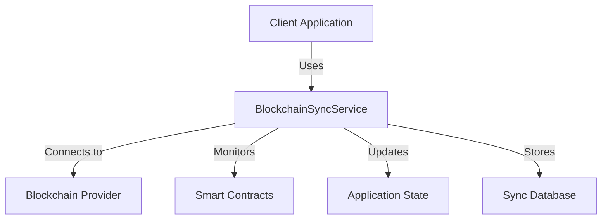
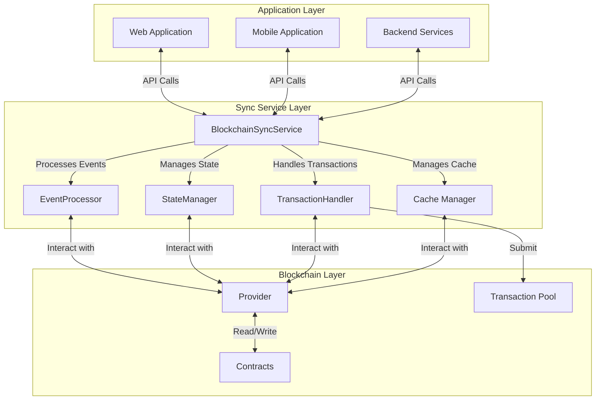
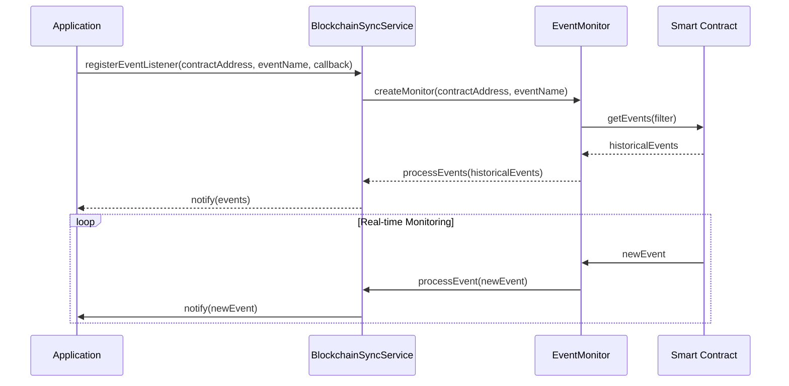
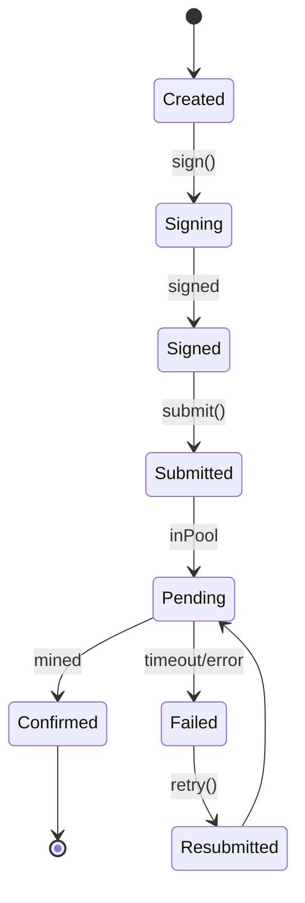
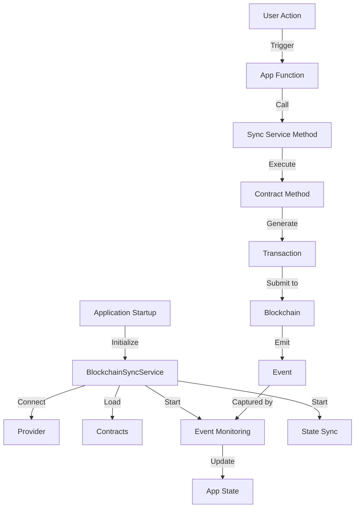
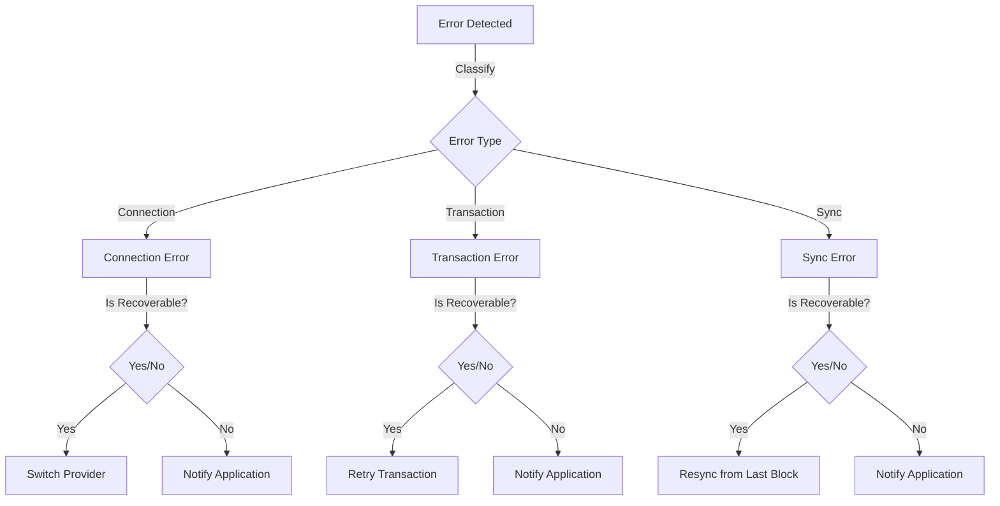
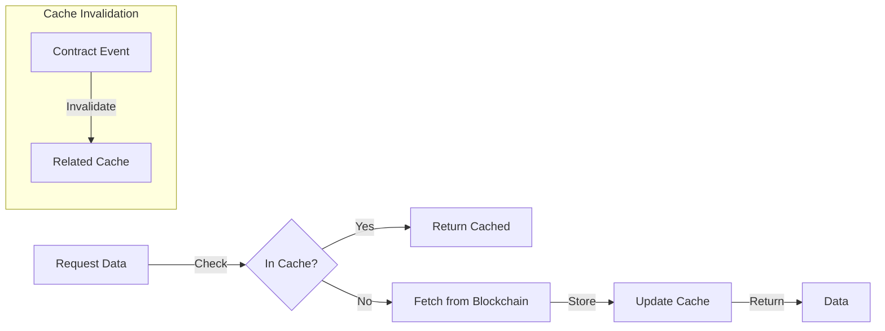

# BlockchainSyncService SDK Documentation

**Version:** 1.0.0  
**Last Updated:** March 2025  
**Status:** Production

## Table of Contents

1. [Overview](#overview)
2. [Architecture](#architecture)
3. [Core Components](#core-components)
4. [API Reference](#api-reference)
5. [Integration Guide](#integration-guide)
6. [Error Handling](#error-handling)
7. [Performance Optimization](#performance-optimization)
8. [Best Practices](#best-practices)

## Overview

The BlockchainSyncService is a critical component of the LEDUP platform that manages blockchain state synchronization with the application layer. It provides a reliable mechanism to monitor and react to blockchain events, synchronize on-chain data, and maintain consistency between the blockchain and application state.



The service handles:

- Event monitoring from smart contracts
- State synchronization
- Transaction handling and error recovery
- Caching of blockchain data
- Retry mechanisms for failed operations

## Architecture

The BlockchainSyncService follows a layered architecture to separate concerns and provide a clean API for applications.



## Core Components

### Provider Management

The BlockchainSyncService uses a provider management system to establish and maintain connections to the Ethereum blockchain, prioritizing different provider options based on availability and reliability.

```typescript
class ProviderManager {
  private providers: JsonRpcProvider[];
  private activeProvider: JsonRpcProvider;

  constructor(providerUrls: string[]) {
    // Initialize providers with fallback options
  }

  public getProvider(): JsonRpcProvider {
    // Return active provider or switch to backup if unavailable
  }
}
```

### Event Monitoring

The service provides robust event monitoring capabilities for smart contract events with configurable filters, historical synchronization, and real-time updates.



### State Synchronization

Manages the synchronization of blockchain state with application state, ensuring consistency and handling conflict resolution.

```typescript
class StateSynchronizer {
  private lastSyncedBlock: number;
  private syncInterval: number;

  constructor(
    private dataRegistry: DataRegistryContract,
    private stateStore: StateStore,
    private options: SyncOptions
  ) {}

  public async syncState(): Promise<SyncResult> {
    // Synchronize state between blockchain and application
  }
}
```

### Transaction Manager

Handles transaction submission, monitoring, and error recovery with configurable retry strategies.



## API Reference

### Initialization

```typescript
import { BlockchainSyncService } from '@ledup/blockchain-sync';

// Initialize with configuration
const syncService = new BlockchainSyncService({
  providers: [
    'https://eth-sepolia.g.alchemy.com/v2/YOUR_ALCHEMY_API_KEY',
    'https://sepolia.infura.io/v3/YOUR_INFURA_API_KEY',
  ],
  contracts: {
    dataRegistry: {
      address: '0x1234...',
      startBlock: 123456, // Optional starting block for syncing
    },
  },
  syncInterval: 15000, // 15 seconds between sync attempts
  retryOptions: {
    maxRetries: 5,
    baseDelay: 1000,
  },
});

// Connect to blockchain
await syncService.connect();
```

### Event Monitoring

```typescript
// Register event listener for specific contract event
syncService.registerEventListener({
  contractName: 'dataRegistry',
  eventName: 'RecordRegistered',
  callback: (event) => {
    console.log('New record registered:', event.args.recordId);
  },
  filter: { producer: myWalletAddress }, // Optional filter
});

// Start monitoring events
await syncService.startEventMonitoring();
```

### State Synchronization

```typescript
// Define state synchronization strategy
const syncStrategy = {
  syncRecords: true,
  syncProducers: true,
  syncAccess: true,
  batchSize: 100, // Process in batches
};

// Start state synchronization
await syncService.startStateSync(syncStrategy);

// Get latest synchronized data
const records = await syncService.getSyncedRecords({ producer: myWalletAddress });
```

### Transaction Handling

```typescript
// Prepare transaction
const tx = await syncService.prepareTransaction({
  contractName: 'dataRegistry',
  method: 'registerRecord',
  params: [
    'record-123',
    'QmHash...',
    ethers.utils.keccak256(ethers.utils.toUtf8Bytes('content')),
    0, // ResourceType.Patient
    1024, // dataSize
  ],
  options: {
    gasLimit: 300000,
    priorityFee: 1.5, // gwei
  },
});

// Submit transaction
const receipt = await syncService.submitTransaction(tx);

// Or use a higher-level API
const receipt = await syncService.executeContractMethod({
  contractName: 'dataRegistry',
  method: 'registerRecord',
  params: [
    /* ... */
  ],
  options: {
    /* ... */
  },
});
```

### Cache Management

```typescript
// Configure cache options
syncService.configureCaching({
  cacheSize: 100, // Maximum number of items in memory cache
  ttl: 300000, // Time-to-live: 5 minutes
  persistToDisk: true,
});

// Manually update cache
await syncService.updateCache('records', 'record-123', recordData);

// Get from cache with fallback to blockchain
const record = await syncService.getWithCache('records', 'record-123', () => dataRegistry.getRecordInfo('record-123'));
```

## Integration Guide

### Setup and Initialization

To integrate the BlockchainSyncService into your application:

1. Install the package:

   ```bash
   npm install @ledup/blockchain-sync
   ```

2. Import and initialize the service:

   ```typescript
   import { BlockchainSyncService } from '@ledup/blockchain-sync';

   const syncService = new BlockchainSyncService({
     // Configuration options
   });

   // Initialize in your application startup
   async function initializeBlockchainSync() {
     await syncService.connect();
     await syncService.startEventMonitoring();
     await syncService.startStateSync();
   }
   ```

3. Use in your application:
   ```typescript
   // React component example
   function HealthRecords() {
     const [records, setRecords] = useState([]);

     useEffect(() => {
       // Get initial data
       syncService.getSyncedRecords().then(setRecords);

       // Register for updates
       const unsubscribe = syncService.onRecordsChanged(setRecords);
       return unsubscribe;
     }, []);

     // Render records...
   }
   ```

### Integration Flow



## Error Handling

The BlockchainSyncService implements comprehensive error handling strategies:

### Error Types

```typescript
enum SyncErrorType {
  CONNECTION_ERROR,
  TRANSACTION_ERROR,
  SYNC_ERROR,
  CONFIGURATION_ERROR,
  CONTRACT_ERROR,
}

class BlockchainSyncError extends Error {
  constructor(
    message: string,
    public readonly type: SyncErrorType,
    public readonly cause?: Error,
    public readonly recoverable: boolean = true
  ) {
    super(message);
  }
}
```

### Error Recovery



### Example

```typescript
try {
  await syncService.executeContractMethod({
    contractName: 'dataRegistry',
    method: 'registerRecord',
    params: [
      /* ... */
    ],
  });
} catch (error) {
  if (error instanceof BlockchainSyncError) {
    switch (error.type) {
      case SyncErrorType.CONNECTION_ERROR:
        // Handle connection issues
        break;
      case SyncErrorType.TRANSACTION_ERROR:
        // Handle transaction failures
        break;
      default:
      // Handle other errors
    }

    if (error.recoverable) {
      // Implement recovery strategy
    } else {
      // Notify user of critical error
    }
  }
}
```

## Performance Optimization

The BlockchainSyncService implements various performance optimizations:

### Batch Processing

```typescript
// Configure batch processing
syncService.configureBatchProcessing({
  maxBatchSize: 100,
  processingInterval: 5000, // 5 seconds
  priorityQueue: true,
});

// Add items to batch queue
syncService.queueForBatch('recordSync', recordIds);
```

### Caching Strategies



### Optimistic Updates

```typescript
// Register optimistic updates
syncService.registerOptimisticHandler('registerRecord', (params) => {
  // Generate optimistic record entry
  return {
    recordId: params[0],
    status: 'pending',
    timestamp: Date.now(),
  };
});

// Execute with optimistic update
const { optimisticResult, finalPromise } = syncService.executeOptimistically('dataRegistry', 'registerRecord', [
  /* params */
]);

// Use optimistic result immediately
updateUI(optimisticResult);

// Later reconcile with actual result
finalPromise.then((actualResult) => {
  reconcileState(optimisticResult, actualResult);
});
```

## Best Practices

1. **Always check connection status** before performing operations.

   ```typescript
   if (!syncService.isConnected()) {
     await syncService.reconnect();
   }
   ```

2. **Implement proper error handling** for all blockchain operations.

   ```typescript
   try {
     await syncService.executeContractMethod(/* ... */);
   } catch (error) {
     handleSyncError(error);
   }
   ```

3. **Use event-based state updates** rather than polling where possible.

   ```typescript
   syncService.registerEventListener({
     contractName: 'dataRegistry',
     eventName: 'RecordRegistered',
     callback: updateRecordsList,
   });
   ```

4. **Batch related transactions** when possible.

   ```typescript
   await syncService.batchExecute([
     {
       contractName: 'dataRegistry',
       method: 'registerRecord',
       params: [
         /* ... */
       ],
     },
     {
       contractName: 'dataRegistry',
       method: 'updateProducerConsent',
       params: [
         /* ... */
       ],
     },
   ]);
   ```

5. **Implement graceful degradation** when blockchain services are unavailable.

   ```typescript
   syncService.onConnectionError((error) => {
     enableOfflineMode();
     scheduleReconnect();
   });
   ```

6. **Monitor sync status** and provide feedback to users.

   ```typescript
   syncService.onSyncStatusChanged((status) => {
     updateSyncIndicator(status);
   });
   ```

7. **Use optimistic UI updates** with proper reconciliation for responsive experiences.
   ```typescript
   const { result, promise } = syncService.executeOptimistically(/* ... */);
   updateUI(result); // Immediate optimistic update
   promise.then((finalResult) => reconcile(finalResult)); // Later reconciliation
   ```

---

## Implementation Example

```typescript
// Example implementation using the BlockchainSyncService
import { BlockchainSyncService } from '@ledup/blockchain-sync';
import { ethers } from 'ethers';

// Initialize service
const syncService = new BlockchainSyncService({
  providers: [getRpcUrl()],
  contracts: {
    dataRegistry: {
      address: DATA_REGISTRY_ADDRESS,
      abi: DATA_REGISTRY_ABI,
    },
  },
});

// Connect to blockchain
async function initialize() {
  await syncService.connect();

  // Register for events
  syncService.registerEventListener({
    contractName: 'dataRegistry',
    eventName: 'RecordRegistered',
    callback: handleNewRecord,
  });

  // Start monitoring
  await syncService.startEventMonitoring();
  await syncService.startStateSync();

  console.log('BlockchainSyncService initialized');
}

// Handle new record event
function handleNewRecord(event) {
  const { recordId, did, cid, contentHash, provider } = event.args;
  console.log(`New record registered: ${recordId} by ${did}`);

  // Update application state
  updateRecordsList(recordId, {
    did,
    cid,
    contentHash,
    provider,
    timestamp: Math.floor(Date.now() / 1000),
  });
}

// Register a new record
async function registerHealthRecord(recordData) {
  try {
    const tx = await syncService.executeContractMethod({
      contractName: 'dataRegistry',
      method: 'registerRecord',
      params: [
        recordData.id,
        recordData.cid,
        ethers.utils.keccak256(ethers.utils.toUtf8Bytes(recordData.content)),
        recordData.resourceType,
        recordData.size,
      ],
    });

    console.log('Record registered, transaction hash:', tx.hash);
    return tx;
  } catch (error) {
    console.error('Failed to register record:', error);
    throw error;
  }
}

// Initialize the service
initialize().catch(console.error);
```

---

**© 2025 LEDUP - All rights reserved.**
