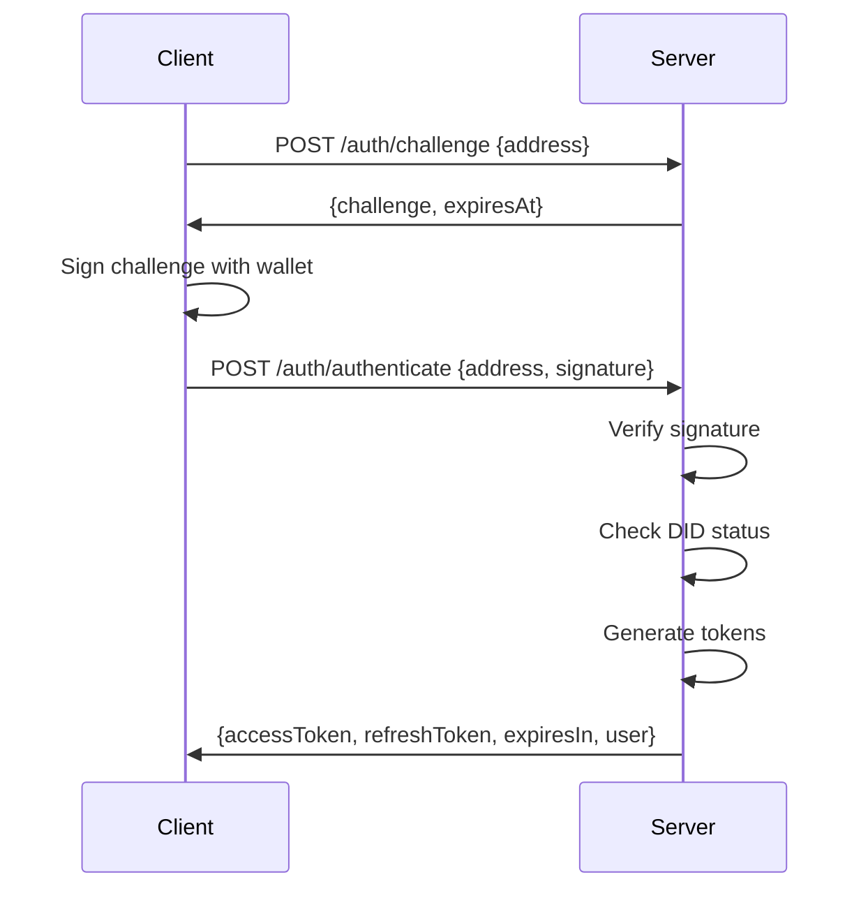

# LED-UP DID Authentication System Documentation

## Overview

The LED-UP DID Authentication System provides a comprehensive solution for decentralized identity (DID) authentication in blockchain applications. This system enables secure authentication, credential management, and token-based authorization using DIDs stored on the blockchain.

## Authentication Endpoints

| Endpoint                    | Method | Description                              |
| --------------------------- | ------ | ---------------------------------------- |
| `/auth/challenge`           | POST   | Generate a challenge for authentication  |
| `/auth/authenticate`        | POST   | Authenticate using address and signature |
| `/auth/refresh`             | POST   | Refresh an access token                  |
| `/auth/verify`              | POST   | Verify an access token                   |
| `/auth/create-did`          | POST   | Create a new DID                         |
| `/auth/get-did-document`    | GET    | Get a DID document                       |
| `/auth/update-did-document` | PUT    | Update a DID document                    |
| `/auth/deactivate-did`      | POST   | Deactivate a DID                         |
| `/auth/get-did-for-address` | GET    | Get the DID for an address               |
| `/auth/check-did-active`    | GET    | Check if a DID is active                 |
| `/auth/resolve-did`         | GET    | Resolve a DID to its document            |
| `/auth/update-public-key`   | PUT    | Update the public key for a DID          |

## Authentication Flow

### 1. Challenge-Response Authentication



#### Step 1: Generate a Challenge

**Request:**

```http
POST /auth/challenge
Content-Type: application/json

{
  "address": "0x1234567890abcdef1234567890abcdef12345678"
}
```

**Response:**

```http
HTTP/1.1 200 OK
Content-Type: application/json

{
  "success": true,
  "challenge": "Sign this message to authenticate with LED-UP: 1234567890abcdef1234567890abcdef",
  "expiresAt": 1612345678000
}
```

#### Step 2: Authenticate with Signature

**Request:**

```http
POST /auth/authenticate
Content-Type: application/json

{
  "address": "0x1234567890abcdef1234567890abcdef12345678",
  "signature": "0x1234567890abcdef1234567890abcdef1234567890abcdef1234567890abcdef1234567890abcdef1234567890abcdef1234567890abcdef1234567890abcdef1b"
}
```

**Response:**

```http
HTTP/1.1 200 OK
Content-Type: application/json

{
  "success": true,
  "accessToken": "eyJhbGciOiJIUzI1NiIsInR5cCI6IkpXVCJ9...",
  "refreshToken": "eyJhbGciOiJIUzI1NiIsInR5cCI6IkpXVCJ9...",
  "expiresIn": 3600,
  "user": {
    "address": "0x1234567890abcdef1234567890abcdef12345678",
    "role": "consumer",
    "did": "did:ethr:0x1234567890abcdef1234567890abcdef12345678"
  }
}
```

### 2. Token Refresh

**Request:**

```http
POST /auth/refresh
Content-Type: application/json

{
  "refreshToken": "eyJhbGciOiJIUzI1NiIsInR5cCI6IkpXVCJ9..."
}
```

**Response:**

```http
HTTP/1.1 200 OK
Content-Type: application/json

{
  "success": true,
  "accessToken": "eyJhbGciOiJIUzI1NiIsInR5cCI6IkpXVCJ9...",
  "refreshToken": "eyJhbGciOiJIUzI1NiIsInR5cCI6IkpXVCJ9...",
  "expiresIn": 3600,
  "user": {
    "address": "0x1234567890abcdef1234567890abcdef12345678",
    "role": "consumer",
    "did": "did:ethr:0x1234567890abcdef1234567890abcdef12345678"
  }
}
```

### 3. Token Verification

**Request:**

```http
POST /auth/verify
Content-Type: application/json

{
  "token": "eyJhbGciOiJIUzI1NiIsInR5cCI6IkpXVCJ9..."
}
```

**Response:**

```http
HTTP/1.1 200 OK
Content-Type: application/json

{
  "success": true,
  "valid": true,
  "payload": {
    "sub": "0x1234567890abcdef1234567890abcdef12345678",
    "role": "consumer",
    "did": "did:ethr:0x1234567890abcdef1234567890abcdef12345678",
    "iat": 1612345678,
    "exp": 1612349278
  }
}
```

## DID Management

### Create a DID

**Request:**

```http
POST /auth/create-did
Content-Type: application/json

{
  "address": "0x1234567890abcdef1234567890abcdef12345678",
  "publicKey": "0x1234567890abcdef1234567890abcdef1234567890abcdef1234567890abcdef",
  "controller": "0x1234567890abcdef1234567890abcdef12345678",
  "signature": "0x1234567890abcdef1234567890abcdef1234567890abcdef1234567890abcdef1234567890abcdef1234567890abcdef1234567890abcdef1234567890abcdef1b"
}
```

**Response:**

```http
HTTP/1.1 200 OK
Content-Type: application/json

{
  "success": true,
  "did": "did:ethr:0x1234567890abcdef1234567890abcdef12345678",
  "document": {
    "@context": "https://www.w3.org/ns/did/v1",
    "id": "did:ethr:0x1234567890abcdef1234567890abcdef12345678",
    "controller": "0x1234567890abcdef1234567890abcdef12345678",
    "verificationMethod": [
      {
        "id": "did:ethr:0x1234567890abcdef1234567890abcdef12345678#keys-1",
        "type": "EcdsaSecp256k1VerificationKey2019",
        "controller": "did:ethr:0x1234567890abcdef1234567890abcdef12345678",
        "publicKeyHex": "0x1234567890abcdef1234567890abcdef1234567890abcdef1234567890abcdef"
      }
    ],
    "authentication": [
      "did:ethr:0x1234567890abcdef1234567890abcdef12345678#keys-1"
    ]
  }
}
```

### Get a DID Document

**Request:**

```http
GET /auth/get-did-document?did=did:ethr:0x1234567890abcdef1234567890abcdef12345678
```

**Response:**

```http
HTTP/1.1 200 OK
Content-Type: application/json

{
  "success": true,
  "document": {
    "@context": "https://www.w3.org/ns/did/v1",
    "id": "did:ethr:0x1234567890abcdef1234567890abcdef12345678",
    "controller": "0x1234567890abcdef1234567890abcdef12345678",
    "verificationMethod": [
      {
        "id": "did:ethr:0x1234567890abcdef1234567890abcdef12345678#keys-1",
        "type": "EcdsaSecp256k1VerificationKey2019",
        "controller": "did:ethr:0x1234567890abcdef1234567890abcdef12345678",
        "publicKeyHex": "0x1234567890abcdef1234567890abcdef1234567890abcdef1234567890abcdef"
      }
    ],
    "authentication": [
      "did:ethr:0x1234567890abcdef1234567890abcdef12345678#keys-1"
    ]
  }
}
```

### Update a DID Document

**Request:**

```http
PUT /auth/update-did-document
Content-Type: application/json

{
  "did": "did:ethr:0x1234567890abcdef1234567890abcdef12345678",
  "document": {
    "@context": "https://www.w3.org/ns/did/v1",
    "id": "did:ethr:0x1234567890abcdef1234567890abcdef12345678",
    "controller": "0x1234567890abcdef1234567890abcdef12345678",
    "verificationMethod": [
      {
        "id": "did:ethr:0x1234567890abcdef1234567890abcdef12345678#keys-1",
        "type": "EcdsaSecp256k1VerificationKey2019",
        "controller": "did:ethr:0x1234567890abcdef1234567890abcdef12345678",
        "publicKeyHex": "0x1234567890abcdef1234567890abcdef1234567890abcdef1234567890abcdef"
      }
    ],
    "authentication": [
      "did:ethr:0x1234567890abcdef1234567890abcdef12345678#keys-1"
    ],
    "service": [
      {
        "id": "did:ethr:0x1234567890abcdef1234567890abcdef12345678#service-1",
        "type": "DataService",
        "serviceEndpoint": "https://data.example.com/api"
      }
    ]
  },
  "signature": "0x1234567890abcdef1234567890abcdef1234567890abcdef1234567890abcdef1234567890abcdef1234567890abcdef1234567890abcdef1234567890abcdef1b"
}
```

**Response:**

```http
HTTP/1.1 200 OK
Content-Type: application/json

{
  "success": true,
  "did": "did:ethr:0x1234567890abcdef1234567890abcdef12345678",
  "document": {
    "@context": "https://www.w3.org/ns/did/v1",
    "id": "did:ethr:0x1234567890abcdef1234567890abcdef12345678",
    "controller": "0x1234567890abcdef1234567890abcdef12345678",
    "verificationMethod": [
      {
        "id": "did:ethr:0x1234567890abcdef1234567890abcdef12345678#keys-1",
        "type": "EcdsaSecp256k1VerificationKey2019",
        "controller": "did:ethr:0x1234567890abcdef1234567890abcdef12345678",
        "publicKeyHex": "0x1234567890abcdef1234567890abcdef1234567890abcdef1234567890abcdef"
      }
    ],
    "authentication": [
      "did:ethr:0x1234567890abcdef1234567890abcdef12345678#keys-1"
    ],
    "service": [
      {
        "id": "did:ethr:0x1234567890abcdef1234567890abcdef12345678#service-1",
        "type": "DataService",
        "serviceEndpoint": "https://data.example.com/api"
      }
    ]
  }
}
```

### Deactivate a DID

**Request:**

```http
POST /auth/deactivate-did
Content-Type: application/json

{
  "did": "did:ethr:0x1234567890abcdef1234567890abcdef12345678",
  "signature": "0x1234567890abcdef1234567890abcdef1234567890abcdef1234567890abcdef1234567890abcdef1234567890abcdef1234567890abcdef1234567890abcdef1b"
}
```

**Response:**

```http
HTTP/1.1 200 OK
Content-Type: application/json

{
  "success": true,
  "did": "did:ethr:0x1234567890abcdef1234567890abcdef12345678",
  "deactivated": true
}
```

### Get DID for Address

**Request:**

```http
GET /auth/get-did-for-address?address=0x1234567890abcdef1234567890abcdef12345678
```

**Response:**

```http
HTTP/1.1 200 OK
Content-Type: application/json

{
  "success": true,
  "did": "did:ethr:0x1234567890abcdef1234567890abcdef12345678",
  "document": {
    "@context": "https://www.w3.org/ns/did/v1",
    "id": "did:ethr:0x1234567890abcdef1234567890abcdef12345678",
    "controller": "0x1234567890abcdef1234567890abcdef12345678",
    "verificationMethod": [
      {
        "id": "did:ethr:0x1234567890abcdef1234567890abcdef12345678#keys-1",
        "type": "EcdsaSecp256k1VerificationKey2019",
        "controller": "did:ethr:0x1234567890abcdef1234567890abcdef12345678",
        "publicKeyHex": "0x1234567890abcdef1234567890abcdef1234567890abcdef1234567890abcdef"
      }
    ],
    "authentication": [
      "did:ethr:0x1234567890abcdef1234567890abcdef12345678#keys-1"
    ]
  }
}
```

### Check if DID is Active

**Request:**

```http
GET /auth/check-did-active?did=did:ethr:0x1234567890abcdef1234567890abcdef12345678
```

**Response:**

```http
HTTP/1.1 200 OK
Content-Type: application/json

{
  "success": true,
  "did": "did:ethr:0x1234567890abcdef1234567890abcdef12345678",
  "active": true
}
```

### Resolve DID

**Request:**

```http
GET /auth/resolve-did?did=did:ethr:0x1234567890abcdef1234567890abcdef12345678
```

**Response:**

```http
HTTP/1.1 200 OK
Content-Type: application/json

{
  "success": true,
  "did": "did:ethr:0x1234567890abcdef1234567890abcdef12345678",
  "document": {
    "@context": "https://www.w3.org/ns/did/v1",
    "id": "did:ethr:0x1234567890abcdef1234567890abcdef12345678",
    "controller": "0x1234567890abcdef1234567890abcdef12345678",
    "verificationMethod": [
      {
        "id": "did:ethr:0x1234567890abcdef1234567890abcdef12345678#keys-1",
        "type": "EcdsaSecp256k1VerificationKey2019",
        "controller": "did:ethr:0x1234567890abcdef1234567890abcdef12345678",
        "publicKeyHex": "0x1234567890abcdef1234567890abcdef1234567890abcdef1234567890abcdef"
      }
    ],
    "authentication": [
      "did:ethr:0x1234567890abcdef1234567890abcdef12345678#keys-1"
    ]
  },
  "metadata": {
    "created": "2023-01-01T00:00:00Z",
    "updated": "2023-01-01T00:00:00Z"
  }
}
```

### Update Public Key

**Request:**

```http
PUT /auth/update-public-key
Content-Type: application/json

{
  "did": "did:ethr:0x1234567890abcdef1234567890abcdef12345678",
  "publicKey": "0xabcdef1234567890abcdef1234567890abcdef1234567890abcdef1234567890",
  "signature": "0x1234567890abcdef1234567890abcdef1234567890abcdef1234567890abcdef1234567890abcdef1234567890abcdef1234567890abcdef1234567890abcdef1b"
}
```

**Response:**

```http
HTTP/1.1 200 OK
Content-Type: application/json

{
  "success": true,
  "did": "did:ethr:0x1234567890abcdef1234567890abcdef12345678",
  "publicKey": "0xabcdef1234567890abcdef1234567890abcdef1234567890abcdef1234567890"
}
```

## Error Handling

The API uses consistent error responses across all endpoints:

```http
HTTP/1.1 400 Bad Request
Content-Type: application/json

{
  "success": false,
  "error": "Bad Request",
  "message": "Address is required"
}
```

```http
HTTP/1.1 401 Unauthorized
Content-Type: application/json

{
  "success": false,
  "error": "Unauthorized",
  "message": "Invalid signature"
}
```

```http
HTTP/1.1 403 Forbidden
Content-Type: application/json

{
  "success": false,
  "error": "Forbidden",
  "message": "User account is deactivated"
}
```

```http
HTTP/1.1 500 Internal Server Error
Content-Type: application/json

{
  "success": false,
  "error": "Internal Server Error",
  "message": "Failed to connect to blockchain"
}
```

## User Roles

The system supports different user roles:

| Role               | Description                                         |
| ------------------ | --------------------------------------------------- |
| `admin`            | System administrator with full access               |
| `producer`         | Data producer with rights to create and manage data |
| `consumer`         | Data consumer with rights to access data            |
| `service_provider` | Service provider with rights to offer services      |
| `verifier`         | Verifier with rights to verify credentials          |

## Authentication Tokens

### Access Token

The access token is a short-lived JWT (1 hour by default) that contains the following claims:

```json
{
  "sub": "0x1234567890abcdef1234567890abcdef12345678", // Ethereum address
  "role": "consumer", // User role
  "did": "did:ethr:0x1234567890abcdef1234567890abcdef12345678", // DID (optional)
  "iat": 1612345678, // Issued at timestamp
  "exp": 1612349278 // Expiration timestamp
}
```

### Refresh Token

The refresh token is a long-lived JWT (7 days by default) that contains the following claims:

```json
{
  "sub": "0x1234567890abcdef1234567890abcdef12345678", // Ethereum address
  "jti": "1234567890abcdef1234567890abcdef", // Unique token ID
  "iat": 1612345678, // Issued at timestamp
  "exp": 1612950478 // Expiration timestamp
}
```

## Best Practices

1. **Secure Storage**: Store tokens securely, preferably in HTTP-only cookies or secure storage.
2. **Token Expiry**: Use short-lived access tokens (1 hour) and longer-lived refresh tokens (7 days).
3. **Error Handling**: Implement comprehensive error handling for authentication failures.
4. **HTTPS**: Always use HTTPS for API endpoints that handle authentication.
5. **Signature Verification**: Always verify signatures before performing sensitive operations.
6. **DID Resolution**: Cache DID documents to improve performance, but implement proper cache invalidation.

## Integration Examples

### JavaScript/TypeScript Client

```typescript
// Authentication client
class AuthClient {
  private baseUrl: string;
  private accessToken: string | null = null;
  private refreshToken: string | null = null;

  constructor(baseUrl: string) {
    this.baseUrl = baseUrl;
  }

  async generateChallenge(address: string): Promise<{ challenge: string; expiresAt: number }> {
    const response = await fetch(`${this.baseUrl}/auth/challenge`, {
      method: 'POST',
      headers: { 'Content-Type': 'application/json' },
      body: JSON.stringify({ address }),
    });

    const data = await response.json();
    if (!data.success) {
      throw new Error(data.message || 'Failed to generate challenge');
    }

    return {
      challenge: data.challenge,
      expiresAt: data.expiresAt,
    };
  }

  async authenticate(
    address: string,
    signature: string
  ): Promise<{
    accessToken: string;
    refreshToken: string;
    expiresIn: number;
    user: {
      address: string;
      role: string;
      did?: string;
    };
  }> {
    const response = await fetch(`${this.baseUrl}/auth/authenticate`, {
      method: 'POST',
      headers: { 'Content-Type': 'application/json' },
      body: JSON.stringify({ address, signature }),
    });

    const data = await response.json();
    if (!data.success) {
      throw new Error(data.message || 'Authentication failed');
    }

    this.accessToken = data.accessToken;
    this.refreshToken = data.refreshToken;

    return {
      accessToken: data.accessToken,
      refreshToken: data.refreshToken,
      expiresIn: data.expiresIn,
      user: data.user,
    };
  }

  async refreshToken(): Promise<{
    accessToken: string;
    refreshToken: string;
    expiresIn: number;
  }> {
    if (!this.refreshToken) {
      throw new Error('No refresh token available');
    }

    const response = await fetch(`${this.baseUrl}/auth/refresh`, {
      method: 'POST',
      headers: { 'Content-Type': 'application/json' },
      body: JSON.stringify({ refreshToken: this.refreshToken }),
    });

    const data = await response.json();
    if (!data.success) {
      throw new Error(data.message || 'Failed to refresh token');
    }

    this.accessToken = data.accessToken;
    this.refreshToken = data.refreshToken;

    return {
      accessToken: data.accessToken,
      refreshToken: data.refreshToken,
      expiresIn: data.expiresIn,
    };
  }

  async verifyToken(token: string = this.accessToken): Promise<{
    valid: boolean;
    payload?: any;
  }> {
    if (!token) {
      throw new Error('No token provided');
    }

    const response = await fetch(`${this.baseUrl}/auth/verify`, {
      method: 'POST',
      headers: { 'Content-Type': 'application/json' },
      body: JSON.stringify({ token }),
    });

    const data = await response.json();
    if (!data.success) {
      throw new Error(data.message || 'Failed to verify token');
    }

    return {
      valid: data.valid,
      payload: data.payload,
    };
  }

  // Add methods for DID management...
}
```

### React Integration

```tsx
import React, { createContext, useContext, useState, useEffect } from 'react';
import { ethers } from 'ethers';
import { AuthClient } from './auth-client';

// Create auth context
const AuthContext = createContext(null);

// Auth provider component
export function AuthProvider({ children }) {
  const [user, setUser] = useState(null);
  const [loading, setLoading] = useState(true);
  const [authClient] = useState(() => new AuthClient('https://api.example.com'));

  // Initialize auth state
  useEffect(() => {
    const initAuth = async () => {
      const accessToken = localStorage.getItem('accessToken');
      const refreshToken = localStorage.getItem('refreshToken');

      if (accessToken && refreshToken) {
        try {
          // Verify the access token
          const { valid, payload } = await authClient.verifyToken(accessToken);

          if (valid) {
            setUser({
              address: payload.sub,
              role: payload.role,
              did: payload.did,
            });
          } else {
            // Try to refresh the token
            const { accessToken: newAccessToken } = await authClient.refreshToken();
            localStorage.setItem('accessToken', newAccessToken);

            // Verify the new token
            const { valid: newValid, payload: newPayload } =
              await authClient.verifyToken(newAccessToken);

            if (newValid) {
              setUser({
                address: newPayload.sub,
                role: newPayload.role,
                did: newPayload.did,
              });
            }
          }
        } catch (error) {
          console.error('Auth initialization failed:', error);
          localStorage.removeItem('accessToken');
          localStorage.removeItem('refreshToken');
        }
      }

      setLoading(false);
    };

    initAuth();
  }, [authClient]);

  // Login function
  const login = async () => {
    try {
      // Request account access
      const provider = new ethers.providers.Web3Provider(window.ethereum);
      await provider.send('eth_requestAccounts', []);
      const signer = provider.getSigner();
      const address = await signer.getAddress();

      // Generate challenge
      const { challenge } = await authClient.generateChallenge(address);

      // Sign challenge
      const signature = await signer.signMessage(challenge);

      // Authenticate
      const { accessToken, refreshToken, user } = await authClient.authenticate(address, signature);

      // Store tokens
      localStorage.setItem('accessToken', accessToken);
      localStorage.setItem('refreshToken', refreshToken);

      // Set user
      setUser(user);

      return user;
    } catch (error) {
      console.error('Login failed:', error);
      throw error;
    }
  };

  // Logout function
  const logout = () => {
    localStorage.removeItem('accessToken');
    localStorage.removeItem('refreshToken');
    setUser(null);
  };

  // Auth context value
  const value = {
    user,
    loading,
    login,
    logout,
    authClient,
  };

  return <AuthContext.Provider value={value}>{children}</AuthContext.Provider>;
}

// Auth hook
export function useAuth() {
  const context = useContext(AuthContext);
  if (!context) {
    throw new Error('useAuth must be used within an AuthProvider');
  }
  return context;
}
```

## Security Considerations

### Token Security

1. **JWT Secret Keys**: Use strong, unique secret keys for signing JWTs.
2. **Token Storage**: Store tokens securely, preferably in HTTP-only cookies.
3. **Token Expiry**: Use short-lived access tokens to minimize the impact of token theft.
4. **Refresh Token Rotation**: Implement refresh token rotation to prevent replay attacks.

### Signature Verification

1. **Challenge Expiry**: Ensure challenges expire after a short period (e.g., 5 minutes).
2. **Signature Validation**: Always verify signatures against the expected message.
3. **Nonce**: Include a nonce in challenges to prevent replay attacks.

### DID Security

1. **Controller Verification**: Verify that the requester is the controller of the DID.
2. **Signature Verification**: Verify signatures for all DID operations.
3. **DID Resolution**: Implement secure DID resolution with proper validation.

## Conclusion

The LED-UP DID Authentication System provides a secure, flexible, and standards-compliant way to authenticate users and manage DIDs in blockchain applications. By following the guidelines and best practices outlined in this documentation, developers can integrate the system into their applications with confidence.

For further assistance or to report issues, please contact the LED-UP team at support@ledup.example.com.
