# LED-UP Zero-Knowledge Proof (ZKP) System SDK Documentation

## Table of Contents

1. [Introduction](#introduction)
2. [System Architecture](#system-architecture)
3. [ZKP Verifiers](#zkp-verifiers)
   - [Age Verifier](#age-verifier)
   - [Hash Verifier](#hash-verifier)
   - [FHIR Verifier](#fhir-verifier)
4. [Smart Contract Components](#smart-contract-components)
   - [ZKPRegistry](#zkpregistry)
   - [ZKPVerifierFactory](#zkpverifierfactory)
   - [Verifier Contracts](#verifier-contracts)
5. [ZoKrates Circuits](#zokrates-circuits)
6. [Proof Generation and Verification](#proof-generation-and-verification)
7. [Integration Guide](#integration-guide)
8. [API Reference](#api-reference)
9. [Security Considerations](#security-considerations)
10. [Troubleshooting](#troubleshooting)

## Introduction

The LED-UP Zero-Knowledge Proof (ZKP) System is a privacy-preserving framework for verifying health data on the blockchain. It uses zero-knowledge proofs to enable verification of sensitive information without revealing the actual data.

The system supports three types of verifications:

1. **Age Verification**: Prove that a person's age is greater than a threshold without revealing the actual age.
2. **Hash Verification**: Prove knowledge of data that hashes to a specific value without revealing the data.
3. **FHIR Verification**: Prove properties of health data in FHIR format without revealing the data.

This SDK documentation provides a comprehensive guide to understanding, deploying, and integrating the ZKP system into your applications.

## System Architecture

The ZKP system consists of several components that work together to enable privacy-preserving verification of health data.

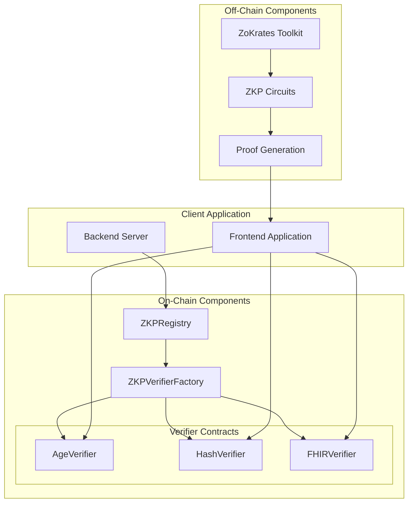

### Component Interaction Flow

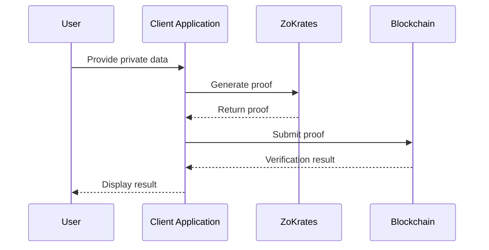

## ZKP Verifiers

### Age Verifier

The Age Verifier allows users to prove that their age is greater than a specified threshold without revealing their actual age.

#### Use Cases

- Age verification for accessing age-restricted content
- Proving eligibility for senior discounts
- Verifying minimum age requirements for medical treatments

#### Circuit Logic

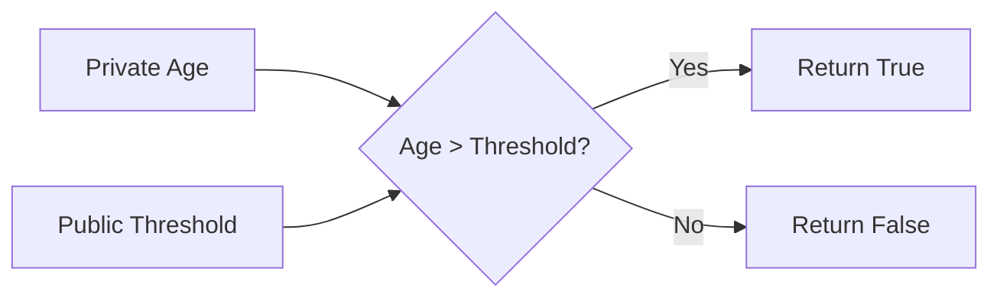

### Hash Verifier

The Hash Verifier allows users to prove knowledge of data that hashes to a specific value without revealing the actual data.

#### Use Cases

- Proving knowledge of medical records without revealing the contents
- Verifying data integrity
- Proving ownership of data

#### Circuit Logic

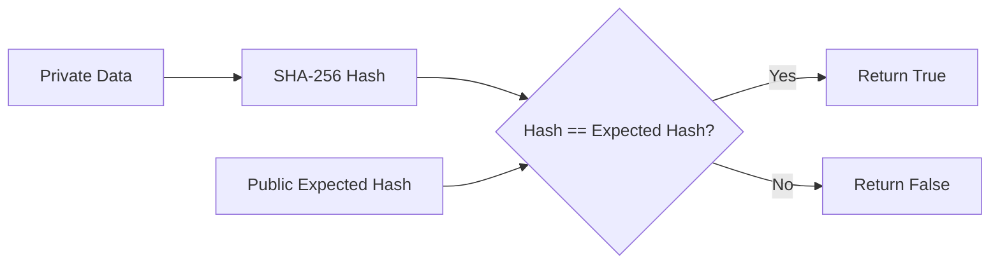

### FHIR Verifier

The FHIR Verifier allows users to prove properties of health data in FHIR format without revealing the data.

#### Use Cases

- Proving specific health conditions without revealing full medical records
- Verifying medication prescriptions without revealing patient details
- Proving vaccination status without revealing personal information

#### Circuit Logic

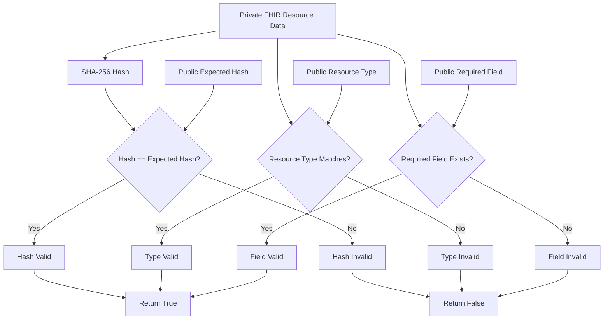

## Smart Contract Components

### ZKPRegistry

The ZKPRegistry is a central registry for all ZKP verifier contracts. It maintains a mapping of verifier types to their contract addresses and provides access control for administrative functions.

#### Key Features

- Registration and removal of verifier contracts
- Access control for administrative functions
- Verification of contract interfaces

#### Contract Structure

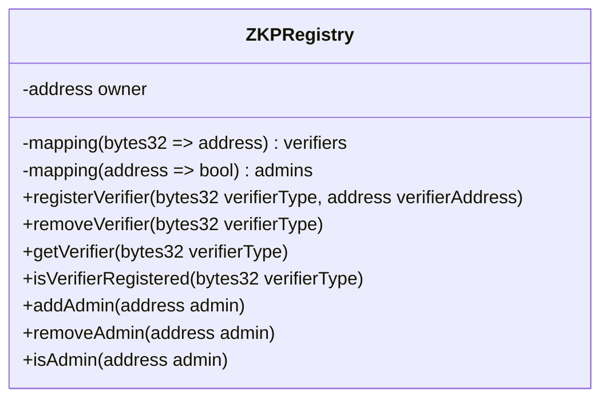

### ZKPVerifierFactory

The ZKPVerifierFactory is responsible for deploying and registering verifier contracts. It provides a standardized way to create new verifier instances.

#### Key Features

- Deployment of verifier contracts
- Registration of verifiers in the ZKPRegistry
- Access control for deployment functions

#### Contract Structure

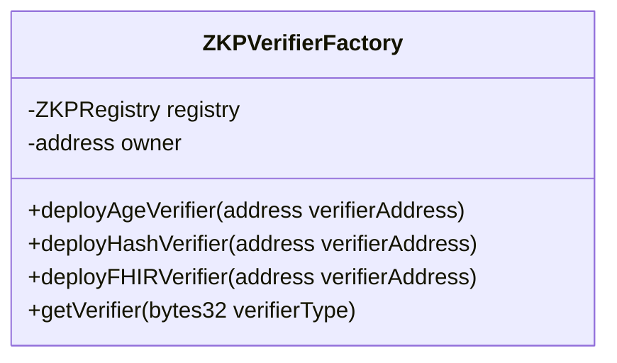

### Verifier Contracts

The verifier contracts are wrapper contracts that interact with the ZoKrates-generated verifier contracts. They provide a standardized interface for verifying proofs.

#### AgeVerifier

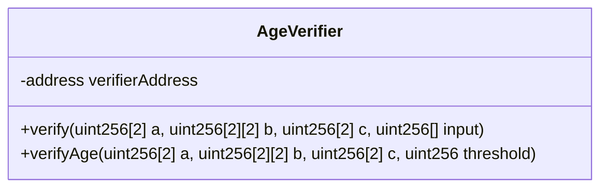

#### HashVerifier

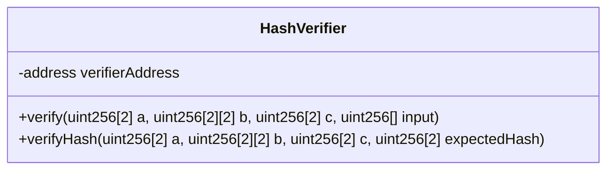

#### FHIRVerifier

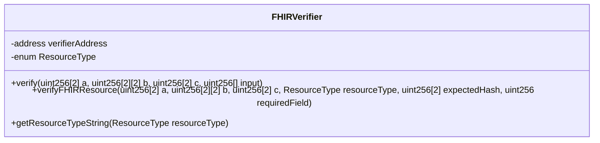

## ZoKrates Circuits

The ZoKrates circuits are the core of the ZKP system. They define the logic for generating and verifying proofs.

### Circuit Development Process

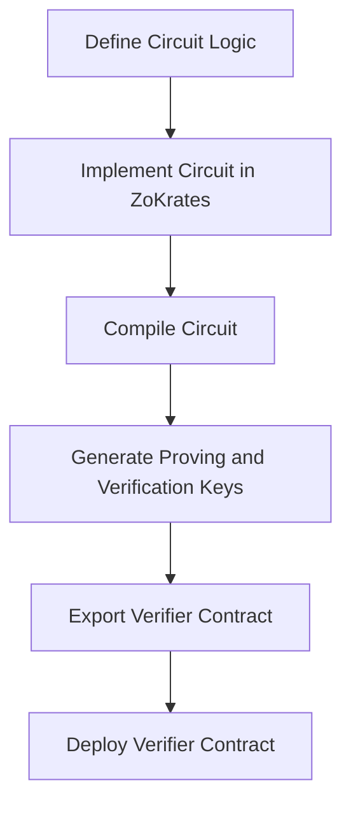

### Circuit Files

#### Age Verifier Circuit (ageCheck.zok)

```zok
def main(private field age, field threshold) -> bool {
    // Validate age is within reasonable range (0-150)
    assert(age >= 0 && age <= 150);

    // Validate threshold is within reasonable range
    assert(threshold >= 0 && threshold <= 150);

    // Check if age is greater than threshold
    return age > threshold;
}
```

#### Hash Verifier Circuit (hashCheck.zok)

```zok
import "hashes/sha256/512bitPacked" as sha256packed;

def main(private field[4] data, field[2] expectedHash) -> bool {
    // Hash the original health data
    field[2] dataHash = sha256packed(data);

    // Verify that the computed hash matches the expected hash
    return dataHash[0] == expectedHash[0] && dataHash[1] == expectedHash[1];
}
```

#### FHIR Verifier Circuit (fhirCheck.zok)

```zok
import "hashes/sha256/512bitPacked" as sha256packed;

def main(
    private field[4] resourceData,
    field resourceType,
    field[2] expectedHash,
    field requiredField
) -> bool {
    // Validate resource type is within valid range (1-4)
    assert(resourceType >= 1 && resourceType <= 4);

    // Hash the FHIR resource data
    field[2] dataHash = sha256packed(resourceData);

    // Verify hash matches expected hash
    bool hashValid = dataHash[0] == expectedHash[0] && dataHash[1] == expectedHash[1];

    // Verify resource type matches expected type
    bool typeValid = resourceData[0] == resourceType;

    // Verify required field exists in the resource
    bool fieldValid = resourceData[0] == requiredField ||
                     resourceData[1] == requiredField ||
                     resourceData[2] == requiredField ||
                     resourceData[3] == requiredField;

    // All conditions must be true for the verification to pass
    return hashValid && typeValid && fieldValid;
}
```

## Proof Generation and Verification

### Proof Generation Process

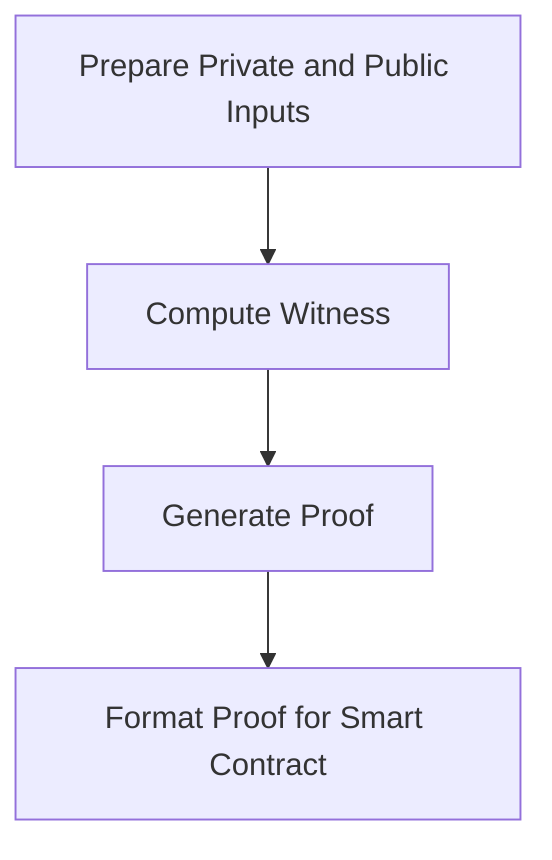

### Verification Process

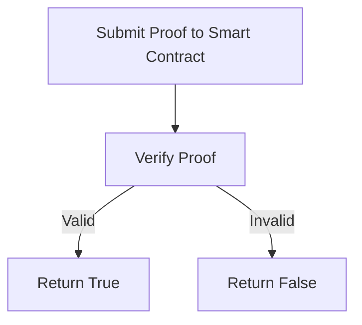

### Proof Generation Scripts

The system includes scripts for generating proofs for each verifier:

#### Age Verifier Proof Generation

```bash
#!/bin/bash

# Ensure we're in the correct directory
cd "$(dirname "$0")"

# Example: Generate a proof that age (30) is greater than threshold (18)
PRIVATE_AGE=30
PUBLIC_THRESHOLD=18

# Ensure the compiled circuit exists
if [ ! -f "ageCheck" ]; then
    echo "Error: Compiled circuit not found. Please run compile.sh first."
    exit 1
fi

# Compute the witness
echo "Computing witness..."
zokrates compute-witness -i ageCheck -a $PRIVATE_AGE $PUBLIC_THRESHOLD

# Generate the proof
echo "Generating proof..."
zokrates generate-proof -i ageCheck

echo "Age verifier proof generated successfully!"
echo "Private age: $PRIVATE_AGE"
echo "Public threshold: $PUBLIC_THRESHOLD"
echo "Proof saved to proof.json"
```

#### Hash Verifier Proof Generation

```bash
#!/bin/bash

# Ensure we're in the correct directory
cd "$(dirname "$0")"

# Example: Generate a proof that we know the preimage of a hash
# The preimage is [1, 2, 3, 4] and the hash is computed using SHA-256

# Ensure the compiled circuit exists
if [ ! -f "hashCheck" ]; then
    echo "Error: Compiled circuit not found. Please run compile.sh first."
    exit 1
fi

# Set up the parameters
PREIMAGE_1=1
PREIMAGE_2=2
PREIMAGE_3=3
PREIMAGE_4=4

# For demonstration purposes, we'll use placeholder hash values
# In a real scenario, you would compute the actual hash of the preimage
# Using decimal values instead of hexadecimal
EXPECTED_HASH_1=123456789
EXPECTED_HASH_2=987654321

# Compute the witness
echo "Computing witness..."
zokrates compute-witness -i hashCheck -a $PREIMAGE_1 $PREIMAGE_2 $PREIMAGE_3 $PREIMAGE_4 $EXPECTED_HASH_1 $EXPECTED_HASH_2

# Generate the proof
echo "Generating proof..."
zokrates generate-proof -i hashCheck

echo "Hash verifier proof generated successfully!"
echo "Private preimage: [$PREIMAGE_1, $PREIMAGE_2, $PREIMAGE_3, $PREIMAGE_4]"
echo "Public expected hash: [$EXPECTED_HASH_1, $EXPECTED_HASH_2]"
echo "Proof saved to proof.json"
```

#### FHIR Verifier Proof Generation

```bash
#!/bin/bash

# Ensure we're in the correct directory
cd "$(dirname "$0")"

# Example: Generate a proof for a FHIR resource
# The resource data is [1, 2, 3, 4], where 1 is the resource type (Patient)
# The resource type is 1 (Patient)
# The expected hash is computed using SHA-256
# The required field is 2 (which exists in the resource data)

# Ensure the compiled circuit exists
if [ ! -f "fhirCheck" ]; then
    echo "Error: Compiled circuit not found. Please run compile.sh first."
    exit 1
fi

# Set up the parameters
RESOURCE_DATA_1=1  # Resource type (Patient)
RESOURCE_DATA_2=2  # Some field value
RESOURCE_DATA_3=3  # Some field value
RESOURCE_DATA_4=4  # Some field value

RESOURCE_TYPE=1    # Patient
REQUIRED_FIELD=2   # Field that must exist in the resource

# For demonstration purposes, we'll use placeholder hash values
# In a real scenario, you would compute the actual hash of the resource data
# Using decimal values instead of hexadecimal
EXPECTED_HASH_1=123456789
EXPECTED_HASH_2=987654321

# Compute the witness
echo "Computing witness..."
zokrates compute-witness -i fhirCheck -a $RESOURCE_DATA_1 $RESOURCE_DATA_2 $RESOURCE_DATA_3 $RESOURCE_DATA_4 $RESOURCE_TYPE $EXPECTED_HASH_1 $EXPECTED_HASH_2 $REQUIRED_FIELD

# Generate the proof
echo "Generating proof..."
zokrates generate-proof -i fhirCheck

echo "FHIR verifier proof generated successfully!"
echo "Private resource data: [$RESOURCE_DATA_1, $RESOURCE_DATA_2, $RESOURCE_DATA_3, $RESOURCE_DATA_4]"
echo "Public resource type: $RESOURCE_TYPE"
echo "Public expected hash: [$EXPECTED_HASH_1, $EXPECTED_HASH_2]"
echo "Public required field: $REQUIRED_FIELD"
echo "Proof saved to proof.json"
```

## Integration Guide

### Prerequisites

- Node.js and npm
- ZoKrates CLI
- Ethereum development environment (Hardhat, Truffle, etc.)
- Web3.js or ethers.js

### Installation

1. Clone the repository:

   ```bash
   git clone https://github.com/LED-UP/zkp-system.git
   cd zkp-system
   ```

2. Install dependencies:

   ```bash
   npm install
   ```

3. Install ZoKrates:
   ```bash
   curl -LSfs get.zokrat.es | sh
   ```

### Deployment

1. Compile the ZoKrates circuits:

   ```bash
   cd src/contracts/circuits/ageVerifier
   ./compile.sh
   cd ../hashVerifier
   ./compile.sh
   cd ../fhirVerifier
   ./compile.sh
   ```

2. Deploy the contracts:
   ```bash
   npx hardhat run src/contracts/deploy_verifiers.js --network <network>
   ```

### Client-Side Integration

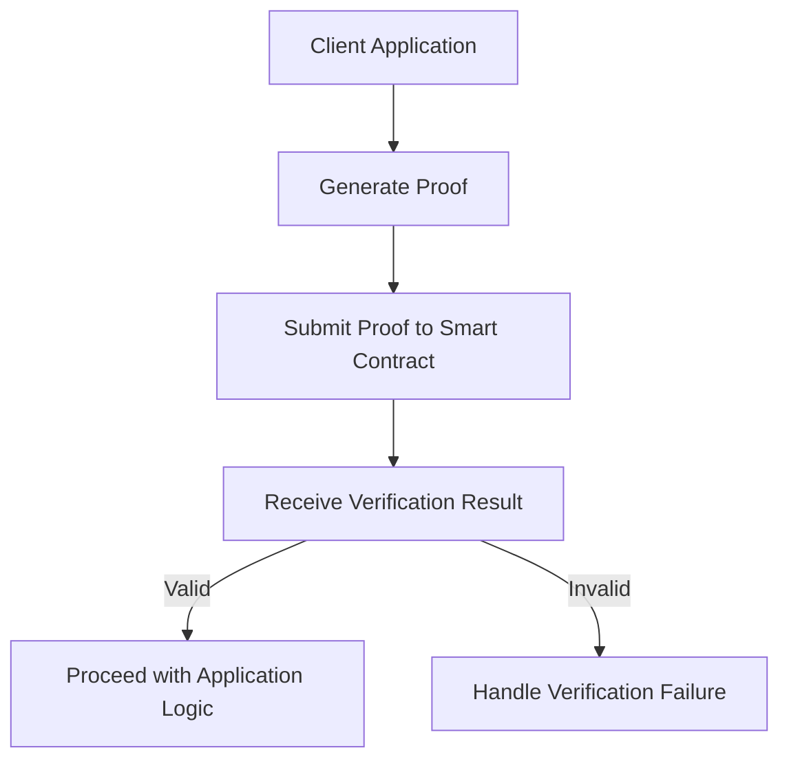

#### Example: Age Verification

```javascript
// Generate proof (client-side)
async function generateAgeProof(age, threshold) {
  // Use ZoKrates to generate a proof
  // This would typically be done in a backend service
  const { proof, publicInputs } = await generateProof(age, threshold);

  // Submit proof to the smart contract
  const contract = new ethers.Contract(ageVerifierAddress, ageVerifierABI, signer);
  const result = await contract.verifyAge(proof.a, proof.b, proof.c, threshold);

  return result;
}
```

## API Reference

### Smart Contract API

#### ZKPRegistry

```solidity
// Register a verifier
function registerVerifier(bytes32 verifierType, address verifierAddress) external onlyAdmin

// Remove a verifier
function removeVerifier(bytes32 verifierType) external onlyAdmin

// Get a verifier address
function getVerifier(bytes32 verifierType) external view returns (address)

// Check if a verifier is registered
function isVerifierRegistered(bytes32 verifierType) external view returns (bool)

// Add an admin
function addAdmin(address admin) external onlyOwner

// Remove an admin
function removeAdmin(address admin) external onlyOwner

// Check if an address is an admin
function isAdmin(address admin) external view returns (bool)
```

#### ZKPVerifierFactory

```solidity
// Deploy an AgeVerifier
function deployAgeVerifier(address verifierAddress) external onlyOwner returns (address)

// Deploy a HashVerifier
function deployHashVerifier(address verifierAddress) external onlyOwner returns (address)

// Deploy a FHIRVerifier
function deployFHIRVerifier(address verifierAddress) external onlyOwner returns (address)

// Get a verifier address
function getVerifier(bytes32 verifierType) external view returns (address)
```

#### AgeVerifier

```solidity
// Verify a proof
function verify(uint256[2] calldata a, uint256[2][2] calldata b, uint256[2] calldata c, uint256[] calldata input)
    external
    view
    returns (bool)

// Verify an age proof
function verifyAge(uint256[2] calldata a, uint256[2][2] calldata b, uint256[2] calldata c, uint256 threshold)
    external
    returns (bool)
```

#### HashVerifier

```solidity
// Verify a proof
function verify(uint256[2] calldata a, uint256[2][2] calldata b, uint256[2] calldata c, uint256[] calldata input)
    external
    view
    returns (bool)

// Verify a hash proof
function verifyHash(uint256[2] calldata a, uint256[2][2] calldata b, uint256[2] calldata c, uint256[2] calldata expectedHash)
    external
    returns (bool)
```

#### FHIRVerifier

```solidity
// Verify a proof
function verify(uint256[2] calldata a, uint256[2][2] calldata b, uint256[2] calldata c, uint256[] calldata input)
    external
    view
    returns (bool)

// Verify a FHIR resource proof
function verifyFHIRResource(
    uint256[2] calldata a,
    uint256[2][2] calldata b,
    uint256[2] calldata c,
    ResourceType resourceType,
    uint256[2] calldata expectedHash,
    uint256 requiredField
) external returns (bool)

// Get the string representation of a resource type
function getResourceTypeString(ResourceType resourceType) external pure returns (string memory)
```

### JavaScript API

#### Proof Generation

```javascript
/**
 * Generate an age verification proof
 * @param {number} age - The private age
 * @param {number} threshold - The public threshold
 * @returns {Object} - The proof and public inputs
 */
async function generateAgeProof(age, threshold) {
  // Implementation details
}

/**
 * Generate a hash verification proof
 * @param {Array<number>} preimage - The private preimage
 * @param {Array<number>} expectedHash - The public expected hash
 * @returns {Object} - The proof and public inputs
 */
async function generateHashProof(preimage, expectedHash) {
  // Implementation details
}

/**
 * Generate a FHIR resource verification proof
 * @param {Array<number>} resourceData - The private resource data
 * @param {number} resourceType - The public resource type
 * @param {Array<number>} expectedHash - The public expected hash
 * @param {number} requiredField - The public required field
 * @returns {Object} - The proof and public inputs
 */
async function generateFHIRProof(resourceData, resourceType, expectedHash, requiredField) {
  // Implementation details
}
```

#### Proof Verification

```javascript
/**
 * Verify an age proof
 * @param {Object} proof - The proof
 * @param {number} threshold - The public threshold
 * @returns {boolean} - Whether the proof is valid
 */
async function verifyAgeProof(proof, threshold) {
  // Implementation details
}

/**
 * Verify a hash proof
 * @param {Object} proof - The proof
 * @param {Array<number>} expectedHash - The public expected hash
 * @returns {boolean} - Whether the proof is valid
 */
async function verifyHashProof(proof, expectedHash) {
  // Implementation details
}

/**
 * Verify a FHIR resource proof
 * @param {Object} proof - The proof
 * @param {number} resourceType - The public resource type
 * @param {Array<number>} expectedHash - The public expected hash
 * @param {number} requiredField - The public required field
 * @returns {boolean} - Whether the proof is valid
 */
async function verifyFHIRProof(proof, resourceType, expectedHash, requiredField) {
  // Implementation details
}
```

## Security Considerations

### Trusted Setup

The ZKP system relies on a trusted setup phase to generate the proving and verification keys. This phase is critical for the security of the system.

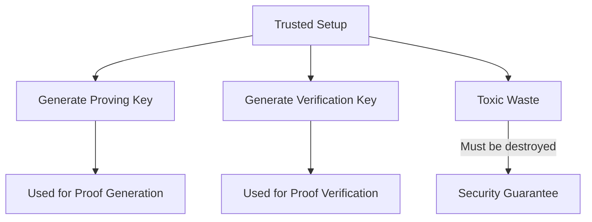

### Circuit Security

The security of the ZKP system depends on the correctness of the ZoKrates circuits. Any bugs or vulnerabilities in the circuits can compromise the security of the system.

### Smart Contract Security

The smart contracts should be audited for security vulnerabilities before deployment to production.

## Troubleshooting

### Common Issues

#### Proof Generation Fails

- Ensure that the ZoKrates CLI is installed and in your PATH
- Ensure that the compiled circuit exists
- Check that the input parameters match the circuit's expected inputs
- Use decimal values instead of hexadecimal for field elements

#### Verification Fails

- Ensure that the proof was generated correctly
- Check that the public inputs match the ones used during proof generation
- Verify that the correct verifier contract is being used

### Debugging

#### Debugging Proof Generation

```bash
# Enable verbose output
zokrates compute-witness -i circuit -a inputs --verbose

# Check the witness file
cat witness
```

#### Debugging Verification

```javascript
// Log the proof and public inputs
console.log(JSON.stringify(proof, null, 2));
console.log(JSON.stringify(publicInputs, null, 2));

// Check the transaction receipt
const receipt = await tx.wait();
console.log(receipt);
```

## Conclusion

The LED-UP Zero-Knowledge Proof (ZKP) System provides a powerful framework for privacy-preserving verification of health data on the blockchain. By following this documentation, you should be able to understand, deploy, and integrate the system into your applications.

For further assistance, please contact the LED-UP team or refer to the ZoKrates documentation.
